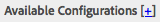
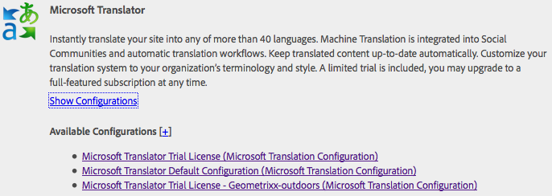

# Microsoft® 번역기에 연결{#connecting-to-microsoft-translator}

Microsoft® Translator 클라우드 서비스에 대한 구성을 만들어 Microsoft® 번역 계정을 사용하여 AEM 페이지 콘텐츠, 커뮤니티 콘텐츠 또는 에셋을 번역할 수 있습니다.

| 속성 | 설명 |
|---|---|
| 번역 레이블 | 번역 서비스의 표시 이름. |
| 번역 속성 | (옵션) 사용자 생성 콘텐츠의 경우, 번역된 텍스트 옆에 표시되는 속성 (예: `Translations by Microsoft`). |
| 작업 영역 ID | (선택 사항) 사용할 맞춤화된 Microsoft® Translator 엔진의 ID입니다. |
| 구독 키 | Microsoft® Translator용 Microsoft® 구독 키. |

구성을 만든 후 다음을 수행해야 합니다. [활성화](/help/sites-administering/tc-msconf.md#activating-the-translator-service-configurations).

다음 절차는 터치에 적합한 UI를 사용하여 Microsoft® Translator 구성을 만듭니다.

1. 레일에서 도구 > Cloud Service 를 클릭하거나 탭합니다.
1. Microsoft® Translator 영역에서 구성 표시를 선택합니다.
1. 사용 가능한 구성 옆에 있는 + 링크를 클릭합니다.

   

1. 구성의 제목을 입력합니다. 제목을 통해 클라우드 서비스 콘솔 및 페이지 속성 드롭다운 목록에서 구성을 식별합니다. 기본 이름은 제목을 기반으로 합니다. 필요한 경우 구성을 저장하는 저장소 노드에 사용할 이름을 입력합니다. 저장소 노드의 경로인 상위 구성 등록 정보에 기본값을 사용합니다.
1. 만들기를 클릭합니다.
1. 나타나는 대화 상자에서 등록 정보 값을 입력한 다음 확인을 클릭합니다.

## 샘플 Microsoft® Translator Cloud Service 구성 {#sample-microsoft-translator-cloud-service-configurations}

다음 Microsoft® Translator 클라우드 서비스 구성이 Geometrixx 샘플과 함께 설치됩니다. 일부 샘플 구성에서는 월 최대 200,000자의 무료 번역을 허용하는 체험판 Microsoft® 번역 계정을 사용합니다.

### Microsoft® Translator 체험판 라이선스 {#microsoft-translator-trial-license}

Microsoft® Translator 체험판 라이선스 구성은 Geometrixx Outdoors 샘플 패키지와 함께 설치된 샘플 구성입니다. 이 구성은 매달 200,000자의 번역을 허용하는 무료 구독이 있는 Microsoft® Translator 계정을 사용합니다.

### Microsoft® Translator 체험판 라이선스 - Geometrixx-outdoors {#microsoft-translator-trial-license-geometrixx-outdoors}

Microsoft® Translator 체험판 라이선스 - Geometrixx-outdoors 구성은 Geometrixx Outdoors과 함께 설치된 샘플 구성입니다. 이 구성은 Microsoft® Translator 체험판 라이선스 구성과 동일한 무료 Microsoft® Translator 계정을 사용합니다. 이 계정에는 매월 2,000,000자의 번역을 사용할 수 있는 무료 구독이 있습니다.

이 Microsoft® Translator 구성은 Geometrixx Outdoors 샘플 사이트의 콘텐츠 유형과 함께 사용하도록 최적화되었습니다.

### Microsoft® Translator 체험판 라이선스 구성 업그레이드 {#upgrading-the-microsoft-translator-trial-license-configuration}

Microsoft® 번역 구성 페이지는 프로덕션 시스템에 적합한 계정 구독을 얻기 위한 Microsoft® 웹 사이트로 간편하게 이동할 수 있는 링크를 제공합니다.

1. 레일에서 도구 > 작업 > 클라우드 > Cloud Service 를 클릭하거나 탭합니다.
1. Microsoft® Translator 영역에서 구성 표시 를 클릭하거나 탭한 다음, Microsoft® Translator 체험판 라이선스(Microsoft® Translation 구성)를 클릭하거나 탭합니다.

   

1. 구성 페이지에서 구독 업그레이드 를 클릭합니다. 열리는 Microsoft® 웹 페이지를 사용하여 계정을 구성합니다.

   

### Microsoft® Translator 엔진 맞춤화 {#customizing-your-microsoft-translator-engine}

Microsoft® 번역 구성 페이지는 Microsoft® Translator 엔진을 맞춤화하기 위한 Microsoft® 웹 사이트로 간편하게 이동할 수 있는 링크를 제공합니다. ([https://www.microsoft.com/en-us/research/project/microsoft-translator-hub/](https://www.microsoft.com/en-us/research/project/microsoft-translator-hub/))

1. 레일에서 도구 > 작업 > 클라우드 > Cloud Service 를 클릭하거나 탭합니다.
1. Microsoft® Translator 영역에서 구성 표시 를 클릭하거나 탭한 다음, 맞춤화할 구성을 클릭하거나 탭합니다.
1. 구성 페이지에서 Translator 맞춤화를 클릭합니다. 화면에 표시되는 Microsoft® 웹 페이지를 사용하여 서비스를 사용자 지정합니다.

## Translator 서비스 구성 활성화 {#activating-the-translator-service-configurations}

게시 인스턴스에 복제되는 번역된 콘텐츠를 지원하려면 클라우드 서비스 구성을 활성화하십시오. Microsoft® Translator 또는 서드파티 클라우드 서비스 구성을 저장하는 저장소 노드를 활성화하려면 다음 메서드를 사용합니다. [전체 섹션 활성화(트리)](/help/sites-authoring/publishing-pages.md#publishing-and-unpublishing-a-tree). 해당 노드는 다음과 같은 상위 노드 아래에 위치합니다.

* Microsoft® 번역 서비스: /libs/settings/cloudconfigs/translation/msft-translation
* 타사 번역: /etc/cloudservices/machine-translation
