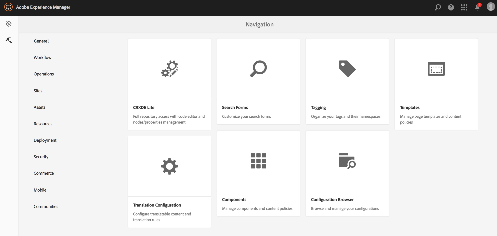

# 번역 내용 식별{#identifying-content-to-translate}

번역 규칙은 번역 프로젝트에 포함되거나 번역 프로젝트에서 제외되는 페이지, 구성 요소 및 자산에 대해 번역할 컨텐츠를 식별합니다. 페이지 또는 자산을 번역하는 경우, AEM은 이 컨텐츠를 추출하여 번역 서비스로 전송할 수 있습니다.

페이지와 자산은 JCR 저장소의 노드로 표시됩니다. 추출되는 컨텐츠는 노드의 속성 값을 하나 이상 나타냅니다. 번역 규칙은 추출할 컨텐츠가 포함된 속성을 식별합니다.

번역 규칙은 XML 형식으로 표현되며 다음과 같은 위치에 저장됩니다.

* `/libs/settings/translation/rules/translation_rules.xml`
* `/apps/settings/translation/rules/translation_rules.xml`
* `/conf/global/settings/translation/rules/translation_rules.xml`

이 파일은 모든 번역 프로젝트에 적용됩니다.

>[!NOTE]
>
>6.4로 업그레이드한 후 /etc에서 파일을 이동하는 것이 좋습니다. 자세한 내용은 [AEM 6.5의 공용 저장소 재구성](/help/sites-deploying/all-repository-restructuring-in-aem-6-5.md#translation-rules)을 참조하십시오.

규칙에는 다음 정보가 포함됩니다.

* 규칙이 적용되는 노드의 경로입니다. 이 규칙은 노드의 하위 노드에도 적용됩니다.
* 변환할 컨텐츠가 포함된 노드 속성의 이름입니다. 속성은 특정 리소스 유형이나 모든 리소스 유형에 따라 달라질 수 있습니다.

예를 들어 작성자가 페이지의 모든 AEM 기반 텍스트 구성 요소에 추가하는 컨텐츠를 변환하는 규칙을 만들 수 있습니다. 규칙은 `foundation/components/text` 구성 요소의 `/content` 노드 및 `text` 속성을 식별할 수 있습니다.

번역 규칙을 구성하기 위해 추가된 [콘솔](#translation-rules-ui)이 있습니다. UI의 정의가 파일을 자동으로 채웁니다.

AEM의 콘텐츠 번역 기능에 대한 개요는 [다국어 사이트에 대한 콘텐츠 번역](/help/sites-administering/translation.md)을 참조하십시오.

>[!NOTE]
>
>AEM은 페이지에서 참조되는 컨텐츠를 번역하기 위해 리소스 유형과 참조 속성 간의 1 대 1 매핑을 지원합니다.

## 페이지, 구성 요소 및 자산 {#rule-syntax-for-pages-components-and-assets} 규칙 구문

규칙은 하나 이상의 하위 `property` 요소와 0개 이상의 하위 `node` 요소가 있는 `node` 요소입니다.

```xml
<node path="content path">
          <property name="property name" [translate="false"]/>
          <node resourceType="component path" >
               <property name="property name" [translate="false"]/>
          </node>
</node>
```

이러한 `node` 요소 각에는 다음과 같은 특성이 있습니다.

* `path` 속성에는 규칙이 적용되는 분기의 루트 노드에 대한 경로가 포함됩니다.
* 하위 `property` 요소는 모든 리소스 유형에 대해 변환할 노드 속성을 식별합니다.

   * `name` 속성에는 속성 이름이 포함되어 있습니다.
   * 선택적 `translate` 속성은 속성이 변환되지 않으면 `false`과 같습니다. 기본적으로 값은 `true`입니다. 이 속성은 이전 규칙을 덮어쓸 때 유용합니다.

* 하위 `node` 요소는 특정 리소스 유형에 대해 변환할 노드 속성을 식별합니다.

   * `resourceType` 속성에는 리소스 유형을 구현하는 구성 요소로 확인되는 경로가 포함됩니다.
   * 자식 `property` 요소는 변환할 노드 속성을 식별합니다. 노드 규칙의 하위 `property` 요소와 같은 방법으로 이 노드를 사용하십시오.

다음 예제 규칙은 `/content` 노드 아래의 모든 페이지에 대해 모든 `text` 속성의 컨텐츠를 번역하도록 합니다. 규칙은 기본 텍스트 구성 요소 및 기본 이미지 구성 요소와 같은 `text` 속성에 컨텐츠를 저장하는 모든 구성 요소에 효과적입니다.

```xml
<node path="/content">
          <property name="text"/>
</node>
```

다음 예제에서는 모든 `text` 속성의 컨텐츠를 번역하고 기본 이미지 구성 요소의 다른 속성을 변환합니다. 다른 구성 요소에 이름이 같은 속성이 있는 경우 해당 규칙이 해당 구성 요소에 적용되지 않습니다.

```xml
<node path="/content">
      <property name="text"/>
      <node resourceType="foundation/components/textimage">
         <property name="image/alt"/>
         <property name="image/jcr:description"/>
         <property name="image/jcr:title"/>
      </node>
</node>
```

## {#rule-syntax-for-extracting-assets-from-pages} 페이지에서 에셋을 추출하기 위한 규칙 구문

다음 규칙 구문을 사용하여 구성 요소에 포함되거나 구성 요소에서 참조되는 자산을 포함할 수 있습니다.

```xml
<assetNode resourceType="path to component" assetReferenceAttribute="property that stores asset"/>
```

각 `assetNode` 요소에는 다음과 같은 특성이 있습니다.

* 구성 요소로 확인되는 경로와 동일한 `resourceType` 속성 하나.
* 자산 이진(포함된 자산에 대해)을 저장하는 속성 이름 또는 참조된 자산에 대한 경로와 같은 `assetReferenceAttribute` 속성 중 하나.

다음 예제에서는 기본 이미지 구성 요소에서 이미지를 추출합니다.

```xml
<assetNode resourceType="foundation/components/image" assetReferenceAttribute="fileReference"/>
```

## 규칙 무시 {#overriding-rules}

translation_rules.xml 파일은 여러 하위 `node` 요소가 있는 `nodelist` 요소로 구성됩니다. AEM은 노드 목록을 위에서 아래로 읽습니다. 여러 규칙이 동일한 노드를 타깃팅하면 파일에서 낮은 규칙이 사용됩니다. 예를 들어, 다음 규칙은 `/content/mysite/en` 페이지 분기를 제외한 `text` 속성의 모든 컨텐츠를 번역하도록 합니다.

```xml
<nodelist>
     <node path="/content”>
           <property name="text" />
     </node>
     <node path=“/content/mysite/en”>
          <property name=“text” translate=“false" />
     </node>
<nodelist>
```

## 속성 필터링 {#filtering-properties}

`filter` 요소를 사용하여 특정 속성이 있는 노드를 필터링할 수 있습니다.

예를 들어 다음 규칙은 `draft` 속성이 `true`로 설정된 노드를 제외하고 `text` 속성의 모든 콘텐츠를 번역하도록 합니다.

```xml
<nodelist>
    <node path="/content”>
     <filter>
   <node containsProperty="draft" propertyValue="true" />
     </filter>
        <property name="text" />
    </node>
<nodelist>
```

## 번역 규칙 UI {#translation-rules-ui}

번역 규칙을 구성하는 데에도 콘솔을 사용할 수 있습니다.

액세스 방법:

1. **도구**&#x200B;로 이동한 다음 **일반**&#x200B;으로 이동합니다.

   

1. **번역 구성**&#x200B;을 선택합니다.

   

여기에서 **컨텍스트**&#x200B;를 추가할 수 있습니다. 이렇게 하면 패스를 추가할 수 있습니다.


그런 다음 컨텍스트를 선택한 다음 **편집**&#x200B;을 클릭합니다. 그러면 번역 규칙 편집기가 열립니다.


UI를 통해 변경할 수 있는 4개의 속성이 있습니다.`isDeep`, `inherit`, `translate` 및 `updateDestinationLanguage`.

**** isDeep이 속성은 노드 필터에 적용되며 기본적으로 true입니다. 노드(또는 해당 상위 노드)에 필터에 지정된 속성 값을 가진 속성이 있는지 확인합니다. false이면 현재 노드에서만 확인합니다.

예를 들어 부모 노드에서 초안 컨텐트에 플래그를 지정하기 위해 속성 `draftOnly`이(가) true로 설정된 경우에도 자식 노드가 번역 작업에 추가됩니다. 여기서 `isDeep`은(는) play를 시작하고 상위 노드의 속성 `draftOnly`이(가) true이고 해당 하위 노드를 제외하는지 확인합니다.

편집기에서 **필터** 탭에서 **깊이**&#x200B;를 선택/선택 취소할 수 있습니다.


다음은 UI에서 **Is Deep**&#x200B;이(가) 선택 취소된 결과 xml의 예입니다.

```xml
 <filter>
    <node containsProperty="draftOnly" isDeep="false" propertyValue="true"/>
</filter>
```

**inherit** 속성에 적용할 수 있습니다. 기본적으로 모든 속성은 상속되지만 일부 속성이 자식에 상속되지 않도록 하려면 해당 속성을 false로 표시하여 특정 노드에만 적용할 수 있습니다.

UI에서 **속성** 탭에서 **상속**&#x200B;을 선택/선택 취소할 수 있습니다.


**translate** translate 속성은 변환 여부를 지정하는 데 사용됩니다.

UI에서 **속성** 탭에서 **번역**&#x200B;을 선택/선택 취소할 수 있습니다.

**** updateDestinationLanguage이 속성은 텍스트가 아닌 언어 코드(예: jcr:language)가 있는 속성에 사용됩니다. 사용자가 텍스트를 번역하지 않고 언어 로케일을 소스에서 대상으로 번역합니다. 이러한 속성은 변환용으로 전송되지 않습니다.

UI에서는 **속성** 탭에서 **번역**&#x200B;을 선택/선택 취소할 수 있지만 언어 코드를 값으로 포함하는 특정 속성에 대해서는 선택/선택 취소할 수 있습니다.

`updateDestinationLanguage`과 `translate` 간의 차이를 명확히 하기 위해 다음은 두 개의 규칙만 있는 컨텍스트의 간단한 예입니다.


xml의 결과는 다음과 같습니다.

```xml
<property inherit="true" name="text" translate="true" updateDestinationLanguage="false"/>
<property inherit="true" name="jcr:language" translate="false" updateDestinationLanguage="true"/>
```

## 규칙 파일을 수동으로 편집 {#editing-the-rules-file-manually}

AEM과 함께 설치되는 translation_rules.xml 파일에는 기본 변환 규칙 세트가 포함되어 있습니다. 번역 프로젝트의 요구 사항을 지원하기 위해 파일을 편집할 수 있습니다. 예를 들어 사용자 지정 구성 요소의 컨텐츠가 번역되도록 규칙을 추가할 수 있습니다.

translation_rules.xml 파일을 편집하는 경우 백업 복사본을 콘텐트 패키지에 보관합니다. AEM 서비스 팩을 설치하거나 특정 AEM 패키지를 다시 설치하면 현재 translation_rules.xml 파일을 원본으로 바꿀 수 있습니다. 이러한 상황에서 규칙을 복원하려면 백업 복사본이 포함된 패키지를 설치할 수 있습니다.

>[!NOTE]
>
>컨텐츠 패키지를 만든 후 파일을 편집할 때마다 패키지를 다시 빌드합니다.

## 번역 규칙 파일 예 {#example-translation-rules-file}

```xml
<nodelist>
    <!-- translation rules for Geometrixx Demo site (example) -->
    <node path="/content/geometrixx">
        <!-- list all node properties that should be translated -->
        <property name="jcr:title" /> <!-- translation workflows running on content saved in /content/geometrixx, will extract jcr:title values independent of the component. -->
        <property name="jcr:description" />
        <node resourceType ="foundation/components/image"> <!-- translation workflows running on content saved in /content/geometrixx, will extract alternateText values only for Image component. -->
            <property name="alternateText"/>
        </node>
        <node resourceType ="geometrixx/components/title">
            <property name="richText"/>
            <property name="jcr:title" translate="false"/> <!-- translation workflows running on content saved in /content/geometrixx, will not extract jcr:title for Title component, but instead use richText. -->
        </node>
        <node pathContains="/cq:annotations">
            <property name="text" translate="false"/> <!-- translation workflows running on content saved in /content/geometrixx, will not extract text if part of cq:annotations node. -->
        </node>
    </node>
    <!-- translation rules for Geometrixx Outdoors site (example) -->
    <node path="/content/geometrixx-outdoors">
        <node resourceType ="foundation/components/image">
            <property name="alternateText"/>
            <property name="jcr:title" />
        </node>
        <node resourceType ="geometrixx-outdoors/components/title">
            <property name="richText"/>
        </node>
    </node>
    <!-- translation rules for ASSETS (example) -->
    <node path="/content/dam">
        <!-- configure list of metadata properties here -->
        <property name="dc:title" />
        <property name="dc:description" />
    </node>
    <!-- translation rules for extracting ASSETS from SITES content, configure all components that embed or reference assets -->
    <assetNode resourceType="foundation/components/image" assetReferenceAttribute="fileReference"/>
    <assetNode resourceType="foundation/components/video" assetReferenceAttribute="asset"/>
    <assetNode resourceType="foundation/components/download" assetReferenceAttribute="fileReference"/>
    <assetNode resourceType="foundation/components/mobileimage" assetReferenceAttribute="fileReference"/>
    <assetNode resourceType="wcm/foundation/components/image" assetReferenceAttribute="fileReference"/>
</nodelist>
```

