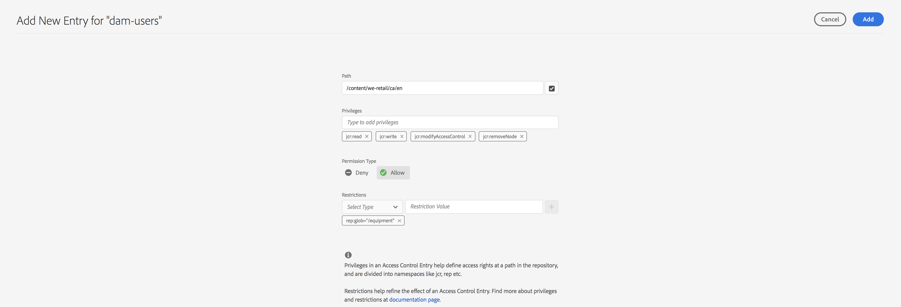

# 권한 관리에 대한 기본 보기{#principal-view-for-permissions-management}

## 개요 {#overview}

AEM 6.5에서는 사용자 및 그룹에 대한 권한 관리를 도입합니다. 기본 기능은 클래식 UI와 동일하게 유지되지만 사용자에게 더 친숙하고 효율적입니다.

## 사용 방법 {#how-to-use}

### UI에 액세스 {#accessing-the-ui}

새 UI 기반 권한 관리는 아래와 같이 보안 아래의 권한 카드를 통해 액세스합니다.

새 보기를 사용하면 권한이 명시적으로 부여된 모든 경로에서 주어진 주도자에 대한 전체 권한 및 제한 사항을 쉽게 확인할 수 있습니다. 따라서 이동할 필요가 없습니다

고급 권한 및 제한을 관리하기 위한 CRXDE. 동일한 보기에서 통합되었습니다. 보기는 기본적으로 &quot;모든 사용자&quot; 그룹으로 설정됩니다.

사용자가 볼 주도자 유형을 선택할 수 있는 필터가 있습니다 **사용자**, **그룹**, 또는 **모두**&#x200B;모든 주도자를 검색하고&#x200B;**.**

### 주도자에 대한 권한 보기 {#viewing-permissions-for-a-principal}

왼쪽의 프레임을 사용하면 아래로 스크롤하여 아래에서 보듯이 선택한 필터를 기반으로 그룹 또는 사용자를 찾을 수 있습니다.

이름을 클릭하면 오른쪽에 지정된 권한이 표시됩니다. 권한 창에는 구성된 제한 사항과 함께 특정 경로에 대한 액세스 제어 항목 목록이 표시됩니다.

### 주도자에 대한 새 액세스 제어 항목 추가 {#adding-new-access-control-entry-for-a-principal}

ACE 추가 단추를 클릭하여 새 액세스 제어 항목을 추가하여 새 권한을 추가할 수 있습니다.

이렇게 하면 아래 표시된 창이 표시되며, 다음 단계는 권한을 구성해야 하는 경로를 선택하는 것입니다.

여기에서 권한을 구성할 경로를 선택합니다 **dam-users**:

경로를 선택하면 워크플로우가 이 화면으로 돌아갑니다. 그러면 사용자가 사용 가능한 네임스페이스(예: )에서 하나 이상의 권한을 선택할 수 있습니다 `jcr`, `rep` 또는 `crx`)을 사용할 수 있습니다.

텍스트 필드를 사용하여 검색한 다음 목록에서 선택하여 권한을 추가할 수 있습니다.

>[!NOTE]
>
>권한 및 설명의 전체 목록은 다음을 참조하십시오 [이 페이지](/help/sites-administering/user-group-ac-admin.md#access-right-management).

 

권한 목록을 선택한 후 사용자는 권한 유형 을 선택할 수 있습니다. 아래 표시된 대로 거부 또는 허용

 

### 제한 사용 {#using-restrictions}

이 화면에서는 권한 목록 및 지정된 경로에 있는 권한 유형 외에도 다음과 같이 세분화된 액세스 제어의 제한을 추가할 수 있습니다.

>[!NOTE]
>
>각 제한 사항의 의미에 대한 자세한 내용은 다음을 참조하십시오 [Jackrabbit Oak 설명서](https://jackrabbit.apache.org/oak/docs/security/authorization/restriction.html).

제한 유형을 선택하고 값을 입력한 다음 을 눌러 다음과 같이 제한 사항을 추가할 수 있습니다 **+** 아이콘.

 

새 ACE는 아래와 같이 액세스 제어 목록에 반영됩니다. 참고 사항 `jcr:write` 는 다음을 포함하는 집계 권한입니다 `jcr:removeNode` 위에 추가되었지만 아래에 표시된 대로 표시되지 않습니다 `jcr:write`.

### ACE 편집 {#editing-aces}

주도자를 선택하고 편집할 ACE를 선택하여 액세스 제어 항목을 편집할 수 있습니다.

예를 들어 아래의 항목을 **dam-users** 오른쪽에 있는 연필 아이콘을 클릭하여 다음을 수행합니다.

편집 화면에는 구성된 ACE가 미리 선택된 상태로 표시됩니다. 이 ACE 옆에 있는 교차 아이콘을 클릭하여 삭제할 수 있으며, 아래 표시된 대로 지정된 경로에 새 권한을 추가할 수 있습니다.

여기에서는 `addChildNodes` 권한 **dam-users** 를 클릭합니다.

변경 사항은 **저장** 오른쪽 상단의 단추와 변경 사항이 아래와 같이 **dam-users**에 대한 새 권한에 반영됩니다.

### ACE 삭제 {#deleting-aces}

액세스 제어 항목을 삭제하여 특정 경로에 있는 주도자에게 부여된 모든 권한을 제거할 수 있습니다. ACE 옆에 있는 X 아이콘을 사용하여 아래와 같이 삭제할 수 있습니다.

 

### 클래식 UI 권한 조합 {#classic-ui-privilege-combinations}

새 권한 UI는 부여된 정확한 기본 권한을 반영하지 않은 사전 정의된 조합 대신 기본 권한 집합을 명시적으로 사용합니다.

구성 중인 내용에 대한 혼동을 초래했습니다. 다음 표에는 클래식 UI의 권한 조합을 구성하는 실제 권한에 매핑이 나열되어 있습니다.

<table>
 <tbody>
  <tr>
   <th>클래식 UI 권한 조합</th>
   <th>권한 UI 권한</th>
  </tr>
  <tr>
   <td>읽기</td>
   <td><code>jcr:read</code></td>
  </tr>
  <tr>
   <td>수정</td>
   <td>
<code>jcr:modifyProperties</code>
 
<code>jcr:lockManagement</code>
 
<code>jcr:versionManagement</code>
 </td>
  </tr>
  <tr>
   <td>만들기</td>
   <td>
<code>jcr:addChildNodes</code>
 
<code>jcr:nodeTypeManagement</code>
 </td>
  </tr>
  <tr>
   <td>삭제</td>
   <td>
<code>jcr:removeNode</code>
 
<code>jcr:removeChildNodes</code>
 </td>
  </tr>
  <tr>
   <td>ACL 읽기</td>
   <td><code>jcr:readAccessControl</code></td>
  </tr>
  <tr>
   <td>ACL 편집</td>
   <td><code>jcr:modifyAccessControl</code></td>
  </tr>
  <tr>
   <td>복제</td>
   <td><code>crx:replicate</code></td>
  </tr>
 </tbody>
</table>
