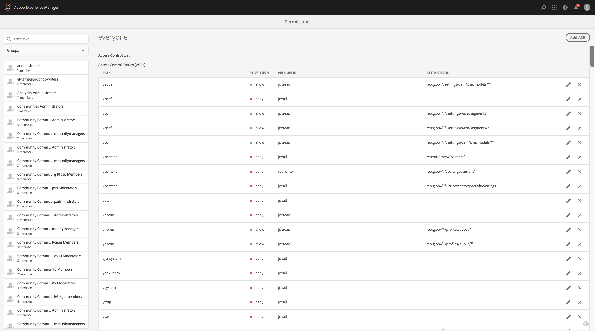

# 권한 관리에 대한 기본 보기{#principal-view-for-permissions-management}

## 개요 {#overview}

AEM 6.5에서는 사용자 및 그룹에 대한 권한 관리를 제공합니다. 기본 기능은 클래식 UI와 동일하게 유지되지만 사용자에게 친숙하고 효율적입니다.

## 사용 방법 {#how-to-use}

### UI {#accessing-the-ui} 액세스

새 UI 기반 권한 관리는 아래와 같이 보안 아래의 권한 카드를 통해 액세스합니다.

새 보기를 사용하면 권한이 명시적으로 부여된 모든 경로에서 지정된 주체에 대한 모든 권한 및 제한 사항을 쉽게 확인할 수 있습니다. 이렇게 하면

CRXDE를 사용하여 고급 권한 및 제한을 관리합니다. 동일한 관점에서 통합되었습니다. 기본값은 그룹 &quot;모든 사람&quot;입니다.

사용자가 **사용자**, **그룹** 또는 **모두**&#x200B;를 볼 주제의 유형을 선택하고 주체&#x200B;**를 검색할 수 있는 필터가 있습니다.**

### 주체 {#viewing-permissions-for-a-principal}에 대한 권한 보기

왼쪽에 있는 프레임에서는 아래에서와 같이 아래로 스크롤하여 주체를 찾거나 선택한 필터를 기반으로 그룹 또는 사용자를 검색할 수 있습니다.

이름을 클릭하면 오른쪽의 할당된 권한이 표시됩니다. 권한 창에는 구성된 제한 사항과 함께 특정 경로에 대한 액세스 제어 항목 목록이 표시됩니다.

### 주체 {#adding-new-access-control-entry-for-a-principal}에 대한 새 액세스 제어 항목 추가

ACE 추가 버튼을 클릭하여 새로운 액세스 제어 항목을 추가하면 새로운 권한을 추가할 수 있습니다.

이렇게 하면 아래 창이 표시되며, 다음 단계는 권한을 구성해야 하는 경로를 선택하는 것입니다.

여기서 **dam-users**&#x200B;에 대한 권한을 구성할 경로를 선택합니다.

경로를 선택한 후 작업 과정은 이 화면으로 돌아갑니다. 여기에서 사용자는 아래 표시된 대로 사용 가능한 네임스페이스(예: `jcr`, `rep` 또는 `crx`)에서 하나 이상의 권한을 선택할 수 있습니다.

텍스트 필드를 검색하여 목록에서 선택하여 권한을 추가할 수 있습니다.

>[!NOTE]
>
>권한 및 설명의 전체 목록을 보려면 [이 페이지](/help/sites-administering/user-group-ac-admin.md#access-right-management)를 참조하십시오.

 

권한 목록을 선택한 후 사용자는 권한 유형을 선택할 수 있습니다.거부 또는 허용을 참조하십시오.

 

### 제한 사용 {#using-restrictions}

이 화면에서는 해당 경로의 권한 목록 및 권한 유형 외에도 아래에 표시된 것처럼 세부 분류된 액세스 제어에 대한 제한을 추가할 수 있습니다.

>[!NOTE]
>
>각 제한이 의미하는 사항에 대한 자세한 내용은 [이 페이지](/help/sites-administering/user-group-ac-admin.md#restrictions)를 참조하십시오.

제한 유형을 선택하고 값을 입력한 다음 **+** 아이콘을 눌러 아래와 같이 제한을 추가할 수 있습니다. 

새 ACE가 아래와 같이 액세스 제어 목록에 반영됩니다. `jcr:write`은(는) 위에 추가된 `jcr:removeNode`을(를) 포함하는 집계 권한이지만 `jcr:write`에 따라 아래에 표시되지 않습니다.

### ACE 편집 {#editing-aces}

액세스 제어 항목은 주도자를 선택하고 편집할 ACE를 선택하여 편집할 수 있습니다.

예를 들어 오른쪽 연필 아이콘을 클릭하여 **dam-users**&#x200B;에 대한 아래 항목을 편집할 수 있습니다.

편집 화면은 구성된 ACE가 미리 선택된 상태로 표시되며, 이 ACE 옆에 있는 상호 아이콘을 클릭하여 삭제할 수 있으며, 아래에 표시된 것처럼 지정된 경로에 새 권한을 추가할 수 있습니다.

여기서는 지정된 경로에 **dam-users**&#x200B;에 대한 `addChildNodes` 권한을 추가합니다.

오른쪽 위에 있는 **저장** 단추를 클릭하여 변경 사항을 저장할 수 있으며, 변경 사항은 아래와 같이 **dam-users**에 대한 새 권한에 반영됩니다.

### ACE {#deleting-aces} 삭제

액세스 제어 항목을 삭제하여 특정 경로에서 주체에게 주어진 모든 권한을 제거할 수 있습니다. ACE 옆에 있는 X 아이콘을 사용하여 아래와 같이 삭제할 수 있습니다.

 

### 클래식 UI 권한 조합 {#classic-ui-privilege-combinations}

새 권한 UI는 부여된 정확한 기본 권한을 실제로 반영하지 않은 사전 정의된 조합 대신 기본 권한 집합을 명시적으로 사용합니다.

무엇이 정확히 구성되어 있는지 혼동하게 했습니다. 다음 표는 클래식 UI에서 권한을 구성하는 실제 권한에 대한 권한 조합 간의 매핑을 나열합니다.

<table>
 <tbody>
  <tr>
   <th>클래식 UI 권한 조합</th>
   <th>권한 UI 권한</th>
  </tr>
  <tr>
   <td>읽기</td>
   <td><code>jcr:read</code></td>
  </tr>
  <tr>
   <td>수정</td>
   <td>
<code>jcr:modifyProperties</code>
 
<code>jcr:lockManagement</code>
 
<code>jcr:versionManagement</code>
 </td>
  </tr>
  <tr>
   <td>만들기</td>
   <td>
<code>jcr:addChildNodes</code>
 
<code>jcr:nodeTypeManagement</code>
 </td>
  </tr>
  <tr>
   <td>삭제</td>
   <td>
<code>jcr:removeNode</code>
 
<code>jcr:removeChildNodes</code>
 </td>
  </tr>
  <tr>
   <td>ACL 읽기</td>
   <td><code>jcr:readAccessControl</code></td>
  </tr>
  <tr>
   <td>ACL 편집</td>
   <td><code>jcr:modifyAccessControl</code></td>
  </tr>
  <tr>
   <td>복제</td>
   <td><code>crx:replicate</code></td>
  </tr>
 </tbody>
</table>

