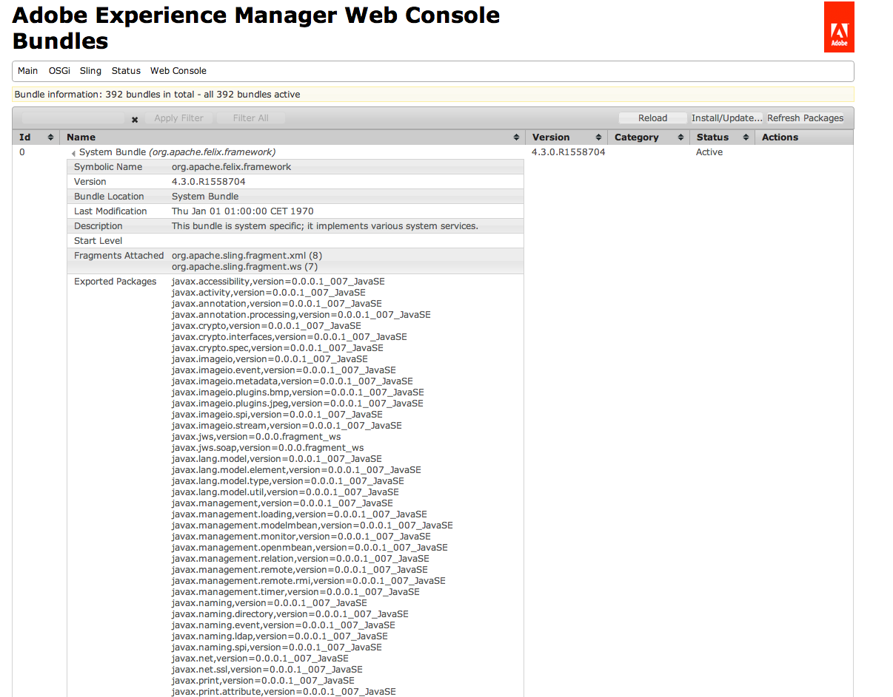

# AEM {#troubleshooting-aem} 문제 해결

다음 섹션에서는 AEM 사용 시 발생할 수 있는 몇 가지 문제와 이러한 문제를 해결하는 방법에 대한 제안 사항을 다룹니다.

>[!NOTE]
>
>AEM에서 작성 문제를 해결하는 경우 작성자에 대한 문제 해결을 참조하십시오.

>[!NOTE]
>
>문제가 발생하는 경우 인스턴스(릴리스 및 서비스 팩)에 대한 [알려진 문제](/help/release-notes/known-issues.md) 목록을 확인하는 것이 유용할 수 있습니다.

## 관리자의 문제 해결 시나리오 {#troubleshooting-scenarios-for-administrators}

다음 표는 관리자가 문제를 해결해야 할 수 있는 문제에 대한 개요를 제공합니다.

<table>
 <tbody>
  <tr>
   <td><strong>역할</strong></td>
   <td><strong>문제 </strong></td>
  </tr>
  <tr>
   <td>시스템 관리자</td>
   <td>
빠른 시작 jar를 두 번 클릭해도 아무런 효과가 없거나 다른 프로그램과 함께 jar 파일을 엽니다(예: 아카이브 관리자).
 </td>
  </tr>
  <tr>
   <td>
시스템 관리자
 </td>
   <td>
CRX에서 실행되는 응용 프로그램에서 메모리 부족 오류가 발생합니다.
 </td>
  </tr>
  <tr>
   <td>
시스템 관리자
 </td>
   <td>
AEM CM Quickstart를 두 번 클릭하면 AEM 시작 화면이 브라우저에 표시되지 않습니다.
 </td>
  </tr>
  <tr>
   <td>
시스템 관리자
 
관리자 사용자
 </td>
   <td>
스레드 덤프 만들기
 </td>
  </tr>
  <tr>
   <td>
시스템 관리자
 
관리자 사용자
 </td>
   <td>
닫히지 않은 JCR 세션 확인
 </td>
  </tr>
 </tbody>
</table>

## 설치 문제 {#installation-issues}

다음 문제 해결 시나리오에 대한 자세한 내용은 [일반적인 설치 문제](/help/sites-deploying/troubleshooting.md#common-installation-issues)를 참조하십시오.

* 빠른 시작 jar를 두 번 클릭해도 영향을 주지 않거나 JAR 파일이 다른 프로그램(예: 아카이브 관리자)에서 실행됩니다.
* CRX에서 애플리케이션을 실행하면 메모리 부족 오류가 발생합니다.
* AEM Quickstart를 두 번 클릭해도 AEM Welcome 화면이 브라우저에 표시되지 않습니다.

## 분석 문제 해결 방법 {#methods-for-troubleshooting-analysis}

### 스레드 덤프 만들기 {#making-a-thread-dump}

스레드 덤프는 현재 활성 상태인 모든 Java 스레드 목록입니다. AEM이 제대로 응답하지 않으면 스레드 덤프가 교착 상태 또는 기타 문제를 식별하는 데 도움이 될 수 있습니다.

### Sling 스레드 덤퍼 사용 {#using-sling-thread-dumper}

1. **AEM 웹 콘솔**;예: `https://localhost:4502/system/console/`.
1. **상태** 탭에서 **스레드**&#x200B;를 선택합니다.

### jstack(명령줄) {#using-jstack-command-line} 사용

1. AEM Java 인스턴스의 PID(프로세스 ID)를 찾습니다.

   예를 들어 `ps -ef` 또는 `jps`을 사용할 수 있습니다.

1. 실행:

   `jstack <pid>`

1. 스레드 덤프가 표시됩니다.

>[!NOTE]
>
>`>>` 출력 리디렉션을 사용하여 스레드 덤프를 로그 파일에 추가할 수 있습니다.
>
>`jstack <pid> >> /path/to/logfile.log`

자세한 내용은 [JVM](https://helpx.adobe.com/cq/kb/TakeThreadDump.html) 설명서에서 스레드 덤프를 가져오는 방법을 참조하십시오.

### 닫히지 않은 JCR 세션 {#checking-for-unclosed-jcr-sessions} 확인

AEM WCM에 대한 기능이 개발되면 JCR 세션을 열 수 있습니다(데이터베이스 연결 여는 것과 비교할 수 있음). 열린 세션이 닫히지 않으면 시스템에서 다음과 같은 증상이 나타날 수 있습니다.

* 시스템이 느립니다.
* CacheManager가 많이 표시됩니다.resize로그 파일의 모든 항목;다음 숫자(size=&lt;x>)는 캐시 수를 보여주며 각 세션은 여러 개의 캐시를 엽니다.
* 때때로 시스템의 메모리가 부족합니다(심각도에 따라 몇 시간, 일 또는 몇 주 후).

닫히지 않은 세션을 분석하고 세션을 닫지 않는 코드를 찾으려면 기술 자료 문서 [닫히지 않은 세션 분석](https://helpx.adobe.com/crx/kb/AnalyzeUnclosedSessions.html)을 참조하십시오.

### Adobe Experience Manager 웹 콘솔 사용 {#using-the-adobe-experience-manager-web-console}

OSGi 번들의 상태는 또한 가능한 문제를 조기에 나타낼 수 있다.

1. **AEM 웹 콘솔**;예: `https://localhost:4502/system/console/`.
1. **OSGI** 탭에서 **번들**&#x200B;을 선택합니다.
1. 확인:

   * 번들의 상태입니다. 비활성 또는 충족되지 않은 경우 번들을 중지하고 다시 시작하십시오. 문제가 지속되는 경우 다른 방법을 사용하여 추가로 조사해야 할 수 있습니다.
   * 번들 중 어느 것에도 종속성이 없는지 여부. 이러한 세부 사항은 링크인 개별 번들 이름을 클릭하여 확인할 수 있습니다(다음 예에는 문제가 없음).

