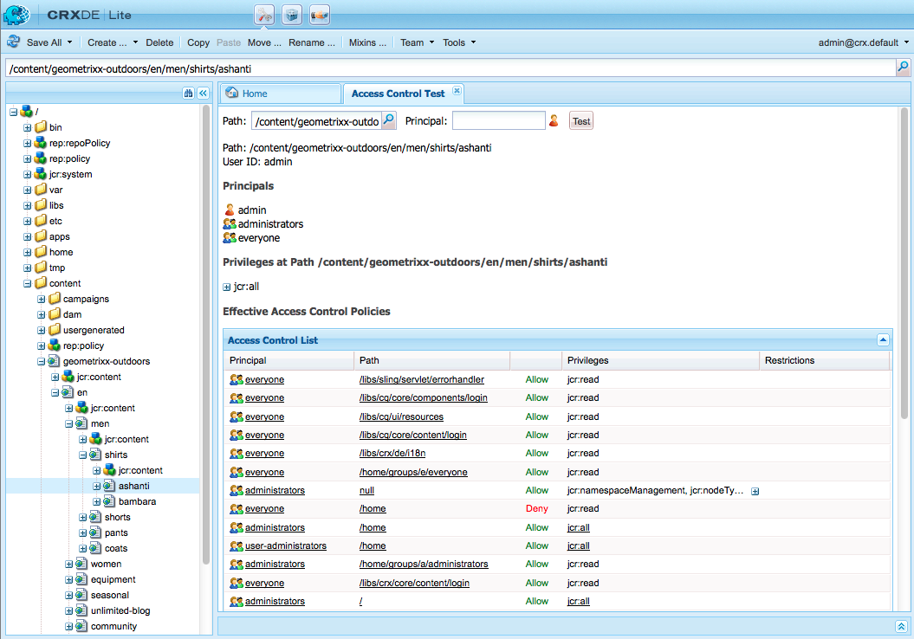

# 사용자, 그룹 및 액세스 권한 관리{#user-group-and-access-rights-administration}

CRX 저장소에 대한 액세스 활성화에는 다음과 같은 여러 가지 항목이 포함됩니다.

* [액세스 권한](#how-access-rights-are-evaluated)  - 정의 및 평가 방법의 개념
* [사용자 관리](#user-administration)  - 액세스에 사용되는 개별 계정 관리
* [그룹 관리](#group-administration)  - 그룹을 구성하여 사용자 관리 간소화
* [액세스 권한 관리](#access-right-management)  - 이러한 사용자와 그룹이 리소스에 액세스할 수 있는 방법을 제어하는 정책 정의

기본 요소는 다음과 같습니다.

**사용자** 계정 CRX는 사용자 계정에 저장된 세부 사항에 따라 사용자(해당 사용자 또는 다른 응용 프로그램)를 식별 및 확인하여 액세스를 인증합니다.

CRX에서 모든 사용자 계정은 작업 공간의 노드입니다. CRX 사용자 계정에는 다음 속성이 있습니다.

* CRX의 한 사용자를 나타냅니다.
* 사용자 이름과 암호가 들어 있습니다.
* 해당 작업 영역에 적용됩니다.
* 하위 사용자는 포함할 수 없습니다. 계층 액세스 권한의 경우 그룹을 사용해야 합니다.

* 사용자 계정에 대한 액세스 권한을 지정할 수 있습니다.

   하지만 관리를 간소화하려면 그룹 계정에 액세스 권한을 할당하는 것이 좋습니다(대부분의 경우). 각 개별 사용자에 대한 액세스 권한을 할당하면 관리가 매우 어려워집니다(단, 한 개 또는 두 개의 인스턴스만 있을 경우 특정 시스템 사용자가 예외입니다).

**그룹** 계정그룹 계정은 사용자 및/또는 기타 그룹의 컬렉션입니다. 그룹에 할당된 액세스 권한이 해당 그룹의 모든 사용자에게 자동으로 적용되기 때문에 관리를 간소화하는 데 사용됩니다. 사용자는 그룹에 속할 필요는 없지만 여러 그룹에 속하기도 합니다.

CRX에서 그룹의 속성은 다음과 같습니다.

* 공통 액세스 권한이 있는 사용자 그룹을 나타냅니다. 작성자 또는 개발자를 예로 들 수 있습니다.
* 해당 작업 영역에 적용됩니다.
* 회원이 있을 수 있습니다.개별 사용자 또는 다른 그룹이 될 수 있습니다.
* 멤버 관계를 사용하여 계층 그룹화를 구현할 수 있습니다. 저장소의 다른 그룹 바로 아래에 그룹을 배치할 수 없습니다.
* 모든 그룹 구성원의 액세스 권한을 정의할 수 있습니다.

**Access** RightsCRX는 액세스 권한을 사용하여 저장소의 특정 영역에 대한 액세스를 제어합니다.

이는 저장소의 리소스(노드 또는 경로)에 대한 액세스를 허용하거나 거부하도록 권한을 할당함으로써 수행됩니다. 다양한 권한을 할당할 수 있으므로 현재 요청에 적용할 수 있는 조합을 결정하도록 평가되어야 합니다.

CRX에서는 사용자 및 그룹 계정 모두에 대한 액세스 권한을 구성할 수 있습니다. 그런 다음 두 가지 모두에 평가의 기본 원칙이 적용됩니다.

## 액세스 권한이 평가되는 방법 {#how-access-rights-are-evaluated}

>[!NOTE]
>
>CRX는 JSR-283](https://docs.adobe.com/content/docs/en/spec/jcr/2.0/16_Access_Control_Management.html)에서 정의한 대로 [액세스 제어를 구현합니다.
>
>CRX 저장소의 표준 설치는 리소스 기반 액세스 제어 목록을 사용하도록 구성됩니다. 이것은 JSR-283 액세스 제어의 한 가지 구현 및 Jackrabbit에 있는 구현 중 하나입니다.

### 주체 및 주체 {#subjects-and-principals}

CRX는 액세스 권한을 평가할 때 두 가지 주요 개념을 사용합니다.

* **principal**&#x200B;은 액세스 권한이 있는 엔터티입니다. 주도자는 다음과 같습니다.

   * 사용자 계정
   * 그룹 계정

      사용자 계정이 하나 이상에 속한 경우 해당 그룹 주도자도 함께 연결됩니다.

* **subject**&#x200B;는 요청의 소스를 나타내는 데 사용됩니다.

   해당 요청에 적용할 수 있는 액세스 권한을 통합하는 데 사용됩니다. 다음 제품에서 가져옵니다.

   * 사용자 주체

      사용자 계정에 직접 할당하는 권한.

   * 해당 사용자와 연결된 모든 그룹

      사용자가 속한 그룹에 할당된 모든 권한
   그런 다음 요청된 리소스에 대한 액세스를 허용하거나 거부하는 데 결과가 사용됩니다.

#### 제목 {#compiling-the-list-of-access-rights-for-a-subject}에 대한 액세스 권한 목록 컴파일

CRX에서는 주체가 다음 항목에 따라 달라집니다.

* 사용자 주체
* 해당 사용자와 연관된 모든 그룹 주도자

제목에 적용 가능한 액세스 권한 목록은 다음 항목에서 구성됩니다.

* 사용자 계정에 직접 할당하는 권한
* 사용자가 속한 그룹에 할당된 모든 권한 추가


>[!NOTE]
>
>* CRX는 목록을 컴파일할 때 사용자 계층을 고려하지 않습니다.
>* CRX는 그룹을 다른 그룹의 구성원으로 포함할 때만 그룹 계층을 사용합니다. 그룹 권한에 대한 자동 상속은 없습니다.
>* 그룹을 지정하는 순서는 액세스 권한에 영향을 주지 않습니다.

>


### 요청 및 액세스 권한 확인 중 {#resolving-request-and-access-rights}

CRX가 요청을 처리할 때 주체의 액세스 요청을 저장소 노드의 액세스 제어 목록과 비교합니다.

따라서 Linda가 다음 저장소 구조의 `/features` 노드를 업데이트하도록 요청하는 경우:


### 우선 순위 {#order-of-precedence}

CRX의 액세스 권한은 다음과 같이 평가됩니다.

* 사용자 주도자는 다음에 관계없이 항상 그룹 주도자보다 우선합니다.

   * 액세스 제어 목록의 해당 순서
   * 노드 계층에서의 해당 위치

* 지정된 주체에 대해 주어진 노드에 대해 거부(DoS) 1과 1이(가) 있습니다. 구현은 항상 중복 항목을 삭제하고 허용 및 거부 항목 모두에 동일한 권한이 표시되지 않도록 합니다.

>[!NOTE]
>
>이 평가 프로세스는 표준 CRX 설치의 리소스 기반 액세스 제어에 적합합니다.

사용자 `aUser`이(가) 그룹 `aGroup`의 멤버인 두 가지 예:

```xml
   + parentNode
     + acl
       + ace: aUser - deny - write
     + childNode
       + acl
         + ace: aGroup - allow - write
       + grandChildNode
```

위의 경우:

* `aUser` 에 대한 쓰기 권한이 부여되지 않았습니다 `grandChildNode`.

```xml
   + parentNode
     + acl
       + ace: aUser - deny - write
     + childNode
       + acl
         + ace: aGroup - allow - write
         + ace: aUser - deny - write
       + grandChildNode
```

이 경우:

* `aUser` 에 대한 쓰기 권한이 부여되지 않았습니다 `grandChildNode`.
* `aUser`의 두 번째 ACE는 중복됩니다.

여러 그룹 주체에 대한 액세스 권한은 계층 내부 및 단일 액세스 제어 목록 내에서 순서에 따라 평가됩니다.

### 우수 사례 {#best-practices}

다음 표에는 몇 가지 권장 사항과 우수 사례가 나와 있습니다.

<table>
 <tbody>
  <tr>
   <td>추천...</td>
   <td>이유...</td>
  </tr>
  <tr>
   <td><i>그룹 사용</i></td>
   <td><p>사용자별로 액세스 권한을 할당하지 마십시오. 다음과 같은 몇 가지 이유가 있습니다.</p>
    <ul>
     <li>그룹보다 사용자가 많으므로 그룹은 구조를 단순화합니다.</li>
     <li>그룹은 모든 계정에 대한 개요를 제공합니다.</li>
     <li>그룹은 상속이 더 쉬워진다.</li>
     <li>사용자는 어디에서나 그룹은 장기적입니다.</li>
    </ul> </td>
  </tr>
  <tr>
   <td><i>긍정적이 되세요</i></td>
   <td><p>항상 Allow 문을 사용하여 그룹 주체의 액세스 권한을 지정합니다(가능한 경우). Deny 문을 사용하지 마십시오.</p> <p>그룹 주도자는 단일 액세스 제어 목록 내에서 계층 및 순서 내에서 순서대로 평가됩니다.</p> </td>
  </tr>
  <tr>
   <td><i>간편한 관리</i></td>
   <td><p>새 설치를 구성할 때 얼마간의 시간과 생각을 투자하면 충분한 보상을 받을 수 있을 것입니다.</p> <p>명확한 구조를 적용하면 지속적인 유지 관리 및 관리가 간소화되므로 현재의 동료 및/또는 미래의 승계자 모두 구현되는 내용을 쉽게 이해할 수 있습니다.</p> </td>
  </tr>
  <tr>
   <td><i>테스트</i></td>
   <td>테스트 설치를 사용하여 다양한 사용자와 그룹 간의 관계를 실습하고 이해할 수 있습니다.</td>
  </tr>
  <tr>
   <td><i>기본 사용자/그룹</i></td>
   <td>보안 문제를 방지하기 위해 항상 설치 후 즉시 기본 사용자 및 그룹을 업데이트하십시오.</td>
  </tr>
 </tbody>
</table>

## 사용자 관리 {#user-administration}

표준 대화 상자는 **사용자 관리**&#x200B;에 사용됩니다.

적절한 작업 영역에 로그인한 다음 두 작업 모두에서 대화 상자에 액세스할 수 있습니다.

* CRX의 주 콘솔에 있는 **사용자 관리** 링크
* CRX 탐색기의 **보안** 메뉴


**속성**

* **사용자 ID**

   CRX에 액세스할 때 사용되는 계정의 짧은 이름입니다.

* **주체 이름**

   계정의 전체 텍스트 이름입니다.

* **암호**

   이 계정으로 CRX에 액세스할 때 필요합니다.

* **ntlmhash**

   각 새 계정에 자동으로 할당되고 암호가 변경되면 업데이트됩니다.

* 이름, 유형 및 값을 정의하여 새 속성을 추가할 수 있습니다. 각 새 속성에 대해 저장(녹색 눈금 기호)을 클릭합니다.

**그룹 구성원**

그러면 계정이 속하는 모든 그룹이 표시됩니다. 상속됨 열은 다른 그룹의 멤버십으로 인해 상속된 멤버십을 나타냅니다.

GroupID(사용 가능한 경우)를 클릭하면 해당 그룹에 대한 [그룹 관리](#group-administration)가 열립니다.

**가장한 사람**

가장 기능을 사용하면 사용자는 다른 사용자를 대신하여 작업할 수 있습니다.

즉, 사용자 계정은 자신의 계정으로 작업할 수 있는 다른 계정(사용자 또는 그룹)을 지정할 수 있습니다. 즉, 사용자-B가 사용자-A를 가장할 수 있는 경우, 사용자-B는 사용자-A의 전체 계정 세부 정보(ID, 이름 및 액세스 권한 포함)를 사용하여 작업을 수행할 수 있습니다.

이렇게 하면 가장하는 계정을 사용하는 것처럼 가장된 계정이 작업을 완료할 수 있습니다.예를 들어, 부재 중 또는 과도한 로드 단기 공유.

한 계정에서 다른 계정을 가장하는 경우 매우 보기 어렵습니다. 로그 파일에는 이벤트에서 가장이 발생했다는 사실에 대한 정보가 없습니다. 따라서 사용자-B가 사용자-A를 가장하는 경우 모든 이벤트는 사용자-A에 의해 개인적으로 수행되는 것처럼 보입니다.

### 사용자 계정 만들기 {#creating-a-user-account}

1. **사용자 관리** 대화 상자를 엽니다.
1. **사용자 만들기**&#x200B;를 클릭합니다.
1. 그런 다음 속성을 입력할 수 있습니다.

   * **** UserID계정 이름으로 사용됩니다.
   * **로그인** 시 암호가 필요합니다.
   * **주체 이름** 을 사용하여 전체 텍스트 이름을 입력합니다.
   * **트리** 구조를 형성하는 데 사용할 수 있는 중간 경로.

1. 저장(녹색 눈금 기호)을 클릭합니다.
1. 대화 상자가 확장되어 다음을 수행할 수 있습니다.

   1. **속성**&#x200B;을 구성합니다.
   1. **그룹 구성원**&#x200B;을 참조하십시오.
   1. **가장자**&#x200B;를 정의합니다.

>[!NOTE]
>
>둘 다 많은 수의 신규 사용자를 설치에 등록하면 성능이 저하되는 경우가 있습니다.
>
>* 사용자
>* 그룹 많은 구성원

>


### 사용자 계정 업데이트 {#updating-a-user-account}

1. **사용자 관리** 대화 상자에서 모든 계정의 목록 보기가 열립니다.
1. 트리 구조를 탐색합니다.
1. 편집을 위해 열려면 필요한 계정을 클릭합니다.
1. 항목을 변경한 다음 해당 항목에 대해 저장(녹색 눈금 기호)을 클릭합니다.
1. **닫기** 또는 **목록...을 클릭합니다.**&#x200B;을(를) 클릭하여 모든 사용자 계정 목록으로 돌아갑니다.

### 사용자 계정 {#removing-a-user-account} 제거

1. **사용자 관리** 대화 상자에서 모든 계정의 목록 보기가 열립니다.
1. 트리 구조를 탐색합니다.
1. 필요한 계정을 선택하고 **사용자 제거**;를 클릭합니다.계정이 즉시 삭제됩니다.

>[!NOTE]
>
>저장소에서 이 주체에 대한 노드를 제거합니다.
>
>액세스 권한 항목은 제거되지 않습니다. 이것이 역사적인 무결성을 보장합니다.

### 속성 정의 {#defining-properties}

새 계정 또는 기존 계정에 대해 **속성**&#x200B;을 정의할 수 있습니다.

1. 해당 계정에 대해 **사용자 관리** 대화 상자를 엽니다.
1. **속성** 이름을 정의합니다.
1. 드롭다운 목록에서 **유형**&#x200B;을 선택합니다.
1. **값**&#x200B;을 정의합니다.
1. 새 속성에 대해 저장(녹색 클릭 기호)을 클릭합니다.

기존 속성은 휴지통 심볼과 함께 삭제할 수 있습니다.

암호를 제외하고 속성을 편집할 수 없으므로 삭제하고 다시 만들어야 합니다.

#### 암호 {#changing-the-password} 변경

**암호**&#x200B;는 **암호 변경** 링크를 클릭하여 변경할 수 있는 특수 속성입니다.

CRX 탐색기의 **보안** 메뉴에서 암호를 사용자 계정으로 변경할 수도 있습니다.

### 가장자 정의 {#defining-an-impersonator}

새 계정 또는 기존 계정에 대해 사칭자를 정의할 수 있습니다.

1. 해당 계정에 대해 **사용자 관리** 대화 상자를 엽니다.
1. 해당 계정을 가장할 수 있도록 허용할 계정을 지정합니다.

   찾아보기...를 사용하여 기존 계정을 선택할 수 있습니다.

1. 새 속성에 대해 저장(녹색 눈금 기호)을 클릭합니다.

## 그룹 관리 {#group-administration}

표준 대화 상자는 **그룹 관리**&#x200B;에 사용됩니다.

적절한 작업 영역에 로그인한 다음 두 작업 모두에서 대화 상자에 액세스할 수 있습니다.

* CRX의 주 콘솔에 있는 **그룹 관리** 링크
* CRX 탐색기의 **보안** 메뉴


**속성**

* **GroupID**

   그룹 계정의 짧은 이름입니다.

* **주체 이름**

   그룹 계정의 전체 텍스트 이름입니다.

* 이름, 유형 및 값을 정의하여 새 속성을 추가할 수 있습니다. 각 새 속성에 대해 저장(녹색 눈금 기호)을 클릭합니다.

* **구성원**

   이 그룹의 구성원으로 사용자 또는 다른 그룹을 추가할 수 있습니다.

**그룹 구성원**

이렇게 하면 현재 그룹 계정이 속하는 모든 그룹이 표시됩니다. 상속됨 열은 다른 그룹의 멤버십으로 인해 상속된 멤버십을 나타냅니다.

GroupID를 클릭하면 해당 그룹에 대한 대화 상자가 열립니다.

**구성원**

현재 그룹의 구성원인 모든 계정(사용자 및/또는 그룹)을 나열합니다.

**상속됨** 열은 다른 그룹의 멤버십으로 인해 상속된 멤버십을 나타냅니다.

>[!NOTE]
>
>소유자, 편집기 또는 뷰어 역할이 에셋 폴더의 사용자에게 할당되면 새 그룹이 만들어집니다. 그룹 이름은 역할이 정의된 각 폴더의 `mac-default-<foldername>` 형식입니다.

### 그룹 계정 만들기 {#creating-a-group-account}

1. **그룹 관리** 대화 상자를 엽니다.
1. **그룹 만들기**&#x200B;를 클릭합니다.
1. 그런 다음 속성을 입력할 수 있습니다.

   * **주체 이름** 을 사용하여 전체 텍스트 이름을 입력합니다.
   * **트리** 구조를 형성하는 데 사용할 수 있는 중간 경로.

1. 저장(녹색 눈금 기호)을 클릭합니다.
1. 대화 상자가 확장되어 다음을 수행할 수 있습니다.

   1. **속성**&#x200B;을 구성합니다.
   1. **그룹 구성원**&#x200B;을 참조하십시오.
   1. **구성원**&#x200B;을(를) 관리합니다.

### 그룹 계정 {#updating-a-group-account} 업데이트

1. **그룹 관리** 대화 상자에서 모든 계정의 목록 보기가 열립니다.
1. 트리 구조를 탐색합니다.
1. 편집을 위해 열려면 필요한 계정을 클릭합니다.
1. 항목을 변경한 다음 해당 항목에 대해 저장(녹색 눈금 기호)을 클릭합니다.
1. **닫기** 또는 **목록...을 클릭합니다.**&#x200B;을(를) 클릭하여 모든 그룹 계정 목록으로 돌아갑니다.

### 그룹 계정 {#removing-a-group-account} 제거

1. **그룹 관리** 대화 상자에서 모든 계정의 목록 보기가 열립니다.
1. 트리 구조를 탐색합니다.
1. 필요한 계정을 선택하고 **그룹 제거**;를 클릭합니다.계정이 즉시 삭제됩니다.

>[!NOTE]
>
>저장소에서 이 주체에 대한 노드를 제거합니다.
>
>액세스 권한 항목은 제거되지 않습니다. 이것이 역사적인 무결성을 보장합니다.

### 속성 정의 {#defining-properties-1}

새 계정 또는 기존 계정에 대한 속성을 정의할 수 있습니다.

1. 해당 계정에 대해 **그룹 관리** 대화 상자를 엽니다.
1. **속성** 이름을 정의합니다.
1. 드롭다운 목록에서 **유형**&#x200B;을 선택합니다.
1. **값**&#x200B;을 정의합니다.
1. 새 속성에 대해 저장(녹색 눈금 기호)을 클릭합니다.

기존 속성은 휴지통 심볼과 함께 삭제할 수 있습니다.

### 구성원 {#members}

현재 그룹에 구성원을 추가할 수 있습니다.

1. 해당 계정에 대해 **그룹 관리** 대화 상자를 엽니다.
1. 다음 중 하나를 선택합니다.

   * 필요한 구성원(사용자 또는 그룹 계정)의 이름을 입력합니다.
   * 또는 **찾아보기..추가할 주체(사용자 또는 그룹 계정)를 검색하고 선택하려면**

1. 새 속성에 대해 저장(녹색 눈금 기호)을 클릭합니다.

또는 휴지통 기호가 있는 기존 멤버를 삭제합니다.

## 액세스 권한 관리 {#access-right-management}

CRXDE Lite의 **액세스 제어** 탭을 사용하여 액세스 제어 정책을 정의하고 관련 권한을 할당할 수 있습니다.

예를 들어, **현재 경로**&#x200B;의 경우 왼쪽 창에서 필요한 리소스를 선택하고 오른쪽 하단 창의 액세스 제어 탭을 선택합니다.


정책은 다음과 같이 분류됩니다.

* **해당 액세스 제어 정책**

   이러한 정책을 적용할 수 있습니다.

   로컬 정책을 만드는 데 사용할 수 있는 정책입니다. 적용 가능한 정책을 선택하고 추가하면 로컬 정책이 됩니다.

* **로컬 액세스 제어 정책**

   적용한 액세스 제어 정책입니다. 그런 다음 업데이트, 주문 또는 제거할 수 있습니다.

   로컬 정책은 상위에서 상속된 정책을 덮어씁니다.

* **유효 액세스 제어 정책**

   액세스 제어 정책이며 현재 액세스 요청에 대해 적용됩니다. 여기에는 로컬 정책과 상위에서 상속되는 정책 모두에서 파생된 집계 정책이 표시됩니다.

### 정책 선택 {#policy-selection}

다음 항목에 대한 정책을 선택할 수 있습니다.

* **현재 경로**

   위의 예에서 저장소 내의 리소스를 선택합니다. 이 &quot;현재 경로&quot;에 대한 정책이 표시됩니다.

* **저장소**

   저장소 수준 액세스 제어를 선택합니다. 예를 들어 `jcr:namespaceManagement` 권한을 설정할 때 저장소에만 해당하며 노드가 아닙니다.

* **사용자**

   저장소에 등록된 주체입니다.

   **주체** 이름을 입력하거나 필드 오른쪽의 아이콘을 클릭하여 **주체 선택** 대화 상자를 열 수 있습니다.

   이렇게 하면 **사용자** 또는 **그룹**&#x200B;에 대해 **검색**&#x200B;할 수 있습니다. 결과 목록에서 필요한 주체를 선택한 다음 **확인**&#x200B;을 클릭하여 값을 이전 대화 상자로 돌아갑니다.


>[!NOTE]
>
>관리를 간소화하려면 개별 사용자 계정이 아니라 그룹 계정에 액세스 권한을 할당하는 것이 좋습니다.
>
>많은 사용자 계정이 아닌 몇 개의 그룹을 관리하는 것이 더 쉽습니다.

### 권한 {#privileges}

액세스 제어 항목을 추가할 때 다음 권한을 선택할 수 있습니다(자세한 내용은 [보안 API](https://docs.adobe.com/docs/en/spec/javax.jcr/javadocs/jcr-2.0/javax/jcr/security/Privilege.html) 참조).

<table>
 <tbody>
  <tr>
   <th><strong>권한 이름</strong></th>
   <th><strong>...의 권한을 제어하는 것.</strong></th>
  </tr>
  <tr>
   <td><code>jcr:read</code></td>
   <td>노드를 검색하고 해당 속성과 값을 읽습니다.</td>
  </tr>
  <tr>
   <td><code>rep:write</code></td>
   <td>jcr:write 및 jcr:nodeTypeManagement의 jcrabbit 특정 집계 권한입니다.<br /> </td>
  </tr>
  <tr>
   <td><code>jcr:all</code></td>
   <td>이 권한은 미리 정의된 다른 모든 권한을 포함하는 집계 권한입니다.</td>
  </tr>
  <tr>
   <td><strong>고급</strong></td>
   <td> </td>
  </tr>
  <tr>
   <td><code>crx:replicate</code></td>
   <td>노드의 복제를 수행합니다.</td>
  </tr>
  <tr>
   <td><code>jcr:addChildNodes</code></td>
   <td>노드의 하위 노드를 만듭니다.</td>
  </tr>
  <tr>
   <td><code>jcr:lifecycleManagement</code></td>
   <td>노드에서 라이프사이클 작업을 수행합니다.</td>
  </tr>
  <tr>
   <td><code>jcr:lockManagement</code></td>
   <td>노드 잠금 및 잠금 해제;잠금을 새로 고칩니다.</td>
  </tr>
  <tr>
   <td><code>jcr:modifyAccessControl</code></td>
   <td>노드의 액세스 제어 정책을 수정합니다.</td>
  </tr>
  <tr>
   <td><code>jcr:modifyProperties</code></td>
   <td>노드의 속성을 생성, 수정 및 제거합니다.</td>
  </tr>
  <tr>
   <td><code>jcr:namespaceManagement</code></td>
   <td>네임스페이스 정의를 등록, 등록 취소 및 수정합니다.</td>
  </tr>
  <tr>
   <td><code>jcr:nodeTypeDefinitionManagement</code></td>
   <td>노드 유형 정의를 저장소로 가져옵니다.</td>
  </tr>
  <tr>
   <td><code>jcr:nodeTypeManagement</code></td>
   <td>혼합 노드 유형을 추가 및 제거하고 노드의 기본 노드 유형을 변경합니다. 또한 새 노드의 mixin 또는 기본 유형이 명시적으로 지정된 Node.addNode 및 XML 가져오기 메서드를 호출하는 작업도 포함합니다.</td>
  </tr>
  <tr>
   <td><code>jcr:readAccessControl</code></td>
   <td>노드의 액세스 제어 정책을 읽습니다.</td>
  </tr>
  <tr>
   <td><code>jcr:removeChildNodes</code></td>
   <td>노드의 하위 노드를 제거합니다.</td>
  </tr>
  <tr>
   <td><code>jcr:removeNode</code></td>
   <td>노드를 제거합니다.</td>
  </tr>
  <tr>
   <td><code>jcr:retentionManagement</code></td>
   <td>노드에서 보존 관리 작업을 수행합니다.</td>
  </tr>
  <tr>
   <td><code>jcr:versionManagement</code></td>
   <td>노드에서 버전 관리 작업을 수행합니다.</td>
  </tr>
  <tr>
   <td><code>jcr:workspaceManagement</code></td>
   <td>JCR API를 통한 작업 영역 생성 및 삭제</td>
  </tr>
  <tr>
   <td><code>jcr:write</code></td>
   <td>이 권한은 <br /> - jcr:modifyProperties<br /> - jcr:addChildNodes<br /> - jcr:removeNode<br /> - jcr:removeChildNodes를 포함하는 집계 권한입니다.</td>
  </tr>
  <tr>
   <td><code>rep:privilegeManagement</code></td>
   <td>새 권한을 등록합니다.</td>
  </tr>
 </tbody>
</table>

### 새 권한 등록 {#registering-new-privileges}

새 권한을 등록할 수도 있습니다.

1. 도구 모음에서 **도구**&#x200B;를 선택한 다음 **권한**&#x200B;을 선택하여 현재 등록된 권한을 표시합니다.

   

1. **권한 등록 아이콘(**+**)을 사용하여 대화 상자를 열고 새 권한을 정의합니다.**

   

1. **확인**&#x200B;을 클릭하여 저장합니다. 이제 권한을 선택할 수 있습니다.

### 액세스 제어 항목 추가 {#adding-an-access-control-entry}

1. 리소스를 선택하고 **액세스 제어** 탭을 엽니다.

1. 새 **로컬 액세스 제어 정책**&#x200B;을 추가하려면 **해당 액세스 제어 정책** 목록 오른쪽에 있는 **+** 아이콘을 클릭합니다.

   

1. **로컬 액세스 제어 정책:** 아래에 새 항목이 나타납니다.

   

1. **+** 아이콘을 클릭하여 새 항목을 추가합니다.

   

   >[!NOTE]
   >
   >현재 빈 문자열을 지정하는 데 대한 해결 방법이 필요합니다.
   >
   >이를 위해서는 &quot;&quot;를 사용해야 합니다.

1. 액세스 제어 정책을 정의하고 **확인**&#x200B;을 클릭하여 저장합니다. 새 정책은 다음과 같습니다.

   * **로컬 액세스 제어 정책** 아래에 나열됩니다.
   * 변경 사항은 **효과적인 액세스 제어 정책**&#x200B;에 반영됩니다.

CRX는 선택 영역의 유효성을 검사합니다.주어진 주체에 대해 주어진 노드에 대해 (최대) 1 거부 및 1이 있으며 주어진 노드에 항목 허용 옵션이 있습니다. 구현은 항상 중복 항목을 삭제하고 허용 및 거부 항목 모두에 동일한 권한이 표시되지 않도록 합니다.

### 로컬 액세스 제어 정책 주문 {#ordering-local-access-control-policies}

목록의 순서는 정책이 적용되는 순서를 나타냅니다.

1. **로컬 액세스 제어 정책** 표에서 필요한 항목을 선택하고 표의 새 위치로 드래그합니다.

   

1. 변경 사항은 **Local** 및 **유효한 액세스 제어 정책**&#x200B;에 대한 두 표에 모두 표시됩니다.

### 액세스 제어 정책 {#removing-an-access-control-policy} 제거

1. **로컬 액세스 제어 정책** 표의 항목 오른쪽에 있는 빨간색 아이콘(-)을 클릭합니다.
1. **Local**&#x200B;과 **유효한 액세스 제어 정책**&#x200B;의 두 표 모두에서 항목이 제거됩니다.

### 액세스 제어 정책 테스트 {#testing-an-access-control-policy}

1. CRXDE Lite 도구 모음에서 **도구**&#x200B;를 선택한 다음 **액세스 제어 테스트...를 선택합니다.**.
1. 오른쪽 상단 창에 새 대화 상자가 열립니다. 테스트할 **경로** 및/또는 **주체**&#x200B;를 선택합니다.
1. 선택 항목의 결과를 보려면 **테스트**&#x200B;를 클릭합니다.

   
