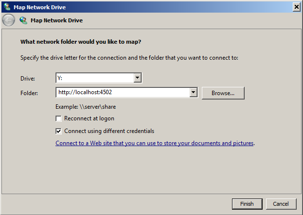

# WebDAV 액세스{#webdav-access}

KDE와 WebDAV를 통해 AEM에 연결하려면 다음을 수행하십시오.

AEM에서는 저장소 컨텐츠를 표시하고 편집할 수 있는 WebDAV 지원을 제공합니다. WebDAV를 통해 연결하면 데스크탑을 통해 콘텐츠 저장소에 직접 액세스할 수 있습니다. WebDAV 연결을 통해 저장소에 추가된 텍스트 및 PDF 파일은 자동으로 전체 텍스트 인덱싱되며 표준 검색 인터페이스와 표준 Java API를 통해 검색할 수 있습니다.

## 일반 {#general}

[운영 체제별 자세한 지침](/help/sites-administering/webdav-access.md#connecting-via-webdav) WebDAV 프로토콜을 사용하여 저장소에 연결하는 것은 기본적으로 이 문서에 포함되지만 WebDAV 클라이언트를 다음 위치로 보냅니다.

```xml
http://localhost:4502
```


이 URL은 운영 체제 수준에서 연결된 경우 기본 작업 영역에 대한 WebDAV 액세스 권한을 제공합니다( `crx.default`). 사용자가 간단하지만 작업 공간 이름을 지정할 때 추가적인 유연성을 제공하지 않으므로 추가 기능을 사용하여 수행할 수 있습니다 [WebDAV URL](/help/sites-administering/webdav-access.md#webdav-urls).

AEM에는 다음과 같이 저장소 컨텐츠가 표시됩니다.

* 유형의 노드 `nt:folder` 이 폴더로 표시됩니다. 아래의 노드 `nt:folder` 노드는 폴더 컨텐츠로 표시됩니다.

* 유형의 노드 `nt:file` 는 파일로 표시됩니다. 아래의 노드 `nt:file` 노드는 표시되지 않지만 파일의 컨텐츠를 형성합니다.

WebDAV를 사용하여 폴더와 파일을 만들고 편집하면 AEM에서 필요한 내용을 만들고 편집합니다 `nt:folder` 및 `nt:file` 노드 아래에 나열됩니다. WebDAV를 사용하여 컨텐츠를 가져오고 내보낼 계획이라면 다음 작업을 수행합니다 `nt:file` 및 `nt:folder` 노드 유형은 가능한 한 많습니다.

>[!NOTE]
>
>WebDAV를 설정하기 전에 [기술 요구 사항](/help/sites-deploying/technical-requirements.md#webdav-clients).

## WebDAV URL {#webdav-urls}

WebDAV 서버의 URL은 다음 구조를 갖습니다.

<table>
 <colgroup>
  <col width="100" />
  <col width="100" />
  <col width="100" />
  <col width="100" />
  <col width="100" />
 </colgroup>
 <tbody>
  <tr>
   <td>
    <code>
     <strong>URL Component</strong>
    </code></td>
   <td><code>https://&lt;host&gt;:&lt;port&gt;</code></td>
   <td><code>/&lt;crx-webapp-path&gt;</code></td>
   <td><code>/repository</code></td>
   <td><code>/&lt;workspace&gt;</code></td>
  </tr>
  <tr>
   <td>
    <code>
     <strong>Example</strong>
    </code></td>
   <td><code>http://localhost:4502</code></td>
   <td><code>/crx</code></td>
   <td><code>/repository</code></td>
   <td><code>/crx.default</code></td>
  </tr>
  <tr>
   <td><strong>설명</strong></td>
   <td>AEM이 실행되는 호스트 및 포트</td>
   <td>AEM 저장소 웹 앱의 경로</td>
   <td>WebDAV 서블릿이 매핑되는 경로</td>
   <td>작업 공간 이름</td>
  </tr>
 </tbody>
</table>

경로에서 작업 공간 요소를 변경하여 기본( `crx.default`). 예를 들어, `staging`를 사용하려면 다음 URL을 사용하십시오.

```xml
http://localhost:4502/crx/repository/staging
```

## WebDAV를 통해 연결 {#connecting-via-webdav}

[위에서 언급한 대로](/help/sites-administering/webdav-access.md#general)WebDAV 프로토콜을 사용하여 저장소에 연결하려면 WebDAV 클라이언트를 저장소 위치에 지정합니다. 그러나 OS에 따라 클라이언트를 연결하는 단계가 다르며 필요한 OS가 구성되어 있을 수 있습니다.

다음 운영 체제를 연결하는 방법에 대한 지침이 제공됩니다.

* [Windows](/help/sites-administering/webdav-access.md#windows)
* [macOS](/help/sites-administering/webdav-access.md#macos)
* [Linux](/help/sites-administering/webdav-access.md#linux)

### Windows {#windows}

SSL을 사용하여 안전하지 않은 AEM 인스턴스에 Microsoft Windows 7 이상 시스템을 성공적으로 연결하려면 비보안 네트워크를 통해 기본 인증을 설정하는 옵션을 Windows에서 명시적으로 활성화해야 합니다. 이렇게 하려면 WebClient의 Windows 레지스트리를 변경해야 합니다.

레지스트리가 업데이트되면 AEM 인스턴스를 드라이브로 매핑할 수 있습니다.

#### Windows 7 이상 구성 {#windows-and-greater-configuration}

비보안 네트워크에서 기본 인증을 허용하도록 레지스트리를 업데이트하려면 다음을 수행하십시오.

1. 다음 레지스트리 하위 키를 찾습니다.

   ```xml
   HKEY_LOCAL_MACHINE\SYSTEM\CurrentControlSet\Services\WebClient\Parameters
   ```

1. 설정 `BasicAuthLevel` 레지스트리 항목 하위 키를 다음 값 `2` 이상

   없는 경우 하위 키를 추가합니다.

1. 레지스트리 변경 사항을 적용하려면 시스템을 다시 시작해야 합니다.

자세한 내용은 [Microsoft 지원 KB 841215](https://support.microsoft.com/default.aspx/kb/841215) 레지스트리 변경에 대한 자세한 정보

자세한 내용은 [Microsoft 지원 KB 2445570](https://support.microsoft.com/kb/2445570) windows에서 WebDav 클라이언트의 책임을 향상시키는 방법에 대한 정보.

>[!NOTE]
>
>Adobe은 저장소 사용자와 동일한 자격 증명을 사용하는 Windows 사용자를 만들 것을 권장합니다. 그렇지 않으면 권한 충돌이 발생할 수 있습니다.

#### Windows 8 구성 {#windows-configuration}

Windows 8의 경우 레지스트리 항목을 변경해야 합니다 [Windows 7 이상](/help/sites-administering/webdav-access.md#windows-and-greater-configuration). 그러나 레지스트리 항목을 보려면 먼저 Desktop Experience Cloud를 활성화해야 합니다.

데스크탑 경험을 활성화하려면 **서버 관리자**, 그런 다음 **기능**, 그런 다음 **기능 추가**, 그런 다음 **데스크탑 경험**.

Windows 7 이상에 대해 설명된 레지스트리 항목을 재부팅한 후 사용할 수 있습니다. Windows 7 이상에 대해 설명된 대로 수정합니다.

#### Windows에서 연결 {#connecting-in-windows}

Windows 환경에서 WebDAV를 통해 AEM에 연결하려면

1. 열기 **Windows 탐색기** 또는 **파일 탐색기** 을(를) 클릭합니다. **컴퓨터** 또는 **이 PC**.

   

1. 클릭 **네트워크 드라이브 매핑** 마법사를 시작하려면 다음을 수행하십시오.
1. 매핑 세부 정보를 입력합니다.

   * **드라이브**: 사용 가능한 편지 선택
   * **폴더**: `http://localhost:4502`
   * 확인 **다른 자격 증명을 사용하여 연결**

   마침을 클릭합니다

   

   >[!NOTE]
   >
   >AEM이 다른 포트에 있는 경우 4502 대신 해당 포트 번호를 사용하십시오. 또한 로컬 시스템에서 컨텐츠 저장소를 실행하지 않는 경우 를 바꿉니다 `localhost` 각 서버 이름 또는 IP 주소 사용.

1. 사용자 이름 입력 `admin` 및 암호 `admin`. Adobe은 테스트에 사전 구성된 관리 계정을 사용하는 것을 권장합니다.

   

1. 마법사가 닫히고 새로 매핑된 드라이브가 Windows 탐색기 또는 파일 탐색기 창에서 열립니다.

   

이제 Windows에서는 WebDAV를 통해 AEM을 드라이브로 매핑했으며 다른 드라이브로 사용할 수 있습니다.

### macOS {#macos}

macOS에서 WebDAV를 통해 연결하는 데 필요한 구성 단계는 없습니다. WebDAV 서버에 연결해야 합니다.

1. 원하는 위치로 이동 **파인더** 을(를) 클릭하고 **이동** 및 **서버에 연결**&#x200B;또는 누르기 **Command+k**.
1. 에서 **서버에 연결** 창에서 AEM 위치를 입력합니다.

   * `http://localhost:4502`
   >[!NOTE]
   >
   >AEM이 다른 포트에 있는 경우 4502 대신 해당 포트 번호를 사용하십시오. 또한 로컬 시스템에서 컨텐츠 저장소를 실행하지 않는 경우 를 바꿉니다 `localhost` 각 서버 이름 또는 IP 주소 사용.

1. 인증 메시지가 표시되면 사용자 이름을 입력합니다 `admin` 및 암호 `admin`. Adobe은 테스트에 사전 구성된 관리 계정을 사용하는 것을 권장합니다.

이제 macOS이 WebDAV를 통해 AEM에 연결되었으며 Mac의 다른 폴더로 사용할 수 있습니다.

### Linux {#linux}

Linux에서 WebDAV를 통해 연결하면 구성이 필요 없지만, 데스크탑 환경에 따라 다르게 연결하는 몇 가지 단계가 필요합니다.

#### 그놈 {#gnome}

GNOME를 사용하여 WebDAV를 통해 AEM에 연결하려면

1. Nautilus(파일 탐색기)에서 **위치** 을(를) 선택합니다. **서버에 연결**.
1. 에서 **서버에 연결** 창의 서비스 유형에서 WebDAV(HTTP)를 선택합니다.

1. in **서버**, 입력 `http://localhost:4502/crx/repository/crx.default`

   >[!NOTE]
   >
   >AEM이 다른 포트에 있는 경우 4502 대신 해당 포트 번호를 사용하십시오. 또한 로컬 시스템에서 컨텐츠 저장소를 실행하지 않는 경우 를 바꿉니다 `localhost` 각 서버 이름 또는 IP 주소 사용.

1. in **폴더**, 입력 `/dav`
1. 사용자 이름 입력 `admin`. Adobe은 테스트에 사전 구성된 관리 계정을 사용하는 것을 권장합니다.
1. 포트를 비워 두고 연결에 사용할 이름을 입력합니다.
1. 클릭 **Connect**. AEM에서 암호를 묻는 메시지를 표시합니다.
1. 암호를 입력합니다 `admin` 을(를) 클릭합니다. **Connect**.

GNOME는 이제 AEM을 볼륨으로 마운트했으며 다른 볼륨처럼 사용할 수 있습니다.

#### KDE {#kde}

1. 네트워크 폴더 마법사를 엽니다.
1. 선택 **WebFolder**(webdav)를 클릭하고 다음을 클릭합니다.
1. in **이름**&#x200B;에 연결 이름을 입력합니다.
1. in **사용자**, 입력 `admin.` Adobe은 사전 구성된 관리 계정을 사용하는 것을 권장합니다.
1. in **서버**, 입력 `http://localhost:4502/crx/repository/crx.default`

   >[!NOTE]
   >
   >AEM이 다른 포트에 있는 경우 4502 대신 해당 포트 번호를 사용하십시오. 또한 로컬 시스템에서 컨텐츠 저장소를 실행하지 않는 경우 를 바꿉니다 `localhost` 각 서버 이름 또는 IP 주소 사용

1. in **폴더**, 입력 `dav`

1. 클릭 **저장 및 연결**.
1. 암호를 입력하라는 메시지가 표시되면 암호를 입력합니다 `admin` 을(를) 클릭합니다. **Connect**.

KDE는 이제 AEM을 볼륨으로 마운트했으며 다른 볼륨처럼 사용할 수 있습니다.
