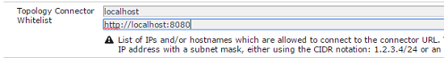

# 자산 워크플로우 오프로더{#assets-workflow-offloader}

자산 워크플로우 오프로더를 사용하면 AEM(Adobe Experience Manager) 자산의 여러 인스턴스를 활성화하여 기본(리더) 인스턴스의 처리 로드를 줄일 수 있습니다. 처리 부드는 지시선 인스턴스와 여기에 추가하는 다양한 오로더(작업자) 인스턴스 사이에 배포됩니다. 자산의 처리 로드를 배포하면 AEM Assets가 자산을 처리하는 효율성과 속도가 향상됩니다. 또한 전용 리소스를 할당하여 특정 MIME 유형의 자산을 처리할 수 있습니다. 예를 들어 토폴로지에서 특정 노드를 할당하여 InDesign 자산만 처리할 수 있습니다.

## 오프로더 토폴로지 구성 {#configure-offloader-topology}

Configuration Manager를 사용하여 지시선 인스턴스의 URL과 지시선 인스턴스의 연결 요청에 대한 오프로더 인스턴스의 호스트 이름을 추가합니다.

1. AEM 로고를 탭/클릭하고 도구 > **작업** > 웹 **콘솔을** 선택하여 **구성** 관리자를엽니다.
1. 웹 콘솔에서 Sling > **토폴로지** 관리를 **선택합니다**.

   

1. 토폴로지 관리 페이지에서 Discovery.Oak 서비스 **구성 링크를 탭/클릭합니다** .

   

1. [검색 서비스 구성] 페이지에서 [토폴로지 커넥터 URL] **필드에 지시자 인스턴스에 대한 커넥터 URL을** 지정합니다.

   

1. 토폴로지 커넥터 **화이트리스트** 필드에서 지시선 인스턴스와 연결할 수 있는 오프로더 인스턴스의 IP 주소 또는 호스트 이름을 지정합니다. Tap/click **Save**.

   

1. 지시선 인스턴스에 연결된 오프로더 인스턴스를 보려면 도구 > **배포** > **토폴로지로** 이동하여 **클러스터** 보기를 탭/클릭합니다.

## 오프로딩 비활성화 {#disable-offloading}

1. AEM 로고를 탭/클릭하고 도구 > **배포** > **오프로드** ( **Offloading**)를선택합니다. 브라우저 **오프로드** 페이지에는 항목을 사용할 수 있는 항목과 서버 인스턴스가 표시됩니다.

   

1. 사용자가 AEM 자산을 업로드하거나 변경하기 위해 상호 작용하는 선도적인 인스턴스에서 *com/adobe/granite/workflow/offloading* 항목을 비활성화합니다.

   

## 선도적인 인스턴스에서 워크플로우 런터 구성 {#configure-workflow-launchers-on-the-leader-instance}

Dam 자산 업데이트 워크플로우 대신 선도적인 [!UICONTROL 인스턴스에서 DAM 자산] 오프로딩 워크플로우를 사용하도록 **워크플로우 런처를 구성합니다** .

1. AEM 로고를 탭/클릭하고 도구 > **워크플로** > **** **** Launcher를 **선택하여** Workflow Launcher콘솔을엽니다.

   

1. 이벤트 유형 노드 생성됨 및 노드 **수정됨으로** 각각 DAM 자산 **업데이트** 워크플로우를 실행하는 두 개의 **런처 구성을** 찾습니다.
1. 각 구성에 대해 앞에 있는 확인란을 선택하고 도구 모음에서 속성 **보기** 아이콘을 탭/클릭하여 실행 **속성 대화 상자를 표시합니다** .

   

1. 워크플로우 **목록에서 DAM 자산** 오프로드를 선택하고 [!UICONTROL 저장을 탭/] 클릭합니다 ****.

   

1. AEM 로고를 탭/클릭하고 도구 > **워크플로우** > **모델을** 선택하여 **워크플로우** 모델 **페이지를** 엽니다.
1. DAM 자산 [!UICONTROL 오프로드] 작업 과정을 선택하고 도구 모음에서 편집을 탭/클릭하여 **해당** 세부 사항을 표시합니다.

   

1. DAM 워크플로우 오프로드 단계의 컨텍스트 메뉴를 **표시하고** 편집을 **선택합니다**. 구성 대화 상자의 **범용 인수** 탭의 **작업 항목** 필드에 항목을확인합니다.

   

## 오프로더 인스턴스에서 워크플로우 런터 비활성화 {#disable-the-workflow-launchers-on-the-offloader-instances}

선도적인 인스턴스에서 DAM 자산 업데이트 **워크플로우를 실행하는** 워크플로우 런처를 비활성화합니다.

1. AEM 로고를 탭/클릭하고 도구 > **워크플로** > **** **** Launcher를 **선택하여** Workflow Launcher콘솔을엽니다.

   

1. 이벤트 유형 노드 생성됨 및 노드 **수정됨으로** 각각 DAM 자산 **업데이트** 워크플로우를 실행하는 두 개의 **런처 구성을** 찾습니다.
1. 각 구성에 대해 앞에 있는 확인란을 선택하고 도구 모음에서 속성 **보기** 아이콘을 탭/클릭하여 실행 **속성 대화 상자를 표시합니다** .

   

1. 활성화 **섹션에서** 슬라이더를 드래그하여 워크플로우 실행 프로그램을 비활성화하고 저장을 탭/클릭하여 **비활성화합니다** .

   

1. 지시선 인스턴스에서 유형 이미지의 자산을 업로드합니다. 오프로드된 인스턴스에서 에셋에 대해 생성된 축소판을 다시 포팅했는지 확인합니다.

