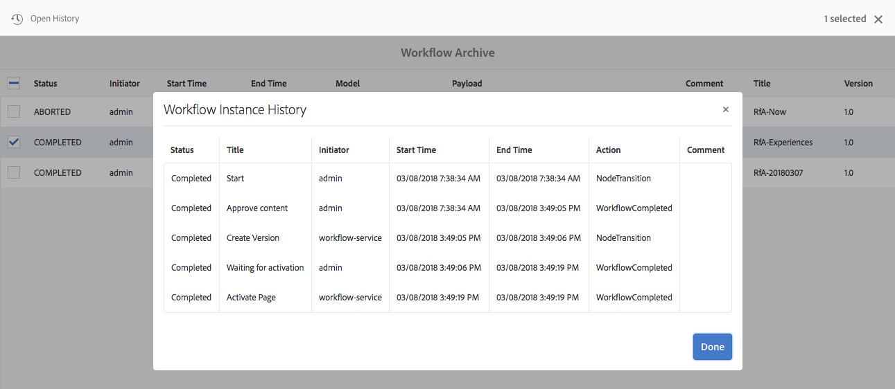

# 워크플로우 인스턴스 관리{#administering-workflow-instances}

워크플로우 콘솔은 워크플로우 인스턴스가 예상대로 실행되는지 확인하기 위해 워크플로우 인스턴스를 관리하는 몇 가지 도구를 제공합니다.

>[!NOTE]
>
>[JMX 콘솔](/help/sites-administering/jmx-console.md#workflow-maintenance)은 추가적인 워크플로우 유지 관리 작업을 제공합니다.

워크플로우를 관리하는 데 다양한 콘솔을 사용할 수 있습니다. [전역 탐색](/help/sites-authoring/basic-handling.md#global-navigation)을 사용하여 **도구** 창을 연 다음 **워크플로우**&#x200B;를 선택합니다.

* **모델**:워크플로우 정의 관리
* **인스턴스**:실행 중인 워크플로우 인스턴스 보기 및 관리
* **런처**:워크플로우를 시작하는 방법 관리
* **보관**:성공적으로 완료된 워크플로우의 기록 보기
* **실패**:오류와 함께 완료된 워크플로우의 내역 보기

## 워크플로우 인스턴스 상태 모니터링 {#monitoring-the-status-of-workflow-instances}

1. 탐색 기능을 사용하여 **도구**&#x200B;를 선택한 다음 **워크플로우**&#x200B;를 선택합니다.
1. **인스턴스**&#x200B;를 선택하여 현재 진행 중인 워크플로우 인스턴스 목록을 표시합니다.

   

1. 특정 항목을 선택한 다음 **Open History** 를 선택하여 자세한 내용을 확인합니다.

   

## 워크플로 인스턴스 {#suspending-resuming-and-terminating-a-workflow-instance} 일시 중지, 다시 시작 및 종료

1. 탐색 기능을 사용하여 **도구**&#x200B;를 선택한 다음 **워크플로우**&#x200B;를 선택합니다.
1. **인스턴스**&#x200B;를 선택하여 현재 진행 중인 워크플로우 인스턴스 목록을 표시합니다.

   

1. 특정 항목을 선택한 다음 **종료**, **일시 중단** 또는 **다시 시작**&#x200B;을 적절하게 사용하십시오.확인 및/또는 자세한 내용은 다음과 같습니다.

   

## 보관된 워크플로우 보기 {#viewing-archived-workflows}

1. 탐색 기능을 사용하여 **도구**&#x200B;를 선택한 다음 **워크플로우**&#x200B;를 선택합니다.
1. **아카이브**&#x200B;를 선택하여 성공적으로 완료된 워크플로우 인스턴스 목록을 표시합니다.

   

   >[!NOTE]
   >
   >abort 상태는 사용자 작업의 결과로 발생할 때 성공한 종료로 간주됩니다.예:
   >
   >* **종료** 작업 사용
   >* 워크플로우의 적용을 받는 페이지가 (강제) 삭제되면 워크플로우가 종료됩니다

1. 특정 항목을 선택한 다음 **Open History** 를 선택하여 자세한 내용을 확인합니다.

   

## 워크플로우 인스턴스 오류 수정 {#fixing-workflow-instance-failures}

워크플로우가 실패할 경우 AEM은 **실패** 콘솔을 제공하여 원래 원인이 처리된 후에 적절한 조치를 취할 수 있도록 합니다.

* **실패**
세부 정보창을 열어 
**오류 메시지**, 단계  **** 및  **실패 스택**.

* **열기**
기록워크플로 내역의 세부 정보를 표시합니다.

* **다시** 시도 단계스크립트 단계 구성 요소 인스턴스를 다시 실행합니다. 원래 오류 원인을 해결한 후 Retry Step 명령을 사용합니다. 예를 들어 프로세스 단계가 실행되는 스크립트에서 버그를 수정한 후 단계를 다시 시도하십시오.
* **** 종료: 오류로 인해 워크플로우가 인식할 수 없는 상황이 발생한 경우 워크플로우를 종료합니다. 예를 들어, 워크플로우는 워크플로우 인스턴스에 더 이상 유효하지 않은 저장소의 정보와 같은 환경 조건을 사용할 수 있습니다.
* **종료 및** 다시 시도 **** 는 원래 페이로드, 제목 및 설명을 사용하여 새 워크플로우 인스턴스가 시작된다는 점을 제외하면 종료와 유사합니다.

오류를 조사하려면 나중에 워크플로우를 다시 시작하거나 종료하려면 다음 단계를 사용합니다.

1. 탐색 기능을 사용하여 **도구**&#x200B;를 선택한 다음 **워크플로우**&#x200B;를 선택합니다.
1. **실패**&#x200B;를 선택하여 완료되지 않은 워크플로우 인스턴스 목록을 표시합니다.
1. 특정 항목을 선택한 다음, 적절한 작업을 선택합니다.

   

## 워크플로우 인스턴스 일반 삭제 {#regular-purging-of-workflow-instances}

워크플로우 인스턴스 수를 최소화하면 워크플로우 엔진의 성능이 높아지므로 리포지토리에서 완료되거나 실행되는 워크플로우 인스턴스를 정기적으로 제거할 수 있습니다.

**Granite Workflow 제거 구성**&#x200B;을 구성하여 해당 연령 및 상태에 따라 워크플로우 인스턴스를 삭제합니다. 모든 모델 또는 특정 모델의 워크플로우 인스턴스를 삭제할 수도 있습니다.

서비스의 여러 구성을 만들어 다양한 기준을 충족하는 워크플로우 인스턴스를 삭제할 수도 있습니다. 예를 들어, 예상 시간보다 오래 실행되는 특정 워크플로우 모델의 인스턴스를 삭제하는 구성을 만듭니다. 특정 일 이후에 완료된 모든 워크플로우를 지우는 다른 구성을 만들어 저장소 크기를 최소화합니다.

서비스를 구성하려면 [웹 콘솔](/help/sites-deploying/configuring-osgi.md#osgi-configuration-with-the-web-console) 또는 [OSGi 구성을 저장소](/help/sites-deploying/configuring-osgi.md#osgi-configuration-in-the-repository)에 추가할 수 있습니다. 다음 표에서는 두 방법 중 하나에 필요한 속성에 대해 설명합니다.

>[!NOTE]
>
>저장소에 구성을 추가하기 위해 서비스 PID는 다음과 같습니다.
>
>`com.adobe.granite.workflow.purge.Scheduler`
>
>서비스가 공장 서비스이므로 `sling:OsgiConfig` 노드의 이름은 식별자 접미사를 필요로 합니다. 예를 들면 다음과 같습니다.
>
>`com.adobe.granite.workflow.purge.Scheduler-myidentifier`

<table>
 <tbody>
  <tr>
   <th>속성 이름(웹 콘솔)</th>
   <th>OSGi 속성 이름</th>
   <th>설명</th>
  </tr>
  <tr>
   <td>작업 이름</td>
   <td>scheduledpurge.name</td>
   <td>예약된 삭제를 설명하는 이름입니다.</td>
  </tr>
  <tr>
   <td>워크플로우 상태</td>
   <td>scheduledpurge.workflowStatus</td>
   <td>
제거할 워크플로우 인스턴스의 상태입니다. 다음 값이 유효합니다.

    <ul>
     <li>완료됨:완료된 워크플로우 인스턴스가 삭제됩니다.</li>
     <li>실행 중:실행 중인 워크플로우 인스턴스가 삭제됩니다.</li>
    </ul> </td>
  </tr>
  <tr>
   <td>삭제할 모델</td>
   <td>scheduledpurge.modelIds</td>
   <td>
제거할 워크플로우 모델의 ID입니다. ID는 모델 노드의 경로입니다(예:  /conf/global/settings/workflow/models/dam/update_asset/jcr:content/model  모든 워크플로우 모델의 인스턴스를 삭제할 값을 지정하지 않습니다.
 
여러 모델을 지정하려면 웹 콘솔에서 + 단추를 클릭합니다. 
 </td>
  </tr>
  <tr>
   <td>워크플로우 연령</td>
   <td>scheduledpurge.daysold</td>
   <td>제거할 워크플로우 인스턴스 기간(일 단위)입니다.</td>
  </tr>
 </tbody>
</table>

## 받은 편지함 {#setting-the-maximum-size-of-the-inbox}의 최대 크기 설정

**Granite Workflow 서비스**&#x200B;를 구성하고, [웹 콘솔](/help/sites-deploying/configuring-osgi.md#osgi-configuration-with-the-web-console) 또는 [OSGi 구성을 저장소](/help/sites-deploying/configuring-osgi.md#osgi-configuration-in-the-repository)에 추가하여 받은 편지함의 최대 크기를 설정할 수 있습니다. 다음 표에서는 두 방법 중 하나에 대해 구성하는 속성에 대해 설명합니다.

>[!NOTE]
>
>저장소에 구성을 추가하기 위해 서비스 PID는 다음과 같습니다.
>
>`com.adobe.granite.workflow.core.WorkflowSessionFactory`.

| 속성 이름(웹 콘솔) | OSGi 속성 이름 |
|---|---|
| 최대 받은 편지함 쿼리 크기 | granite.workflow.inboxQuerySize |
