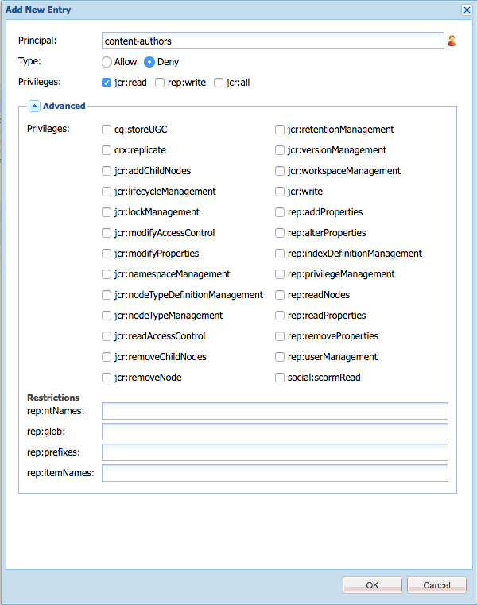

# 워크플로에 대한 액세스 관리{#managing-access-to-workflows}

워크플로우를 시작(또는 비활성화)하고 참여하도록 사용자 계정에 따라 ACL을 구성합니다.

## 워크플로우에 필요한 사용자 권한 {#required-user-permissions-for-workflows}

다음과 같은 경우 워크플로우에 대한 작업을 수행할 수 있습니다.

* 을(를) 사용하여 작업 중 `admin` account
* 계정이 기본 그룹에 할당되었습니다. `workflow-users`:

   * 이 그룹은 사용자가 워크플로우 작업을 수행하는 데 필요한 모든 권한을 갖습니다.
   * 계정이 이 그룹에 있으면 시작한 워크플로우에만 액세스할 수 있습니다.

* 계정이 기본 그룹에 할당되었습니다. `workflow-administrators`:

   * 이 그룹은 권한이 있는 사용자가 워크플로우를 모니터링하고 관리하는 데 필요한 모든 권한을 갖습니다.
   * 계정이 이 그룹에 있으면 모든 워크플로우에 액세스할 수 있습니다.

>[!NOTE]
>
>최소 요구 사항입니다. 특정 단계를 수행하려면 계정이 할당된 참가자 또는 할당된 그룹의 구성원이어야 합니다.

## 워크플로우에 대한 액세스 구성 {#configuring-access-to-workflows}

워크플로 모델은 사용자가 워크플로와 상호 작용하는 방법을 제어하기 위한 기본 액세스 제어 목록(ACL)을 상속합니다. 워크플로에 대한 사용자 액세스를 사용자 정의하려면 워크플로 모델 노드가 포함된 폴더의 저장소에서 ACL(액세스 제어 목록)을 수정합니다.

* [/var/workflow/models에 특정 워크플로우 모델에 대한 ACL 적용](/help/sites-administering/workflows-managing.md#apply-an-acl-for-the-specific-workflow-model-to-var-workflow-models)
* [/var/workflow/models에 하위 폴더를 만들고 여기에 ACL 을 적용합니다](/help/sites-administering/workflows-managing.md#create-a-subfolder-in-var-workflow-models-and-apply-the-acl-to-that)

>[!NOTE]
>
>CRXDE Lite을 사용하여 ACL 구성에 대한 자세한 내용은 [액세스 권한 관리](/help/sites-administering/user-group-ac-admin.md#access-right-management).

### /var/workflow/models에 특정 워크플로우 모델에 대한 ACL 적용 {#apply-an-acl-for-the-specific-workflow-model-to-var-workflow-models}

워크플로 모델이 다음 내에 저장된 경우: `/var/workflow/models`그런 다음 해당 워크플로우에만 관련된 특정 ACL을 폴더에 할당할 수 있습니다.

1. 웹 브라우저에서 CRXDE Lite 열기(예: [http://localhost:4502/crx/de](http://localhost:4502/crx/de)).
1. 노드 트리에서 워크플로 모델 폴더의 노드를 선택합니다.

   `/var/workflow/models`

1. 다음을 클릭합니다. **액세스 제어** 탭.
1. 다음에서 **로컬 액세스 제어 정책** (**액세스 제어 목록**) 표를 만들 때 더하기 아이콘을 클릭하여 **게시물 추가**.
1. 다음에서 **새 항목 추가** 대화 상자에서 다음 속성을 사용하여 ACE를 추가합니다.

   * **사용자**: `content-authors`
   * **유형**: `Deny`
   * **권한**: `jcr:read`
   * **rep:glob**: 특정 워크플로우에 대한 참조

   

   다음 **액세스 제어 목록** 이제 테이블에 대한 제한 사항이 포함됩니다. `content-authors` 다음에 있음 `prototype-wfm-01` 워크플로우 모델.

   

1. **모두 저장**&#x200B;을 클릭합니다.

   다음 `prototype-wfm-01` 의 멤버는 더 이상 워크플로를 사용할 수 없습니다. `content-authors` 그룹입니다.

### /var/workflow/models에 하위 폴더를 만들고 여기에 ACL 을 적용합니다 {#create-a-subfolder-in-var-workflow-models-and-apply-the-acl-to-that}

사용자 [개발 팀은 하위 폴더에 워크플로를 만들 수 있습니다.](/help/sites-developing/workflows-models.md#creating-a-new-workflow) /

`/var/workflow/models`

아래에 저장된 DAM 워크플로우와 비교

`/var/workflow/models/dam/`

그런 다음 폴더 자체에 ACL을 추가할 수 있습니다.

1. 웹 브라우저에서 CRXDE Lite 열기(예: [http://localhost:4502/crx/de](http://localhost:4502/crx/de)).
1. 노드 트리에서 워크플로 모델 폴더의 개별 폴더에 대한 노드를 선택합니다. 예를 들면 다음과 같습니다.

   `/var/workflow/models/prototypes`

1. 다음을 클릭합니다. **액세스 제어** 탭.
1. 다음에서 **적용 가능한 액세스 제어 정책** 테이블에서 더하기 아이콘 을 클릭하여 **추가** 항목.
1. 다음에서 **로컬 액세스 제어 정책** (**액세스 제어 목록**) 표를 만들 때 더하기 아이콘을 클릭하여 **게시물 추가**.
1. 다음에서 **새 항목 추가** 대화 상자에서 다음 속성을 사용하여 ACE를 추가합니다.

   * **사용자**: `content-authors`
   * **유형**: `Deny`
   * **권한**: `jcr:read`

   >[!NOTE]
   >
   >에서와 같이 [/var/workflow/models에 특정 워크플로우 모델에 대한 ACL 적용](/help/sites-administering/workflows-managing.md#apply-an-acl-for-the-specific-workflow-model-to-var-workflow-models) rep:glob을 포함하여 특정 워크플로우에 대한 액세스를 제한할 수 있습니다.

   

   다음 **액세스 제어 목록** 이제 테이블에 대한 제한 사항이 포함됩니다. `content-authors` 다음에 있음 `prototypes` 폴더를 삭제합니다.

   

1. **모두 저장**&#x200B;을 클릭합니다.

   의 모델 `prototypes` 의 멤버는 더 이상 폴더를 사용할 수 없습니다. `content-authors` 그룹입니다.
