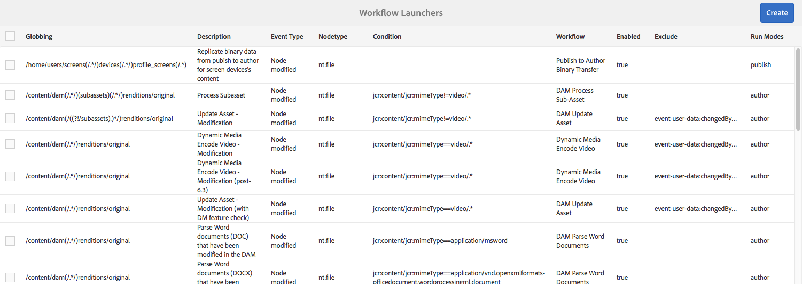

# 워크플로우 시작{#starting-workflows}

워크플로우를 관리할 때 다양한 방법으로 워크플로우를 시작할 수 있습니다.

* 수동:

   * [워크플로우 모델](#workflow-models)에서
   * [일괄 처리](#workflow-packages-for-batch-processing)에 워크플로우 패키지 사용.

* 자동:

   * 노드 변경에 응답하여[Launcher](#workflows-launchers) 사용.

>[!NOTE]
>
>작성자도 다른 방법을 사용할 수 있습니다.자세한 내용은 다음을 참조하십시오.
>
>* [페이지에 워크플로우 적용](/help/sites-authoring/workflows-applying.md)
* [DAM 자산에 워크플로우를 적용하는 방법](/help/assets/assets-workflow.md)
* [AEM Forms](https://helpx.adobe.com/aem-forms/6-2/aem-workflows-submit-process-form.html)
* [번역 프로젝트](/help/sites-administering/tc-manage.md)

## 워크플로우 모델 {#workflow-models}

워크플로우 모델 콘솔에 나열된 모델](/help/sites-administering/workflows.md#workflow-models-and-instances) 중 하나를 기반으로 워크플로우 [를 시작할 수 있습니다. 제목 및/또는 댓글도 추가할 수 있지만 페이로드만 필수 정보입니다.

## 워크플로우 런처 {#workflows-launchers}

워크플로우 런처 는 변경된 노드의 위치 및 리소스 유형에 따라 컨텐츠 저장소의 변경 사항을 모니터링하여 워크플로우를 시작합니다.

**시작 관리자**&#x200B;를 사용하여 다음을 수행할 수 있습니다.

* 특정 노드에 대해 이미 실행된 워크플로우를 참조하십시오.
* 특정 노드/노드 유형이 생성/수정/제거될 때 시작할 워크플로우를 선택합니다.
* 기존 워크플로우-노드 관계를 제거합니다.

모든 노드에 대해 런처를 만들 수 있습니다. 그러나 특정 노드에 대한 변경 사항은 워크플로우를 시작하지 않습니다. 다음 경로 아래의 노드를 변경해도 워크플로우가 실행되지 않습니다.

* `/var/workflow/instances`
* `/home/users` 분기의 어느 곳에든 있는 모든 workflow-inbox 노드
* `/tmp`
* `/var/audit`
* `/var/classes`
* `/var/eventing`
* `/var/linkchecker`
* `/var/mobile`
* `/var/statistics`

   * 예외:`/var/statistics/tracking` *do* 아래의 노드를 변경하면 워크플로우가 시작됩니다.

표준 설치에는 다양한 정의가 포함되어 있습니다. 디지털 자산 관리 및 소셜 협업 작업에 사용됩니다.

## 일괄 처리를 위한 워크플로우 패키지 {#workflow-packages-for-batch-processing}

워크플로우 패키지는 처리를 위한 페이로드로 워크플로우에 전달할 수 있는 패키지로, 여러 리소스를 처리할 수 있습니다.

워크플로우 패키지:

* 일련의 리소스(예: 페이지, 자산)에 대한 링크를 포함합니다.
* 생성 날짜, 패키지를 만든 사용자 및 간단한 설명과 같은 패키지 정보를 포함합니다.
* 는 전문 페이지 템플릿을 사용하여 정의됩니다.이러한 페이지에서는 사용자가 패키지의 리소스를 지정할 수 있습니다.
* 여러 번 사용할 수 있습니다.
* 워크플로우 인스턴스가 실제로 실행되는 동안 사용자가 변경할 수 있습니다(리소스 추가 또는 제거).

## 모델 콘솔에서 워크플로우 시작 {#starting-a-workflow-from-the-models-console}

1. **도구**, **워크플로우**&#x200B;를 사용하여 **모델** 콘솔로 이동한 다음 **모델**&#x200B;으로 이동합니다.
1. 워크플로우 선택(콘솔 보기에 따라);필요할 경우 검색(왼쪽 상단)을 사용할 수도 있습니다.

   

   >[!NOTE]
   **[임시](/help/sites-developing/workflows.md#transient-workflows)** 표시기는 워크플로우 기록이 지속되지 않는 워크플로우를 보여줍니다.

1. 도구 모음에서 **워크플로우 시작**&#x200B;을 선택합니다.
1. 워크플로우 실행 대화 상자가 열려 다음 사항을 지정할 수 있습니다.

   * **페이로드**

      페이지, 노드, 자산, 패키지 등이 될 수 있습니다.

   * **제목**

      이 인스턴스를 식별하는 데 도움이 되는 선택적 제목입니다.

   * **주석**

      이 인스턴스의 세부 사항을 나타내는 데 도움이 되는 선택적 주석입니다.
   

## 시작 관리자 구성 만들기 {#creating-a-launcher-configuration}

1. **도구**, **워크플로우**&#x200B;를 사용하여 **워크플로우 런처** 콘솔로 이동한 다음 **런처**&#x200B;로 이동합니다.
1. **만들기**, **런처 추가**&#x200B;를 선택하여 대화 상자를 엽니다.

   

   * **이벤트 유형**

      워크플로우를 시작할 이벤트 유형:

      * 작성일
      * 수정됨
      * 제거됨
   * **노드 유형**

      워크플로우 런처가 적용되는 노드 유형입니다.

   * **경로**

      워크플로우 런처가 적용되는 경로입니다.

   * **모드 실행**

      워크플로우 런처가 적용되는 서버 유형입니다. **작성자**, **게시** 또는 **작성 및 게시**&#x200B;를 선택합니다.

   * **조건**

      평가 시 워크플로우가 시작되는지 여부를 결정하는 노드 값에 대한 조건 목록입니다. 예를 들어, 다음 조건을 사용하면 노드에 User 값이 있는 속성 이름이 있을 때 워크플로우가 시작됩니다.

      name==User

   * **기능**

      활성화할 기능 목록입니다. 드롭다운 선택기를 사용하여 필요한 기능을 선택합니다.

   * **비활성화된 기능**

   비활성화할 기능 목록입니다. 드롭다운 선택기를 사용하여 필요한 기능을 선택합니다.

   * **워크플로우 모델**

      이벤트 유형이 정의된 조건 아래의 Nodetype 및/또는 경로에서 발생할 때 시작할 워크플로우입니다.

   * **설명**

      런처 구성을 설명하고 식별하는 자체 텍스트입니다.

   * **활성화**

      워크플로우 런처를 활성화할지 여부를 제어합니다.

      * 구성 속성이 만족될 때 워크플로우를 시작하려면 **활성화**&#x200B;를 선택합니다.
      * 워크플로우가 실행되지 않아야 하는 경우( 구성 속성이 충족된 경우에도 아님) **비활성화**&#x200B;를 선택합니다.
   * **제외 목록**

      워크플로우 트리거 여부를 결정할 때 제외할 JCR 이벤트(즉, 무시)를 지정합니다.

      이 시작 관리자 속성은 쉼표로 구분된 항목 목록입니다.&quot;

      * `property-name` 지정된  `jcr` 속성 이름에서 트리거되는 모든 이벤트를 무시합니다.&quot;
      * `event-user-data:<*someValue*>` 는  `*<someValue*`API `user-data` (https://docs.adobe.com/content/docs/en/spec/jsr170/javadocs/jcr-2.0/javax/jcr/observation/ObservationManager.html#setUserData(java.lang.String)을 통해  [ `ObservationManager` > ]설정된 이벤트를 포함하는 모든 이벤트를 무시합니다.

      예:

      `jcr:lastModified,dc:modified,dc:format,jcr:lastModifiedBy,imageMap,event-user-data:changedByWorkflowProcess`

      이 기능은 제외 항목을 추가하여 다른 워크플로우 프로세스에서 트리거한 모든 변경 사항을 무시하는 데 사용할 수 있습니다.

      `event-user-data:changedByWorkflowProcess`

1. **만들기**&#x200B;를 선택하여 시작 관리자를 만들고 콘솔로 돌아갑니다.

   적절한 이벤트가 발생하면 실행 프로그램이 트리거되고 워크플로우가 시작됩니다.

## 시작 관리자 구성 관리 {#managing-a-launcher-configuration}

런처 구성을 만든 후 동일한 콘솔을 사용하여 인스턴스를 선택하고 **속성 보기**(및 편집) 또는 **삭제**&#x200B;를 선택할 수 있습니다.
