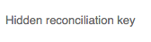

# Adobe Campaign 구성 요소{#adobe-campaign-components}

Adobe Campaign과 통합하면 뉴스레터 및 양식을 사용하여 작업할 때 사용할 수 있는 구성 요소가 있습니다. 둘 다 이 문서에 설명되어 있습니다.

>[!CAUTION]
>
>AEM 이메일 구성 요소는 더 이상 사용되지 않습니다. 컨텐츠 및 스타일을 병합하는 이메일의 특성으로 인해, AEM에서 기본적으로 제공하는 이메일 구성 요소는 프로젝트에 필요한 구성 요소에 사용자 지정 스타일을 구현해야 하므로 고객을 위해 제한된 재사용이 됩니다.
>
>이메일 구성 요소는 프로젝트 수준에서 구현할 수 있으며 사용되지 않는 AEM 이메일 구성 요소는 이를 어떻게 달성할 수 있는지 보여줍니다. 하지만 이렇게 사용되지 않는 구성 요소는 프로젝트에서 사용해서는 안 됩니다.

## Adobe Campaign 뉴스레터 구성 요소 {#adobe-campaign-newsletter-components}

모든 캠페인 구성 요소는 다음에 설명된 우수 사례를 따릅니다 [이메일 템플릿 우수 사례](/help/sites-administering/best-practices-for-email-templates.md) 및 는 Adobe 마크업 언어를 기반으로 합니다 [HTL](https://helpx.adobe.com/kr/experience-manager/htl/using/overview.html).

Adobe Campaign과 통합하도록 구성된 뉴스레터/이메일을 열면 다음 구성 요소가 **Adobe Campaign 뉴스레터** 섹션:

* 제목(캠페인)
* 이미지(캠페인)
* 링크(캠페인)
* Scene7 이미지 템플릿(캠페인)
* 타깃팅된 참조(캠페인)
* 텍스트 및 이미지(캠페인)
* 텍스트 및 개인화(캠페인)

이러한 구성 요소에 대한 설명은 다음 섹션에 있습니다.

구성 요소는 다음과 같이 나타납니다.

### 제목(캠페인) {#heading-campaign}

제목 구성 요소는 다음 중 하나를 수행할 수 있습니다.

* 현재 페이지의 이름을 **제목** 필드를 비워 둡니다.
* 에서 지정하는 텍스트를 표시합니다. **제목** 필드.

을 편집합니다 **제목(캠페인)** 구성 요소를 직접 사용할 수 있습니다. 페이지 제목을 사용하려면 비워 둡니다.

다음을 구성할 수 있습니다.

* **제목**
페이지 제목 이외의 이름을 사용하려면 여기에 입력합니다.

* **제목 수준(1, 2, 3, 4)**
HTML 제목 크기 1-4를 기반으로 하는 제목 수준입니다.

다음 예는 제목(캠페인) 구성 요소가 표시되는 것을 보여줍니다.

### 이미지(캠페인) {#image-campaign}

이미지(캠페인) 구성 요소는 지정된 매개 변수에 따라 이미지와 추가 텍스트를 표시합니다.

이미지를 업로드한 다음 편집하고 조작(예: 자르기, 회전, 링크/제목/텍스트 추가)할 수 있습니다.

이미지를 [자산 브라우저](/help/sites-authoring/author-environment-tools.md#assetsbrowsertouchoptimizedui) 구성 요소 또는 해당 구성 요소에 바로 액세스 [구성 대화 상자](/help/sites-authoring/editing-content.md#editconfigurecopycutdeletepastetouchoptimizedui). 구성 대화 상자에서 이미지를 업로드할 수도 있습니다. 이 대화 상자는 이미지의 모든 정의 및 조작도 제어합니다.

>[!NOTE]
>
>에 정보를 입력해야 합니다. **대체 텍스트** 필드 또는 이미지를 저장할 수 없습니다.

이미지가 업로드된 후(그 전은 아님) 다음 아이콘을 사용할 수 있습니다 [즉석 편집](/help/sites-authoring/editing-content.md#editcontenttouchoptimizedui) 필요에 따라 이미지를 자르거나 회전하려면:

>[!NOTE]
>
>즉석 편집기에서는 편집할 때 이미지의 원래 크기와 종횡비를 사용합니다. 높이 및 너비 속성을 지정할 수도 있습니다. 속성에 정의된 모든 크기와 종횡비는 편집 변경 사항을 저장할 때 적용됩니다.
>
>사용자 인스턴스에 따라 최소 및 최대 제한 사항은 [페이지의 디자인](/help/sites-developing/designer.md)에 의해 적용될 수도 있습니다. 이러한 제한 사항은 프로젝트 구현 중 개발됩니다.

맵 및 확대/축소와 같은 몇 가지 추가 옵션은 전체 화면 편집 모드에서 사용할 수 있습니다.

이미지가 로드되면 다음 항목을 구성할 수 있습니다.

* **맵**
이미지를 매핑하려면 맵을 선택합니다. 이미지 맵을 만들 방법(사각형, 다각형 등)과 영역이 가리킬 대상 위치를 지정할 수 있습니다.

* **자르기**
자르기를 선택하여 이미지를 자릅니다. 마우스를 사용하여 이미지를 자를 수 있습니다.

* **회전**
이미지를 회전하려면 회전을 선택합니다. 이미지가 원하는 방향으로 회전할 때까지 반복적으로 사용합니다.

* **지우기**
현재 이미지를 제거합니다.

* 확대/축소 막대(클래식만 해당) 이미지를 확대/축소하려면 이미지 아래에서 [확인] 및 [취소] 단추 위에 있는 슬라이드 막대를 사용합니다
* **제목**
이미지의 제목입니다.

* **대체 텍스트**
액세스 가능한 컨텐츠를 만들 때 사용할 대체 텍스트입니다.

* **링크 대상**
웹 사이트 내의 자산 또는 다른 페이지로 이동하는 링크를 만듭니다.

* **설명**
이미지에 대한 설명입니다.

* **크기**
이미지의 높이와 너비를 설정합니다.

>[!NOTE]
>
>에 정보를 입력해야 합니다. **대체 텍스트** 의 필드 **고급** 탭하거나 이미지를 저장할 수 없으며 다음 오류 메시지가 표시됩니다.
>
>`Validation failed. Verify the values of the marked fields.`

다음 예는 이미지(캠페인) 구성 요소가 표시되는 것을 보여줍니다.

### 링크(캠페인) {#link-campaign}

링크(캠페인) 구성 요소를 사용하면 뉴스레터에 링크를 추가할 수 있습니다.

에서 다음을 구성할 수 있습니다 **표시**, **URL 정보**, 또는 **고급** 탭:

* **링크 캡션**
링크의 캡션입니다. 사용자가 보는 텍스트입니다.

* **링크 도구 설명**
링크 사용 방법에 대한 추가 정보를 추가합니다.

* **LinkType**
드롭다운 목록에서 
**사용자 지정 URL** 그리고 **응용 문서**. 이 필드는 필수입니다. 사용자 지정 URL을 선택하는 경우 링크 URL을 제공할 수 있습니다. 응용 문서를 선택하면 문서 경로를 제공할 수 있습니다.

* **추가 URL 매개 변수**
추가 URL 매개 변수를 추가합니다. 항목 추가 를 클릭하여 여러 항목을 추가합니다.

>[!NOTE]
>
>에 정보를 입력해야 합니다. **링크 유형** 의 필드 **URL 정보** 탭하거나 구성 요소를 저장할 수 없으며 다음 오류 메시지가 표시됩니다.
>
>`Validation failed. Verify the values of the marked fields.`

다음 예는 링크(캠페인) 구성 요소가 표시되는 것을 보여줍니다.

### Dynamic Media Classic(Scene7) 이미지 템플릿(캠페인) {#scene-image-template-campaign}

Dynamic Media Classic(Scene7) 이미지 템플릿은 계층이 지정된 이미지 파일로서, 컨텐츠와 속성이 가변성을 위해 매개 변수화할 수 있습니다. 다음 **[!UICONTROL 이미지 템플릿]** 구성 요소로 뉴스레터 내에서 Scene7 템플릿을 사용하고 템플릿 매개 변수의 값을 변경할 수 있습니다. 또한 매개 변수 내에서 Adobe Campaign 메타데이터 변수를 사용할 수 있으므로 각 사용자는 개인화된 방식으로 이미지를 경험하게 됩니다.

**편집**&#x200B;을 클릭하여 구성 요소를 구성합니다. 이 섹션에 설명된 설정을 구성할 수 있습니다. 이 Scene7 이미지 템플릿은 [Scene7 이미지 템플릿 구성 요소](/help/assets/scene7.md#image-template).

또한 매개 변수 패널에는 Scene7에서 템플릿에 대해 정의된 모든 템플릿 매개 변수가 표시됩니다. 이러한 각 매개 변수에 대해 값을 조정하거나, 변수를 삽입하거나, 기본값으로 재설정할 수 있습니다.

### 타깃팅된 참조(캠페인) {#targeted-reference-campaign}

타깃팅된 참조(캠페인) 구성 요소를 사용하면 타깃팅된 단락에 대한 참조를 만들 수 있습니다.

이 구성 요소에서 타깃팅된 단락으로 이동하여 선택합니다.

폴더 아이콘을 클릭하여 참조할 단락으로 이동합니다. 완료되면 확인 표시를 클릭합니다.

### 텍스트 및 이미지(캠페인) {#text-image-campaign}

텍스트 및 이미지(캠페인) 구성 요소는 텍스트 블록과 이미지를 추가합니다.

을 클릭하여 구성 요소를 구성하면 텍스트 또는 이미지를 선택합니다.

선택 **텍스트** 인라인 편집기를 표시합니다.

선택 **이미지** 이미지에 대한 즉석 편집기를 표시합니다.

자세한 내용은 [이미지(캠페인) 구성 요소](#image-campaign) 를 참조하십시오. 자세한 내용은 [텍스트 및 개인화(캠페인) 구성 요소](#text-personalization-campaign) 를 참조하십시오.

텍스트 및 개인화(캠페인) 및 이미지(캠페인) 구성 요소와 같이 다음을 구성할 수 있습니다.

* **텍스트**
텍스트를 입력합니다. 도구 모음을 사용하여 서식을 수정하고, 목록을 만들고, 링크를 추가합니다.

* **이미지**
Content Finder에서 이미지를 드래그하거나 클릭하여 이미지를 찾습니다. 필요에 따라 자르거나 회전합니다.

* **이미지 속성** (**고급 이미지 속성**) 다음을 지정할 수 있습니다.

   * **제목**
블록의 제목입니다. 마우스오버로 표시됩니다.

   * **대체 텍스트**
이미지를 표시할 수 없을 때 표시할 대체 텍스트입니다.

   * **링크 대상**
웹 사이트 내의 자산 또는 다른 페이지로 이동하는 링크를 만듭니다.

   * **설명**
이미지에 대한 설명입니다.

   * **크기**
이미지의 높이와 너비를 설정합니다.

>[!NOTE]
>
>다음 **대체 텍스트** 의 필드 **고급** 탭이 필요하거나 구성 요소를 저장할 수 없으며 다음 오류 메시지가 표시됩니다.
>
>`Validation failed. Verify the values of the marked fields.`

다음 예는 텍스트 및 이미지(캠페인) 구성 요소가 표시되는 것을 보여줍니다.

### 텍스트 및 개인화(캠페인) {#text-personalization-campaign}

텍스트 및 개인화(캠페인) 구성 요소를 사용하면 [리치 텍스트 편집기](/help/sites-authoring/rich-text-editor.md). 또한 이 구성 요소를 사용하면 Adobe Campaign에서 사용할 수 있는 컨텍스트 필드와 개인화 블록을 사용할 수 있습니다. 또한 [개인화 삽입](/help/sites-authoring/campaign.md#inserting-personalization).

여러 가지 아이콘을 사용하여 글꼴 특성, 정렬, 링크, 목록 및 들여쓰기 등의 텍스트 서식을 지정할 수 있습니다. 기능은 기본적으로 [두 UI 모두](/help/sites-authoring/editing-content.md)과 같이 사용됩니다.

즉석 편집기에서는 텍스트를 추가하고, 양쪽 맞춤을 변경하고, 링크를 추가 및 제거하고, 컨텍스트 필드나 개인화 블록을 추가하고, 전체 화면 모드를 시작할 수 있습니다. 텍스트/개인화 추가를 마치면 확인 표시를 선택하여 변경 사항을 저장합니다(또는 취소하려면 x). 자세한 내용은 [즉석 편집](/help/sites-authoring/editing-content.md#editcontenttouchoptimizedui) 추가 정보.

>[!NOTE]
>
>* 사용 가능한 개인화 필드는 뉴스레터가 연결된 Adobe Campaign 템플릿에 따라 다릅니다.
>* ContextHub에서 가상 사용자를 선택하면 개인화 필드가 선택한 프로필의 데이터로 자동 교체됩니다.
>
>자세한 내용은 [개인화 삽입](/help/sites-authoring/campaign.md#inserting-personalization).

>[!NOTE]
>
>에 정의된 필드만 **nms:seedMember** 스키마 또는 그 확장 중 하나를 고려합니다. 연결된 테이블의 속성 **nms:seedMember** 사용할 수 없습니다.

## Adobe Campaign 양식 구성 요소 {#adobe-campaign-form-components}

Adobe Campaign 구성 요소를 사용하여 사용자가 뉴스레터에 가입하거나, 뉴스레터에서 가입을 해지하거나, 사용자 프로필을 업데이트하기 위해 채우는 양식을 만들 수 있습니다. 자세한 내용은 [Adobe Campaign Forms 만들기](/help/sites-authoring/adobe-campaign-forms.md) 추가 정보.

각 구성 요소 필드를 Adobe Campaign 데이터베이스 필드에 연결할 수 있습니다. 사용 가능한 필드는 섹션에 설명된 대로 필드가 포함하는 데이터 유형에 따라 다릅니다 [구성 요소 및 데이터 유형](#components-and-data-type). Adobe Campaign에서 수신자 스키마를 확장하는 경우, 데이터 유형이 일치하는 구성 요소에서 새 필드를 사용할 수 있습니다.

Adobe Campaign과 통합하도록 구성된 양식을 열면 다음 구성 요소가 **Adobe Campaign** 섹션:

* 확인란(캠페인)
* 날짜 필드(캠페인)와 날짜 필드/HTML5(캠페인)
* 암호화된 기본 키(캠페인)
* 표시 오류(캠페인)
* 숨겨진 조정 키(캠페인)
* 숫자 필드(캠페인)
* 옵션 필드(캠페인)
* 가입 확인 목록(캠페인)
* 텍스트 필드(캠페인)

구성 요소는 다음과 같이 나타납니다.

이 섹션에서는 각 구성 요소에 대해 자세히 설명합니다.

### 구성 요소 및 데이터 유형 {#components-and-data-type}

다음 표에서는 Adobe Campaign 프로필 데이터를 표시하고 수정하는 데 사용할 수 있는 구성 요소에 대해 설명합니다. 각 구성 요소를 Adobe Campaign 프로필 필드에 매핑하여 해당 값을 표시하고 양식이 제출될 때 필드를 업데이트할 수 있습니다. 다른 구성 요소는 적절한 데이터 유형의 필드에만 일치시킬 수 있습니다.

<table>
 <tbody>
  <tr>
   <td>
<strong>구성 요소</strong>
 </td>
   <td>
<strong>Adobe Campaign 필드의 데이터 유형</strong>
 </td>
   <td>
<strong>예제 필드</strong>
 </td>
  </tr>
  <tr>
   <td>
확인란(캠페인)
 </td>
   <td>
부울
 </td>
   <td>
더 이상 연락하지 않음(채널별로)
 </td>
  </tr>
  <tr>
   <td>
날짜 필드(캠페인)
 
날짜 필드/HTML 5(캠페인)
 </td>
   <td>
날짜
 </td>
   <td>
생년월일
 </td>
  </tr>
  <tr>
   <td>
숫자 필드(캠페인)
 </td>
   <td>
숫자(바이트, short, long, double)
 </td>
   <td>
나이
 </td>
  </tr>
  <tr>
   <td>
옵션 필드(캠페인)
 </td>
   <td>
연결된 값이 있는 바이트
 </td>
   <td>
성별
 </td>
  </tr>
  <tr>
   <td>
텍스트 필드(캠페인)
 </td>
   <td>
문자열
 </td>
   <td>
이메일
 </td>
  </tr>
 </tbody>
</table>

### 대부분의 구성 요소에 공통되는 설정 {#settings-common-to-most-components}

Adobe Campaign 구성 요소에는 모든 구성 요소에서 공통적인 설정이 있습니다(암호화된 기본 키와 숨겨진 조정 키 구성 요소 제외).

대부분의 구성 요소에서 다음을 구성할 수 있습니다.

#### 제목 및 텍스트 {#title-and-text}

* **제목**
요소 이름 이외의 이름을 사용하려면 여기에 입력합니다.

* **제목 숨기기**
제목을 표시하지 않으려면 이 확인란을 선택하십시오.

* **설명**
사용자를 위한 자세한 정보를 제공하기 위해 필드에 설명을 추가합니다.

* **값만 표시**
값이 있을 경우에만 값을 표시합니다

#### Adobe Campaign {#adobe-campaign}

다음을 구성할 수 있습니다.

* **매핑**
해당되는 경우 Adobe Campaign 개인화 필드를 선택합니다.

* **조정 키**
이 필드가 조정 키의 일부인 경우 이 확인란을 선택합니다.

#### 제한 {#constraints}

* **필수 여부** 이 구성 요소를 필수 구성 요소로 만들려면 이 확인란을 선택하십시오. 즉, 사용자가 값을 입력해야 합니다.
* **필수 메시지** 필수 필드임을 알리는 메시지를 추가할 수도 있습니다.

#### 스타일링 {#styling}

* **CSS**
이 구성 요소에 사용할 CSS 클래스를 입력하십시오.

### 확인란(캠페인) {#checkbox-campaign}

확인란(캠페인) 구성 요소를 사용하면 사용자가 부울 데이터 유형의 Adobe Campaign 프로필 필드를 수정할 수 있습니다. 예를 들어 수신자가 채널을 통해 연락하지 않도록 지정할 수 있는 확인란(캠페인) 구성 요소가 있을 수 있습니다.

다음을 수행할 수 있습니다 [대부분의 Adobe Campaign 구성 요소에 공통되는 설정 구성](#settings-common-to-most-components) 확인란(캠페인) 구성 요소에서 사용할 수 없습니다.

다음 예는 확인란(캠페인) 구성 요소가 표시되는 것을 보여줍니다.

### 날짜 필드(캠페인)와 날짜 필드/HTML 5(캠페인) {#date-field-campaign-and-date-field-html-campaign}

수신자가 날짜를 지정할 수 있도록 하려면 날짜 필드를 사용하십시오. 예를 들어 수신자가 생년월일을 지정하도록 할 수 있습니다. 날짜 형식은 Adobe Campaign 인스턴스에 사용된 형식과 일치합니다.

추가 [대부분의 Adobe Campaign 구성 요소에 공통되는 설정](#settings-common-to-most-components)를 구성할 수 있습니다.

* **제한 - 제한** 드롭다운 - **없음** 또는 **날짜 -** 날짜 제한을 추가하거나 제한을 추가하지 않습니다. 날짜를 선택하는 경우 사용자가 필드에 입력하는 응답의 형식은 날짜 형식이어야 합니다.

* **제한 메시지** 또한 사용자가 응답의 형식을 적절하게 지정하는 방법을 알 수 있도록 제한 메시지를 추가할 수 있습니다.
* **스타일링 - 너비** 을 클릭하거나 탭하여 필드의 너비를 조정합니다 **+** 및 **-** 아이콘을 클릭하거나 숫자를 입력합니다.

다음 예제는 폭이 조정된 날짜 필드(캠페인) 구성 요소가 표시되는 것을 보여줍니다.

### 암호화된 기본 키(캠페인) {#encrypted-primary-key-campaign}

이 구성 요소는 Adobe Campaign 프로필의 식별자를 포함할 URL 매개 변수의 이름을 정의합니다(**기본 리소스 식별자** 또는 **암호화된 기본 키** ( 각각 Adobe Campaign Standard 및 6.1 )에서 사용할 수 있습니다.

Adobe Campaign 프로필 데이터를 표시하고 수정하는 각 양식 **반드시** 암호화된 기본 키 구성 요소를 포함합니다.

암호화된 기본 키(캠페인) 구성 요소에서 다음을 구성할 수 있습니다.

* **제목 및 텍스트 - 요소 이름** 기본값은 encryptedPK입니다. 양식의 다른 요소 이름과 충돌할 때만 요소 이름을 변경해야 합니다. 두 양식 필드에는 동일한 요소 이름이 있을 수 없습니다.
* **Adobe Campaign - URL 매개 변수** EPK에 대한 URL 매개 변수를 추가합니다. 예를 들어 값을 사용할 수 있습니다 **epk**.

다음 예는 암호화된 기본 키(캠페인) 구성 요소가 표시되는 것을 보여줍니다.

### 표시 오류(캠페인) {#error-display-campaign}

이 구성 요소로 백엔드 오류를 표시할 수 있습니다. 구성 요소가 제대로 작동하도록 하려면 양식의 오류 처리를 [앞으로]로 설정해야 합니다.

다음 예는 오류 표시(캠페인) 구성 요소가 표시되는 것을 보여줍니다.

### 숨겨진 조정 키(캠페인) {#hidden-reconciliation-key-campaign}

숨겨진 조정 키(캠페인) 구성 요소를 사용하면 숨겨진 필드를 조정 키의 일부로 양식에 추가할 수 있습니다.

숨겨진 조정 키(캠페인) 구성 요소에서 다음 내용을 구성할 수 있습니다.

* **제목 및 텍스트 - 요소 이름** 기본값은 reconcilKey입니다. 양식의 다른 요소 이름과 충돌할 때만 요소 이름을 변경해야 합니다. 두 양식 필드에는 동일한 요소 이름이 있을 수 없습니다.
* **Adobe Campaign - 매핑** Adobe Campaign 개인화 필드에 매핑합니다.

다음 예는 숨겨진 조정 키(캠페인) 구성 요소가 표시되는 것을 보여줍니다.

### 숫자 필드(캠페인) {#numeric-field-campaign}

수신자가 연령 등의 숫자를 입력할 수 있도록 하려면 숫자 필드를 사용합니다.

추가 [대부분의 Adobe Campaign 구성 요소에 공통되는 설정](#settings-common-to-most-components)를 구성할 수 있습니다.

* **제한 - 제한** 드롭다운 - **없음** 또는 **숫자 -** 숫자를 추가하거나 제약 조건을 추가하지 않으려면 숫자를 선택하는 경우, 사용자가 필드에 입력하는 응답은 숫자여야 합니다.

* **제한 메시지** 또한 사용자가 응답의 형식을 적절하게 지정하는 방법을 알 수 있도록 제한 메시지를 추가할 수 있습니다.
* **스타일링 - 너비** 을 클릭하거나 탭하여 필드의 너비를 조정합니다 **+** 및 **-** 아이콘을 클릭하거나 숫자를 입력합니다.

다음 예는 숫자 필드(캠페인) 구성 요소가 구성된 너비가 표시되는 것을 보여줍니다.

### 옵션 필드(캠페인) {#option-field-campaign}

이 드롭다운 목록에서 옵션을 선택할 수 있습니다. 예를 들어, 수신자의 성별 또는 상태입니다.

다음을 수행할 수 있습니다 [대부분의 Adobe Campaign 구성 요소에 공통되는 설정 구성](#settings-common-to-most-components) ( 옵션 필드 (캠페인) 구성 요소에 있습니다. 드롭다운 목록을 채우려면 Adobe Campaign 기호를 클릭하거나 탭하고 필드로 이동하여 Adobe Campaign 개인화 필드에서 해당 필드를 선택합니다.

다음 예는 옵션 필드(캠페인) 구성 요소가 표시되는 것을 보여줍니다.

### 가입 확인 목록(캠페인) {#subscriptions-checklist-campaign}

를 사용하십시오 **가입 확인 목록(캠페인)** 구성 요소를 사용하여 Adobe Campaign 프로필과 연결된 구독을 수정할 수 있습니다.

이 구성 요소를 양식에 추가하면 사용 가능한 모든 가입을 확인란으로 표시하고 사용자가 원하는 구독을 선택할 수 있습니다. 사용자가 양식을 제출하면 이 구성 요소는 양식 작업 유형(**Adobe Campaign: 서비스 구독** 또는 **Adobe Campaign: 서비스 구독 취소**).

>[!NOTE]
>
>구성 요소는 사용자가 이미 가입했거나 가입을 해지한 서비스를 확인하지 않습니다.

다음을 수행할 수 있습니다 [대부분의 Adobe Campaign 구성 요소에 공통되는 설정 구성](#settings-common-to-most-components) 가입 확인 목록(캠페인) 구성 요소에 있는 모든 세그먼트를 표시합니다. (이 구성 요소에 사용할 수 있는 Adobe Campaign 구성이 없습니다.)

다음 예는 가입 확인 목록(캠페인) 구성 요소가 표시되는 것을 보여줍니다.

### 텍스트 필드(캠페인) {#text-field-campaign}

텍스트 필드(캠페인) 구성 요소에서는 이름, 성, 주소, 이메일 주소 등과 같은 문자열 유형 데이터를 입력할 수 있습니다.

추가 [대부분의 Adobe Campaign 구성 요소에 공통되는 설정](#settings-common-to-most-components)를 구성할 수 있습니다.

* **제한 - 제한** 드롭다운 - **없음,** **이메일**, 또는 **이름** (모음 기호 없음) - 전자 메일 주소, 이름 또는 제한 없음 제한을 추가합니다. 이메일을 선택하는 경우, 사용자가 필드에 입력하는 응답의 형식은 이메일 주소여야 합니다. 이름을 선택하는 경우 이름이어야 합니다(모음 기호는 허용되지 않음).

* **제한 메시지** 또한 사용자가 응답의 형식을 적절하게 지정하는 방법을 알 수 있도록 제한 메시지를 추가할 수 있습니다.
* **스타일링 - 너비** 을 클릭하거나 탭하여 필드의 너비를 조정합니다 **+** 및 **-** 아이콘을 클릭하거나 숫자를 입력합니다.

다음 예는 텍스트 필드(캠페인) 구성 요소가 표시되는 것을 보여줍니다.

