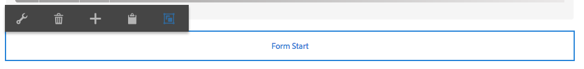
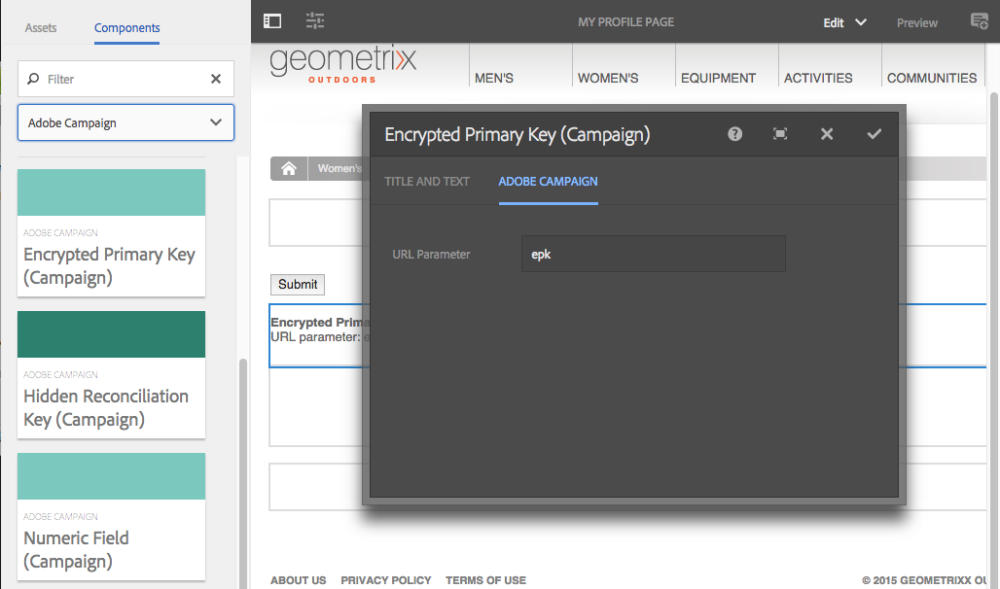

# AEM에서 Adobe Campaign 양식 작성 {#creating-adobe-campaign-forms-in-aem}

AEM에서는 웹 사이트에서 Adobe Campaign과 상호 작용하는 양식을 작성하고 사용할 수 있습니다. 특정 필드를 양식에 삽입하고 Adobe Campaign 데이터베이스에 매핑할 수 있습니다.

데이터를 Adobe Campaign 데이터베이스에 통합하는 내내 새로운 연락처 가입, 가입 해지 및 사용자 프로필 데이터를 관리할 수 있습니다.

AEM에서 Adobe Campaign 양식을 사용하려면 이 문서에 설명된 다음 절차를 따라야 합니다.

1. 템플릿을 사용할 수 있도록 합니다.
1. 양식을 작성합니다.
1. 양식 컨텐츠를 편집합니다.

Adobe Campaign에 사용하는 세 가지 유형의 양식을 기본적으로 사용할 수 있습니다.

* 프로필 저장
* 서비스 가입
* 서비스 가입 해지

이러한 양식은 Adobe Campaign 프로필의 암호화된 기본 키를 허용하는 URL 매개 변수를 정의합니다. 양식은 연결된 Adobe Campaign 프로필의 데이터를 이 URL 매개 변수를 기반으로 업데이트합니다.

이러한 양식을 독립적으로 만들더라도 일반적인 사용 사례에서는 수신자가 링크를 열고 프로필 데이터를 조정(해당 프로필을 가입하든지, 가입 해지하든지 또는 업데이트하든지 간에)할 수 있도록 뉴스레터 컨텐츠 내에 양식 페이지를 연결하는 개인화된 링크를 생성합니다.

양식은 사용자를 기반으로 자동으로 업데이트됩니다. 자세한 내용은 [양식 컨텐츠 편집](#editing-form-content)을 참조하십시오.

## 템플릿을 사용할 수 있도록 설정 {#making-a-template-available}

Adobe Campaign에 사용되는 양식을 작성하려면 먼저 AEM 애플리케이션에서 다른 템플릿을 사용할 수 있도록 해야 합니다.

이렇게 하려면 [템플릿 설명서](/help/sites-developing/templates.md#template-availability)를 참조하십시오.

## 양식 만들기 {#creating-a-form}

먼저 작성 및 게시 인스턴스와 Adobe Campaign 간에 제대로 연결되었는지 확인하십시오. [Adobe Campaign Standard와 통합](/help/sites-administering/campaignstandard.md) 또는 [Adobe Campaign Classic과 통합](/help/sites-administering/campaignonpremise.md)을 참조하십시오.

>[!NOTE]
>
>Adobe Campaign Classic 또는 Adobe Campaign Standard를 각각 사용할 때 페이지의 **jcr:content** 노드에 대한 **acMapping** 속성이 **mapRecipient** 또는 **profile**&#x200B;로 설정되어 있는지 확인합니다.

1. AEM의 [사이트]에서 새 페이지를 만들 위치로 이동합니다.
1. 페이지를 만들고 **Adobe Campaign Classic 프로필** 또는&#x200B;**Adobe Campaign Standard 프로필**&#x200B;을 선택하고 **다음**&#x200B;을 클릭합니다.

   

   >[!NOTE]
   >
   >원하는 템플릿을 사용할 수 없는 경우 [템플릿 가용성](/help/sites-developing/templates.md#template-availability)을 참조하십시오.

1. **이름** 필드에 페이지 이름을 추가합니다. 올바른 JCR 이름이어야 합니다.
1. **제목** 필드에 제목을 입력하고 **만들기**&#x200B;를 클릭합니다.
1. 페이지를 열고 **속성 열기**&#x200B;를 선택한 다음, 클라우드 서비스에서 Adobe Campaign 구성을 추가하고 변경 사항을 저장하는 확인란을 선택합니다.

   

1. 페이지의 **양식 시작** 구성 요소에서 양식 유형(**가입, 가입 해지**&#x200B;또는 **프로필 저장**)을 선택합니다. 유형은 양식당 하나만 있어야 합니다. 이제 [양식의 컨텐츠를 편집](#editing-form-content)할 수 있습니다.

## 양식 컨텐츠 편집 {#editing-form-content}

Adobe Campaign 전용 양식에는 특정 구성 요소가 있습니다. 이러한 구성 요소에는 양식의 각 필드를 Adobe Campaign 데이터베이스의 필드에 연결할 수 있는 선택 사항이 있습니다.

>[!NOTE]
>
>원하는 템플릿을 사용할 수 없는 경우 [템플릿을 사용할 수 있게 만들기](/help/sites-authoring/adobe-campaign.md)를 참조하십시오.

이 섹션에서는 Adobe Campaign을 연결하는 특정 링크에 대해서만 자세히 설명합니다. Adobe Experience Manager에서 양식을 사용하는 방법에 대한 일반적인 개요에 대한 자세한 내용은 [Editmode 구성 요소](/help/sites-authoring/default-components-foundation.md)를 참조하십시오.

1. **속성 열기**&#x200B;를 선택한 다음, 클라우드 서비스에서 Adobe Campaign 구성을 추가하고 변경 사항을 저장하는 확인란을 선택합니다.

   

1. 페이지의 **양식 시작** 구성 요소에서 구성 아이콘을 클릭합니다.

   

1. **고급** 탭을 클릭하고 양식 유형 **가입, 가입 해지,** 또는 **프로필 저장**&#x200B;을 선택하고 **확인을 클릭합니다.** 유형은 양식당 하나만 있어야 합니다.

   * **Adobe Campaign: 프로필 저장**: Adobe Campaign(기본값)에서 수신자를 생성하거나 업데이트할 수 있습니다.
   * **Adobe Campaign: 서비스에 가입**: Adobe Campaign에서 수신자의 가입을 관리할 수 있습니다.
   * **Adobe Campaign: 서비스 가입 해지**: Adobe Campaign에서 수신자의 가입을 취소할 수 있습니다.

1. 각 양식에 **암호화된 기본 키** 구성 요소가 있어야 합니다. 이 구성 요소는 Adobe Campaign 프로필의 암호화된 기본 키를 허용하는 데 사용할 URL 매개 변수를 정의합니다. [구성 요소]에서 해당 구성 요소만 표시되도록 Adobe Campaign을 선택합니다.
1. 구성 요소 **암호화된 기본 키**&#x200B;를 양식(아무 데나)으로 드래그하고 **구성** 아이콘을 클릭하거나 탭합니다. **Adobe Campaign** 탭에서 URL 매개 변수의 이름을 지정하십시오. 확인 표시를 클릭하거나 탭하여 변경 사항을 저장합니다.

   이 양식에 연결하도록 생성된 링크는 이 URL 매개 변수를 사용하고 이 매개 변수를 Adobe Campaign 프로필의 암호화된 기본 키에 지정해야 합니다. 암호화된 기본 키는 올바르게 URL(퍼센트)로 인코딩되어야 합니다.

   

1. 텍스트 필드, 날짜 필드, 확인란 필드, 선택 사항 필드 등과 같이, 필요에 따라 양식에 구성 요소를 추가합니다. 각 구성 요소에 대한 자세한 내용은 [Adobe Campaign 양식 구성 요소](/help/sites-authoring/adobe-campaign-components.md)를 참조하십시오.
1. 구성 아이콘을 클릭하여 구성 요소를 엽니다. 예를 들어 **텍스트 필드(캠페인)** 구성 요소에서 제목과 텍스트를 변경합니다.

   **Adobe Campaign**&#x200B;을 클릭하여 양식 필드를 Adobe Campaign 메타데이터 변수에 매핑하십시오. 양식을 제출하면 매핑된 필드가 Adobe Campaign에서 업데이트됩니다. 일치하는 유형의 필드만 변수 선택기에서 사용할 수 있습니다(예: 텍스트 필드용 문자열 변수).

   

   >[!NOTE]
   >
   >아래 지침에 따라 수신자 표에 표시되는 필드를 추가/제거할 수 있습니다.[https://blogs.adobe.com/experiencedelivers/experience-management/aem-campaign-integration/](https://blogs.adobe.com/experiencedelivers/experience-management/aem-campaign-integration/)

1. **페이지 게시**&#x200B;를 클릭합니다. 사이트에서 페이지가 활성화됩니다. AEM 게시 인스턴스로 이동하여 이것을 확인할 수 있습니다. [양식을 테스트](#testing-a-form)할 수도 있습니다.

   >[!CAUTION]
   >
   >게시 시 양식을 사용하려면 클라우드 서비스의 익명 사용자에게 읽기 권한을 제공해야 합니다. 그러나 익명 사용자에게 읽기 권한을 제공하는 데 따르는 잠재적인 보안 문제를 알고 있어야 합니다. 그리고 디스패처를 구성하는 등의 작업으로 이러한 문제를 반드시 방지하도록 하십시오.

## 양식 테스트  {#testing-a-form}

양식을 작성하고 양식 컨텐츠를 편집한 후 양식이 예상대로 작동하는지 수동으로 테스트할 수 있습니다.

>[!NOTE]
>
>각 양식에 **암호화된 기본 키** 구성 요소가 있어야 합니다. [구성 요소]에서 해당 구성 요소만 표시되도록 Adobe Campaign을 선택합니다.
>
>이 절차에서는 epk(암호화된 기본 키) 번호를 수동으로 입력하지만 실제로는 사용자가 뉴스레터 내에서 이 페이지에 연결하는 링크를 가져오게 됩니다(프로필을 가입 해지하든지, 가입하든지 또는 업데이트하든지 간에). epk는 사용자를 기반으로 자동으로 업데이트됩니다.
>
>해당 링크를 만들려면 Adobe Campaign의 epk에 연결하는 변수 **Main resource identifier**(Adobe Campaign Standard) 또는 **암호화된 식별자**(Adobe Campaign Classic)(예: **텍스트 및 개인화(캠페인)** 구성 요소에서)를 사용합니다.

이렇게 하려면 Adobe Campaign 프로필의 EPK를 수동으로 가져온 다음, URL에 추가해야 합니다.

1. Adobe Campaign 프로필의 암호화된 기본 키(EPK)를 가져오려면 다음을 수행하십시오.

   * Adobe Campaign Standard - 기존 프로필이 나열된 **프로필 및 대상** > **프로필**&#x200B;으로 이동합니다. 테이블에 열에 **주 리소스 식별자** 필드가 표시되는지 확인하십시오. (이 필드는 **목록 구성**&#x200B;을 클릭/탭하여 구성할 수 있습니다.) 원하는 프로필의 기본 리소스 ID를 복사하십시오.
   * Adobe Campaign Classic에서 기존 프로필이 나열된 **프로필 및 Target** > **수신자**&#x200B;로 이동합니다. 표에 열에 **암호화된 식별자** 필드가 표시되는지 확인하십시오. (항목을 마우스 오른쪽 단추로 클릭하고 **목록 구성...을 선택하여 이 필드를 구성할 수 있습니다.**). 원하는 프로필의 암호화된 ID를 복사하십시오.

1. AEM에서 게시 인스턴스의 양식 페이지를 열고 1단계에서 EPK를 URL 매개 변수로 추가합니다.양식을 작성할 때 이전에 EPK 구성 요소에서 정의한 것과 동일한 이름을 사용합니다(예:`?epk=...`)
1. 이제 연결된 Adobe Campaign 프로필과 연결된 데이터와 가입을 수정하는 데 이 양식을 사용할 수 있습니다. 일부 필드를 수정하고 양식을 제출한 후 적절한 데이터가 업데이트된 것을 Adobe Campaign 내에서 확인할 수 있습니다.

양식의 유효성이 검증되면 Adobe Campaign 데이터베이스의 데이터가 업데이트됩니다.
