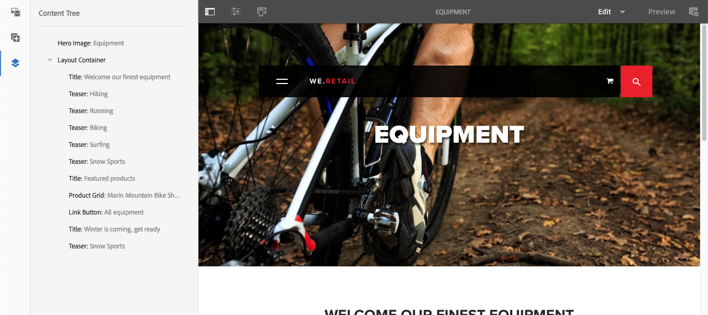

# 작성 - 환경 및 도구{#authoring-the-environment-and-tools}

AEM의 작성 환경에서는 컨텐츠를 구성하고 편집하기 위한 다양한 메커니즘을 제공합니다. 제공된 도구는 다양한 콘솔 및 페이지 편집기에서 액세스됩니다.

## 사이트 관리 {#managing-your-site}

**사이트** 콘솔에서는 헤더 막대, 도구 모음, 작업 아이콘(선택한 리소스에 대해 적용 가능), 탐색 표시 및 선택한 경우 보조 레일(예: 타임라인 및 참조)을 사용하여 웹 사이트를 탐색 및 관리할 수 있습니다.

예를 들면 열 보기에서 다음 작업을 수행합니다.

## 페이지 콘텐츠 편집 {#editing-page-content}

페이지 편집기로 페이지를 편집할 수 있습니다. 예:

`https://localhost:4502/editor.html/content/we-retail/us/en/equipment.html`

>[!NOTE]
>
>편집할 페이지를 처음 열면 일련의 슬라이드를 통해 기능을 둘러볼 수 있습니다.
>
>원할 경우 둘러보기를 건너뛰고 언제든지 **페이지 정보** 메뉴에서 선택하여 반복할 수도 있습니다.

## 도움말 액세스 {#accessing-help}

페이지를 편집할 때 다음 위치에서 **도움말**&#x200B;에 액세스할 수 있습니다.

* [**페이지 정보**](/help/sites-authoring/editing-page-properties.md#page-properties) 선택기. 편집기에 처음 액세스할 때 표시되는 소개 슬라이드가 표시됩니다.
* 특정 구성 요소의 [구성](/help/sites-authoring/editing-content.md#edit-configure-copy-cut-delete-paste) 대화 상자(물음표 사용) 대화 상자의 도구 모음에 있는 아이콘). 상황에 맞는 도움말이 표시됩니다.

추가 [도움말 관련 리소스는 콘솔에서 사용할 수 있습니다](/help/sites-authoring/basic-handling.md#accessing-help).

## 구성 요소 브라우저 {#components-browser}

구성 요소 브라우저에는 현재 페이지에서 사용할 수 있는 모든 구성 요소가 표시됩니다. 이 구성 요소들은 적절한 위치로 드래그한 다음 편집하여 콘텐츠를 추가할 수 있습니다.

구성 요소 브라우저는 사이드 패널 내의 탭입니다([자산 브라우저](/help/sites-authoring/author-environment-tools.md#assets-browser) 및 [콘텐츠 트리](/help/sites-authoring/author-environment-tools.md#content-tree)와 함께 있음). 사이드 패널을 열려면(또는 닫으려면) 도구 모음의 왼쪽 상단에 있는 아이콘을 사용합니다.

사이드 패널을 열 때는 왼쪽에서 밀어서 열게 됩니다(필요한 경우 **구성 요소** 탭 선택). 열려 있는 경우 페이지에 사용할 수 있는 모든 구성 요소를 찾아볼 수 있습니다.

실제 모양 및 처리는 사용하는 장치 유형에 따라 달라집니다.

>[!NOTE]
>
>폭이 1024px 미만이면 모바일 디바이스가 검색됩니다. 소형 데스크탑 창에 해당할 수도 있습니다.

* **모바일 디바이스(예: iPad)**

  구성 요소 브라우저는 편집되는 페이지를 완전히 포함합니다.

  페이지에 구성 요소를 추가하려면 필요한 구성 요소를 길게 누른 상태에서 오른쪽으로 이동합니다. 구성 요소 브라우저가 닫히고 페이지가 다시 표시됩니다. 이 위치에서 구성 요소를 배치할 수 있습니다.

  

* **데스크탑 디바이스**

  창의 왼쪽에 구성 요소 브라우저가 열립니다.

  페이지에 구성 요소를 추가하려면 필요한 구성 요소를 클릭하고 원하는 위치로 끕니다.

  

  구성 요소는 다음으로 표시됩니다.

   * 구성 요소 이름
   * 구성 요소 그룹(회색)
   * 아이콘 또는 약어

      * 표준 구성 요소의 아이콘은 단색입니다.
      * 약어는 항상 구성 요소 이름의 첫 번째 두 문자입니다.

  **구성 요소** 브라우저의 맨 위 도구 모음에서 다음 작업을 수행할 수 있습니다.

   * 구성 요소를 이름별로 필터링합니다.
   * 드롭다운 선택을 사용하여 표시를 특정 그룹으로 제한합니다.

  구성 요소에 대한 자세한 설명은 **구성 요소** 브라우저에서 구성 요소 옆에 있는 정보 아이콘을 클릭하면 됩니다(사용 가능한 경우). For example, for the **Layout Container**:

  

  사용 가능한 구성 요소에 대한 자세한 내용은 [구성 요소 콘솔](/help/sites-authoring/default-components-console.md)을 참조하십시오.

## 자산 브라우저 {#assets-browser}

자산 브라우저에는 현재 페이지에서 직접 사용할 수 있는 모든 [자산](/help/assets/assets.md)이 표시됩니다.

에셋 브라우저는 사이드 패널 내의 탭이며 [구성 요소 찾아보기](/help/sites-authoring/author-environment-tools.md#components-browser)r 및 [콘텐츠 트리](/help/sites-authoring/author-environment-tools.md#content-tree)와(과) 함께 있습니다. 사이드 패널을 열거나 닫으려면 도구 모음의 왼쪽 상단에 있는 아이콘을 사용합니다.

사이드 패널을 열 때는 왼쪽에서 밀어서 열게 됩니다. 필요한 경우 **Assets** 탭을 선택합니다.

에셋 브라우저가 열려 있으면 페이지에 사용할 수 있는 모든 에셋을 검색할 수 있습니다. 필요하면 목록을 확장하는 데 스크롤을 무제한으로 사용합니다.

자산을 페이지에 추가하려면 선택한 후 필요한 위치로 끕니다. 다음과 같은 경우일 수 있습니다.

* 해당 유형의 기존 구성 요소

   * 예를 들어 유형 이미지의 자산을 이미지 구성 요소로 끌 수 있습니다.

* 적절한 형식의 구성 요소를 만들기 위한 단락 시스템의 [자리 표시자](/help/sites-authoring/editing-content.md#component-placeholder)입니다.

   * 예를 들어 유형 이미지의 자산을 단락 시스템으로 드래그하여 이미지 구성 요소를 만들 수 있습니다.

>[!NOTE]
>
>특정 자산 및 구성 요소 유형에 사용할 수 있습니다. 자세한 내용은 [자산 브라우저를 사용하여 구성 요소 삽입](/help/sites-authoring/editing-content.md#inserting-a-component-using-the-assets-browser)을 참조하십시오.

자산 브라우저의 상단 도구 모음에서 다음 기준에 따라 자산을 필터링할 수 있습니다.

* 이름
* 경로
* 이미지, 원고, 문서, 비디오, 페이지, 단락 및 제품 등 에셋 유형
* 방향(세로, 가로, 사각형) 및 스타일(색상, 단색, 회색 음영)과 같은 에셋 특성

   * 특정 자산 유형에만 사용할 수 있음

실제 모양 및 처리는 사용하는 장치 유형에 따라 달라집니다.

>[!NOTE]
>
>모바일 디바이스는 폭이 1024픽셀 미만인 경우 감지됩니다(즉, 작은 데스크탑 창에서도 감지됨).

* **iPad과 같은 모바일 장치**

  자산 브라우저는 편집되는 페이지를 완전히 포함합니다.

  에셋을 페이지에 추가하려면 필요한 에셋을 길게 터치하고 오른쪽으로 이동합니다. 에셋 브라우저가 닫히고 페이지가 다시 표시되어 필요한 구성 요소에 에셋을 추가할 수 있습니다.

  

* **데스크탑 디바이스**

  창의 왼쪽에 자산 브라우저가 열립니다.

  에셋을 페이지에 추가하려면 에셋을 클릭하고 필요한 구성 요소 또는 위치로 드래그합니다.

  

에셋을 빠르게 변경해야 하는 경우, 에셋의 이름 옆에 있는 편집 아이콘을 클릭하여 [에셋 편집기](/help/assets/manage-assets.md)를 에셋 브라우저에서 직접 시작할 수 있습니다.

## 콘텐츠 트리 {#content-tree}

**콘텐츠 트리**&#x200B;는 계층 구조의 페이지에 있는 모든 구성 요소에 대한 개요를 제공하므로 페이지 작성 방법을 한눈에 볼 수 있습니다.

콘텐츠 트리는 구성 요소 및 자산 브라우저와 함께 있는 측면 패널 내의 탭입니다. 사이드 패널을 열거나 닫으려면 도구 모음의 왼쪽 상단에 있는 아이콘을 사용합니다.

사이드 패널을 열 때는(왼쪽에서) 밀어서 열게 됩니다. 필요한 경우 **콘텐츠 트리** 탭을 선택하십시오. 열리면 페이지나 템플릿의 트리 보기 표시를 확인하여 콘텐츠가 계층적으로 구성되는 방식을 쉽게 이해할 수 있습니다. 또한 복잡한 페이지에서 페이지의 구성 요소 간을 더 쉽게 이동할 수 있습니다.

페이지는 동일한 유형의 여러 구성 요소로 쉽게 구성할 수 있으므로 콘텐츠(구성 요소) 트리에는 구성 요소 유형의 이름(검은색) 뒤에 설명 텍스트(회색)가 표시됩니다. 설명 텍스트는 제목 또는 텍스트와 같은 구성 요소의 공통된 속성에서 가져옵니다.

구성 요소 유형은 사용자 언어로 표시되는 반면 구성 요소 설명 텍스트는 페이지 언어로 제공됩니다.

구성 요소 옆에 있는 V자형 화살표를 클릭하면 해당 수준이 축소되거나 확장됩니다.

>[!NOTE]
>
>모바일 디바이스(브라우저 폭이 1024px 미만인 경우)에서 페이지를 편집하는 경우, 콘텐츠 트리를 사용할 수 없습니다.

구성 요소를 클릭하면 페이지 편집기에서 구성 요소가 강조 표시됩니다. 사용 가능한 작업은 페이지 상태에 따라 다릅니다.

* 예: 기본 페이지:

  `https://localhost:4502/editor.html/content/we-retail/language-masters/en/equipment.html`

  

  트리에서 클릭하는 구성 요소를 편집할 수 있는 경우 이름 오른쪽에 렌치 아이콘이 나타납니다. 이 아이콘을 클릭하면 구성 요소의 편집 대화 상자가 열립니다.

  

* 또는 다른 페이지에서 구성 요소가 상속되는 [livecopy](/help/sites-administering/msm.md)의 일부인 페이지입니다. 예:

  `https://localhost:4502/editor.html/content/we-retail/us/en/equipment.html`

  

## 조각 - 관련 콘텐츠 브라우저 {#fragments-associated-content-browser}

페이지에 콘텐츠 조각이 포함되어 있으면 관련 콘텐츠의 [브라우저](/help/sites-authoring/content-fragments.md#using-associated-content)에 액세스할 수 있습니다.

## 참조 {#references}

**참조**&#x200B;에서는 선택한 페이지에 대한 연결을 보여 줍니다.

* 블루프린트
* 론치
* Live Copy
* 언어 사본
* 수신 링크
* 참조 구성 요소 사용: 빌린 콘텐츠 및 빌려준 콘텐츠
* 제품 페이지에 대한 참조(Commerce - 제품 콘솔 참조)

필수 콘솔을 연 다음 필수 리소스로 이동하고 다음을 사용하여 **참조**&#x200B;를 엽니다.

[필요한 리소스 선택](/help/sites-authoring/basic-handling.md#viewing-and-selecting-resources)은(는) 해당 리소스와 관련된 참조 형식 목록을 표시합니다.

자세한 내용을 보려면 적절한 참조 유형을 선택합니다. 특정 참조를 선택하면 다음과 같은 추가 작업을 사용할 수 있습니다.

* **수신 링크**&#x200B;는 페이지를 참조하는 페이지 목록과 함께, 특정 링크를 선택할 때 해당 페이지 중 **편집**&#x200B;에 직접 액세스할 수 있는 권한을 제공합니다.

   * 동적으로 생성된 링크가 아닌 정적 링크만 표시할 수 있습니다(예: 목록 구성 요소에서).

* **참조** 구성 요소를 사용하여 빌린 콘텐츠와 빌려준 콘텐츠의 인스턴스: 여기서 참조하는/참조한 페이지로 이동할 수 있음

* [제품 페이지에 대한 참조](/help/commerce/cif-classic/administering/generic.md#showing-product-references)(Commerce-제품 콘솔에서 사용 가능)
* [시작](/help/sites-authoring/launches.md)은(는) 관련 시작에 대한 액세스를 제공합니다.
* [Live Copy](/help/sites-administering/msm.md): 선택한 리소스를 기반으로 하는 모든 Live Copy의 경로 표시
* [블루프린트](/help/sites-administering/msm-best-practices.md)에서는 세부 정보와 여러 작업을 제공합니다.
* [언어 사본](/help/sites-administering/tc-manage.md#creating-translation-projects-using-the-references-panel)은(는) 세부 정보와 다양한 작업을 제공합니다.

예를 들어 참조 구성 요소 내에서 끊어진 참조를 수정할 수 있습니다.

## 이벤트 - 타임라인 {#events-timeline}

해당 리소스(예: **사이트** 콘솔의 페이지 또는 **자산**&#x200B;콘솔의 자산)에 대해 타임라인을 사용하여 [선택한 항목에 대한 최근 활동을 표시할 수 있습니다](/help/sites-authoring/basic-handling.md#timeline).

필수 콘솔을 연 다음 필수 리소스로 이동하고 다음을 사용하여 **타임라인**&#x200B;을 엽니다.

[필수 리소스를 선택](/help/sites-authoring/basic-handling.md#viewing-and-selecting-resources)한 다음 **모두 표시**&#x200B;나 **활동**&#x200B;을 선택하여 선택한 리소스에 대한 모든 최근 작업을 나열합니다.

## 페이지 정보 {#page-information}

페이지 정보 버튼(이퀄라이저 아이콘)에는 마지막 편집과 마지막 게시에 대한 세부 사항을 보여 주는 메뉴가 열립니다. 페이지, 사이트 및 인스턴스의 특성에 따라 다음 옵션을 사용할 수 있습니다.

* [속성 열기](/help/sites-authoring/editing-page-properties.md)
* [페이지 롤아웃](/help/sites-administering/msm.md#msm-from-the-ui)
* [워크플로 시작](/help/sites-authoring/workflows-applying.md#starting-a-workflow-from-the-page-editor)
* [페이지 잠금](/help/sites-authoring/editing-content.md#locking-a-page)
* [페이지 게시](/help/sites-authoring/publishing-pages.md#main-pars-title-10)
* [페이지 게시 취소](/help/sites-authoring/publishing-pages.md#main-pars-title-5)
* [템플릿 편집](/help/sites-authoring/templates.md); 페이지가 [편집 가능한 템플릿](/help/sites-authoring/templates.md#editable-and-static-templates)을 기반으로 하는 경우

* [게시됨으로 보기](/help/sites-authoring/editing-content.md#view-as-published)
* 관리자로 보기, [사이트 콘솔](/help/sites-authoring/basic-handling.md#viewing-and-selecting-resources)에서 페이지 열기
* [도움말](/help/sites-authoring/basic-handling.md#accessing-help)

예를 들어, 해당되는 경우 **페이지 정보**&#x200B;에도 다음 옵션이 있습니다.

* 페이지가 시작인 경우 [시작 홍보](/help/sites-authoring/launches-promoting.md)
* 관리자가 [&#128279;](/help/sites-administering/enable-classic-ui-editor.md)이 옵션을 사용하도록 설정한 경우 [클래식 UI에서 열기](/help/sites-authoring/select-ui.md#switching-to-classic-ui-when-editing-a-page)

또한 **페이지 정보**&#x200B;는 해당하는 경우 분석 및 권장 사항에 대한 액세스 권한을 제공할 수 있습니다.

## 페이지 모드 {#page-modes}

여러 작업을 허용하는 페이지를 편집할 때는 다음과 같은 다양한 모드가 있습니다.

* [편집](/help/sites-authoring/editing-content.md) - 페이지 콘텐츠를 편집할 때 이 모드를 사용하십시오.
* [레이아웃](/help/sites-authoring/responsive-layout.md) - 장치에 따라 응답형 레이아웃을 만들고 편집할 수 있도록 해줍니다(페이지가 레이아웃 컨테이너를 기반으로 하는 경우).

* [스캐폴딩](/help/sites-authoring/scaffolding.md) - 구조를 공유하지만 내용이 다른 대용량 페이지 집합을 만들 수 있습니다.
* [개발자](/help/sites-developing/developer-mode.md) - 다양한 작업을 수행할 수 있습니다(권한 필요). 페이지 및 해당 구성 요소의 기술 세부 사항 검사가 포함됩니다.

* [디자인](/help/sites-authoring/default-components-designmode.md) - 페이지에서 사용할 구성 요소를 활성화/비활성화하고 구성 요소의 디자인을 구성할 수 있습니다(페이지가 [정적 템플릿](/help/sites-authoring/templates.md#editable-and-static-templates)을 기반으로 하는 경우).

* [타겟팅](/help/sites-authoring/content-targeting-touch.md) - 모든 채널에서 타겟팅과 측정을 통해 콘텐츠 관련성을 높입니다.
* [Activity Map](/help/sites-authoring/page-analytics-using.md#analyticsvisiblefromthepageeditor) - 페이지에 대한 Analytics 데이터를 표시합니다.

* [타임워프](/help/sites-authoring/working-with-page-versions.md#timewarp) - 특정 시점에 페이지 상태를 볼 수 있습니다.
* [Live Copy 상태](/help/sites-authoring/editing-content.md#live-copy-status) - Live Copy 상태와 상속되었거나 상속되지 않은 구성 요소에 대한 간단한 개요를 알 수 있습니다.
* [미리보기](/help/sites-authoring/editing-content.md#previewing-pages) - 페이지가 게시 환경에 표시되는 상태로 해당 페이지를 보거나 콘텐츠의 링크를 사용하여 탐색하는 데 사용됩니다.

* [주석](/help/sites-authoring/annotations.md) - 페이지에서 주석을 추가하거나 보는 데 사용됩니다.

오른쪽 상단의 아이콘을 사용하여 이러한 기능에 액세스할 수 있습니다. 실제 아이콘은 현재 사용 중인 모드를 반영하도록 변경됩니다.

>[!NOTE]
>
>* 페이지의 특성에 따라 일부 모드를 사용할 수 없습니다.
>* 일부 모드에 액세스하려면 적절한 권한/권한이 필요합니다.
>* 공간 제약으로 인해 [개발자 모드]는 모바일 디바이스에서 사용할 수 없습니다.
>* **미리 보기**&#x200B;와 현재 선택한 모드(예: **편집**, **레이아웃**) 간에 전환하려면 [바로 가기](/help/sites-authoring/page-authoring-keyboard-shortcuts.md)(`Ctrl-Shift-M`)를 사용합니다.
>

## 경로 선택 {#path-selection}

작성할 때, 다른 페이지나 리소스에 대한 링크를 정의하거나 이미지를 선택할 때와 같이 다른 리소스를 선택해야 하는 경우가 있습니다. 경로를 쉽게 선택할 수 있도록 [경로 필드](/help/sites-authoring/author-environment-tools.md#path-fields)가 자동 완성 기능을 제공하고 [경로 브라우저](/help/sites-authoring/author-environment-tools.md#path-browser)가 보다 강력하게 선택할 수 있도록 지원합니다.

### 경로 필드 {#path-fields}

여기에 사용되는 예제는 이미지 구성 요소입니다. 구성 요소 사용 및 편집에 대한 자세한 내용은 [페이지 작성을 위한 구성 요소](/help/sites-authoring/default-components.md)를 참조하십시오.

경로 필드에는 자동 완성 및 예측 기능이 있어 리소스를 쉽게 찾을 수 있습니다.

경로 필드에서 **선택 대화 상자 열기** 버튼을 클릭하면 [경로 브라우저](/help/sites-authoring/author-environment-tools.md#path-browser) 대화 상자가 열려 좀 더 상세한 선택 옵션을 사용할 수 있습니다.

또는 경로 필드에 입력을 시작하면 AEM에서 일치하는 경로를 제공합니다.

### 경로 브라우저 {#path-browser}

경로 브라우저는 [Sites 콘솔]의 [열 보기](/help/sites-authoring/basic-handling.md#column-view)와 같이 구성되어 리소스에 대한 상세한 선택 항목을 확인할 수 있습니다.

* 리소스를 선택하면 대화 상자의 오른쪽 상단에 **선택** 버튼이 활성화됩니다. 클릭하여 선택을 확인하거나 **취소**&#x200B;를 클릭하여 중단합니다.
* 컨텍스트에서 여러 리소스를 선택할 수 있는 경우, 리소스를 선택하면 **선택** 버튼이 활성화되지만 선택한 리소스 수도 창의 오른쪽 상단에 추가됩니다. 숫자 옆에 있는 **X**&#x200B;을(를) 클릭하여 모두 선택을 취소합니다.
* 트리를 탐색할 때 위치는 대화 상자 상단의 이동 경로에 반영됩니다. 이러한 이동 경로를 사용하여 리소스 계층 구조 내에서 빠르게 이동할 수도 있습니다.
* 언제든지 대화 상자 상단의 검색 필드를 사용할 수 있습니다. 검색을 지우려면 검색 필드에서 **X**&#x200B;를 클릭합니다.
* 검색 범위를 좁히려면 필터 옵션을 표시하고 특정 경로에 따라 결과를 필터링할 수 있습니다.

  

## 키보드 단축키 {#keyboard-shortcuts}

다양한 [키보드 단축키](/help/sites-authoring/page-authoring-keyboard-shortcuts.md)도 사용할 수 있습니다.
