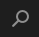
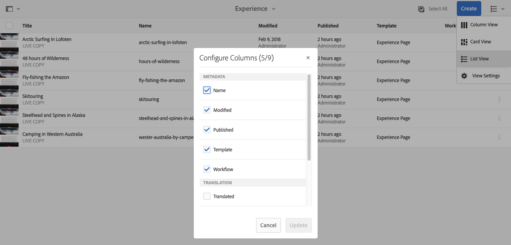

# 기본 처리{#basic-handling}

>[!NOTE]
>
>* 이 페이지는 AEM 작성 환경을 사용할 때 기본 처리에 대한 개요를 알 수 있도록 설계되었습니다. **사이트** 콘솔을 기본으로 사용합니다.
   >
   >
* 몇 가지 기능을 일부 콘솔에서 사용할 수 없거나, 추가 기능을 일부 콘솔에서 사용할 수 있습니다. 개별 콘솔에 대한 특정 정보 및 관련 기능은 다른 페이지에서 더 자세히 다룹니다.
>* AEM 전체에서 키보드 단축키를 사용할 수 있습니다. 특히 [콘솔을 사용하고](/help/sites-authoring/keyboard-shortcuts.md) [페이지를 편집할 때 ](/help/sites-authoring/page-authoring-keyboard-shortcuts.md)이러한 키보드 단축키를 사용할 수 있습니다.

>

## 시작하기 {#getting-started}

### 터치 활성화 UI {#a-touch-enabled-ui}

AEM 사용자 인터페이스는 터치가 활성화되어 있습니다. 터치 활성화 인터페이스를 사용하면 탭, 길게 터치하기, 밀기 등과 같은 동작을 통해 소프트웨어와 상호 작용할 수 있습니다. 이것은 기존의 데스크탑 인터페이스가 클릭, 두 번 클릭, 마우스 오른쪽 클릭, 마우스오버 등과 같은 마우스 제스처를 사용하는 방식과 대조적입니다.

AEM UI가 터치를 사용하므로 터치 장치(예: 모바일 또는 태블릿)에서 터치 제스처를 사용하고 기존 데스크탑 장치에서 마우스 동작을 사용할 수 있습니다.

### 첫 단계 {#first-steps}

로그인하면 [탐색 패널](#navigation-panel)로 바로 이동합니다. 옵션 중 하나를 선택하면 해당 콘솔이 열립니다.

>[!NOTE]
>
>AEM의 기본 사용 방법을 이해할 수 있도록 이 문서는 **사이트** 콘솔을 기반으로 합니다.
>
>**사이트**&#x200B;를 클릭하거나 탭하여 시작합니다.

### 제품 탐색 {#product-navigation}

사용자가 콘솔에 처음 액세스할 때마다 제품 탐색 자습서가 시작됩니다. 잠시 시간을 내어 자습서를 클릭하거나 탭하여 AEM 기본 처리 방법에 대한 개요를 확인하십시오.

개요의 다음 페이지로 이동하려면 **다음**&#x200B;을 클릭하거나 탭합니다. 닫으려면 **닫기**&#x200B;를 클릭 또는 탭하거나 개요 대화 상자의 외부를 클릭 또는 탭합니다.

모든 슬라이드를 표시하지 않거나 **다시 표시 안 함** 옵션을 선택하지 않은 한 이후에 콘솔에 액세스하면 개요가 다시 시작됩니다.

## 전역 탐색 {#global-navigation}

전역 탐색 패널을 사용하여 콘솔 간을 탐색할 수 있습니다. 화면의 왼쪽 상단에 있는 Adobe Experience Manager 링크를 클릭하거나 탭하면 전체 화면 드롭다운으로 트리거됩니다.

**닫기**&#x200B;를 클릭하거나 탭하여 전역 탐색 패널을 닫고 이전 위치로 돌아갈 수 있습니다.

>[!NOTE]
>
>처음 로그인하면 **탐색** 패널로 이동합니다.

전역 탐색에는 다음과 같은 두 개의 패널이 있으며 화면의 왼쪽 여백에 아이콘으로 표시됩니다.

* **[탐색](/help/sites-authoring/basic-handling.md#navigation-panel)** - 나침반으로 표시되며, 
* **[도구](/help/sites-authoring/basic-handling.md#tools-panel)** - 망치로 표시됨

이러한 패널에서 사용 가능한 옵션은 아래에 설명되어 있습니다.

### 탐색 패널 {#navigation-panel}

탐색 패널에서는 AEM 콘솔에 액세스할 수 있습니다.

콘솔 및 컨텐츠를 탐색할 때 브라우저 탭의 제목이 현재 위치를 반영하도록 업데이트됩니다.

탐색에서 사용할 수 있는 콘솔은 다음과 같습니다.

<table>
 <tbody>
  <tr>
   <td><strong>콘솔</strong></td>
   <td><strong>목적</strong></td>
  </tr>
  <tr>
   <td>자산  </td>
   <td>이러한 콘솔에서는 이미지, 비디오, 문서 및 오디오 파일 등의 <a href="/help/assets/home.md">디지털 자산을 관리하고 </a> 가져올 수 있습니다. 그런 다음 동일한 AEM 인스턴스에서 실행되는 웹 사이트에서 이러한 자산을 사용할 수 있습니다.   </td>
  </tr>
  <tr>
   <td>커뮤니티</td>
   <td>이 콘솔에서 <a href="/help/communities/overview.md#engagement-community">참여</a> 및 <a href="/help/communities/overview.md#enablement-community">지원</a>을 위한 <a href="/help/communities/sites-console.md">커뮤니티 사이트</a>를 만들고 관리할 수 있습니다.</td>
  </tr>
  <tr>
   <td>상거래</td>
   <td>여기서는 제품, 제품 카탈로그 및 <a href="/help/sites-administering/ecommerce.md">상거래 </a> 사이트와 관련된 주문을 관리할 수 있습니다.</td>
  </tr>
  <tr>
   <td>경험 구성요소</td>
   <td><a href="/help/sites-authoring/experience-fragments.md">경험 조각</a>은 여러 채널 간에 재사용할 수 있으며 변형이 있는 독립형 환경으로, 경험 또는 경험 일부를 반복해서 복사하고 붙여넣는 단조로운 작업을 수행할 필요를 없애줍니다.</td>
  </tr>
  <tr>
   <td>양식</td>
   <td>이 콘솔에서 <a href="/help/forms/home.md">포럼 및 문서</a>를 만들고, 관리하고, 처리할 수 있습니다.</td>
  </tr>
  <tr>
   <td>개인화</td>
   <td>이 콘솔은 <a href="/help/sites-authoring/personalization.md">타겟팅된 컨텐츠를 작성하고 개인화된 환경을 제공하기 위한 도구 프레임워크</a>를 제공합니다.</td>
  </tr>
  <tr>
   <td>프로젝트</td>
   <td><a href="/help/sites-authoring/touch-ui-managing-projects.md">프로젝트 콘솔에서는 프로젝트에 직접 액세스할 수 있습니다</a>. 프로젝트는 가상 대시보드입니다. 팀을 만든 다음 이 팀이 리소스, 워크플로우 및 작업에 액세스하도록 할 수 있기 때문에 공통의 목표에 대한 작업을 수행할 수 있도록 해줍니다.   </td>
  </tr>
  <tr>
   <td>스크린</td>
   <td><a href="https://docs.adobe.com/content/help/ko-KR/experience-manager-screens/user-guide/authoring/setting-up-projects/creating-a-screens-project.html">스크린</a>을 사용하여 크기와 위치에 상관없이 고객이 보는 모든 화면을 관리할 수 있습니다.</td>
  </tr>
  <tr>
   <td>사이트</td>
   <td>사이트 콘솔에서는 AEM 인스턴스에서 실행되는<a href="/help/sites-authoring/page-authoring.md"> 웹 사이트를 만들고, 보고, 관리</a>할 수 있습니다. 이 콘솔을 통해 웹 사이트 페이지를 만들고, 편집하고, 복사하고, 이동하고, 삭제하며 워크플로우를 시작하고, 페이지를 게시할 수 있습니다.  </td>
  </tr>
 </tbody>
</table>

### 도구 패널 {#tools-panel}

[도구] 패널의 측면 패널에 있는 각 옵션에는 다양한 하위 메뉴가 있습니다. 여기서 사용할 수 있는 [도구 콘솔](/help/sites-administering/tools-consoles.md)에서는 웹 사이트, 디지털 자산 및 컨텐츠 저장소의 다른 측면을 관리하는 데 도움이 되는 많은 전문 도구 및 콘솔에 액세스할 수 있습니다.

## 헤더 {#the-header}

헤더는 항상 화면 상단에 있습니다. 헤더의 대부분 옵션은 시스템 위치와 관계없이 동일하게 유지되지만 일부는 컨텍스트에 따라 다릅니다.

* [전역 탐색](#navigatingconsolesandtools)

   콘솔 간에 탐색하려면 **Adobe Experience Manager** 링크를 선택합니다.

   

* [검색](/help/sites-authoring/search.md)

   

   [단축키](/help/sites-authoring/keyboard-shortcuts.md) `/`(슬래시)를 사용하여 모든 콘솔에서 검색을 호출할 수도 있습니다.

* [솔루션](https://www.adobe.com/kr/experience-cloud.html)

   

* [도움말](#accessinghelptouchoptimizedui)

   

* [알림](/help/sites-authoring/inbox.md)

   

   이 아이콘에는 현재 할당된 불완전 알림 수가 배지로 지정됩니다.

   >[!NOTE]
   >
   >곧바로 사용할 수 있는 AEM에는 관리자 사용자 그룹에 할당된 관리 작업이 미리 로드되어 있습니다. 자세한 내용은 [받은 편지함 - 곧바로 사용할 수 있는 관리 작업](/help/sites-authoring/inbox.md#out-of-the-box-administrative-tasks)을 참조하십시오.

* [사용자 속성](/help/sites-authoring/user-properties.md)

   

* [레일 선택기](/help/sites-authoring/basic-handling.md#rail-selector)

   

   제공된 옵션은 현재 콘솔에 따라 다릅니다. 예를 들어 **사이트**&#x200B;에서 컨텐츠 전용(기본값), 타임라인, 참조 또는 필터 사이드 패널을 선택할 수 있습니다.

   

* 탐색 표시

   

   레일의 중간에 위치하며 항상 현재 선택된 항목에 대한 설명을 표시하는 탐색 표시를 사용하면 특정 콘솔 내에서 탐색할 수 있습니다. Sites 콘솔에서는 웹 사이트 수준을 탐색할 수 있습니다.

   현재 선택된 항목의 계층 구조 레벨을 나열하는 드롭다운 목록을 표시하려면 [탐색 표시] 텍스트를 클릭하면 됩니다. 해당 위치로 이동하려면 항목을 클릭하십시오.

   

* 분석 기간 선택

   

   목록 보기에서만 사용 가능합니다. 자세한 내용은 [목록 보기](#list-view)를 참조하십시오.

* **만들기** 단추

   

   클릭하면 콘솔/컨텍스트에 해당하는 옵션이 표시됩니다.

* [보기](/help/sites-authoring/basic-handling.md#viewingandselectingyourresourcescardlistcolumn)

   보기 아이콘은 AEM 도구 모음의 맨 오른쪽에 있습니다. 또한 현재 보기를 나타내므로 아이콘이 변경됩니다. 예를 들어, 기본 보기인 **열 보기**&#x200B;에서 다음이 표시됩니다.

   

   열 보기, 카드 보기 및 목록 보기 간에 전환할 수 있습니다. 목록 보기에서 보기 설정도 표시됩니다.

   

* 키보드 탐색

   키보드만 사용하여 웹 사이트를 탐색할 수 있습니다. 여기서는 **TAB** 키(또는 **OPT+TAB**)의 표준 브라우저 기능을 사용하여 *포커스가 있는* 페이지에서 요소 간에 이동할 수 있습니다.

   **사이트** 콘솔에는 **기본 컨텐츠로 건너뛸 수 있는** 추가된 옵션이 있습니다. 헤더 옵션을 *탭하면* 볼 수 있고 (제품) 도구 모음의 표준 요소를 건너뛰고 기본 컨텐츠로 바로 이동할 수 있으므로 탐색 시간을 단축할 수 있습니다.

   

## 도움말 액세스 {#accessing-help}

사용할 수 있는 도움말 리소스는 다양합니다.

* **콘솔 도구 모음**

   사용자의 위치에 따라 **도움말** 아이콘이 적절한 리소스를 엽니다.

   

* **탐색**

   시스템을 처음 탐색하면 [일련의 슬라이드가 표시되면서 AEM 탐색 기능을 소개](/help/sites-authoring/basic-handling.md#product-navigation)합니다.

* **페이지 편집기**

   페이지를 처음 편집하면 일련의 슬라이드를 통해 페이지 편집기에 대한 설명을 볼 수 있습니다.

   

   모든 콘솔에 처음 액세스할 때 [제품 탐색 개요](/help/sites-authoring/basic-handling.md#product-navigation)와 마찬가지로 이 개요를 탐색합니다.

   [**페이지 정보** 메뉴에서 **도움말**](/help/sites-authoring/author-environment-tools.md#accessing-help)&#x200B;을 선택하여 언제든지 이 페이지를 다시 볼 수 있습니다.

* **도구 콘솔**

   **도구** 콘솔에서 외부 **리소스**&#x200B;에도 액세스할 수 있습니다.

   * **설명서**
웹 경험 관리 설명서 보기

   * **개발자 리소스**
개발자 리소스 및 다운로드
   >[!NOTE]
   >
   >콘솔에서 있을 때에는 핫키 `?`(물음표)를 사용하여 사용 가능한 단축키 개요를 언제든지 볼 수 있습니다.
   >
   >모든 키보드 단축키에 대한 개요는 다음 문서를 참조하십시오.
   >
   >    * [페이지 편집을 위한 키보드 단축키](/help/sites-authoring/page-authoring-keyboard-shortcuts.md)
   >    * [콘솔용 키보드 단축키](/help/sites-authoring/keyboard-shortcuts.md)

## 작업 도구 모음 {#actions-toolbar}

리소스를 선택하면(예: 페이지 또는 자산) 도구 모음에 설명 텍스트가 있는 아이콘으로 다양한 작업이 표시됩니다. 이러한 작업은 다음 항목에 따라 달라집니다.

* 현재 콘솔.
* 현재 컨텍스트.
* [선택 모드](#navigatingandselectionmode)인지 여부

도구 모음에서 사용 가능한 작업은 선택한 특정 항목에서 수행할 수 있는 작업을 반영하도록 변경됩니다.

[리소스 선택 방법](/help/sites-authoring/basic-handling.md#viewing-and-selecting-resources)은 보기에 따라 다릅니다.

일부 창은 공간이 제한되어 있으므로 도구 모음이 사용할 수 있는 공간보다 바로 길어질 수 있습니다. 이 경우 추가 옵션이 표시됩니다. 생략 부호(세 점 또는 **...**)를 클릭하거나 탭하면 나머지 작업을 모두 포함하는 드롭다운 선택기가 열립니다. 예를 들어 **사이트** 콘솔에서 페이지를 선택하면 다음이 수행됩니다.

>[!NOTE]
>
>사용할 수 있는 개별 아이콘은 적절한 콘솔/기능/시나리오와 관련하여 문서화되어 있습니다.

## 빠른 작업  {#quick-actions}

[카드 보기](#cardviewquickactions)에서는 특정 작업을 빠른 작업 아이콘으로 사용할 수 있을 뿐 아니라 도구 모음에 표시할 수도 있습니다. 빠른 작업 아이콘은 한 번에 단일 항목에 사용할 수 있으며 사전 선택할 필요가 없습니다.

빠른 작업은(데스크톱 장치) 리소스 카드 위에 마우스를 올려 놓으면 표시됩니다. 사용 가능한 빠른 작업은 콘솔 및 컨텍스트에 따라 달라질 수 있습니다. 예를 들어, **사이트** 콘솔에서 페이지에 대한 빠른 작업은 다음과 같습니다.

## 리소스 보기 및 선택 {#viewing-and-selecting-resources}

보기, 탐색 및 선택은 모든 보기에서 개념적으로는 같지만 사용 중인 보기에 따라 처리 방식이 약간 다릅니다.

사용 가능한 보기 중 하나에서(추가 작업을 위해) 리소스를 보고, 탐색하며 선택할 수 있습니다. 각 보기는 오른쪽 상단의 아이콘으로 선택할 수 있습니다.

* [열 보기](#column-view)
* [카드 보기](#card-view)

* [목록 보기](#list-view)

>[!NOTE]
>
>기본적으로 AEM Assets은 보기의 썸네일로 UI에 있는 자산의 원본 표현물을 표시하지 않습니다. 관리자인 경우, 오버레이를 사용하여 AEM Assets을 구성한 뒤 원본 표현물을 썸네일로 표시할 수 있습니다.

### 리소스 선택  {#selecting-resources}

특정 리소스를 선택하는 방법은 보기 및 장치 조합에 따라 다릅니다.

<table>
 <tbody>
  <tr>
   <td> </td>
   <td>선택</td>
   <td>선택 취소</td>
  </tr>
  <tr>
   <td>열 보기  </td>
   <td>
    <ul>
     <li>데스크톱:   썸네일 클릭</li>
     <li>모바일 장치:   썸네일 탭하기</li>
    </ul> </td>
   <td>
    <ul>
     <li>데스크톱:   썸네일 클릭</li>
     <li>모바일 장치:   썸네일 탭하기</li>
    </ul> </td>
  </tr>
  <tr>
   <td>카드 보기  </td>
   <td>
    <ul>
     <li>데스크탑:   마우스를 올려 놓은 후 체크 표시 빠른 작업 사용</li>
     <li>모바일 장치:   카드를 길게 탭하기</li>
    </ul> </td>
   <td>
    <ul>
     <li>데스크탑:   카드 클릭</li>
     <li>모바일 장치:   카드 탭하기</li>
    </ul> </td>
  </tr>
  <tr>
   <td>목록 보기</td>
   <td>
    <ul>
     <li>데스크톱:   썸네일 클릭</li>
     <li>모바일 장치:   썸네일 탭하기</li>
    </ul> </td>
   <td>
    <ul>
     <li>데스크톱:   썸네일 클릭</li>
     <li>모바일 장치:   썸네일 탭하기</li>
    </ul> </td>
  </tr>
 </tbody>
</table>

#### 모두 선택 {#select-all}

콘솔의 오른쪽 상단에 있는 **모두 선택** 옵션을 클릭하여 보기에서 모든 항목을 선택할 수 있습니다.

* **카드 보기**&#x200B;에서 모든 카드가 선택됩니다.
* **목록 보기**&#x200B;에서는 목록의 모든 항목이 선택됩니다.
* **열 보기**&#x200B;에서 맨 왼쪽 열에 있는 모든 항목이 선택됩니다.

#### 전체 선택 취소 {#deselecting-all}

모든 항목을 선택하면 선택한 항목의 수가 도구 모음의 오른쪽 상단에 표시됩니다.

모든 항목을 선택 취소하고 다음 중 하나를 수행하여 선택 모드를 종료할 수 있습니다.

* 카운트 옆에 있는 **X**&#x200B;를 클릭하거나 탭합니다.

* 또는 **이스케이프**&#x200B;를 사용합니다.

데스크톱 장치를 사용하는 경우, 키보드에서 ESC 키를 탭하여 모든 보기에 있는 모든 항목을 선택 취소할 수 있습니다.

#### 선택 예 {#selecting-example}

1. 예를 들면 카드 보기에서 다음을 수행합니다.

   

1. 리소스를 선택하면 상단 헤더에는 현재 선택한 리소스에 적용할 수 있는 작업에 대한 액세스를 제공하는 [작업 도구 모음](#actionstoolbar)이 표시됩니다.

   선택 모드를 종료하려면 오른쪽 상단에서 **X**&#x200B;를 선택하거나 **Esc** 키를 사용하십시오.

### 열 보기 {#column-view}

[열 보기]를 사용하면 일련의 계단식 열을 통해 컨텐츠 트리를 시각적으로 탐색할 수 있습니다. 이 보기에서는 웹 사이트의 트리 구조를 시각화하고 트래버스할 수 있습니다.

맨 왼쪽 열의 리소스를 선택하면 오른쪽 열에 하위 리소스가 표시됩니다. 오른쪽 열에서 리소스를 선택하면 오른쪽의 다른 열에 하위 리소스가 표시됩니다.

* 리소스 이름 또는 리소스 이름 오른쪽에 있는 V자형 화살표를 탭하거나 클릭하여 트리에서 위아래로 탐색할 수 있습니다.

   * 탭하거나 클릭하면 리소스 이름 및 V자형 화살표가 강조 표시됩니다.

   

   * 클릭하거나 탭한 리소스의 하위 항목은 클릭하거나 탭한 리소스의 오른쪽에 있는 열에 표시됩니다.
   * 하위 항목이 없는 리소스 이름을 탭하거나 클릭하는 경우, 마지막 열에 해당 세부 정보가 표시됩니다.

* 썸네일을 탭하거나 클릭하면 리소스가 선택됩니다.

   * 선택하면 확인 표시가 썸네일에 오버레이되고 리소스 이름도 강조 표시됩니다.
   * 선택한 리소스의 세부 정보가 마지막 열에 표시됩니다.
   * 작업 도구 모음을 사용할 수 있습니다.

   

   [열 보기]에서 페이지를 선택하면 선택한 페이지가 다음 세부 정보와 함께 마지막 열에 표시됩니다.

   * 페이지 제목
   * 페이지 이름(페이지 URL 일부)
   * 페이지의 기반이 되는 템플릿
   * 수정 세부 사항
   * 페이지 언어
   * 게시 세부 사항

### 카드 보기 {#card-view}

* 카드 보기는 현재 수준에서 각 항목에 대한 정보 카드를 표시합니다. 다음과 같은 정보를 제공합니다.

   * 페이지 컨텐츠의 시각적 표현.
   * 페이지 제목.
   * 중요한 날짜(예: 마지막 편집 날짜, 마지막 게시 날짜).
   * 페이지가 잠긴 경우 숨겨진 Live Copy 또는 Live Copy 일부.
   * 필요한 경우 워크플로우의 일부로 작업을 수행해야 합니다.

      * 필요한 작업을 나타내는 마커는 [받은 편지함](/help/sites-authoring/inbox.md)의 항목과 관련되어 있을 수 있습니다.

* 또한 [빠른 작업](#quick-actions)은 선택과 같은 보기, 편집과 같은 일반적인 작업에서 사용할 수 있습니다.

   

* 카드를 탭하거나 클릭하여 트리 아래를 탐색하거나(빠른 작업이 발생하지 않도록 주의) [헤더에서 탐색 표시](/help/sites-authoring/basic-handling.md#the-header)를 사용하여 트리 위로 다시 탐색할 수 있습니다.

### 목록 보기 {#list-view}

* 목록 보기에는 현재 수준의 각 리소스에 대한 정보가 표시됩니다.
* 리소스 이름을 탭/클릭하여 트리를 탐색하고 [헤더에서 [탐색 표시]](/help/sites-authoring/basic-handling.md#the-header)를 사용하여 백업할 수 있습니다.

* 목록에서 모든 항목을 간편하게 선택하려면 목록의 왼쪽 상단에 있는 확인란을 사용합니다.

   

   * 목록의 모든 항목을 선택하면 이 확인란이 선택된 것으로 표시됩니다.

      * 확인란을 클릭하거나 탭하면 모든 항목이 선택 취소됩니다.
   * 일부 항목만 선택한 경우 빼기(-) 기호가 표시됩니다.

      * 확인란을 클릭하거나 탭하여 모두 선택합니다.
      * 확인란을 다시 클릭하거나 탭하면 모든 항목이 선택 취소됩니다.

* [보기] 단추 아래에 있는 **보기 설정** 옵션을 사용하여 표시할 열을 선택합니다. 다음 열이 표시될 수 있습니다.

   * **이름** - 페이지 이름이며, 페이지 URL의 일부이고 언어와 관계없이 변경되지 않으므로 다국어 제작 환경에서 유용할 수 있습니다.
   * **수정됨** - 마지막 수정 일자 및 수정자
   * **게시됨** - 게시 상태
   * **템플릿** - 페이지의 기반이 되는 템플릿
   * **워크플로우** - 페이지에 현재 적용된 워크플로우입니다. 마우스오버로 또는 타임라인을 열면 더 많은 정보를 사용할 수 있습니다.

   * **페이지 분석**
   * **고유 방문자 수**
   * **페이지 시간**

   

   기본적으로 페이지 URL 부분을 구성하는 **이름** 열이 표시됩니다. 일부 경우에는 작성자가 다른 언어로 된 페이지에 액세스해야 하며 작성자가 페이지의 언어를 모르는 경우 페이지 이름(일반적으로 변경되지 않음)을 확인하면 도움이 될 수 있습니다.

* 목록에서 각 항목의 맨 오른쪽에 있는 점선 세로 막대를 사용하여 항목 순서를 변경합니다.

   >[!NOTE]
   >
   >순서 변경은 `jcr:primaryType` 값이 `sling:OrderedFolder`인 순서가 지정된 폴더 내에서만 작동합니다.

   

   수직 선택 막대를 클릭하거나 탭하고 항목을 목록의 새 위치로 드래그합니다.

   

* **보기 설정** 대화 상자로 적절한 열을 표시하여 분석 데이터를 표시할 수 있습니다.

   헤더의 오른쪽에 있는 필터 옵션을 사용하여 최근 30일, 90일 또는 365일 간의 분석 데이터를 필터링할 수 있습니다.

   

## 레일 선택기 {#rail-selector}

**레일 선택기**&#x200B;는 창 왼쪽 상단에서 사용할 수 있으며 현재 콘솔에 따라 옵션을 표시합니다.

예를 들어 Sites에서 컨텐츠 전용(기본값), 컨텐츠 트리, 타임라인, 참조 또는 필터 사이드 패널을 선택할 수 있습니다.

컨텐츠만을 선택하면 레일 아이콘만 표시됩니다. 기타 옵션이 선택된 경우, 레일 아이콘 옆에 옵션 이름이 표시됩니다.

>[!NOTE]
>
>[키보드 단축키](/help/sites-authoring/keyboard-shortcuts.md)를 사용하면 레일 디스플레이 옵션 간을 빠르게 전환할 수 있습니다.

### 컨텐츠 트리 {#content-tree}

컨텐츠 트리를 사용하여 사이드 패널에서 사이트 계층 구조를 빠르게 탐색하고, 현재 폴더의 페이지에 대한 다양한 정보를 볼 수 있습니다.

컨텐츠 트리 사이드 패널과 목록 보기 또는 카드 보기를 함께 사용하여 프로젝트의 계층 구조를 쉽게 확인하고, 컨텐츠 트리 사이드 패널을 사용해서 컨텐츠 구조를 쉽게 탐색할 수 있으며 목록 보기에서 자세한 페이지 정보를 볼 수 있습니다.

>[!NOTE]
>
>계층 구조 보기에서 항목을 선택한 후에는 화살표 키를 사용하여 계층 구조를 빠르게 탐색할 수 있습니다.
>
>자세한 내용은 [키보드 단축키](/help/sites-authoring/keyboard-shortcuts.md)를 참조하십시오.

### 타임라인 {#timeline}

타임라인을 사용하면 선택한 리소스에서 발생한 이벤트를 보거나 시작할 수 있습니다. 타임라인 열을 열려면 레일 선택기를 사용합니다.

타임라인 열에서 다음을 수행할 수 있습니다.

* [선택한 항목과 관련된 다양한 이벤트 보기](#timelineviewevents)

   * 드롭다운 목록에서 이벤트 유형을 선택할 수 있습니다.

      * [댓글](#timelineaddingandviewingcomments)
      * 주석
      * 활동
      * [론치](/help/sites-authoring/launches.md)
      * [버전](/help/sites-authoring/working-with-page-versions.md)
      * [워크플로우](/help/sites-authoring/workflows-applying.md)

         * 내역 정보가 저장되지 않는 [임시 워크플로우](/help/sites-developing/workflows.md#transient-workflows) 제외
      * 모두 표시

* [선택한 항목에 대한 댓글 추가/보기](#timelineaddingandviewingcomments) 이벤트 목록 맨 아래쪽에 **주석** 상자가 표시됩니다. 댓글을 입력(입력 후 Return 키)하면 댓글이 등록되고 이 댓글은 **댓글** 또는 **모두 표시**&#x200B;를 선택하면 표시됩니다.

* 특정 콘솔에는 추가 기능이 있습니다. 예를 들면 [사이트 콘솔]에서 다음을 수행할 수 있습니다.

   * [버전 저장](/help/sites-authoring/working-with-page-versions.md#creatinganewversiontouchoptimizedui).
   * [워크플로우 시작](/help/sites-authoring/workflows-applying.md#startingaworkflowfromtherail).

이러한 옵션은 **댓글** 필드 옆에 있는 V자형 화살표를 통해 액세스할 수 있습니다.

### 참조 {#references}

**참조**&#x200B;에는 선택한 리소스에 대한 모든 연결 내용이 표시됩니다. 예를 들어, 페이지의 **사이트** 콘솔 [참조](/help/sites-authoring/author-environment-tools.md#showingpagereferences)는 다음과 같은 정보를 표시합니다.

* [론치](/help/sites-authoring/launches.md#launches-in-references-sites-console)
* [Live copy](/help/sites-administering/msm-livecopy-overview.md#openingthelivecopyoverviewfromreferences)
* [언어 복사](/help/sites-administering/tc-prep.md#seeing-the-status-of-language-roots)
* 컨텐츠 참조:

   * 다른 페이지에서 선택한 페이지로의 링크
   * 참조 구성 요소가 선택한 페이지에서 빌린 컨텐츠 및/또는 선택한 페이지에 빌려준 컨텐츠

### 필터 {#filter}

필터를 선택하면 해당 위치 필터가 이미 설정된 [검색](/help/sites-authoring/search.md)과 비슷한 패널이 열리므로, 보려는 컨텐츠를 추가로 필터링할 수 있습니다.

