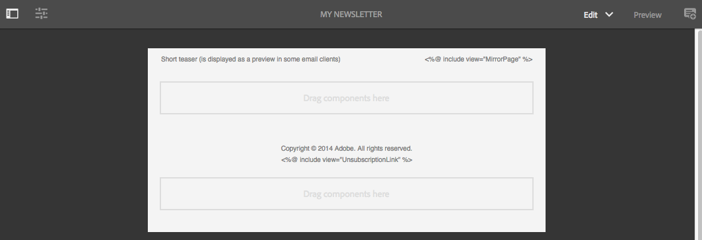
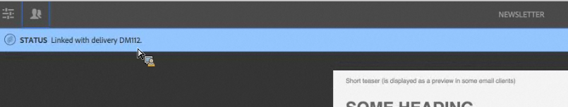

# Adobe Campaign Classic 및 Adobe Campaign Standard 작업{#working-with-adobe-campaign-classic-and-adobe-campaign-standard}

AEM에서 이메일 컨텐츠를 만들고 Adobe Campaign 이메일에서 처리할 수 있습니다. 이를 위해 다음을 수행해야 합니다.

1. Adobe Campaign 관련 템플릿에서 AEM의 새 뉴스레터를 만듭니다.
1. 모든 기능에 액세스하려면 컨텐츠를 편집하기 전에 [Adobe Campaign 서비스](#selecting-the-adobe-campaign-cloud-service-and-template)를 선택합니다.
1. 컨텐츠를 편집합니다.
1. 컨텐츠를 확인합니다.

그러면 컨텐츠가 Adobe Campaign의 게재와 동기화될 수 있습니다. 자세한 지침은 이 문서에 설명되어 있습니다.

[AEM에서 Adobe Campaign 양식 작성](/help/sites-authoring/adobe-campaign-forms.md)을 참조하십시오.

>[!NOTE]
>
>이 기능을 사용하려면 먼저 [Adobe Campaign](/help/sites-administering/campaignonpremise.md) 또는 [Adobe Campaign Standard](/help/sites-administering/campaignstandard.md)와 통합되도록 AEM을 구성해야 합니다.

## Adobe Campaign을 통해 이메일 컨텐츠 보내기 {#sending-email-content-via-adobe-campaign}

AEM 및 Adobe Campaign을 구성한 후에는 AEM에서 직접 이메일 게재 컨텐츠를 만든 후 Adobe Campaign에서 처리할 수 있습니다.

AEM에서 Adobe Campaign 컨텐츠를 만들 때 모든 기능에 액세스하려면 컨텐츠를 편집하기 전에 Adobe Campaign 서비스에 연결해야 합니다.

다음 두 가지 경우가 가능합니다.

* 컨텐츠가 Adobe Campaign의 게재와 동기화될 수 있습니다. 이를 통해 게재에서 AEM 컨텐츠를 사용할 수 있습니다.
* (Adobe Campaign Classic만) 컨텐츠를 Adobe Campaign으로 직접 전송할 수 있으며, 이 경우 자동으로 새 이메일 배달이 생성됩니다. 이 모드에는 제한 사항이 있습니다.

자세한 지침은 이 문서에 설명되어 있습니다.

### 새 이메일 컨텐츠 만들기 {#creating-new-email-content}

>[!NOTE]
>
>When adding email templates, be sure to add them under **/content/campaigns** to make them available.

#### 새 이메일 컨텐츠 만들기 {#creating-new-email-content-1}

1. In AEM select **Sites** then **Campaigns**, then browse to where your email campaigns are managed. In the following example, the path is **Sites** > **Campaigns** > **Geometrixx Outdoors** > **Email Campaigns**.

   >[!NOTE]
   >
   >[이메일 샘플은 Geometrixx에서만 사용할 수 있습니다](/help/sites-developing/we-retail.md). 패키지 공유에서 샘플 Geometrixx 콘텐츠를 다운로드하십시오.

   

1. **만들기**&#x200B;를 선택하고 **페이지 만들기**&#x200B;를 선택합니다.
1. 연결 중인 Adobe Campaign에 고유한 사용 가능한 템플릿 중 하나를 선택하고 **다음**&#x200B;을 클릭합니다. 기본적으로 다음과 같은 세 가지 템플릿을 사용할 수 있습니다.

   * **Adobe Campaign Classic 이메일**: 배달할 Adobe Campaign Classic에 컨텐츠를 보내기 전에 미리 정의된 템플릿(열 2개)에 컨텐츠를 추가할 수 있습니다.
   * **Adobe Campaign Standard 이메일**: 배달할 Adobe Campaign Standard에 컨텐츠를 보내기 전에 미리 정의된 템플릿(열 2개)에 컨텐츠를 추가할 수 있습니다.

1. Fill in the **Title** and optionally the **Description** and click **Create**. 제목은 이메일을 편집하는 동안 덮어쓰지 않을 경우, 뉴스레터/이메일의 제목으로 사용됩니다.

### Adobe Campaign 클라우드 서비스 및 템플릿 선택 {#selecting-the-adobe-campaign-cloud-service-and-template}

Adobe Campaign과 통합하려면 페이지에 Adobe Campaign 클라우드 서비스를 추가해야 합니다. 이렇게 하면 개인화 및 기타 Adobe Campaign 정보에 액세스할 수 있습니다.

또한 Adobe Campaign 템플릿을 선택하고 제목을 변경한 후, HTML에서 이메일을 보지 않는 사용자를 위해 일반 텍스트 컨텐츠를 추가해야 할 수도 있습니다.

**사이트** 탭에서 또는 만든 이메일/뉴스레터 내에서 클라우드 서비스를 선택할 수 있습니다.

**사이트** 탭에서 클라우드 서비스를 선택하는 것이 좋습니다. 이메일/뉴스레터에서 클라우드 서비스를 선택하려면 해결 방법이 필요합니다.

**사이트** 페이지에서 다음을 수행합니다.

1. AEM에서 이메일 페이지를 선택하고 **속성 보기**&#x200B;를 클릭합니다.

   

1. Select **Edit** and then the **Cloud services** tab and scroll down to the bottom and click the + sign to add a configuration and then select **Adobe Campaign**.

   

1. 드롭다운 목록에서 Adobe Campaign 인스턴스와 일치하는 구성을 선택하고 **저장**&#x200B;을 클릭하여 확인합니다.
1. **Adobe Campaign** 탭을 클릭하여 이메일이 적용된 템플릿을 볼 수 있습니다. 다른 템플릿을 선택하려면 편집하는 동안 이메일 내에서 템플릿에 액세스할 수 있습니다.

   If you would like to apply a specific email delivery template (from Adobe Campaign), other than the default mail template, in **Properties**, select the **Adobe Campaign** tab. 관련된 Adobe Campaign 인스턴스에 이메일 게재 템플릿의 내부 이름을 입력합니다.

   선택한 템플릿에 따라 Adobe Campaign에서 사용할 수 있는 개인화 필드가 결정됩니다.

   

작성의 뉴스레터/이메일 내에서는 레이아웃 문제로 인해 **페이지 속성**&#x200B;에서 Adobe Campaign 클라우드 서비스 구성을 선택하지 못할 수 없습니다. 여기에 설명된 해결 방법을 사용할 수 있습니다.

1. AEM에서 이메일 페이지를 선택하고 **편집**&#x200B;을 클릭합니다. **속성 열기**&#x200B;를 클릭합니다.

   

1. Select **Cloud services** and click **+** to add a configuration. 표시되는 아무 구성이나 선택합니다. **+** 기호를 탭하거나 클릭하여 다른 구성을 추가한 후, **Adobe Campaign**&#x200B;을 선택합니다.

   >[!NOTE]
   >
   >또는 **사이트** 탭에서 **속성 보기**&#x200B;를 선택하여 클라우드 서비스를 선택할 수 있습니다.

1. 드롭다운 목록에서 Adobe Campaign 인스턴스와 일치하는 구성을 선택하고 Adobe Campaign에 대해 만들지 않은 첫 번째 구성을 삭제한 다음 확인 표시를 클릭하여 확인합니다.
1. 이전 절차의 4단계를 계속하여 템플릿을 선택하고 일반 텍스트를 추가합니다.

### 이메일 컨텐츠 편집 {#editing-email-content}

이메일 컨텐츠를 편집하려면:

1. 이메일을 엽니다. 그러면 기본적으로 편집 모드가 됩니다.

   

1. If you would like to change the subject of the email or add plain text for those users who will not view the email in HTML, select **Email** and add a subject and text. HTML에서 일반 텍스트 버전을 자동 생성하려면 페이지 아이콘을 선택합니다. 완료되면 확인 표시를 클릭합니다.

   Adobe Campaign 개인화 필드를 사용하여 뉴스레터를 개인화할 수 있습니다. 개인화 필드를 추가하려면 Adobe Campaign 로고를 표시하는 단추를 클릭하여 개인화 필드 선택기를 엽니다. 그런 다음 이 뉴스레터에 사용 가능한 모든 필드 중에서 선택할 수 있습니다.

   >[!NOTE]
   >
   >편집기 내에서 속성의 개인화 필드가 회색으로 처리되면 구성을 다시 검사하십시오.

   

1. Open the components panel on left side of screen and select **Adobe Campaign Newsletter** from the drop-down menu to find those components.

   

1. 구성 요소를 페이지로 직접 끌어와 그에 따라 편집합니다. 예를 들어 **텍스트 및 개인화(캠페인)** 구성 요소를 끌어오고 개인화된 텍스트를 추가할 수 있습니다.

   

   See [Adobe Campaign Components](/help/sites-authoring/adobe-campaign-components.md) for a detailed description of each component.

   

### 개인화 삽입 {#inserting-personalization}

컨텐츠를 편집할 때 다음을 삽입할 수 있습니다.

* Adobe Campaign 컨텍스트 필드. 이러한 필드는 텍스트 내에 삽입할 수 있는 필드로, 수신자 데이터(예: 이름, 성 또는 대상 차원의 데이터)에 따라 조정됩니다.
* Adobe Campaign 개인화 블록. 브랜드 로고 또는 미러 페이지에 대한 링크와 같은 수신자 데이터와 관련이 없는 사전 정의된 컨텐츠 블록입니다.

캠페인 구성 요소에 대한 전체 설명을 보려면 [Adobe Campaign 구성 요소](/help/sites-authoring/adobe-campaign-components.md)를 참조하십시오.

>[!NOTE]
>
>* Adobe Campaign **프로필** 타깃팅 차원의 필드만 고려됩니다.
>* When viewing Properties from **Sites**, you do not have access to the Adobe Campaign context fields. 편집하는 동안 이메일에서 직접 액세스할 수 있습니다.

>

개인화를 삽입하려면:

1. Insert a new **Newsletter** > **Text &amp; Personalization (Campaign)** component by dragging it onto the page.

   

1. 연필 모양 아이콘을 클릭하여 구성 요소를 엽니다. 즉석 편집기가 열립니다.

   

   >[!NOTE]
   >
   >**Adobe Campaign Standard:**
   >
   >* 사용 가능한 컨텍스트 필드는 Adobe Campaign의 **프로필** 타깃팅 차원에 해당합니다.
   >* See [Linking an AEM page to an Adobe Campaign email](#linking-an-aem-page-to-an-adobe-campaign-email-adobe-campaign-standard).

   >
   >**Adobe Campaign Classic:**
   >
   >* Available context fields are dynamically recovered from the Adobe Campaign **nms:seedMember** schema. 대상 확장 데이터는 컨텐츠와 동기화된 게재를 포함하는 워크플로우에서 동적으로 복구됩니다. (See the [Synchronizing content created in AEM with a delivery from Adobe Campaign](#synchronizing-content-created-in-aem-with-a-delivery-from-adobe-campaign-classic) section).
      >
      >
   * To add or hide personalization elements, see [Managing personalization fields and blocks](/help/sites-administering/campaignonpremise.md#managing-personalization-fields-and-blocks).
   >* **중요**: 모든 시드 테이블 필드가 수신자 테이블(또는 해당 연락처 테이블)에도 있어야 합니다.

1. 텍스트를 입력하여 삽입합니다. Adobe Campaign 구성 요소를 클릭하고 선택하여 컨텍스트 필드 또는 개인화 블록을 삽입합니다. 완료되면 확인 표시를 선택합니다.

   

   컨텍스트 필드 또는 개인화 블록을 삽입한 후 뉴스레터를 미리 보고 필드를 테스트할 수 있습니다. See [Previewing a Newsletter](#previewing-a-newsletter).

### 뉴스레터 미리 보기 {#previewing-a-newsletter}

뉴스레터의 모양을 미리 보고 개인화도 미리 볼 수 있습니다.

1. 뉴스레터를 연 상태로 AEM의 오른쪽 상단 모서리에서 **미리 보기**&#x200B;를 클릭합니다. AEM은 사용자가 뉴스레터를 수신할 때의 뉴스레터 모습을 표시합니다.

   

   >[!NOTE]
   >
   >Adobe Campaign Standard와 샘플 템플릿을 사용하는 경우, 게재 동안 컨텐츠를 가져올 때 초기 컨텐츠를 표시하는 두 개의 개인화 블록 **&quot;&lt;%@ include view=&quot;MirrorPage&quot; %>&quot;** 및 **&quot;&lt;%@ include view=&quot;UnsubscriptionLink&quot; %>&quot;**&#x200B;가 오류를 발생합니다. 개인화 블록 선택기로 해당 블록을 선택하여 조정할 수 있습니다.

1. 개인화를 미리 보려면 도구 모음에서 해당 아이콘을 클릭/탭하여 ContextHub를 엽니다. 개인화 필드 태그는 이제 선택한 가상 사용자의 시드 데이터로 바뀝니다. ContextHub에서 개인화를 전환할 때 변수가 조정되는 방식을 참조하십시오.

   

1. 현재 선택된 가상 사용자와 연관된 Adobe Campaign의 시드 데이터를 볼 수 있습니다. 이를 수행하려면 ContextHub 모음에서 Adobe Campaign 모듈을 클릭/탭합니다. 이렇게 하면 현재 프로필의 모든 시드 데이터를 표시하는 대화 상자가 열립니다. 다른 가상 사용자로 전환하면 데이터가 다시 조정됩니다.

   

### AEM에서 컨텐츠 승인 {#approving-content-in-aem}

컨텐츠가 완료되면 승인 프로세스를 시작할 수 있습니다. Go to the **Workflow** tab of the toolbox and select the **Approve for Adobe Campaign** workflow.

곧바로 사용할 수 있는 이 워크플로우에는 개정 후 개정 또는 개정 후 거부의 두 단계가 포함되어 있습니다. 그렇지만 이 워크플로우를 확장하고 좀 더 복잡한 프로세스에 맞게 조정할 수 있습니다.

To approve content for Adobe Campaign, apply the workflow by selecting **Workflow** and selecting **Approve for Adobe Campaign** and click **Start Workflow**. 단계를 거쳐 컨텐츠를 승인합니다. 마지막 워크플로우 단계에서 **승인** 대신 **거부**&#x200B;를 선택하여 컨텐츠를 거부할 수도 있습니다.

컨텐츠가 승인되면 Adobe Campaign에 승인된 것으로 나타납니다. 그러면 이메일을 전송할 수 있습니다.

Adobe Campaign Standard:

Adobe Campaign Classic:

>[!NOTE]
승인되지 않은 컨텐츠는 Adobe Campaign의 게재와 동기화할 수 있지만 게재를 실행할 수는 없습니다. 승인된 컨텐츠만 캠페인 게재를 통해 전송할 수 있습니다.

## AEM과 Adobe Campaign Standard 및 Adobe Campaign Classic 연결 {#linking-aem-with-adobe-campaign-standard-and-adobe-campaign-classic}

AEM을 Adobe Campaign과 연결하거나 동기화하는 방법은 구독 기반 Adobe Campaign Standard를 사용하는지 또는 온-프레미스 기반 Adobe Campaign Classic을 사용하는지에 따라 다릅니다.

Adobe Campaign 솔루션에 따른 지침을 보려면 다음 섹션을 참조하십시오.

* [AEM 페이지를 Adobe Campaign 이메일에 연결(Adobe Campaign Standard)](#linking-an-aem-page-to-an-adobe-campaign-email-adobe-campaign-standard)
* [AEM에서 만든 컨텐츠를 Adobe Campaign Classic의 배달과 동기화](#synchronizing-content-created-in-aem-with-a-delivery-from-adobe-campaign-classic)

### AEM 페이지를 Adobe Campaign 이메일에 연결(Adobe Campaign Standard) {#linking-an-aem-page-to-an-adobe-campaign-email-adobe-campaign-standard}

Adobe Campaign Standard에서는 AEM에서 만든 컨텐츠를 복구하고 다음과 연결할 수 있습니다.

* 이메일.
* 이메일 템플릿.

이렇게 하면 컨텐츠를 전달할 수 있습니다. 페이지에 표시되는 코드로 뉴스레터가 단일 게재에 연결되어 있는지 여부를 확인합니다.

>[!NOTE]
뉴스레터가 여러 게재에 연결된 경우 연결된 게재 수입니다(모든 ID가 표시되는 것은 아님).

AEM에서 만든 페이지를 Adobe Campaign의 이메일에 연결하려면:

1. AEM 특정 이메일 템플릿을 기준으로 새 이메일을 만듭니다. Refer to [Creating emails in Adobe Campaign Standard](https://helpx.adobe.com/kr/campaign/standard/channels/using/creating-an-email.html) for more information.

   

1. 게재 대시보드에서 **컨텐츠** 블록을 엽니다.

   

1. Select **Link with an Adobe Experience Manager content** in the toolbar to access the list of contents available in AEM.

   >[!NOTE]
   If the **Link with an Adobe Experience Manager** option does not appear in the action bar, check that the **Content editing mode** is correctly configured set to **Adobe Experience Manager** in the email properties.

   

1. 이메일에 사용할 컨텐츠를 선택합니다.

   이 목록은 다음을 지정합니다.

   * AEM의 컨텐츠 레이블
   * AEM의 컨텐츠 승인 상태 컨텐츠가 승인되지 않으면 컨텐츠를 동기화할 수 있지만 게재를 전송하기 전에 승인해야 합니다. 그러나 증명 전송 또는 미리 보기 테스트와 같은 특정 작업을 실행할 수 있습니다.
   * 컨텐츠의 마지막 수정 날짜
   * 게재에 이미 연결된 컨텐츠

   >[!NOTE]
   기본적으로 게재와 이미 동기화된 컨텐츠는 숨겨집니다. 그러나 이러한 컨텐츠를 표시하고 사용할 수 있습니다. 예를 들어 컨텐츠를 여러 게재에 대한 템플릿으로 사용하려는 경우가 여기에 해당합니다.

   이메일이 AEM 컨텐츠에 연결되어 있으면 Adobe Campaign에서 컨텐츠를 편집할 수 없습니다.

1. 대시보드에서 이메일의 다른 매개 변수(대상, 실행 일정)를 지정합니다.
1. 이메일 게재를 실행합니다. 게재 분석 동안, 최신 버전의 AEM 컨텐츠가 검색됩니다.

   >[!NOTE]
   컨텐츠가 이메일에 연결되어 있는 동안 AEM에서 업데이트하면 분석 중에 Adobe Campaign에서 자동으로 업데이트됩니다. 컨텐츠 작업 모음에서 **Adobe Experience Manager 컨텐츠 새로 고침**&#x200B;을 사용하여 동기화를 수동으로 실행할 수도 있습니다.
   컨텐츠 작업 모음에서 **Adobe Experience Manager 컨텐츠와의 연결 삭제**&#x200B;를 사용하여 이메일과 AEM 컨텐츠 사이의 연결을 취소할 수 있습니다. 이 단추는 컨텐츠가 게재와 이미 연결된 경우에만 사용할 수 있습니다. 다른 컨텐츠를 게재와 연결하려면 새 링크를 설정하기 전에 현재 컨텐츠 연결을 삭제해야 합니다.
   연결이 삭제되면 로컬 컨텐츠는 유지되며 Adobe Campaign에서 편집 가능합니다. 컨텐츠를 수정한 후 다시 연결하면 모든 변경 사항이 손실됩니다.

### AEM에서 만든 컨텐츠를 Adobe Campaign Classic의 배달과 동기화 {#synchronizing-content-created-in-aem-with-a-delivery-from-adobe-campaign-classic}

Adobe Campaign에서는 AEM에서 만든 컨텐츠를 복구하고 다음과 동기화할 수 있습니다.

* 캠페인 게재
* 캠페인 워크플로우의 게재 활동
* 반복 게재
* 연속 게재
* 메시지 센터 게재
* 게재 템플릿

AEM에서, 뉴스레터가 단일 게재에 연결된 경우 게재 코드가 페이지에 표시됩니다.

>[!NOTE]
뉴스레터가 여러 게재에 연결된 경우 연결된 게재 수입니다(모든 ID가 표시되는 것은 아님).
[!NOTE]
워크플로우 단계 **Adobe Campaign에 게시**&#x200B;는 AEM 6.1에서 더 이상 사용되지 않습니다. 이 단계는 AEM 6.0과 Adobe Campaign 통합의 일부로 제공되었으며 더 이상 필요하지 않습니다.

AEM에서 만든 컨텐츠를 Adobe Campaign의 게재와 동기화하려면:

1. Create a delivery or add a delivery activity to a campaign workflow by selecting the **Email delivery with AEM content (mailAEMContent)** delivery template.

   

1. Select **Synchronize** in the toolbar to access the list of contents available in AEM.

   >[!NOTE]
   If the **Synchronize** option does not appear in the delivery&#39;s toolbar, check that the **Content editing mode** field is correctly configured in **AEM** by selecting **Properties** > **Advanced**.

   

1. 게재와 동기화할 컨텐츠를 선택합니다.

   이 목록은 다음을 지정합니다.

   * AEM의 컨텐츠 레이블
   * AEM의 컨텐츠 승인 상태 컨텐츠가 승인되지 않으면 컨텐츠를 동기화할 수 있지만 게재를 전송하기 전에 승인해야 합니다. 그러나 BAT 전송 또는 미리 보기 테스트와 같은 특정 작업을 실행할 수 있습니다.
   * 컨텐츠의 마지막 수정 날짜입니다.
   * 게재에 이미 연결된 컨텐츠

   >[!NOTE]
   기본적으로 게재와 이미 동기화된 컨텐츠는 숨겨집니다. 그러나 이러한 컨텐츠를 표시하고 사용할 수 있습니다. 예를 들어 컨텐츠를 여러 게재에 대한 템플릿으로 사용하려는 경우가 여기에 해당합니다.

   

1. 게재의 다른 매개 변수(대상 등)를 지정합니다.
1. 필요한 경우 Adobe Campaign에서 게재 승인 절차를 시작합니다. Adobe Campaign에 구성된 승인(예산, 대상 등) 외에 AEM의 컨텐츠 승인이 필요합니다. 컨텐츠가 AEM에서 이미 승인된 경우에만 Adobe Campaign의 컨텐츠 승인이 가능합니다.
1. 게재를 실행합니다. 게재 분석 동안, 최신 버전의 AEM 컨텐츠가 복구됩니다.

   >[!NOTE]
   * 게재 및 컨텐츠가 동기화된 후에, Adobe Campaign의 게재 컨텐츠는 읽기 전용이 됩니다. 이메일 제목과 해당 컨텐츠를 더 이상 수정할 수 없습니다.
   * AEM에서 Adobe Campaign의 게재와 연결된 컨텐츠가 업데이트되면 게재 분석 동안 게재에서 자동으로 업데이트됩니다. The synchronization can also be executed manually using the **Refresh content now** button.
   * You can cancel synchronization between a delivery and AEM content using the **Desynchronize** button. 컨텐츠가 게재와 이미 동기화된 경우에만 사용할 수 있습니다. 다른 컨텐츠를 게재와 동기화하려면 새 링크를 설정하기 전에 현재 컨텐츠 동기화를 취소해야 합니다.
   * 동기화가 취소될 경우 로컬 컨텐츠는 보관되며 Adobe Campaign에서 편집할 수 있게 됩니다. 컨텐츠를 수정한 후 다시 동기화하면 모든 변경 사항이 손실됩니다.
   * 반복 및 연속 게재의 경우, 게재가 실행될 때마다 AEM 컨텐츠와의 동기화가 중지됩니다.

