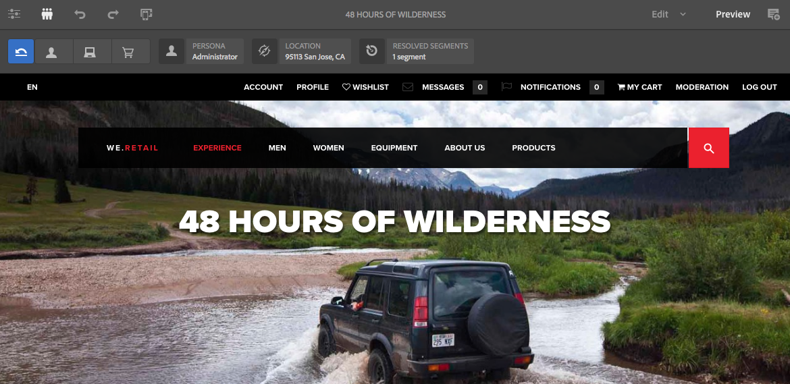

# ContextHub 데이터를 사용하여 페이지 미리보기{#previewing-pages-using-contexthub-data}

[ContextHub](/help/sites-developing/contexthub.md) 도구 모음은 ContextHub 저장소의 데이터를 표시하고 저장소 데이터를 변경할 수 있도록 해줍니다. ContextHub 도구 모음은 ContextHub 저장소의 데이터로 판별되는 콘텐츠를 미리 보는 데 유용합니다.

도구 모음은 하나 이상의 UI 모듈을 포함하는 일련의 UI 모드로 구성됩니다.

* UI 모드는 도구 모음의 왼쪽에 표시되는 아이콘입니다. 아이콘을 클릭하거나 탭하면 포함된 UI 모듈이 도구 모음에 표시됩니다.
* UI 모듈은 하나 이상의 ContextHub 저장소에서 가져온 데이터를 표시합니다. 일부 UI 모듈에서는 저장소 데이터를 조작할 수도 있습니다.

ContextHub는 몇 가지 UI 모드와 UI 모듈을 설치합니다. 관리자가 다른 것들을 표시하도록 [ContextHub를 구성](/help/sites-developing/ch-configuring.md)했을 수 있습니다.

## ContextHub 도구 모음 표시 {#revealing-the-contexthub-toolbar}

ContextHub 도구 모음은 미리보기 모드에서 사용할 수 있습니다. 도구 모음은 작성자 인스턴스에서만, 그리고 관리자가 활성화한 경우에만 사용할 수 있습니다.

1. 편집할 수 있도록 페이지가 열린 상태에서 도구 모음의 [미리보기]를 클릭하거나 탭합니다.

   

1. 도구 모음을 표시하려면 ContextHub 아이콘을 클릭하거나 탭합니다.

   

## UI 모듈 기능 {#ui-module-features}

각 UI 모듈에서는 서로 다른 기능 세트를 제공하지만 다음 유형의 기능은 일반적입니다. UI 모듈은 확장이 가능하므로 개발자는 필요에 따라 다른 기능을 구현할 수 있습니다.

### 도구 모음 콘텐츠 {#toolbar-content}

UI 모듈은 도구 모음에 있는 하나 이상의 ContextHub 저장소에서 가져온 데이터를 표시할 수 있습니다. UI 모듈은 아이콘 및 제목을 사용하여 자신을 식별합니다.

### 팝업 콘텐츠 {#popup-content}

일부 UI 모듈은 클릭하거나 탭하면 팝업 오버레이를 표시합니다. 일반적으로 팝업은 도구 모음에 표시되는 내용 이외의 추가 정보를 포함합니다.

### 팝업 양식 {#popup-forms}

모듈의 팝업 오버레이는 ContextHub 저장소의 데이터를 변경할 수 있는 양식 요소를 포함할 수 있습니다. 페이지 콘텐츠가 저장소 데이터에 의해 판별되는 경우 양식을 사용하고 페이지 콘텐츠에 대한 변경 사항을 관찰할 수 있습니다.

### 전체 화면 모드 {#fullscreen-mode}

팝업 오버레이는 클릭하거나 탭하여 전체 브라우저 창이나 화면을 덮도록 팝업 콘텐츠를 확장하는 아이콘을 포함할 수 있습니다.

