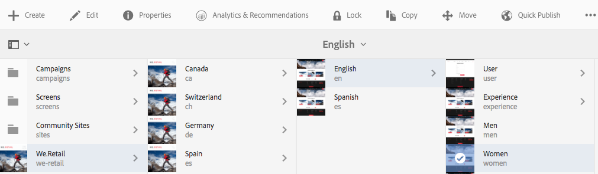

# 페이지 성능 분석{#analyzing-page-performance}

를 엽니다. [컨텐츠 인사이트](/help/sites-authoring/content-insights.md) 작성 중인 페이지의 성능을 분석하는 페이지입니다. 분석에 초점을 맞추도록 보고 기간을 구성합니다.

## 페이지용 Analytics 및 Recommendations 열기 {#opening-analytics-and-recommendations-for-a-page}

다음 절차에 따라 페이지에 대한 Analytics 및 Recommendations을 확인하십시오.

1. 분석할 페이지로 이동합니다.
1. 도구 모음에서 를 클릭합니다 **Analytics 및 Recommendations**.

   >[!NOTE]
   >
   >페이지에 대한 Analytics 및 Recommendations은 AEM을에 구성한 경우에만 나타납니다. [Adobe Analytics과 통합](/help/sites-administering/adobeanalytics-connect.md).

   

### 보고 기간 변경 {#changing-the-reporting-period}

분석 보고서에서 다음 시간 관련 측면을 변경합니다.

* 보고할 기간.
* 데이터의 세부 기간입니다.

보고서의 시간 관련 측면을 변경하는 도구는 Content Insight 페이지의 맨 위에 표시됩니다. 

#### 보고 기간 변경 {#changing-the-reporting-period-1}

페이지 활동 분석을 특정 기간에 집중하도록 컨텐츠 인사이트 페이지의 보고 기간을 변경합니다. 보고 기간을 변경하면 보고서가 자동으로 새로 고쳐집니다. 시간대의 음영 처리된 영역은 보고 기간을 나타냅니다. 일정의 날짜가 왼쪽에서 오른쪽으로 늘어납니다.

Content Insight 페이지의 보고 기간을 변경하려면:

1. 일정이 페이지 상단에 표시되지 않으면 일정 전환 아이콘을 클릭합니다.

   

1. 보고 기간의 시작 날짜를 변경하려면 음영 처리된 영역의 왼쪽에 나타나는 원을 원하는 시작 날짜로 끕니다.

   음영처리된 영역의 왼쪽을 볼 수 없는 경우 스크롤 막대를 사용하여 해당 영역을 표시합니다.

1. 보고 기간의 종료 날짜를 변경하려면 음영 처리된 영역의 오른쪽에 나타나는 원을 원하는 종료 날짜로 드래그합니다.

#### 보고 기간의 세부기간 변경 {#changing-the-granularity-of-the-reporting-period}

보고서에서 각 데이터 포인트가 걸리는 시간을 변경합니다. 예를 들어 주 세부기간을 선택하면 보기 보고서의 각 데이터 포인트는 1주일 보기 수를 나타냅니다.

세부기간은 보기 및 페이지 평균 참여 분 보고서와 같이 데이터를 시간에 따라 플롯하는 보고서에 영향을 줍니다. 세부 기간은 일정 규모에도 영향을 줍니다.

1. 세부기간 컨트롤이 나타나지 않으면 세부기간 토글 아이콘을 클릭합니다.

   

1. 원하는 세부 기간을 클릭합니다. 선택하면 세부 기간을 반영하도록 보고서가 자동으로 업데이트됩니다.

### SEO Recommendations에 작업 할당 {#assigning-tasks-for-seo-recommendations}

SEO Recommendations 보고서를 사용하여 검색 엔진에 대한 페이지 가시성을 개선하기 위한 작업을 만들 수 있습니다. 확인 표시가 없는 보고서의 각 권장 사항에 대해 사용자에게 할당할 작업을 만들어 필요한 작업을 수행할 수 있습니다.

SEO 권장 사항의 상태는 작업이 생성되었지만 아직 완료되지 않은 시기를 나타냅니다.

생성되면 작업이 사용자의 작업 목록에 나타납니다. 작업에 대한 자세한 내용은 [작업](/help/sites-authoring/task-content.md).

다음 절차를 사용하여 SEO 권장 사항에 대한 작업을 만듭니다.

1. SEO 권장 사항에 대한 정보 아이콘을 클릭합니다.

   

1. 정보 아이콘 옆에 나타나는 둘러싸인 삼각형 아이콘을 클릭합니다.

   

1. 표시되는 양식 필드를 입력한 다음 만들기 를 선택합니다.

   * 프로젝트: 작업을 생성할 프로젝트를 선택합니다.
   * 이름: 작업을 식별하는 이름입니다. 기본 이름은 SEO 권장 사항의 제목입니다.
   * 할당 대상: 작업을 할당할 사용자를 선택합니다. 목록을 필터링하려면 사용자 이름을 입력하십시오.
   * 설명: 작업을 완료하는 데 필요한 활동에 대한 설명입니다. 기본 설명은 SEO 권장 사항과 함께 제공되는 정보입니다.
   * 작업 우선 순위: 작업의 우선 순위.
   * 만기 일자: 작업을 완료해야 하는 일자입니다.

   **참고:** 생성된 작업에는 SEO 권장 사항이 적용되는 페이지에 대한 경로도 포함됩니다.

1. 완료 를 클릭하여 작업 생성 메시지를 닫습니다.
