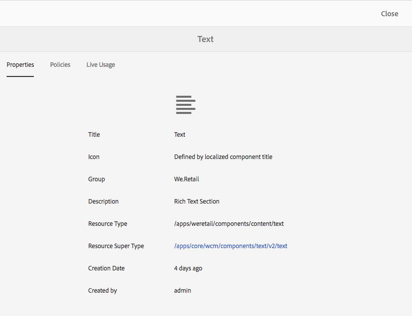

# 구성 요소 콘솔{#components-console}

구성 요소 콘솔에서 인스턴스에 대해 정의된 모든 구성 요소를 탐색하고 각 구성 요소에 대한 주요 정보를 볼 수 있습니다.

**도구 >** **일반 >** **구성 요소**&#x200B;에서 액세스할 수 있습니다. In the console, card and list view are available. Because there is no tree structure for components, column view is not available.

>[!NOTE]
>
>구성 요소 콘솔에는 시스템의 모든 구성 요소가 표시됩니다. [구성 요소 브라우저](/help/sites-authoring/author-environment-tools.md#components-browser)는 작성자가 사용할 수 있는 구성 요소를 표시하며 마침표(`.`)로 시작하는 모든 구성 요소 그룹을 숨깁니다.

## 검색 {#searching}

**콘텐츠 전용** 아이콘(왼쪽 상단)을 사용하여 구성 요소를 검색 및/또는 필터링할 **검색** 패널을 열 수 있습니다.

### 구성 요소 세부 정보 {#component-details}

특정 구성 요소에 대한 세부 정보를 보려면 필요한 리소스를 클릭하십시오. 세 탭에서 다음 정보를 제공합니다.

* **속성**

  

  [속성] 탭에서 다음 작업을 수행할 수 있습니다.

   * 구성 요소의 일반 속성 확인
   * 구성 요소에 대해 [아이콘 또는 약어를 정의한 방법](/help/sites-developing/components-basics.md#component-icon-in-touch-ui)을 확인하세요.

      * 아이콘의 소스를 클릭하면 해당 구성 요소로 이동합니다.

   * 구성 요소에 대한 **리소스 유형** 및 **리소스 슈퍼 유형**(정의된 경우)을 확인합니다.

      * [리소스 슈퍼 유형]을 클릭하면 해당 구성 요소로 이동합니다.

  >[!NOTE]
  >
  >`/apps`는 런타임 시 편집할 수 없으므로 구성 요소 콘솔은 읽기 전용입니다.

* **정책**

  

* **라이브 사용량**

  

  >[!CAUTION]
  >
  >이 보기에 대해 수집 중인 정보의 특성으로 인해 순서대로 구성하거나 표시하는 데 시간이 걸릴 수 있습니다.

* **설명서**

  개발자가 구성 요소에 대한 [설명서](/help/sites-developing/developing-components.md#documenting-your-component)를 제공한 경우 **설명서** 탭에 표시됩니다. 사용 가능한 설명서가 없으면 **설명서** 탭이 표시되지 않습니다.

  
