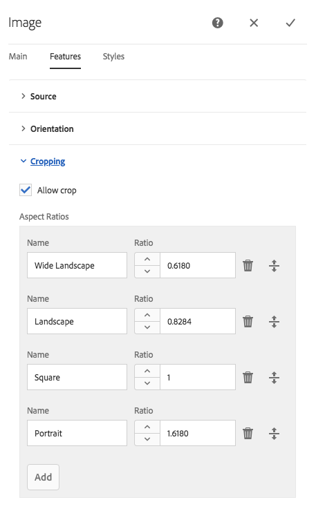

# 디자인 모드에서 구성 요소 구성{#configuring-components-in-design-mode}

AEM 인스턴스가 바로 설치되면 구성 요소 브라우저에서 즉시 구성 요소를 선택할 수 있습니다.

이러한 구성 요소 외에 다양한 다른 구성 요소도 사용할 수 있습니다. [디자인 모드]를 사용하여 [이러한 구성 요소를 활성화/비활성화](#enable-disable-components)할 수 있습니다. 구성 요소가 활성화되어 사용자 페이지에 있으면 [디자인 모드]에서 속성 매개 변수를 편집하여 [구성 요소 디자인의 여러 측면을 구성](#configuring-the-design-of-a-component)할 수 있습니다.

>[!NOTE]
>
>이러한 구성 요소를 편집할 때는 세심한 주의를 기울여야 합니다. 디자인 설정은 전체 웹 사이트의 디자인에서 핵심적인 부분인 경우가 많으므로 적절한 권한 및 경험을 갖춘 작성자(예: 관리자 또는 개발자)만 이러한 설정을 변경해야 합니다. 자세한 내용은 [구성 요소 개발](/help/sites-developing/components.md)을 참조하십시오.

>[!NOTE]
>
>[디자인 모드]는 정적 템플릿에만 사용 가능합니다. 편집 가능한 템플릿으로 생성된 템플릿은 [템플릿 편집기](/help/sites-authoring/templates.md)를 사용하여 편집해야 합니다.

>[!NOTE]
>
>디자인 모드는 ( `/etc`) 아래의 컨텐츠로 저장된 디자인 구성에만 사용할 수 있습니다.
>
>AEM 6.4부터 지속적인 배포 시나리오를 지원하기 위해 디자인을 `/apps` 아래에 구성 데이터로 저장하는 것이 좋습니다. `/apps`에 저장된 디자인은 런타임 시 편집할 수 없으며 이러한 템플릿에 대해 관리자가 아닌 사용자는 디자인 모드를 사용할 수 없습니다.

이 과정에서는 페이지의 단락 시스템에서 허용되는 구성 요소를 추가 또는 제거하게 됩니다. 단락 시스템(`parsys`)은 다른 모든 단락 구성 요소를 포함하는 복합 구성 요소입니다. 단락 시스템에는 다른 단락 구성 요소도 모두 포함되어 있으므로 작성자가 여러 유형의 구성 요소를 페이지에 추가할 수 있습니다. 각 단락 유형은 구성 요소로 표현됩니다. 

예를 들어 제품 페이지의 컨텐츠에는 다음을 포함하는 단락 시스템이 있을 수 있습니다.

* 제품 이미지(이미지 또는 텍스트 이미지 단락 형태)
* 제품 설명(텍스트 단락)
* 기술 데이터가 기재된 표(표 단락 형태)
* 사용자가 입력하는 양식(양식 시작, 양식 요소 및 양식 끝 단락)

>[!NOTE]
>
>[에 대한 자세한 내용은 ](/help/sites-developing/components.md)구성 요소 개발[ 및 ](/help/sites-developing/dev-guidelines-bestpractices.md#guidelines-for-using-templates-and-components)템플릿 및 구성 요소 사용 지침`parsys`을 참조하십시오.

>[!CAUTION]
>
>정적 템플릿의 디자인을 정의할 때 이 문서에 설명된 대로 디자인 모드를 사용하여 디자인을 편집하는 것이 좋습니다.
>
>예를 들어, CRX DE에서 디자인을 수정하는 것은 좋지 않으며, 그러한 디자인의 애플리케이션은 예상 동작과 다를 수 있습니다. 자세한 내용은 개발자 문서 [페이지 템플릿 - 정적](/help/sites-developing/page-templates-static.md#how-template-designs-are-applied)을 참조하십시오.

## 구성 요소 활성화/비활성화 {#enable-disable-components}

구성 요소를 활성화하거나 비활성화하려면:

1. **디자인** 모드를 선택합니다.

   

1. 구성 요소를 탭하거나 클릭합니다. 선택하면 구성 요소에 파란색 테두리가 생깁니다.

   

1. **상위** 아이콘을 클릭하거나 탭합니다.

   

   이 아이콘은 현재 구성 요소를 포함하는 단락 시스템을 선택합니다.

1. 단락 시스템의 **구성** 아이콘은 상위 작업 표시줄에 표시됩니다.

   

   대화 상자를 표시하려면 이 아이콘을 선택합니다.

1. 이 대화 상자를 사용하여 현재 페이지를 편집할 때 구성 요소 브라우저에서 사용할 수 있는 구성 요소를 정의합니다.

   

   대화 상자에는 다음과 같은 두 개의 탭이 있습니다.

   * 허용된 구성 요소
   * 설정

   **허용된 구성 요소**

   **허용된 구성 요소** 탭에서 parsys에 사용할 수 있는 구성 요소를 정의합니다.

   * 구성 요소는 확장 및 축소할 수 있는 구성 요소 그룹별로 그룹화됩니다.
   * 그룹 이름을 체크 표시하여 전체 그룹을 선택할 수 있으며, 체크 표시를 해제하여 전체 그룹을 선택 취소할 수 있습니다.
   * 빼기 기호는 그룹의 항목이 하나 이상 선택되어 있음을 나타냅니다.
   * 검색을 통해 구성 요소를 이름별로 필터링할 수 있습니다.
   * 구성 요소 그룹 이름의 오른쪽에 나열된 숫자는 필터와 관계없이 해당 그룹에서 선택한 구성 요소의 총 개수를 나타냅니다.

   페이지 구성 요소별로 구성을 정의합니다. 하위 페이지에서 동일한 템플릿 및/또는 페이지 구성 요소(일반적으로 정렬됨)를 사용하면 동일한 구성이 해당 단락 시스템에도 적용됩니다.

   >[!NOTE]
   >
   >적응형 양식 구성 요소는 [적응형 양식 컨테이너] 내에서 작동하도록 설계되어 [양식] 에코시스템을 활용할 수 있습니다. 따라서 이러한 구성 요소는 [적응형 양식 편집기]에서만 사용해야 하며 [사이트 페이지 편집기]에서는 작동하지 않습니다.

   **설정**

   **설정** 탭에서 각 구성 요소의 앵커 그리기, 각 컨테이너의 셀 채우기 정의 등과 같은 추가 옵션을 정의할 수 있습니다.

1. **완료**&#x200B;를 선택하여 구성을 저장합니다.

## 구성 요소 디자인 구성 {#configuring-the-design-of-a-component}

1. **디자인** 모드를 선택합니다.

   

1. 파란색 테두리가 있는 구성 요소를 탭하거나 클릭합니다. 이 예에서는 영웅 이미지 구성 요소가 선택되었습니다.

   

1. **구성** 아이콘을 사용하여 대화 상자를 열 수 있습니다.

   

   디자인 대화 상자에서 사용 가능한 디자인 매개 변수에 따라 구성 요소를 구성할 수 있습니다.

   

   대화 상자에는 다음과 같은 세 개의 탭이 있습니다.

   * 기본
   * 기능
   * 스타일

   **속성**

   **속성** 탭을 사용하여 구성 요소의 중요한 디자인 매개 변수를 구성할 수 있습니다. 예를 들어 이미지 구성 요소의 경우 허용되는 이미지의 최대 및 최소 크기를 정의할 수 있습니다.

   **기능**

   **기능** 탭을 사용하여 구성 요소의 추가 기능을 활성화하거나 비활성화할 수 있습니다. 예를 들어 이미지 구성 요소의 경우, 이미지 방향을 정의하고 이미지를 업로드할 수 있는 경우 자르기 옵션을 사용할 수 있습니다.

   **스타일**

   **스타일** 탭에서는 해당 구성 요소에 사용할 CSS 클래스와 스타일을 정의할 수 있습니다.

   

   **추가** 단추를 사용하여 여러 항목의 대화 상자 목록에 항목을 추가할 수 있습니다.

   

   다중 항목 대화 상자 목록에서 항목을 제거하려면 ** 삭제 ** 아이콘을 사용합니다.

   

   **이동** 아이콘을 사용하여 여러 항목의 대화 상자 목록에서 항목 순서를 재정렬할 수 있습니다.

   

1. **완료** 아이콘을 클릭하거나 탭하여 대화 상자를 저장하고 닫습니다.

