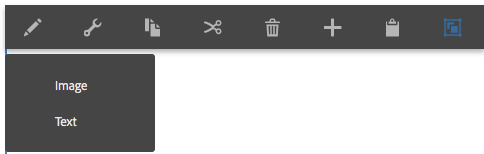
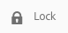

# 페이지 컨텐츠 편집{#editing-page-content}

페이지가 만들어지면(launch 또는 live copy의 일부 또는 신규) 컨텐츠를 편집하여 필요한 업데이트 작업을 수행할 수 있습니다.

컨텐츠는 페이지로 끌 수 있는 [구성 요소](/help/sites-authoring/default-components-console.md)(컨텐츠 유형에 맞는)를 사용하여 추가됩니다. 그런 다음 그 자리에서 편집하거나, 이동하거나 삭제할 수 있습니다.

>[!NOTE]
>
>페이지를 편집하기 위해서는 계정에 [적절한 액세스 권한](/help/sites-administering/security.md)과 [사용 권한](/help/sites-administering/security.md#permissions)이 있어야 합니다.
>
>문제가 발생하면 시스템 관리자에게 문의하십시오.

>[!NOTE]
>
>페이지 및/또는 템플릿이 적절하게 설정된 경우 편집할 때 [응답형 레이아웃](/help/sites-authoring/responsive-layout.md)을 사용할 수 있습니다.

>[!NOTE]
>
>**편집** 모드에서는 컨텐츠에 링크가 표시되지만 **액세스할 수 없습니다**. 컨텐츠의 링크를 사용하여 탐색하려면 [미리 보기 모드](#previewingpagestouchoptimizedui)를 사용하십시오.

## 페이지 도구 모음 {#page-toolbar}

페이지 도구 모음에서는 페이지 구성에 따라 적절한 기능에 대한 액세스 권한을 제공합니다.

도구 모음은 다양한 옵션에 대한 액세스를 제공합니다. 현재 컨텍스트 및 구성에 따라 일부 옵션을 사용하지 못할 수 있습니다.

* **사이드 패널 전환**

   [자산 브라우저](/help/sites-authoring/author-environment-tools.md#assets-browser), [구성 요소 브라우저](/help/sites-authoring/author-environment-tools.md#components-browser) 및 [컨텐츠 트리](/help/sites-authoring/author-environment-tools.md#content-tree)를 보유하는 사이드 패널을 열고 닫습니다.

   

* **페이지 정보**

   페이지 정보 보기 및 편집, 페이지 속성 보기, 페이지 게시/게시 취소를 포함하여 페이지에서 수행할 수 있는 페이지 정보 및 작업 등과 같은 [페이지 정보](/help/sites-authoring/author-environment-tools.md#page-information) 메뉴에 대한 액세스를 제공합니다.

   

* **에뮬레이터**

   다른 장치에서 페이지의 디자인을 에뮬레이트하는 데 사용되는 [에뮬레이터 도구 모음](/help/sites-authoring/responsive-layout.md#selecting-a-device-to-emulate)을 전환합니다. 이것은 레이아웃 모드에서 자동으로 전환됩니다.

   

* **ContextHub**

   [context hub을 엽니다](/help/sites-authoring/ch-previewing.md). [미리 보기 모드]에서만 사용 가능합니다.

   

* **페이지 제목**

   정보 제공용입니다.

   

* **모드 선택기**

   현재 [모드](/help/sites-authoring/author-environment-tools.md#page-modes)를 표시하고 편집, 레이아웃, 타임워프 또는 타깃팅과 같은 다른 모드를 선택할 수 있습니다.

   

* **미리 보기**

   [미리 보기 모드](/help/sites-authoring/editing-content.md#preview-mode)를 활성화합니다. 게시될 때 나타나는 페이지가 표시됩니다.

   

* **주석**

   페이지를 검토할 때 페이지에 [주석](/help/sites-authoring/annotations.md)을 추가할 수 있습니다. 첫 번째 주석 다음에 아이콘이 숫자로 전환하여 페이지에 있는 주석의 수를 가리킵니다.

   

### 상태 알림 {#status-notification}

페이지가 [워크플로우](/help/sites-authoring/workflows.md) 또는 다중 워크플로우의 일부인 경우 페이지를 편집할 때 화면 맨 위에 있는 알림 표시줄에 이 정보가 표시됩니다.

>[!NOTE]
>
>상태 표시줄은 적절한 권한이 있는 사용자 계정에만 표시됩니다.

알림은 페이지에 대해 실행 중인 워크플로우를 나열합니다. 사용자가 현재 워크플로우 단계에 참여 중인 경우 옵션은 [워크플로우 상태](/help/sites-authoring/workflows-participating.md)에 영향을 주며 워크플로우에 대한 자세한 정보는 다음과 같이 확인할 수 있습니다.

* **완료**  - 전체 작업 항목  **대화** 상자를 엽니다.

* **위임**  - 전체 작업 항목  **대화** 상자를 엽니다.

* **세부 사항 보기** - 워크플로우의 **세부 사항** 창을 엽니다.

알림 표시줄을 통해 워크플로우 단계를 완료하고 위임하는 것은 알림 받은 편지함에서 [워크플로우에 참여](/help/sites-authoring/workflows-participating.md)할 때와 같은 방식입니다.

페이지에 여러 개의 워크플로우가 있는 경우 알림 오른쪽 끝에 화살표 단추와 함께 워크플로우 개수가 표시되어 워크플로우를 스크롤할 수 있습니다.

## 구성 요소 자리 표시자 {#component-placeholder}

구성 요소 자리 표시자는 구성 요소를 놓을 때 배치될 위치를 보여주는 표시기입니다(현재 마우스로 가리키고 있는 구성 요소 위에 있음).

* 페이지에 새 구성 요소를 추가할 때(구성 요소 브라우저로부터 끌기):

   

* 기존 구성 요소를 이동할 때:

   

## 구성 요소 삽입 {#inserting-a-component}

### 구성 요소 브라우저에서 구성 요소 삽입 {#inserting-a-component-from-the-components-browser}

[구성 요소 브라우저](/help/sites-authoring/author-environment-tools.md#components-browser)를 사용하여 새 구성 요소를 추가할 수 있습니다. [구성 요소 자리 표시자](#component-placeholder)는 구성 요소가 위치할 곳을 보여 줍니다:

1. 페이지가 [**편집** 모드](/help/sites-authoring/author-environment-tools.md#page-modes)인지 확인합니다.
1. [구성 요소 브라우저](/help/sites-authoring/author-environment-tools.md#components-browser)를 엽니다.
1. 필요한 구성 요소를 [필요한 위치](#component-placeholder)로 드래그합니다.

1. 구성 요소를 [편집합니다.](#editmovecopypastedelete)

>[!NOTE]
>
>모바일 장치에서 구성 요소 브라우저가 전체 화면을 채웁니다. 구성 요소를 드래그하면 브라우저가 닫히고 구성 요소를 배치할 수 있도록 페이지가 다시 표시됩니다.

### 단락 시스템에서 구성 요소 삽입 {#inserting-a-component-from-the-paragraph-system}

단락 시스템의 **구성 요소를 여기로 드래그하십시오.** 상자를 사용하여 새 구성 요소를 추가할 수 있습니다.

1. 페이지가 [**편집** 모드](/help/sites-authoring/author-environment-tools.md#page-modes)인지 확인합니다.
1. 단락 시스템에서 새 구성 요소를 선택하고 추가하는 두 가지 방법이 있습니다.

   * 기존 구성 요소의 도구 모음 또는 **구성 요소를 여기로 드래그하십시오.** 상자에서 **구성 요소 삽입** 옵션(+)을 선택합니다.

   

   * 데스크탑 장치를 사용하는 경우 **구성 요소를 여기로 드래그하십시오.** 상자를 두 번 클릭합니다.

   필수 구성 요소를 선택할 수 있는 **새 구성 요소 삽입** 대화 상자가 열립니다.

   

1. 선택한 구성 요소가 페이지 아래쪽에 추가됩니다. 필요에 따라 구성 요소를 [편집합니다.](#editmovecopypastedelete)

### 자산 브라우저를 사용하여 구성 요소 삽입 {#inserting-a-component-using-the-assets-browser}

[자산 브라우저](/help/sites-authoring/author-environment-tools.md#assets-browser)에서 자산을 끌어 페이지에 새 구성 요소를 추가할 수도 있습니다. 이렇게 하면 적절한 유형의 새 구성 요소가 자동으로 만들어집니다(자산이 들어 있음).

이것은 다음 자산 유형에 대해 유효합니다(일부는 페이지/단락 시스템에 따라 다릅니다.).

<table>
 <tbody>
  <tr>
   <th><strong>자산 유형</strong></th>
   <th><strong>결과 구성 요소 유형</strong></th>
  </tr>
  <tr>
   <td>이미지</td>
   <td>이미지</td>
  </tr>
  <tr>
   <td>문서</td>
   <td>다운로드</td>
  </tr>
  <tr>
   <td>제품</td>
   <td>제품</td>
  </tr>
  <tr>
   <td>비디오</td>
   <td>Flash</td>
  </tr>
  <tr>
   <td>콘텐츠 조각</td>
   <td>콘텐츠 조각  </td>
  </tr>
 </tbody>
</table>

>[!NOTE]
>
>이 동작은 설치에 대해 구성할 수 있습니다. 자세한 내용은 [단락 시스템 구성 및 자산 드래그를 통한 구성 요소 인스턴스 생성](/help/sites-developing/developing-components.md#configuring-a-paragraph-system-so-that-dragging-an-asset-creates-a-component-instance)을 참조하십시오.

위의 자산 유형 중 하나를 끌어 구성 요소를 만들려면,

1. 페이지가 [**편집** 모드](/help/sites-authoring/author-environment-tools.md#page-modes)인지 확인합니다.
1. [자산 브라우저](/help/sites-authoring/author-environment-tools.md#assets-browser)를 엽니다.
1. 필요한 자산을 필요한 위치로 끕니다. [구성 요소 자리 표시자](#component-placeholder)는 구성 요소가 위치할 곳을 보여 줍니다.

   자산 유형에 적절한 구성 요소가 필요한 위치에 만들어지게 됩니다. 여기에 선택한 자산이 포함됩니다.

1. 필요할 경우 구성 요소를 [편집합니다.](#editmovecopypastedelete)

>[!NOTE]
>
>모바일 장치에서 자산 브라우저가 전체 화면을 채웁니다. 자산을 드래그하면 브라우저가 닫히고 자산을 배치할 수 있도록 페이지가 다시 표시됩니다.

자산을 검색할 때 자산을 빠르게 변경해야 하는 경우, 자산의 이름 옆에 있는 편집 아이콘을 클릭하여 [자산 편집기](/help/assets/manage-assets.md)를 브라우저에서 직접 시작할 수 있습니다.

## 편집/구성/복사/잘라내기/삭제/붙여넣기 {#edit-configure-copy-cut-delete-paste}

구성 요소를 선택하면 도구 모음이 열립니다. 이 도구 모음에서는 구성 요소에서 수행할 수 있는 다양한 작업에 액세스할 수 있습니다.

사용자가 사용할 수 있는 실제 작업은 상황에 따라 적절히 표시되며 일부 작업은 여기에서 설명되지 않을 수 있습니다.

* **편집**

   [편집 구성 요소 유형에 따라](/help/sites-authoring/default-components.md) [구성 요소의 컨텐츠를 편집](#edit-content)할 수 있게 됩니다. 종종 도구 모음이 제공됩니다.

   

* **구성**

   [구성 요소 유형에 따라](/help/sites-authoring/default-components.md) 구성 요소의 속성을 편집 및 구성할 수 있게 됩니다. 종종 대화 상자가 열립니다.

   

* **복사**

   그러면 구성 요소가 클립보드로 복사됩니다. 붙여넣기 작업 후에도 원래 구성 요소는 여전히 유지됩니다.

   

* **잘라내기**

   그러면 구성 요소가 클립보드로 복사됩니다. 붙여넣기 작업 후 원래 구성 요소는 제거됩니다.

   

* **삭제**

   확인과 함께 페이지에서 구성 요소가 삭제됩니다.

   

* **구성 요소 삽입**

   대화 상자가 열려 [새 구성 요소를 추가](/help/sites-authoring/editing-content.md#inserting-a-component-from-the-paragraph-system)할 수 있습니다.

   

* **붙여넣기**

   구성 요소를 클립보드에서 페이지로 붙여넣게 됩니다. 원본이 유지되는지 여부는 사용한 것이 복사인지 잘라내기인지에 따라 다릅니다.

   * 같은 페이지나 다른 페이지에 붙여넣을 수 있습니다.
   * 붙여넣은 항목은 붙여넣기 작업을 선택한 항목 위에 붙여넣게 됩니다.
   * 클립보드에 컨텐츠가 있는 경우에만 붙여넣기 작업이 표시됩니다.

   

   >[!NOTE]
   >
   >잘라내기/복사 작업 전에 이미 열려 있는 다른 페이지에 붙여넣으면 해당 페이지를 새로 고쳐 붙여넣은 컨텐츠를 볼 수 있습니다.

* **그룹**

   여러 구성 요소를 한 번에 선택할 수 있도록 해줍니다. **Control+Click** 또는 **Command+Click**&#x200B;하여 데스크톱 장치에서도 동일한 작업을 수행할 수 있습니다.

   

* **상위**

   선택한 구성 요소의 상위 구성 요소를 선택할 수 있습니다.

   

* **레이아웃**

   이렇게 하면 선택한 구성 요소의 [레이아웃](/help/sites-authoring/editing-content.md#edit-component-layout)을 수정할 수 있습니다. 선택한 구성 요소에만 적용되며 전체 페이지의 [레이아웃 모드](/help/sites-authoring/author-environment-tools.md#page-modes)는 활성화하지 않습니다.

   

* **경험 조각 변형으로 변환**

   이 작업에서는 선택한 구성 요소에서 새 [경험 조각](/help/sites-authoring/experience-fragments.md)을 생성하거나 기존 경험 조각에 추가할 수 있습니다.

   

## 편집(컨텐츠) {#edit-content}

구성 요소에서 컨텐츠를 추가 및/또는 편집하는 방법에는 두 가지가 있습니다.

* [편집하려면 구성 요소 대화 상자](#component-edit-dialog)를 엽니다.
* 자산 브라우저에서 [자산을 끌어다 놓아](#draganddropintocomponent) 컨텐츠를 바로 추가합니다.

### 구성 요소 편집 대화 상자  {#component-edit-dialog}

[구성 요소 도구 모음의 편집(연필) 아이콘](#edit-configure-copy-cut-delete-paste)을 사용하여 컨텐츠를 편집할 구성 요소를 열 수 있습니다.

정확한 편집 옵션은 구성 요소에 따라 다릅니다. 일부 구성 요소의 경우 [모든 작업이 전체 화면 모드에서만 사용](#edit-content-full-screen-mode)할 수 있습니다. 예:

* [텍스트 구성 요소](/help/sites-authoring/rich-text-editor.md#main-pars-title-24)

   

* 이미지 구성 요소

   

   >[!NOTE]
   >
   >빈 이미지 구성 요소에서는 편집기가 작동하지 않습니다.
   >
   >
   >편집을 시작하려면 먼저 [이미지를 끌거나 업로드(구성 사용)](/help/sites-authoring/default-components-foundation.md#image)해야 합니다.

* 이미지 구성 요소 - 전체 화면

   이미지 구성 요소에 대해 [전체 화면 모드를 표시](/help/sites-authoring/editing-content.md#edit-content-full-screen-mode)하면 **Launch Map** 및 **확대/축소 재설정**&#x200B;과 같은 추가 편집 옵션을 표시할 뿐 아니라 이미지를 편집하는 데 더 많은 공간을 사용할 수 있습니다. 또한 전체 화면에서는 [자르기 사전 설정]을 선택할 수 있습니다.

   

* [텍스트 및 이미지 기초 구성 요소](/help/sites-authoring/default-components-foundation.md#text-image)와 같이 두 개 이상의 기본 구성 요소에서 만들어진 구성 요소는 우선 원하는 편집 선택 사항 세트를 확인할 것을 요구합니다.

   

### 자산을 구성 요소로 끌어다 놓기 {#drag-and-drop-assets-into-component}

특정 구성 요소 유형의 경우 자산 브라우저의 자산을 구성 요소에 바로 끌어다 놓아 컨텐츠를 업데이트할 수 있습니다.

| **자산 유형** | **구성 요소 유형** |
|---|---|
| 이미지 | 이미지 |
| 문서 | 다운로드 |
| 제품 | 제품 |
| 비디오 | Flash |
| 콘텐츠 조각 | 컨텐츠 조각 |

## (컨텐츠) 편집 전체 화면 모드  {#edit-content-full-screen-mode}

모든 구성 요소에 대해 다음 아이콘으로 전체 화면 모드에 액세스(및 액세스 종료)할 수 있습니다.

예를 들어, **텍스트** 구성 요소:

>[!NOTE]
>
>일부 구성 요소의 경우, 전체 화면 모드는 기본 즉석 편집기보다 사용할 수 있는 옵션이 더 많습니다.

## 구성 요소 이동 {#moving-a-component}

단락 구성 요소 이동

1. 탭한 상태나 클릭한 상태로 유지하여 이동할 단락을 선택합니다.
1. 단락을 새 위치로 드래그합니다. AEM에서 단락을 둘 수 있는 위치를 보여줍니다. 단락을 원하는 위치에 놓습니다.

   

1. 단락이 이동됩니다.

>[!NOTE]
>
>[잘라내기 및 붙여넣기](/help/sites-authoring/editing-content.md#edit-configure-copy-cut-delete-paste)를 사용하여 구성 요소를 이동할 수도 있습니다.

## 구성 요소 레이아웃 편집 {#edit-component-layout}

구성 요소를 조정하기 위해 편집에서 [레이아웃 모드](/help/sites-authoring/responsive-layout.md)로 반복적으로 전환하는 대신 해당 구성 요소의 레이아웃을 변경하려는 구성 요소에 대해 **레이아웃** 작업을 선택하면 [편집 모드]를 벗어나지 않고 시간을 절약할 수 있습니다.

1. Sites 콘솔의 **편집** 모드에 있는 경우 구성 요소를 선택하면 구성 요소의 도구 모음이 표시됩니다.

   

   **레이아웃** 작업을 클릭하거나 탭하여 구성 요소의 레이아웃을 조정합니다.

   

1. 레이아웃 작업이 선택되면 다음과 같습니다.

   * 구성 요소 표시의 크기 조정 핸들이 표시됩니다.
   * 에뮬레이터 도구 모음이 화면 맨 위에 표시됩니다.
   * 표준 편집 작업 대신 레이아웃 작업이 구성 요소 도구 모음에 표시됩니다.

   

   [레이아웃 모드](/help/sites-authoring/responsive-layout.md#defining-layouts-layout-mode)에서처럼 구성 요소의 레이아웃을 수정할 수 있습니다.

1. 필요한 레이아웃 변경을 만든 후 구성 요소 작업 메뉴에서 **닫기** 단추를 클릭하여 구성 요소 레이아웃 수정을 중지할 수 있습니다. 구성 요소의 도구 모음이 일반적인 편집 상태로 돌아갑니다.

   

>[!NOTE]
>
>레이아웃 작업은 선택한 구성 요소의 범위로 제한됩니다. 예를 들어 한 구성 요소의 레이아웃을 편집한 다음 다른 구성 요소를 클릭하면 에뮬레이터 도구 모음이 사라질 뿐 아니라 새로 선택한 구성 요소 및 크기 조정 핸들에 대한 표준 편집 도구 모음(레이아웃 도구 모음이 아님)이 표시됩니다.
>
>여러 구성 요소에 영향을 미치는 페이지의 전체 레이아웃을 편집해야 하는 경우 [레이아웃 모드](/help/sites-authoring/responsive-layout.md)로 전환하십시오.

## 상속된 구성 요소 {#inherited-components}

상속된 구성 요소는 다음을 포함하여 다양한 시나리오의 제품일 수 있습니다.

* [다중 사이트 관리](/help/sites-administering/msm.md)
* [Launch](/help/sites-authoring/launches.md)(live copy을 기반으로 할 때).
* 특정 구성 요소입니다(예: Geometrixx 내 상속된 단락 시스템).

상속을 취소(그런 다음 다시 활성화)할 수 있습니다. 구성 요소에 따라 다음 제품에서 사용할 수 있습니다.

* **Live Copy**

   구성 요소 도구 모음 - 구성 요소가 live copy나 launch(live copy 기반)의 일부인 페이지에 있을 경우. 예:

   

   [상속 취소] 옵션을 사용할 수 있습니다.

   

   또는 이미 취소된 경우 상속을 재활성화합니다.

   

   롤라웃 작업은 블루프린트 또는 Live Copy 소스에서도 사용 가능합니다.

   

* **상속된 단락 시스템**

   구성 대화 상자입니다. 예를 들어, 상속된 단락 시스템을 사용하는 경우 다음과 같습니다.

   

## 페이지 템플릿 편집 {#editing-the-page-template}

페이지가 [편집 가능한 템플릿](/help/sites-authoring/templates.md#editable-and-static-templates)을 기반으로 하는 경우 [페이지 정보 메뉴](/help/sites-authoring/author-environment-tools.md#page-information)에서 **템플릿 편집**&#x200B;을 선택하여 [템플릿 편집기](/help/sites-authoring/templates.md#editing-templates-template-authors)로 간편하게 전환할 수 있습니다.

페이지가 [정적 템플릿](/help/sites-authoring/templates.md#editable-and-static-templates)을 기반으로 하는 경우 도구 모음의 [페이지 모드 선택기](/help/sites-authoring/author-environment-tools.md#page-modes)를 사용하여 [디자인 모드](/help/sites-authoring/default-components-designmode.md)로 전환하여 페이지에 사용할 구성 요소를 활성화/비활성화할 수 있습니다.

[열 보기](/help/sites-authoring/basic-handling.md#column-view) 또는 [목록 보기](/help/sites-authoring/basic-handling.md#list-view) 페이지를 선택할 때 페이지가 기반으로 하는 템플릿을 쉽게 확인할 수 있습니다.

## Live Copy 상태  {#live-copy-status}

[Live Copy 상태 페이지 모드](/help/sites-authoring/author-environment-tools.md#page-modes)를 사용하면 live copy 상태와 상속되었거나 상속되지 않은 구성 요소에 대한 간단한 개요를 알 수 있습니다.

* 녹색 테두리: 상속됨
* 분홍색 테두리: 상속이 취소되었습니다.

예:

## 주석 추가 {#adding-annotations}

[주석](/help/sites-authoring/annotations.md)을 사용하면 검토자와 다른 작성자가 컨텐츠에 대한 피드백을 제공할 수 있습니다. 검토 및 유효성 검사 목적으로도 종종 사용됩니다.

## 페이지 미리 보기  {#previewing-pages}

페이지를 미리 볼 수 있는 두 가지 옵션이 있습니다.

* [미리 보기 모드](#preview-mode) - 빠르고 즉각적인 미리 보기

* [게시됨으로 보기](#view-as-published) - 새 탭에 페이지가 열리는 전체 미리 보기

>[!NOTE]
>
>* 컨텐츠에 있는 링크는 볼 수는 있지만 편집 모드에서 액세스할 수는 없습니다.
>* 링크를 사용하여 탐색하려는 경우 미리 보기 옵션 중 하나를 사용합니다.
>* [키보드 단축키](/help/sites-authoring/keyboard-shortcuts.md) `Ctrl-Shift-M`을 사용하여 미리 보기와 마지막에 선택한 모드 간에 전환할 수 있습니다.

>

>[!NOTE]
>
>[WCM 모드] 쿠키는 두 옵션 모두에 대해 설정됩니다.

### 미리 보기 모드 {#preview-mode}

내용을 편집할 때 [미리 보기 모드](/help/sites-authoring/author-environment-tools.md#page-modes)를 사용하여 페이지를 미리 볼 수 있습니다. 이 모드에서 다음을 수행합니다.

* 게시할 때 페이지가 표시되는 모양에 대해 빠른 보기를 제공할 수 있도록 여러 가지 편집 메커니즘을 숨깁니다.
* 링크를 사용하여 탐색할 수 있습니다.
* 페이지 컨텐츠를 새로 고치지 **않습니다**.

미리 보기 모드는 작성할 때 페이지 편집기의 오른쪽 상단에 있는 아이콘을 사용하면 이용할 수 있습니다.

### 게시됨으로 보기 {#view-as-published}

**게시됨으로 보기** 옵션은 [페이지 정보](/help/sites-authoring/author-environment-tools.md#page-information) 메뉴에서 사용할 수 있습니다. 이 옵션은 새 탭에 페이지를 열고, 컨텐츠를 새로 고치고, 게시 환경에 표시되는 대로 페이지를 표시합니다.

## 페이지 잠금 {#locking-a-page}

AEM에서는 다른 사람이 컨텐츠를 수정할 수 없도록 페이지를 잠글 수 있습니다. 이 기능은 하나의 특정 페이지에 여러 편집 작업을 수행하거나 잠시 동안 페이지를 동결해야 할 때 유용합니다.

페이지는 다음 중 하나에서 잠글 수 있습니다.

* **사이트** 콘솔

   1. [선택 모드](/help/sites-authoring/basic-handling.md#viewing-and-selecting-resources)로 페이지를 선택합니다.
   1. 잠금 아이콘을 선택합니다.

   

* **페이지 편집기**

   1. **페이지 정보**&#x200B;아이콘을 선택하여 메뉴를 엽니다.
   1. **페이지 잠금** 옵션을 선택합니다. 

페이지가 잠기면 콘솔 보기 정보가 업데이트되며, 편집 시에는 잠금 기호가 도구 모음에 표시됩니다.

>[!CAUTION]
>
>[사용자를 가장](/help/sites-administering/security.md#impersonating-another-user)할 때 페이지 잠금이 수행될 수 있습니다. 그러나 이 방법으로 잠긴 페이지는 가장한 사용자나 관리자만 잠금 해제할 수 있습니다.
>
>페이지를 잠근 사용자를 가장하는 것으로는 페이지 잠금을 해제할 수 없습니다.

## 페이지 잠금 해제 {#unlocking-a-page}

페이지 잠금을 해제하는 것은 [페이지 잠금](#locking-a-page)과 매우 유사해서, 페이지가 잠기면 잠금 옵션이 잠금 해제 동작으로 대체됩니다.

[페이지 정보] 메뉴에 **잠금 해제**&#x200B;가 옵션으로 표시되며 [사이트 콘솔]의 잠금 아이콘은 **잠금 해제** 아이콘으로 바뀝니다.

>[!CAUTION]
>
>[사용자를 가장](/help/sites-administering/security.md#impersonating-another-user)할 때 페이지 잠금이 수행될 수 있습니다. 그러나 이 방법으로 잠긴 페이지는 가장한 사용자나 관리자만 잠금 해제할 수 있습니다.
>
>페이지를 잠근 사용자를 가장하는 것으로는 페이지 잠금을 해제할 수 없습니다.

## 페이지 편집 실행 취소 및 재실행 {#undoing-and-redoing-page-edits}

다음 아이콘을 사용하여 작업을 실행 취소하거나 재실행할 수 있습니다. 이 아이콘들은 때에 따라 도구 모음에도 표시됩니다.

>[!NOTE]
>
>[키보드 단축키](/help/sites-authoring/page-authoring-keyboard-shortcuts.md) `Ctrl-Z`를 사용하여 페이지 편집 작업을 취소할 수 있습니다.
>
>키보드 단축키 `Ctrl-Y`을(를) 사용하여 페이지 편집 작업을 다시 실행할 수도 있습니다.

>[!NOTE]
>
>페이지 편집 내용을 실행 취소하거나 재실행할 때 가능한 사항에 대한 모든 세부 사항은 [페이지 편집 실행 취소 및 재실행 - 이론](#undoing-and-redoing-page-edits-the-theory)을 참조하십시오.

## 페이지 편집 내용 실행 취소 및 재실행 - 이론 {#undoing-and-redoing-page-edits-the-theory}

>[!NOTE]
>
>시스템 관리자는 인스턴스에 대한 요구 사항에 따라 [실행 취소/재실행 기능의 다양한 측면을 구성](/help/sites-administering/config-undo.md)할 수 있습니다.

AEM에는 사용자가 수행한 작업 내역이 순서대로 저장됩니다. 따라서 여러 작업의 실행을 취소하면 수행한 순서대로 취소됩니다. 그런 다음 필요한 경우 재실행을 사용하여 하나 이상의 작업을 다시 적용할 수 있습니다.

컨텐츠 페이지의 요소(예: 텍스트 구성 요소 등)가 선택된 경우 명령을 실행 취소 및 다시 실행하면 선택한 항목에 적용됩니다.

실행 취소 및 재실행 명령의 동작은 다른 소프트웨어 프로그램의 경우와 비슷합니다. 이러한 명령을 사용하여 웹 페이지의 컨텐츠를 편집하면서 최근 상태로 복원할 수 있습니다. 예를 들어 텍스트 단락을 페이지의 다른 위치로 이동한 후 실행 취소 명령을 사용하여 단락을 원래 위치로 되돌릴 수 있습니다. 그런 다음 이전 위치가 더 낫다고 판단되는 경우 다시 실행 명령을 사용하여 &quot;실행 취소를 실행 취소&quot;하십시오.

>[!NOTE]
>
>다음을 작업을 수행할 수 있습니다.
>
>* 실행 취소를 사용한 후 페이지를 편집하지 않은 경우 작업을 재실행합니다.
>* 최대 20개의 편집 작업 실행을 취소합니다(기본 설정).
>* 실행 취소 및 재실행용 [키보드 단축키](/help/sites-authoring/page-authoring-keyboard-shortcuts.md)를 사용합니다.

>

다음과 같은 유형의 페이지 변경을 취소하거나 재실행할 수 있습니다.

* 단락 추가, 편집, 삭제 및 이동
* 단락 내용 즉석 편집
* 페이지 내 항목 복사, 잘라내기 및 붙여넣기

구성 요소 렌더링을 구성하는 양식 필드는 페이지를 작성하는 동안 값이 지정되지 않습니다. 따라서 실행 취소 및 재실행 명령으로는 해당 구성 요소 유형의 값에 수행한 변경 내용이 적용되지 않습니다. 예를 들어 드롭다운 목록에서 값을 선택한 작업에 대해서는 실행 취소를 할 수 없습니다.

>[!NOTE]
>
>파일 및 이미지 변경을 취소하거나 재실행하려면 특수 권한이 필요합니다.

>[!NOTE]
>
>파일 및 이미지 변경의 실행 취소 내역은 최소 10시간 동안 유지됩니다. 이 시간이 지나면 변경을 취소하지 못할 수 있습니다. 관리자는 기본 시간인 10시간을 변경할 수 있습니다.

