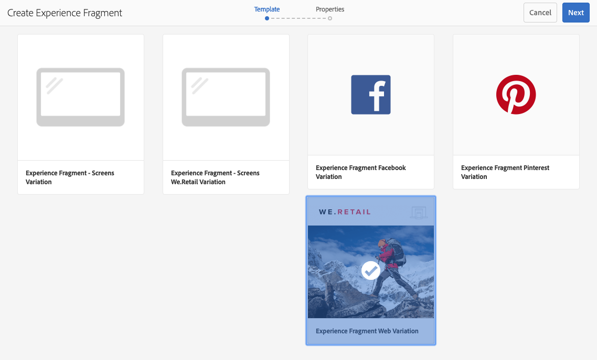
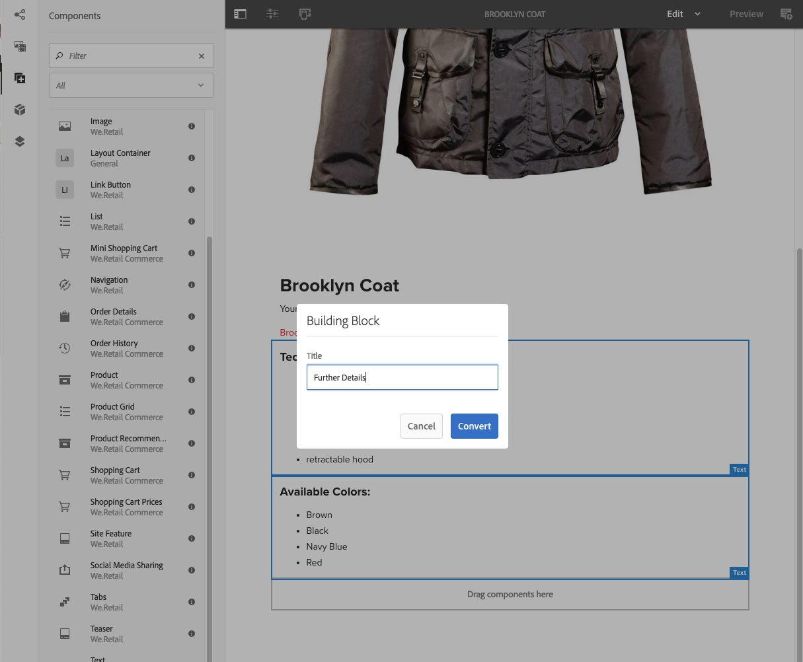

# 경험 조각{#experience-fragments}

Adobe Experience Manager(AEM)에서 경험 조각은 페이지 내에서 참조할 수 있는 컨텐츠 및 레이아웃을 포함한 하나 이상의 구성 요소 그룹입니다. 모든 구성 요소를 포함할 수 있습니다.

경험 조각:

* 경험(페이지)의 일부입니다.
* 여러 페이지(편집 가능한 템플릿을 기반으로 함)에서 사용할 수 있습니다.
* 구조 및 구성 요소를 정의하기 위한 템플릿(편집만 가능)을 기반으로 합니다.
* 이 템플릿을 사용하여 경험 조각의 *루트 페이지*&#x200B;를 제작할 수 있습니다.
* 단락 시스템에서 레이아웃이 있는 하나 이상의 구성 요소로 구성되어 있습니다.
* 다른 경험 조각을 포함할 수 있습니다.
* 다른 조각(다른 경험 조각 포함)과 결합하여 전체 페이지(경험)를 형성할 수 있습니다.
* 루트 페이지를 기반으로 하나 이상의 변형을 만들 수 있습니다.
* 이러한 변형은 콘텐츠 및/또는 구성 요소를 공유할 수 있습니다.
* 조각의 여러 변형에서 사용할 수 있는 빌딩 블록으로 분할할 수 있습니다.

경험 조각을 사용할 수 있습니다.

* 작성자가 페이지의 일부(경험 조각)를 다시 사용하려는 경우 해당 조각을 복사하여 붙여넣어야 합니다. 이러한 복사/붙여넣기 경험을 생성하고 유지 관리하는 데는 시간이 오래 걸리고 사용자 오류가 발생합니다. 경험 조각은 복사/붙여넣기가 필요하지 않습니다.
* Headless CMS 사용 사례를 지원하기 위해 작성자는 작성에만 AEM을 사용하고 고객에게 게재하는 데에는 사용하지 않습니다. 서드파티 시스템/터치포인트는 이러한 경험을 소모한 다음 최종 사용자에게 게재합니다.
* 포함 [다중 사이트 관리(MSM)](/help/sites-administering/msm.md): 경험 조각은 페이지의 일부입니다. 개별 조각과 해당 조각이 있는 폴더 모두에 적용됩니다.

>[!NOTE]
>
>경험 조각에 대한 쓰기 액세스 권한을 사용하려면 그룹에 사용자 계정을 등록해야 합니다.
>
>    `experience-fragments-editors`
>
>문제가 발생하는 경우, 시스템 관리자에게 문의하십시오.

## 언제 경험 조각을 사용해야 합니까? {#when-should-you-use-experience-fragments}

경험 조각은 다음과 같은 경우 사용해야 합니다.

* 경험을 재사용하고자 할 때

   * 경험을 동일하거나 유사한 콘텐츠에서 재사용

* 서드파티의 콘텐츠 게재 플랫폼으로 AEM을 사용할 때

   * AEM을 콘텐츠 게재 플랫폼으로 사용하려는 솔루션
   * 서드파티 터치포인트에 콘텐츠 임베드

* 다양한 변형 또는 표현물에 대한 경험이 있는 경우.

   * 채널 또는 컨텍스트별 변형
   * 그룹에 적절한 경험(예: 채널 간에 다양한 경험이 있는 캠페인)

* Omnichannel Commerce를 사용하는 경우

   * 상거래 관련 콘텐츠 공유 [소셜 미디어](/help/sites-developing/experience-fragments.md#social-variations) 규모에 맞는 채널
   * 터치포인트를 거래와 관련시키기

## 경험 조각 구성 {#organizing-your-experience-fragments}

권장 사항:
* 폴더를 사용하여 경험 조각 구성하는 것이 좋습니다,

* [이러한 폴더에 허용된 템플릿을 구성합니다](#configure-allowed-templates-folder).

폴더를 만들면 다음과 같은 작업을 수행할 수 있습니다.

* 경험 조각에 의미 있는 구조를 만들 수 있습니다(예: 분류에 따라).

  >[!NOTE]
  >
  >경험 조각의 구조를 사이트의 페이지 구조에 일치시킬 필요는 없습니다.

* [폴더 수준에서 허용된 템플릿을 할당할 수 있습니다.](#configure-allowed-templates-folder)

  >[!NOTE]
  >
  >[템플릿 편집기](/help/sites-authoring/templates.md)를 사용하여 나만의 템플릿을 생성할 수 있습니다.

WKND 프로젝트는 `Contributors`에 따라 일부 경험 조각을 구조화합니다. 사용된 구조는 다중 사이트 관리(언어 사본 포함)와 같은 다른 기능을 사용할 방법도 보여 줍니다.

다음을 참조하십시오.

`http://localhost:4502/aem/experience-fragments.html/content/experience-fragments/wknd/language-masters/en/contributors/kumar-selveraj/master`

## 경험 조각용 폴더 만들기 및 구성 {#creating-and-configuring-a-folder-for-your-experience-fragments}

경험 조각용 폴더를 만들고 구성하려면 다음 작업을 수행하는 것이 좋습니다.

1. [폴더를 만듭니다](/help/sites-authoring/managing-pages.md#creating-a-new-folder).

1. [해당 폴더에 대해 허용되는 경험 조각 템플릿을 구성합니다](#configure-allowed-templates-folder).

>[!NOTE]
>
>[인스턴스에 대해 허용되는 템플릿](#configure-allowed-templates-instance)을 구성할 수도 있지만 업그레이드 시 값을 덮어쓸 수 있으므로 이 방법은 권장되지 **않습니다**.

### 폴더에 대해 허용되는 템플릿 구성 {#configure-allowed-templates-folder}

>[!NOTE]
>
>이 방법은 업그레이드 시 값을 덮어쓰지 않으므로 **허용된 템플릿**&#x200B;을 지정하는 데 권장됩니다.

1. 필수 **경험 조각** 폴더로 이동합니다.

1. 폴더를 선택한 다음 **속성**&#x200B;을 선택합니다.

1. **허용된 템플릿** 필드에서 필요한 템플릿을 검색할 정규 표현식을 지정합니다.

   예:
   `/conf/(.*)/settings/wcm/templates/experience-fragment(.*)?`

   다음을 참조하십시오.
   `http://localhost:4502/mnt/overlay/cq/experience-fragments/content/experience-fragments/folderproperties.html/content/experience-fragments/wknd`

   

   >[!NOTE]
   >
   >자세한 내용은 [경험 조각용 템플릿](/help/sites-developing/experience-fragments.md#templates-for-experience-fragments)을 참조하십시오.

1. **저장 후 닫기**&#x200B;를 선택합니다.

### 인스턴스에 대해 허용되는 템플릿 구성 {#configure-allowed-templates-instance}

>[!CAUTION]
>
>지정된 템플릿은 업그레이드 시 덮어쓸 수 있으므로 이 방법으로 **허용된 템플릿**&#x200B;을 변경하지 않는 것이 좋습니다.
>
>이 대화 상자는 정보용으로만 사용합니다.

1. 필요한 **경험 조각** 콘솔로 이동합니다.

1. **구성 옵션**&#x200B;을 선택합니다.

   

1. **경험 조각 구성** 대화 상자에서 필요한 템플릿을 지정합니다.

   

   >[!NOTE]
   >
   >자세한 내용은 [경험 조각용 템플릿](/help/sites-developing/experience-fragments.md#templates-for-experience-fragments)을 참조하십시오.

1. **저장**&#x200B;을 선택합니다.

## 경험 조각 생성 {#creating-an-experience-fragment}

경험 조각을 생성하려면 다음 작업을 수행하십시오.

1. 전역 탐색에서 경험 조각 을 선택합니다.

   

1. 필요한 폴더로 이동한 다음 를 선택합니다. **만들기**.

   

1. **경험 조각**&#x200B;을 선택하여 **경험 조각 만들기** 마법사를 엽니다.

   필요한 **템플릿**&#x200B;을 선택하고 **다음**&#x200B;을 선택합니다.

   

1. **경험 조각**&#x200B;에 대한 **속성**&#x200B;을 입력합니다.

   **제목**&#x200B;은 필수입니다. 다음과 같은 경우 **이름** 이(가) 비어 있으면 **제목**.

   

   >[!NOTE]
   >
   >경험 조각 템플릿의 태그는 이 경험 조각 루트 페이지의 태그와 병합되지 않습니다.
   >
   >이 둘은 완전히 분리되어 있습니다.

1. **만들기**&#x200B;를 클릭합니다.

   메시지가 표시됩니다. 선택:

   * **완료**: 콘솔로 돌아갑니다.

   * **열기**: 조각 편집기를 엽니다.

## 경험 조각 편집 {#editing-your-experience-fragment}

경험 조각 편집기는 일반 페이지 편집기와 유사한 기능을 제공합니다.

>[!NOTE]
>
>페이지 편집기 사용 방법에 대한 자세한 내용은 [페이지 콘텐츠 편집](/help/sites-authoring/editing-content.md)을 참조하십시오.

다음 예제 프로시저는 제품에 대한 티저를 작성하는 방법을 보여 줍니다.

1. 드래그 앤 드롭 **티저** 다음에서 [구성 요소 브라우저](/help/sites-authoring/author-environment-tools.md#components-browser).

   

1. 선택 **[구성](/help/sites-authoring/editing-content.md#edit-configure-copy-cut-delete-paste)** 구성 요소 도구 모음에서 를 클릭합니다.
1. Add the **Asset** and define the **Properties** as required.
1. 다음을 사용하여 정의 확인 **완료** (확인 표시 아이콘)
1. 필요에 따라 구성 요소를 더 추가합니다.

## 경험 조각 변형 만들기 {#creating-an-experience-fragment-variation}

필요에 따라 경험 조각의 변형을 만들 수 있습니다.

1. [편집](/help/sites-authoring/experience-fragments.md#editing-your-experience-fragment)할 조각을 엽니다.
1. **변형** 탭을 엽니다.

   

1. **만들기**&#x200B;를 사용하면 다음을 만들 수 있습니다.

   * **변형**
   * **변형 대상: [live-copy](/help/sites-administering/msm.md#live-copies)**.

     >[!NOTE]
     >
     >초기 변형을 라이브 카피로 만들면 라이브 카피 소스를 기본 변형으로 사용하여 제목이 상속됩니다.

1. 필수 속성을 정의합니다.

   * **템플릿**
   * **제목**
   * **이름**; 비워 두면 제목에서 파생됩니다.
   * **설명**
   * **변형 태그**

   

1. 다음을 사용하여 확인 **완료** (확인 아이콘) 새 변형이 패널에 표시됩니다.

   

## 경험 조각 사용 {#using-your-experience-fragment}

이제 페이지를 작성할 때 경험 조각을 사용할 수 있습니다.

1. 편집할 페이지를 엽니다.

   >[!NOTE]
   >
   >페이지는 편집 가능한 템플릿을 기반으로 해야 합니다.

   예: [https://localhost:4502/editor.html/content/we-retail/language-masters/en/products/men.html](https://localhost:4502/editor.html/content/we-retail/language-masters/en/products/men.html)

1. 구성 요소 브라우저에서 페이지 단락 시스템으로 구성 요소를 드래그하여 경험 조각 구성 요소의 인스턴스를 만듭니다.

   

1. 다음 중 한 방법으로 실제 경험 조각을 구성 요소 인스턴스에 추가합니다.

   * 에셋 브라우저에서 필요한 조각을 구성 요소에 끌어다 놓기
   * 선택 **구성** 구성 요소 도구 모음에서 사용할 조각을 지정하고 다음을 사용하여 확인합니다. **완료** (틱)

   

   >[!NOTE]
   >
   >구성 요소 도구 모음의 편집은 조각 편집기에서 조각을 여는 단축키로 작동합니다.

## 빌딩 블록 {#building-blocks}

하나 이상의 구성 요소를 선택하여 조각 내에서 재활용할 빌딩 블록을 생성할 수 있습니다.

### 빌딩 블록 작성 {#creating-a-building-block}

빌딩 블록을 생성하려면:

1. 경험 조각 편집기에서 재사용할 구성 요소를 선택합니다.

   

1. 구성 요소 도구 모음에서 **빌딩 블록으로 변환**&#x200B;을 선택합니다.

   

1. **빌딩 블록**&#x200B;의 이름을 입력하고 **변환**&#x200B;으로 확인합니다.

   

1. 다음 **빌딩 블록** 은 탭에 표시되며 단락 시스템에서 선택할 수 있습니다.

   

#### 빌딩 블록 관리 {#managing-a-building-block}

빌딩 블록은 **빌딩 블록** 탭에서 볼 수 있습니다. 각 블록에서 다음 작업을 수행할 수 있습니다.

* 마스터로 이동: 새 탭에서 루트 페이지 변형 열기
* 이름 바꾸기
* 삭제

#### 빌딩 블록 사용 {#using-a-building-block}

빌딩 블록을 구성 요소처럼, 조각의 단락 시스템으로 끌 수 있습니다.

## 경험 조각 세부 정보 {#details-of-your-experience-fragment}

조각의 세부 사항을 볼 수 있습니다.

1. 세부 정보는 **경험 조각** 콘솔의 모든 보기에 표시되며, **목록 보기**&#x200B;에는 [Target으로 내보내기](/help/sites-administering/experience-fragments-target.md)에 대한 세부 정보가 포함됩니다.

   

1. 경험 조각의 **속성**&#x200B;을 연 경우:

   

   속성은 여러 탭에서 사용할 수 있습니다.

   >[!CAUTION]
   >
   >이러한 탭은 경험 조각 콘솔에서 **속성**&#x200B;을 열면 표시됩니다.
   >
   >
   >경험 조각을 편집할 때 **속성을 열면** 해당 [페이지 속성](/help/sites-authoring/editing-page-properties.md)이 표시됩니다.

   

   * **기본**

      * **제목** - 필수

      * **설명**
      * **태그**
      * **총 변형 수** - 정보만

      * **웹 변형 수** - 정보만
      * **웹이 아닌 변형 수** - inf **정보만**

      * **이 조각을 사용하는 페이지 수** - 정보만

   * **클라우드 서비스**

      * **클라우드 구성**
      * **클라우드 서비스 구성**
      * **Facebook 페이지 ID**
      * **Pinterest 보드**

   * **참조**

      * 참조 목록입니다.

   * **소셜 미디어 상태**

      * 소셜 미디어 변형에 대한 세부 정보.

## 일반 HTML 렌디션 {#the-plain-html-rendition}

URL에서 `.plain.` 선택기를 사용하여 브라우저에서 일반 HTML 렌디션에 액세스할 수 있습니다.

>[!NOTE]
>
>브라우저에서 직접 사용할 수 있지만 [기본 목적은 다른 애플리케이션(예: 서드파티 웹 앱, 사용자 정의 모바일 구현)이 URL만 사용하여 경험 조각의 콘텐츠에 직접 액세스할 수 있도록 하는 것입니다](/help/sites-developing/experience-fragments.md#the-plain-html-rendition).

## 경험 조각 내보내기 {#exporting-experience-fragments}

기본적으로 경험 조각은 HTML 형식으로 제공됩니다. 이는 AEM과 서드파티 채널에서 모두 동일하게 사용할 수 있습니다.

Adobe Target으로 내보내기 위해 JSON을 사용할 수도 있습니다. 다음을 참조하십시오 [경험 조각과 Target 통합](/help/sites-administering/experience-fragments-target.md) 전체 정보.
