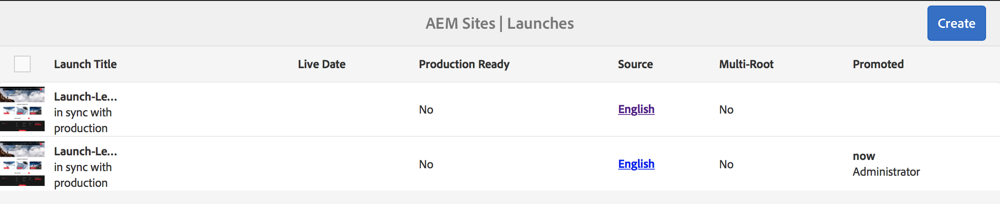

# 론치 홍보{#promoting-launches}

게시 전에 컨텐츠를 소스(프로덕션)로 다시 이동하려면 론치 페이지를 홍보해야 합니다. 론치 페이지가 홍보되면 해당 소스 페이지가 홍보된 페이지의 컨텐츠로 바뀝니다. 론치 페이지 홍보 시 다음 옵션을 사용할 수 있습니다.

* 현재 페이지만 홍보할지 아니면 전체 론치를 홍보할지 여부.
* 현재 페이지의 하위 페이지를 홍보할지 여부.
* 전체 론치를 홍보할지 아니면 변경된 페이지만 홍보할지 여부.
* 승격된 후 론치 삭제 여부.

>[!NOTE]
>
>론치 페이지를 대상(**프로덕션**)에 홍보한 후 **프로덕션** 페이지를 엔티티로 활성화할 수 있습니다(프로세스를 더 빠르게 진행하기 위해). 페이지를 작업 흐름 패키지에 추가하고, 페이지 패키지를 활성화하는 작업 흐름용 페이로드로 사용합니다. 론치를 승격하려면 먼저 작업 흐름 패키지를 만들어야 합니다. [AEM 워크플로우를 사용하여 홍보된 페이지 처리](#processing-promoted-pages-using-aem-workflow)를 참조하십시오.

>[!CAUTION]
>
>단일 론치를 동시에 홍보할 수 없습니다. 즉, 동일한 론치에 대해 동시에 두 개의 홍보 작업을 수행하면 오류 `Launch could not be promoted`(로그의 충돌 오류와 함께)가 발생할 수 있습니다.

>[!CAUTION]
>
>*수정된* 페이지에 대한 론치를 승격할 때 소스와 론치 분기 모두의 수정 사항이 모두 고려됩니다.

## 론치 페이지 홍보 {#promoting-launch-pages}

>[!NOTE]
>
>여기서는 론치 수준이 하나뿐인 경우 론치 페이지를 홍보하는 수동 동작을 설명합니다. 다음을 참조하십시오.
>
>* [중첩된 론치 홍보](#promoting-a-nested-launch)에서는 구조에 둘 이상의 론치가 있는 경우를 설명합니다.
>* [론치 - 이벤트 순서](/help/sites-authoring/launches.md#launches-the-order-of-events)에서는 자동 홍보 및 게시에 대한 세부 정보를 제공합니다.

>

**사이트** 콘솔 또는 **론치** 콘솔에서 론치를 홍보할 수 있습니다.

1. 열기:

   * **사이트** 콘솔:

      1. [참조 레일](/help/sites-authoring/author-environment-tools.md#showingpagereferences)을 열고 [선택 모드](/help/sites-authoring/basic-handling.md)를 사용하여 필요한 소스 페이지를 선택합니다. 또는 참조 레일을 선택하고 열면 순서는 중요하지 않습니다. 모든 참조가 표시됩니다.

      1. 특정 론치 목록을 표시하려면 **론치**(예: 론치(1))를 선택합니다.
      1. 사용 가능한 동작을 표시하려면 특정 론치를 선택합니다.
      1. **론치 홍보**&#x200B;를 선택하여 마법사를 엽니다.
   * **론치** 콘솔:

      1. 론치를 선택합니다(썸네일 탭/클릭).
      1. **홍보**&#x200B;를 선택합니다.

1. 첫 번째 단계에서 다음을 지정할 수 있습니다.

   * **타겟**

      * **승격 후 실행 삭제**
   * **범위**

      * **전체 론치 홍보**
      * **수정된 페이지 홍보**
      * **현재 페이지 홍보**
      * **현재 페이지 및 하위 페이지 홍보**

   예를 들어, 수정된 페이지만 홍보하도록 선택하는 경우:

   

   >[!NOTE]
   >
   >여기서는 단일 론치만 다룹니다. 론치가 중첩된 경우에는 [중첩된 론치 홍보](#promoting-a-nested-launch)를 참조하십시오.

1. **다음**&#x200B;을 선택하여 계속하십시오.
1. 홍보할 페이지를 검토할 수 있습니다. 이러한 작업은 선택한 페이지의 범위에 따라 다릅니다.

   

1. **홍보**&#x200B;를 선택합니다.

## 편집 시 론치 페이지 홍보 {#promoting-launch-pages-when-editing}

론치 페이지를 편집할 때 **론치 홍보** 동작을 **페이지 정보**&#x200B;에서도 사용할 수 있습니다. 이 작업을 수행하면 필요한 정보를 수집하기 위한 마법사가 열립니다.

>[!NOTE]
>
>이 마법사는 단일 및 [중첩 론치](#promoting-a-nested-launch)에 사용할 수 있습니다.

## 중첩 론치 홍보  {#promoting-a-nested-launch}

중첩 론치를 만든 후에는 루트 소스(프로덕션)를 포함하는 모든 소스에 다시 홍보할 수 있습니다.

1. [중첩 론치 만들기](#creatinganestedlaunchlaunchwithinalaunch)의 경우처럼, **론치** 콘솔 또는 **참조** 레일로 이동한 후 필요한 론치를 선택합니다.
1. **론치 홍보**&#x200B;를 선택하여 마법사를 엽니다.

1. 다음과 같은 필수 세부 사항을 입력합니다.

   * **타겟**

      * **홍보 타겟** 어떤 소스로도 홍보할 수 있습니다.

      * **승격 후 론치 삭제** 승격 후 선택한 론치 및 선택한 론치 내에 중첩된 론치가 모두 삭제됩니다.
   * **범위** 여기서는 전체 론치를 홍보할지, 실제로 편집된 페이지만 홍보할지를 선택할 수 있습니다. 후자인 경우, 하위 페이지를 포함/제외하도록 선택할 수 있습니다. 기본 구성은 현재 페이지의 페이지 변경 사항만 홍보하는 것입니다.

      * **전체 론치 홍보**
      * **수정된 페이지 홍보**
      * **현재 페이지 홍보**
      * **현재 페이지 및 하위 페이지 홍보**

   

1. **다음**&#x200B;을 선택합니다.
1. **홍보**&#x200B;를 선택하기 전에 홍보 세부 사항을 검토하십시오.

   

   >[!NOTE]
   >
   >나열되는 페이지는 정의한 **범위** 및 실제로 편집된 페이지에 따라 다릅니다.

1. 변경 사항이 **론치** 콘솔에서 홍보되고 반영됩니다.

   

## AEM Workflow를 사용하여 승격된 페이지 처리 {#processing-promoted-pages-using-aem-workflow}

작업 흐름 모델을 사용하여 다음과 같이 승격된 론치 페이지의 일괄 프로세스를 수행할 수 있습니다.

1. 작업 흐름 패키지를 만듭니다.
1. 작성자는 론치 페이지를 승격할 때 이 페이지를 작업 흐름 패키지에 저장합니다.
1. 패키지를 페이로드로 사용하여 작업 흐름 모델을 시작합니다.

페이지가 홍보될 때 워크플로우를 자동으로 시작하려면 패키지 노드에 대한 [워크플로우 런처를 구성](/help/sites-administering/workflows-starting.md#workflows-launchers)합니다.

예를 들어, 작성자가 론치 페이지를 승격하면 페이지 활성화 요청을 자동으로 생성할 수 있습니다. 패키지 노드가 수정될 때 작업 흐름 론쳐를 구성하여 요청 활성화 작업 흐름을 시작합니다.

