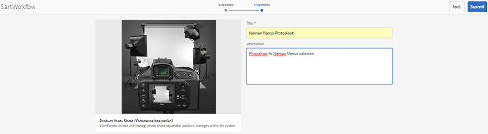
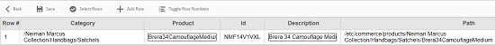
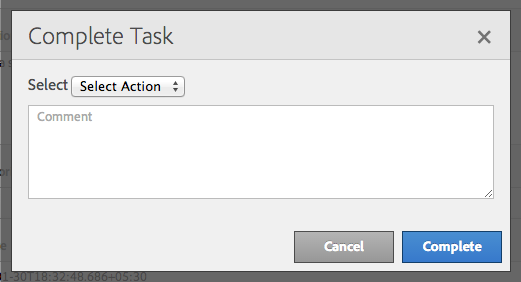

# 크리에이티브 프로젝트 및 PIM 통합{#creative-project-and-pim-integration}

마케터 또는 크리에이티브 전문가라면 Adobe Experience Manager(AEM)의 크리에이티브 프로젝트 툴을 사용하여 조직 내에서 전자 상거래 관련 제품 사진 및 관련 크리에이티브 프로세스를 관리할 수 있습니다.

특히, 크리에이티브 프로젝트를 사용하여 사진 촬영 워크플로우에서 다음과 같은 작업을 간소화할 수 있습니다.

* 사진 촬영 요청 생성
* 사진 촬영 업로드
* 공동으로 사진 촬영 진행
* 승인된 자산 패키징

>[!NOTE]
>
>특정 유형의 사용자에게 사용자 역할 및 워크플로우를 할당하는 방법에 대한 ](/help/sites-authoring/projects.md#user-roles-in-a-project)프로젝트 사용자 역할[을 참조하십시오.

## 제품 사진 촬영 워크플로우 탐색  {#exploring-product-photo-shoot-workflows}

크리에이티브 프로젝트는 다양한 프로젝트 요구 사항을 충족하는 다양한 프로젝트 템플릿을 제공합니다. **제품 사진 촬영 프로젝트** 템플릿은 곧바로 사용할 수 있습니다. 이 템플릿에는 제품 사진 촬영 요청을 시작 및 관리할 수 있는 사진 촬영 워크플로우가 포함되어 있습니다. 또한 적절한 검토 및 승인 프로세스를 통해 제품의 디지털 이미지를 획득할 수 있는 일련의 작업도 포함되어 있습니다.

템플릿에는 다음과 같은 워크플로우가 포함되어 있습니다.

* **제품 사진 촬영(커머스 통합) 워크플로우**: 이 워크플로우에서는 PIM(제품 정보 관리) 시스템과의 상거래 통합을 사용하여 선택한 제품에 대한 촬영 목록(계층 구조)을 자동으로 생성합니다. 워크플로우가 완료된 후 자산 메타데이터의 일부로 제품 데이터를 볼 수 있습니다.
* **제품 사진 촬영 워크플로우**: 이 워크플로우에서는 커머스 통합에 의존하지 않고, 촬영 목록을 제공할 수 있습니다. 업로드된 이미지가 프로젝트 자산 폴더의 CSV 파일에 매핑됩니다.

>[!NOTE]
>
>제품 사진 촬영 워크플로우의 촬영 목록 업로드 작업에 업로드된 CSV 파일은 이름이 shotlist.csv로 지정됩니다.

## 제품 사진 촬영 프로젝트 만들기 {#create-a-product-photo-shoot-project}

1. In the **Projects** console, tap/click **Create** and then choose **Create Project** from the list.

   

1. **프로젝트 만들기** 페이지에서 사진 촬영 프로젝트 템플릿을 선택하고 **다음**&#x200B;을 탭/클릭합니다.

   

1. 제목, 설명, 기한을 비롯한 프로젝트 세부 사항을 입력합니다. 사용자를 추가하고 다양한 역할을 지정합니다. 프로젝트의 썸네일을 추가할 수도 있습니다.

   

1. **만들기**&#x200B;를 탭/클릭합니다. 프로젝트가 작성되었음을 알리는 확인 메시지가 표시됩니다.
1. Tap/click **Done** to return to the **Projects** console. Alternatively, tap/click **Open** to view the assets within the photoshoot project.

## 제품 사진 촬영 프로젝트에서 작업 시작 {#starting-work-in-a-product-photo-shoot-project}

사진 촬영 요청을 시작하려면 프로젝트를 탭하거나 클릭한 후 프로젝트 세부 사항 페이지에서 **작업 추가**&#x200B;를 탭/클릭하여 워크플로우를 시작합니다.


제품 사진 촬영 프로젝트에는 다음과 같은 곧바로 사용이 가능한 워크플로우가 포함되어 있습니다.

* 제품 사진 촬영(커머스 통합) 워크플로우
* 제품 사진 촬영 워크플로우

제품 사진 촬영(커머스 통합) 워크플로우를 사용하여이미지 자산을 AEM의 제품에 매핑합니다. 이러한 워크플로우는 커머스 통합을 활용하여 승인된 이미지를 */etc/commerce* 위치의 기존 제품 데이터에 연결합니다.

제품 사진 촬영(커머스 통합) 워크플로우에는 다음 작업이 포함됩니다.

* 촬영 목록 만들기
* 사진 촬영 업로드
* 사진 촬영 수정
* 리뷰 및 승인
* 프로덕션으로 이동 작업

제품 정보를 AEM에서 사용할 수 없는 경우, 제품 사진 촬영 워크플로우를사용하여 CSV 파일에 업로드한 세부 정보를 기준으로 이미지 자산을 제품에 매핑합니다. CSV 파일에는 제품 ID, 카테고리 및 설명과 같은 기본 제품 정보가 포함되어야 합니다. 워크플로우는 제품의 승인된 자산을 가져옵니다.

이 워크플로우에는 다음 작업이 포함됩니다.

* 촬영 목록 업로드
* 사진 촬영 업로드
* 사진 촬영 수정
* 리뷰 및 승인
* 프로덕션으로 이동 작업

워크플로우 구성 옵션을 사용하여 이 워크플로우를 사용자 지정할 수 있습니다.

두 워크플로우 모두, 제품을 승인된 자산에 연결하는 단계를 포함합니다. 각 워크플로우에는 다음 단계가 포함됩니다.

* 워크플로우 구성: 워크플로우를 사용자 지정하기 위한 옵션을 설명합니다.
* 프로젝트 워크플로우 시작: 제품 사진 촬영을 시작하는 방법을 설명합니다.
* 워크플로우 작업 세부 사항: 워크플로우에서 사용 가능한 작업의 세부 사항을 제공합니다.

## 프로젝트 진행 상태 추적 {#tracking-project-progress}

프로젝트 내의 활성/완료된 작업을 모니터링하여 프로젝트의 진행 상태를 추적할 수 있습니다.

프로젝트의 진행 상태를 모니터링하려면 다음을 사용하십시오.

* **작업 카드**

* **작업 목록**

작업 카드에는 프로젝트의 전반적인 진행 상태가 표시됩니다. 프로젝트에 관련 작업이 있는 경우에만 프로젝트 세부 사항 페이지에 표시됩니다. 작업 카드는 완료된 작업 수를 기준으로 프로젝트의 현재 완료 상태를 표시합니다. 향후 작업은 포함되지 않습니다.

작업 카드는 다음 세부 사항을 제공합니다.

* 활성 작업의 비율
* 완료된 작업의 비율


작업 목록은 프로젝트의 현재 활성 워크플로우 작업에 대한 자세한 정보를 제공합니다. 목록을 표시하려면 작업 카드를 탭/클릭합니다. 작업 목록에는 시작 날짜, 기한, 할당자, 우선 순위 및 작업 상태와 같은 메타데이터도 표시됩니다.


## 워크플로우 구성 {#workflow-configuration}

이 작업에는 역할에 따라 사용자에게 워크플로우 단계를 지정하는 작업이 포함됩니다.

**제품 사진 촬영** 워크플로우를 구성하려면:

1. Navigate to **Tools** > **Workflows**, and then tap the **Models** tile to open the **Workflow Models** page.
1. Select the **Product Photo Shoot** workflow, and the tap the **Edit** icon from the toolbar to open it in edit mode.

   

1. In the **Product Photo Shoot Workflow** page, open a project task. 예를 들어 **촬영 목록 업로드** 작업을 엽니다.

   

1. **작업** 탭을 클릭하여 다음을 구성합니다.

   * 작업의 이름
   * 작업을 받는 기본 사용자(역할)
   * 사용자의 작업 목록에 표시되는 작업의 기본 우선 순위
   * 할당자가 작업을 열 때 표시할 작업 설명
   * 작업의 기한(작업이 시작된 시간을 기준으로 계산됨)

1. **확인**&#x200B;을 클릭하여 구성 설정을 저장합니다.

   마찬가지로 **제품 사진 촬영** 워크플로우에 대해 다음과 같은 작업을 구성할 수 있습니다.

   * 사진 촬영 업로드
   * 제품 사진 촬영 수정
   * 사진 촬영 검토
   * 프로덕션으로 이동

   Perform a similar procedure to configure the tasks in the **Product Photo Shoot (Commerce Integration) workflow**.

이 섹션에서는 제품 정보 관리를 크리에이티브 프로젝트에 통합하는 방법을 설명합니다.

## 프로젝트 워크플로우 시작 {#starting-a-project-workflow}

1. Navigate to a Product Photo Shoot project, and tap/click the **Add Work** icon on the **Workflows** card.
1. **제품 사진 촬영(커머스 통합)** 워크플로우 카드를 선택하여 제품 사진 촬영(커머스 통합) 워크플로우를 시작합니다. If the product information isn&#39;t available under /etc/commerce, select the **Product Photo Shoot** workflow and start the Product Photo Shoot workflow.

   

1. **다음**&#x200B;을 탭/클릭하여 프로젝트의 워크플로우를 시작합니다.
1. 다음 페이지에서 워크플로우 세부 사항을 입력합니다.

   

   **제출**&#x200B;을 클릭하여 사진 촬영 워크플로우를 시작합니다. 사진 촬영 프로젝트의 프로젝트 세부 사항 페이지가 표시됩니다.

   

### 워크플로우 작업 세부 사항 {#workflow-tasks-details}

사진 촬영 워크플로우에는 다음과 같은 여러 작업이 포함됩니다. 각 작업은 작업에 대해 정의된 구성을 기준으로 사용자 그룹에 지정됩니다.

#### 촬영 목록 만들기 작업 {#create-shot-list-task}

**촬영 목록 만들기** 작업을 사용하면 프로젝트 소유자가 이미지가 필요한 제품을 선택할 수 있습니다. 사용자가 선택한 옵션에 따라, 기본 제품 정보를 포함하는 CSV 파일이 생성됩니다.

1. In the project folder, tap/click the ellipses in the [Tasks Card](#tracking-project-progress) to view the task item in the workflow.

   

1. Select the **Create Shot List** task, and then tap/click the **Open** icon from the toolbar.

   

1. 작업 세부 사항을 검토한 후 **촬영 목록 만들기** 단추를 탭/클릭합니다.

   

1. 제품 데이터에 연결된 이미지가 없는 제품을 선택합니다.

   

1. Tap/click the **Add To Shotlist** icon to create a CSV file that contains a list of all such products. 선택한 제품에 대해 촬영 목록이 생성되었음을 확인하는 메시지가 표시됩니다. **닫기**&#x200B;를 클릭하여 워크플로우를 완료합니다.
1. 촬영 목록을 만들면 **촬영 목록 보기** 링크가 표시됩니다. To add more products to the shot list, tap/click **Add to Shot List**. 이 경우 데이터가 처음에 생성된 촬영 목록에 추가됩니다.

   

1. **촬영 목록 보기**&#x200B;를 탭/클릭하여 새 촬영 목록을 확인합니다.

   

   기존 데이터를 편집하거나 새 데이터를 추가하려면 도구 모음에서 **편집**&#x200B;을 탭/클릭합니다. Only the **Product **and **Description** fields are editable.

   

   After you update the file, tap/click **Save** on toolbar to save the file.

1. After adding the products, tap/click the **Complete** icon on the **Create Shot List **task details page to mark the task as completed. 선택적 주석을 추가할 수 있습니다.

   작업이 완료되면 프로젝트 내에서 다음 변경 사항이 적용됩니다.

   * 제품 계층 구조에 해당하는 자산이 워크플로우 제목과 동일한 이름을 갖는 폴더에 작성됩니다.
   * 자산의 메타데이터는 사진사가 이미지를 제공하기 전에도 자산 콘솔을 사용하여 편집 가능합니다.
   * 사진사가 제공하는 이미지를 저장하는 사진 촬영 폴더가 생성됩니다. 사진 촬영 폴더에는 촬영 목록의 각 제품 항목에 대한 하위 폴더가 포함되어 있습니다.

   커머스 통합이 없는 제품 사진 촬영 워크플로우의 경우, 촬영 목록 업로드가 첫 번째 작업입니다. **촬영 목록 업로드**&#x200B;를 탭/클릭하여 **shotlist.csv** 파일을 업로드합니다. CSV 파일에는 제품 ID가 있어야 합니다. 다른 필드는 선택적입니다. 이를 사용하여 자산을 제품에 매핑할 수 있습니다.

### 촬영 목록 업로드 작업 {#upload-shot-list-task}

이 작업은 제품 사진 촬영 워크플로우의 일부입니다. AEM에서 제품 정보를 사용할 수 없는 경우 이 작업을 수행합니다. 이 경우, 이미지 자산이 필요한 CSV 파일에 제품 목록을 업로드합니다. CSV 파일의 세부 사항을 기준으로 이미지 자산을 제품에 매핑합니다.

이전 절차의 프로젝트 카드 아래에 있는 **촬영 목록 보기** 링크를 사용하여 샘플 CSV 파일을 다운로드합니다. 샘플 파일을 검토하여 CSV 파일의 일반 컨텐츠를 확인합니다.

제품 목록 또는 CSV 파일에는 **카테고리, 제품, ID, 설명** 및 **경로**&#x200B;와 같은 필드가 포함될 수 있습니다. **ID** 필드는 필수이며 제품 ID가 포함되어 있습니다. 다른 필드는 선택적입니다.

제품은 특정 카테고리에 속할 수 있습니다. 제품 카테고리는 **카테고리** 열 아래의 CSV에 나열될 수 있습니다. **제품** 필드에 제품의 이름이 포함되어 있습니다. **설명** 필드에 제품 설명 또는 사진가를 위한 지침을 입력합니다.

>[!NOTE]
>
>The name of images to be uploaded should start with &quot;**&lt;ProductId>_&quot;** where Product ID is referenced from the **Id** field in the *shotlist.csv* file. For example, for a product in the shot list with **Id 397122**, you can upload files with names **397122_highcontrast.jpg**, **397122_lowlight.png**, and so on.

1. In the project folder, tap/click the ellipses in the [Tasks Card](#tracking-project-progress) to view the list of tasks in the workflow.
1. Select the **Upload Shot List** task, and then tap/click the **Open** icon from the toolbar.

   

1. Review the task details and then tap/click the **Upload Shot List** button.

   

1. Tap/click the **Upload Shot List** button to upload the CSV file with filename shotlist.csv. 이 워크플로우는 이 파일을 다음 작업의 제품 데이터를 추출하는 데 사용할 소스로 인식합니다.
1. 제품 정보가 포함된 CSV 파일을 적절한 형식으로 업로드합니다. The **View Uploaded Assets** link appears under the card after the CSV file is uploaded.

   

   Click the **Complete** icon to complete the task.

1. Tap/click the **Complete** icon to complete the task.

### 사진 촬영 업로드 작업 {#upload-photo-shoot-task}

If you are an Editor, you can upload shots for the products listed in the **shotlist.csv** file that is created or uploaded in the previous task.

The name of images to be uploaded should begin with **&quot;&lt;productId>_&quot;** where Product ID is referenced from the **Id** field in the **shotlist.csv** file. 예를 들어, 촬영 목록에서 **ID가 397122**&#x200B;인 제품의 경우 이름이 **397122_highcontrast.jpg**,**397122_lowlight.png** 등인 파일을 업로드할 수 있습니다.

이미지를 직접 업로드하거나 이미지가 포함된 ZIP 파일을 업로드할 수 있습니다. 해당 이름에 따라, 이미지는 **사진 촬영** 폴더 내의 각 제품 폴더에 배치됩니다.

1. Under the project folder, tap/click the ellipses in the [Task Card](#tracking-project-progress) to view the task item in the workflow.
1. Select the **Upload Photo Shoot** task, and then tap/click the **Open** icon from the toolbar.

   

1. Tap/click **Upload Photo Shoot** and upload the photo shoot images.
1. 도구 모음에서 **완료** 아이콘을 탭/클릭하여 작업을 완료합니다.

### 사진 촬영 수정 작업 {#retouch-photo-shoot-task}

편집 권한이 있는 경우 사진 촬영 수정 작업을 수행하여 사진 촬영 폴더에 업로드된 이미지를 편집합니다.

1. Under the project folder, tap/click the ellipses in the [Task Card](#tracking-project-progress) to view the task item in the workflow.
1. Select the **Retouch Photo Shoot** task, and then tap/click the **Open** icon from the toolbar.

   

1. Tap/click the **View Uploaded Assets** link in the **Retouch Photo Shoot** page to browse the uploaded images.

   

   필요한 경우 Adobe Creative Cloud 애플리케이션을 사용하여 이미지를 편집합니다.

   

1. 도구 모음에서 **완료** 아이콘을 탭/클릭하여 작업을 완료합니다.

### 리뷰 및 승인 작업 {#review-and-approve-task}

이 작업에서는 사진사가 업로드한 사진 촬영 이미지를 검토하고, 이미지를 사용 승인 상태로 표시합니다.

1. Under the project folder, tap/click the ellipses in the [Task Card](#tracking-project-progress) to view the task item in the workflow.
1. Select the **Review &amp; Approve** task, and then tap/click the **Open** icon from the toolbar.

   

1. In the **Review &amp; Approve** page, assign the review task to role, for example Reviewers, and then tap/click **Review **to start reviewing the uploaded product images.

   

1. 제품 이미지를 선택하고 도구 모음에서 승인 아이콘을 탭/클릭하여 승인 상태로 표시합니다.

   

   이미지를 승인하면 승인된 배너가 위에 표시됩니다.

   >[!NOTE]
   일부 제품은 이미지 없이 둘 수 있습니다. 나중에 작업을 다시 방문하여 완료한 후 완료 상태로 표시할 수 있습니다.

1. **완료**&#x200B;를 탭/클릭합니다. 승인된 이미지는 작성된 빈 자산에 연결됩니다.

자산 UI를 사용하여 프로젝트 자산으로 이동한 후, 승인된 이미지를 확인할 수 있습니다.

다음 수준을 탭/클릭하여 제품 데이터 계층 구조에 따라 제품을 표시합니다.

크리에이티브 프로젝트는 승인된 자산을 참조된 제품과 연관시킵니다. 자산 메타데이터는 AEM 자산 메타데이터 섹션에 표시되는 자산 속성 아래의 **제품 데이터** 탭에 있는 제품 참조 및 기본 정보로 업데이트됩니다.

>[!NOTE]
제품 사진 촬영 워크플로우(커머스 통합 없음)에서 승인된 이미지는 제품과 연관이 없습니다.

### 프로덕션으로 이동 작업 {#move-to-production-task}

이 작업은 승인된 자산을 프로덕션 준비 폴더로 이동하여 사용 가능하게 만듭니다.

1. Under the project folder, tap/click the ellipses in the [Task Card](#tracking-project-progress) to view the task item in the workflow.
1. Select the **Move to Production** task, and then tap/click the **Open** icon from the toolbar.

   

1. 촬영 사진을 프로덕션 준비 폴더로 이동하기 전에 승인된 자산을 보려면, **프로덕션으로 이동** 작업 페이지에서 프로젝트 썸네일 아래에 있는 **승인된 자산 보기** 링크를 클릭합니다.

   

1. Enter the path of the production-ready folder in the **Move To** field.

   

   Tap/click **Move to Production**. 확인 메시지를 닫습니다. 자산은 지정된 경로로 이동되고, 폴더 계층 구조를 기준으로 각 제품의 승인된 자산에 대한 스핀 세트가 자동으로 생성됩니다.

1. 도구 모음에서 **완료** 아이콘을 탭/클릭합니다. 마지막 단계가 완료로 표시되면 워크플로우가 완료됩니다.

## DAM 자산 메타데이터 보기 {#viewing-dam-asset-metadata}

승인 후, 자산은 해당 제품에 연결됩니다. 이제 승인된 자산의 [속성 페이지](/help/assets/manage-assets.md#editing-properties)에는 추가 **제품 데이터**(연결된 제품 정보) 탭이 있습니다. 이 탭에는 제품 세부 사항, SKU 번호 및 자산을 연결하는 기타 제품 관련 세부 사항이 표시됩니다. **편집** 아이콘을 탭/클릭하여 자산 속성을 업데이트합니다. 제품 관련 정보는 읽기 전용으로 유지됩니다.

나타나는 링크를 탭/클릭하여 자산이 연관된 제품 콘솔의 각 제품 세부 사항 페이지로 이동합니다.

## 프로젝트 사진 촬영 워크플로우 사용자 지정 {#customizing-the-project-photo-shoot-workflows}

요구사항에 따라 프로젝트 사진 촬영 워크플로우를 사용자 지정할 수 있습니다. 이 작업은 프로젝트 내의 변수 값을 설정하기 위해 수행하는 선택적인 역할 기반 작업입니다. 나중에 구성된 값을 사용하여 결정을 내릴 수 있습니다.

1. Click/tap the AEM logo, and then navigate to **Tools** > **Workflow** > **Models** to open the Workflow Models page.
1. **제품 사진 촬영(커머스 통합)** 워크플로우 또는 **제품 사진 촬영** 워크플로우를 선택하고 도구 모음에서 **편집**&#x200B;을 클릭/탭하여 편집 모드에서 워크플로우를 엽니다.
1. 사이드 킥에서 **프로젝트** 작업을 열고 **역할 기반 프로젝트 작업 만들기** 단계를 워크플로우로 끌어옵니다.

   

1. Open the **Role Based Task** step.
1. **작업** 탭에서 **작업** 목록에 표시할 작업의이름을 제공합니다. 역할에 작업을 지정하고, 기본 우선 순위를 설정하고, 설명을 제공하고, 작업의 기한 시간을 지정할 수도 있습니다.

   

1. **라우팅** 탭에서 작업에 대한 동작을 지정합니다. 여러 작업을 추가하려면 **항목 추가 **링크를 탭/클릭합니다.

   

1. After adding the options click **OK** to add the changes to the step.

   >[!NOTE]
   Tapping/clicking **OK** does not save the changes in the workflow. To save changes in the workflow, tap/click **Save**.

1. Open the **Workflow** tasks from side kick, and add a **Goto** task.
1. **이동** 작업을 열고 **프로세스** 탭을 탭/클릭합니다.
1. **스크립트** 상자에 다음 코드를 지정합니다.

```
   function check() {

   if (workflowData.getMetaDataMap().get("lastTaskAction","") == "Reject All") {

   return true

   }

   // set copywriter user in metadata

   var previousId = workflowData.getMetaDataMap().get("lastTaskCompletedBy", "");

   workflowData.getMetaDataMap().put("copywriter", previousId);

   return false;

   }
```

>[!NOTE]
For details around scripting in workflow steps, see [Defining a Rule for an OR Split](/help/sites-developing/workflows-models.md).


1. Tap/click **OK**.

1. Tap/click **Save** to save the workflow.

   

1. A new Project owner acceptance task now comes up after the [Move to Production task](#move-to-production-task) is completed and is assigned to the owner.

   소유자 역할의 사용자는 작업을 완료하고 주석 팝업의 목록에서 동작(워크플로우 단계 구성에 추가된 동작 목록에 포함됨)을 선택할 수 있습니다.

   

   적절한 옵션을 선택하고 **완료**&#x200B;를 클릭하여 워크플로우에서 **이동 단계**&#x200B;를 실행합니다.

>[!NOTE]
When you start a server, the Project task list servlet caches the mappings between task types and URLs defined under `/libs/cq/core/content/projects/tasktypes`. You can then perform the usual overlay and add custom task types by placing them under `/apps/cq/core/content/projects/tasktypes`.

