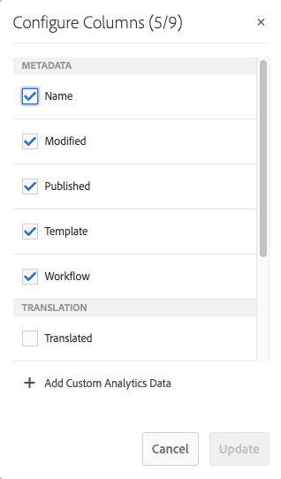

# 페이지 분석 데이터 보기{#seeing-page-analytics-data}

페이지 컨텐츠의 효율성을 측정하려면 페이지 분석 데이터를 사용하십시오.

## 콘솔에서 볼 수 있는 Analytics {#analytics-visible-from-the-console}

페이지 분석 데이터는에 표시됩니다. [목록 보기](/help/sites-authoring/basic-handling.md#list-view) 사이트 콘솔 페이지가 목록 형식으로 표시되면 기본적으로 다음 열을 사용할 수 있습니다.

* 페이지 조회수
* 고유 방문자
* 페이지 시간

각 열에는 현재 보고 기간에 대한 값이 표시되며, 이전 보고 기간 이후 값이 증가했는지 또는 감소했는지를 나타냅니다. 표시되는 데이터는 12시간마다 업데이트됩니다.

>[!NOTE]
>
>업데이트 기간을 변경하려면 [가져오기 간격 구성](/help/sites-administering/adobeanalytics-connect.md#configuring-the-import-interval).

1. 를 엽니다. **Sites** console; 예 [https://localhost:4502/sites.html/content](https://localhost:4502/sites.html/content)
1. 도구 모음의 맨 오른쪽에 있는(오른쪽 위 모서리) 아이콘을 클릭하거나 탭하여 선택합니다 **목록 보기** (표시되는 아이콘은 [현재 보기](/help/sites-authoring/basic-handling.md#viewing-and-selecting-resources)).

1. 다시 도구 모음의 맨 오른쪽에 있는(오른쪽 위 모서리) 아이콘을 클릭하거나 탭한 다음 선택합니다 **설정 보기**. 다음 **열 구성** 대화 상자가 열립니다. 필요한 변경 작업을 수행하고 을(를) 확인합니다. **업데이트**.

   

### 보고 기간 선택 {#selecting-the-reporting-period}

사이트 콘솔에 Analytics 데이터가 표시되는 보고 기간을 선택합니다.

* 최근 30일 데이터
* 최근 90일 데이터
* 올해의 데이터

현재 보고 기간은 사이트 콘솔의 도구 모음에 표시됩니다(맨 위 도구 모음의 오른쪽). 드롭다운을 사용하여 필요한 보고 기간을 선택합니다.

### 사용 가능한 데이터 열 구성 {#configuring-available-data-columns}

analytics-administrators 사용자 그룹의 구성원은 작성자가 추가 Analytics 열을 볼 수 있도록 사이트 콘솔을 구성할 수 있습니다.

>[!NOTE]
>
>페이지 트리에 다른 Adobe Analytics 클라우드 구성과 연결된 1차 하위 구성요소가 포함되어 있으면 페이지에 대해 사용 가능한 데이터 열을 구성할 수 없습니다.

1. 목록 보기에서 보기 선택기(도구 모음의 오른쪽)를 사용하여 **설정 보기** 그리고 **사용자 지정 분석 데이터 추가**.

   

1. 사이트 콘솔에서 작성자에게 노출할 지표를 선택한 다음 를 클릭합니다 **추가**.

   표시되는 열은 Adobe Analytics에서 검색됩니다.

   

### 사이트에서 컨텐츠 인사이트 열기 {#opening-content-insights-from-sites}

열기 [컨텐츠 인사이트](/help/sites-authoring/content-insights.md) 페이지 효과를 자세히 조사하려면 사이트 콘솔에서 를 클릭하십시오.

1. 사이트 콘솔에서 컨텐츠 인사이트를 볼 페이지를 선택합니다.
1. 도구 모음에서 Analytics 및 Recommendations 아이콘을 클릭합니다.

   

## 페이지 편집기에서 볼 수 있는 Analytics(Activity Map) {#analytics-visible-from-the-page-editor-activity-map}

>[!CAUTION]
>
>Adobe Analytics API의 보안 변경 사항으로 인해, AEM 내에 포함된 Activity Map 버전을 더는 사용할 수 없습니다.
>
>다음 [Adobe Analytics에서 제공하는 ActivityMap 플러그인](https://experienceleague.adobe.com/docs/analytics/analyze/activity-map/getting-started/get-started-users/activitymap-install.html) 이제 를 사용해야 합니다.
