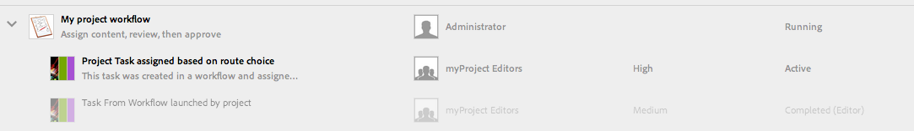

# 프로젝트 워크플로우 작업{#working-with-project-workflows}

즉시 사용 가능한 프로젝트 워크플로우는 다음과 같습니다.

* **프로젝트 승인 워크플로우**  - 이 워크플로우에서는 사용자에게 컨텐츠를 지정하고, 검토한 후 승인할 수 있습니다.
* **론치**  요청 - 론치를 요청하는 워크플로우입니다.
* **랜딩 페이지 요청**  - 이 워크플로우에서는 랜딩 페이지를 요청합니다.
* **요청 이메일** - 이메일을 요청하는 워크플로입니다.
* **제품 사진 촬영과 제품 사진 촬영(커머스)** - 제품 관련 자산을 매핑합니다.
* **DAM 언어 사본 작성 및 번역과 DAM 언어 사본 작성** - 자산 및 폴더에 대한 번역된 바이너리, 메타데이터 및 태그를 생성합니다.

선택하는 프로젝트 템플릿에 따라 사용 가능한 워크플로우가 달라집니다.

|  | **간단한 프로젝트** | **미디어 프로젝트** | **제품 사진 촬영 프로젝트** | **번역 프로젝트** |
|---|:-:|:-:|:-:|:-:|
| 사본 요청 |  | x |  |  |
| 제품 사진 촬영 |  | x | x |  |
| 제품 사진 촬영(커머스) |  |  | x |  |
| 프로젝트 승인 | x |  |  |  |
| 실행 요청 | x |  |  |  |
| 랜딩 페이지 요청 | x |  |  |  |
| 이메일 요청 | x |  |  |  |
| DAM 언어 복사(&amp;M);ast; |  |  |  | x |
| DAM 언어 복사 및 번역;ast; |  |  |  | x |

>[!NOTE]
>
>&amp;ast;이러한 워크플로우는 프로젝트의 **워크플로우** 타일에서 시작하지 않습니다. [자산을 위한 언어 사본 만들기](/help/sites-administering/tc-manage.md)를 참조하십시오.

워크플로우 시작 및 완료 단계는 선택하는 워크플로우와 상관없이 동일합니다. 단계만 변경됩니다.

[프로젝트]에서 바로 워크플로우를 시작합니다([DAM 언어 사본 작성]이나 [DAM 언어 사본 작성 및 번역] 제외). 프로젝트에서 아직 처리되지 않은 작업에 대한 정보는 **작업** 타일에 나열됩니다. 완료해야 하는 작업에 대한 알림은 사용자 아이콘 옆에 표시됩니다.

AEM에서의 워크플로우 작업에 대한 자세한 정보는 다음을 참조하십시오.

* [워크플로우에 참여](/help/sites-authoring/workflows-participating.md)
* [페이지에 워크플로우 적용](/help/sites-authoring/workflows-applying.md)
* [워크플로우 구성](/help/sites-administering/workflows.md)

이 섹션에서는 [프로젝트]에 사용 가능한 워크플로우에 대해 설명합니다.

## 사본 요청 워크플로우 {#request-copy-workflow}

이 워크플로우에서는 사용자의 원고를 요청한 다음, 이를 승인할 수 있습니다. 사본 요청 워크플로우를 시작하려면 다음을 수행하십시오.

1. 미디어 프로젝트에서 **워크플로우** 타일의 **+** 기호를 선택하고 **사본 요청 워크플로우**&#x200B;를 선택합니다.
1. 원고 제목과 요청하는 내용에 대한 간단한 요약을 입력합니다. 해당하는 경우 타겟 단어 수, 작업 우선순위 및 기한을 입력하십시오.

   

1. **만들기**&#x200B;를 클릭합니다. 워크플로우가 시작됩니다. 작업이 **작업** 타겟에 나타납니다.

   

## 제품 사진 촬영 워크플로우 {#product-photo-shoot-workflow}

제품 사진 촬영 워크플로우(상거래가 있는 경우와 없는 경우 모두)는 [크리에이티브 프로젝트](/help/sites-authoring/managing-product-information.md)에서 자세히 다룹니다.

## 프로젝트 승인 워크플로우  {#project-approval-workflow}

프로젝트 승인 워크플로우에서는 사용자에게 컨텐츠를 지정하고 검토한 다음 컨텐츠를 승인합니다.

1. 단순 프로젝트에서 **워크플로우** 타일의 **`+`** 기호를 선택하고 **프로젝트 승인 워크플로우**&#x200B;를 선택합니다.
1. 제목을 입력하고 팀 목록에서 지정할 사용자를 선택합니다. 해당하는 경우 설명, 컨텐츠 경로, 작업 우선순위 및 기한을 입력하십시오.

   

1. **만들기**&#x200B;를 클릭합니다. 워크플로우가 시작됩니다. 작업이 **작업** 타겟에 나타납니다.

   

## 론치 요청 워크플로우 {#request-launch-workflow}

이 워크플로우에서는 론치를 요청할 수 있습니다.

1. 간단한 프로젝트에서 **워크플로우** 타일의 **+** 기호를 선택하고 **론치 요청 워크플로우**&#x200B;를 선택합니다.
1. 론치의 제목을 입력하고 론치 소스 경로를 제공합니다. 해당하는 경우 설명과 활성 날짜를 추가할 수도 있습니다. 론치가 동작하는 방식에 따라 [소스 페이지의 라이브 데이터 가져오기]나 [하위 페이지 제외]를 선택하십시오.

   

1. **만들기**&#x200B;를 클릭합니다. 워크플로우가 시작됩니다. 워크플로우가 **워크플로우** 목록에 나타납니다(줄임표 **클릭)...이 목록에 액세스하려면**&#x200B;워크플로우&#x200B;**타일의**).

## 랜딩 페이지 요청 워크플로우 {#request-landing-page-workflow}

이 워크플로우에서는 랜딩 페이지를 요청할 수 있습니다.

1. 간단한 프로젝트에서 **워크플로우** 타일의 **+** 기호를 선택하고 [랜딩 페이지 요청 워크플로우]를 선택합니다.
1. 랜딩 페이지의 제목과 상위 경로를 입력합니다. 해당하는 경우 활성 날짜를 입력하거나 랜딩 페이지에 사용할 파일을 선택하십시오.

   

1. **만들기**&#x200B;를 클릭합니다. 워크플로우가 시작됩니다. 작업이 **작업** 타겟에 나타납니다.

## 이메일 요청 워크플로우  {#request-email-workflow}

이 워크플로우에서는 이메일을 요청할 수 있습니다. **이메일** 타일에 나타나는 것과 동일한 워크플로우입니다.

1. 미디어 또는 간단한 프로젝트에서 **워크플로우** 타일의 **+** 기호를 선택하고 **이메일 요청 워크플로우**&#x200B;를 선택합니다.
1. 캠페인 경로 및 템플릿 경로와 함께 이메일 제목을 입력합니다. 추가로 이름, 설명 및 활성 날짜를 제공할 수 있습니다.

   

1. **만들기**&#x200B;를 클릭합니다. 워크플로우가 시작됩니다. 작업이 **작업** 타겟에 나타납니다.

   

## 자산에 대한 언어 복사 워크플로우 생성(및 번역){#create-and-translate-language-copy-workflow-for-assets}

**언어 사본 작성** 및 **언어 사본 작성 및 번역** 워크플로우는 [자산에 대한 언어 사본 만들기](/help/assets/translation-projects.md)에서 자세히 다룹니다.
