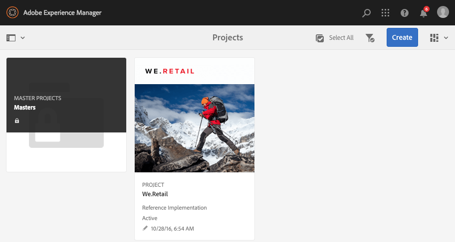
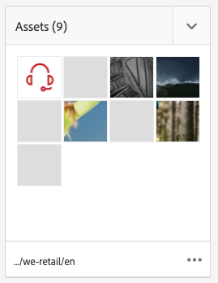
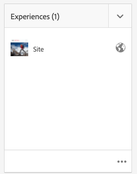
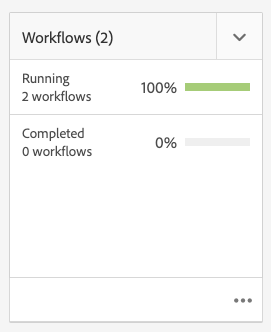

# 프로젝트 {#projects}

프로젝트를 사용하면 리소스를 하나의 엔티티로 그룹화할 수 있습니다. 공통되는 공유 환경을 사용하면 프로젝트 관리가 쉬워집니다. 프로젝트와 연결할 수 있는 리소스 유형은 AEM에서 타일이라고 합니다. 타일에는 프로젝트 및 팀 정보, 자산, 워크플로 및 [프로젝트 타일](#project-tiles)에 설명된 세부 정보와 같은 기타 유형의 정보가 포함될 수 있습니다.

사용자는 다음과 같은 작업을 수행할 수 있습니다.

* 프로젝트 만들기 및 삭제
* 콘텐츠 및 자산 폴더를 프로젝트에 연결
* 프로젝트에서 콘텐츠 링크 제거

## 액세스 요구 사항 {#access-requirements}

표준 AEM 기능을 프로젝트하므로 추가 설정이 필요하지 않습니다.

그러나 프로젝트의 사용자가 프로젝트를 만들 때, 작업/워크플로우를 만들 때 또는 팀을 보고 관리할 때와 같이 프로젝트를 사용하는 동안 다른 사용자/그룹을 보려면 해당 사용자가에 대한 읽기 액세스 권한이 있어야 합니다 `/home/users` 및 `/home/groups`.

이렇게 하는 가장 쉬운 방법은 **프로젝트-사용자** 그룹 읽기 액세스 대상 `/home/users` 및 `/home/groups`.

## 프로젝트 콘솔 {#projects-console}

프로젝트 콘솔은 AEM 내 프로젝트를 액세스하고 관리하는 곳입니다.

프로젝트 콘솔은 AEM의 다른 콘솔과 유사하므로 개별 프로젝트에서 여러 작업을 허용하고 프로젝트 보기를 조정할 수 있습니다.

### 모드 전환 {#modes}

레일 선택기를 사용하여 콘솔 모드 간에 변경할 수 있습니다.

#### 컨텐츠 전용 {#content-only}

콘솔을 열 때 컨텐츠 전용 이 기본 모드입니다. 모든 프로젝트를 표시합니다.

#### 타임라인 {#timeline}

타임라인 보기를 사용하여 개별 프로젝트를 선택하고 해당 프로젝트에 대한 활동을 볼 수 있습니다. 레일 선택기 또는 핫키 사용 `alt+1` 이 보기로 변경합니다.

### 보기 전환 {#views}

보기 선택기를 사용하여 프로젝트를 큰 타일로 보기(기본값), 목록으로 보기 또는 달력으로 보기 간에 변경할 수 있습니다.

### 보기 필터링 {#filter}

필터를 사용하여 모든 프로젝트와 활성 상태인 프로젝트 간에 전환할 수 있습니다.

### 프로젝트 선택 및 보기 {#selecting}

프로젝트 타일 위로 마우스를 가져간 후 확인 표시를 클릭하여 프로젝트를 선택합니다.

프로젝트의 세부 정보를 드릴다운하려면 해당 세부 정보를 눌러 봅니다.

### 새 프로젝트 만들기 {#creating}

클릭 **만들기** 새 프로젝트를 추가합니다.

## 프로젝트 타일 {#project-tiles}

프로젝트는 함께 관리하려는 다양한 유형의 정보로 구성됩니다. 이 정보는 다른 로 표시됩니다. **타일**.

다음과 같은 타일을 프로젝트와 연결할 수 있습니다.

* [자산](#assets)
* [자산 컬렉션](#asset-collections)
* [경험](#experiences)
* [링크](#links)
* [프로젝트 정보](#project-info)
* [팀](#team)
* [랜딩 페이지](#landing-pages)
* [이메일](#emails)
* [워크플로](#workflows)
* [론치](#launches)
* [작업](#tasks)

타일에 데이터를 추가하려면 타일의 오른쪽 상단에 있는 드롭다운 메뉴를 클릭합니다.

타일 오른쪽 하단에 있는 줄임표 버튼을 클릭하여 타일의 데이터를 연결된 콘솔에서 엽니다.

### 자산 {#assets}

**자산** 타일에서는 특정 프로젝트에 사용하는 모든 자산을 수집할 수 있습니다.

타일에서 바로 에셋을 업로드할 수 있습니다.

### 자산 컬렉션 {#asset-collections}

자산과 유사하게 [자산 컬렉션](/help/assets/manage-collections.md)도 프로젝트에 바로 추가할 수 있습니다. [자산]에서 컬렉션을 정의합니다.

**컬렉션 추가**&#x200B;를 클릭하고 목록에서 적절한 컬렉션을 선택하여 추가합니다.

### 경험 {#experiences}

다음 **경험** 타일을 사용하면 모바일 앱, 웹 사이트 또는 게시를 프로젝트에 추가할 수 있습니다.

아이콘은 표시되는 경험의 종류를 나타냅니다.

* 웹 사이트
* 모바일 애플리케이션

### 링크 {#links}

다음 **링크** 타일을 사용하면 외부 링크를 프로젝트와 연결할 수 있습니다.

링크 이름을 알아채기 쉬운 이름으로 지정할 수도 있고, 썸네일을 변경할 수도 있습니다.

### 프로젝트 정보 {#project-info}

다음 **프로젝트 정보** tile에서는 설명, 프로젝트 상태(비활성 또는 활성), 기한 및 구성원을 포함하여 프로젝트에 대한 일반 정보를 제공합니다. 또한 메인 프로젝트 페이지에 표시되는 프로젝트 썸네일을 추가할 수도 있습니다.

### 번역 작업 {#translation-job}

다음 **번역 작업** 타일은 번역을 시작하고 번역 상태를 확인하는 곳입니다.

번역을 설정하려면 문서를 참조하십시오 [번역 프로젝트 만들기](/help/assets/translation-projects.md)

### 팀 {#team}

이 타일에서는 프로젝트 팀의 구성원을 지정할 수 있습니다. 편집 시에는 팀원의 이름을 입력하고 사용자 역할을 지정할 수 있습니다.

팀에서 팀원을 추가하고 삭제할 수 있습니다. 또한 팀원에게 할당된 [사용자 역할](#userroles)을 편집할 수도 있습니다.

### 랜딩 페이지 {#landing-pages}

다음 **랜딩 페이지** 타일을 사용하면 새 랜딩 페이지를 요청할 수 있습니다.

이 워크플로우는 문서에 설명되어 있습니다[랜딩 페이지 워크플로우를 만듭니다.](/help/sites-authoring/projects-with-workflows.md#request-landing-page-workflow)

### 이메일 {#emails}

다음 **이메일** 타일은 이메일에 대한 요청을 관리하는 데 도움이 됩니다. 다음을 시작합니다. **이메일 요청** 워크플로입니다.

자세한 내용은 [이메일 워크플로우를 요청합니다.](/help/sites-authoring/projects-with-workflows.md#request-email-workflow)

### 워크플로 {#workflows}

프로젝트에 대한 워크플로우를 시작할 수 있습니다. 실행 중인 워크플로가 있을 경우 워크플로의 상태가 **워크플로** 타일.

만드는 프로젝트에 따라 사용 가능한 워크플로가 다릅니다.

이에 대해서는 [프로젝트 워크플로 작업](/help/sites-authoring/projects-with-workflows.md)에 설명되어 있습니다.

### 론치 {#launches}

다음 **론치** 타일은 (으)로 요청된 모든 시작을 표시합니다. [론치 요청 워크플로우입니다.](/help/sites-authoring/projects-with-workflows.md)

### 작업 {#tasks}

작업을 사용하면 워크플로를 포함하여 프로젝트 관련 작업의 상태를 모니터링할 수 있습니다. 작업은 [작업](/help/sites-authoring/task-content.md)에 자세히 설명되어 있습니다.

## 프로젝트 템플릿 {#project-templates}

템플릿은 프로젝트를 시작하는 토대 역할을 합니다. AEM은 이러한 표준 프로젝트 템플릿을 제공합니다.

* **미디어 프로젝트** - 미디어 관련 활동에 대한 참조 샘플 프로젝트입니다. 여기에는 여러 미디어 관련 프로젝트 역할이 포함되며 미디어 콘텐츠와 관련된 워크플로우도 포함됩니다.
* **[제품 사진 촬영 프로젝트](/help/sites-authoring/managing-product-information.md)** - eCommerce 관련 제품 사진 관리를 위한 참조 샘플입니다.
* **[번역 프로젝트](/help/sites-administering/translation.md)** - 번역 관련 활동 관리에 대한 참조 샘플입니다. 여기에는 기본 역할과 번역 관리를 위한 워크플로가 포함되어 있습니다.
* **간단한 프로젝트** - 다른 범주에 맞지 않는 프로젝트에 대한 참조 샘플입니다. 여기에는 세 개의 기본 역할과 네 개의 일반 AEM 워크플로가 포함됩니다.

선택하는 템플릿에 따라, 프로젝트 내에서 제공되는 사용자 역할 및 워크플로와 같은 다양한 옵션을 사용할 수 있습니다.

## 프로젝트의 사용자 역할 {#user-roles-in-a-project}

서로 다른 사용자 역할은 프로젝트 템플릿에서 정의되며 다음과 같은 두 가지 주요 이유로 사용됩니다.

1. 권한: 사용자 역할은 나열된 세 가지 범주(관찰자, 편집자, 소유자) 중 하나에 속합니다. 예를 들어 사진 작가나 카피라이터는 편집자와 동일한 권한을 갖습니다. 권한은 사용자가 프로젝트의 콘텐츠에 수행할 수 있는 작업을 결정합니다.
1. 워크플로: 워크플로는 프로젝트에서 작업을 할당할 사용자를 결정합니다. 작업은 프로젝트 역할과 연결할 수 있습니다. 예를 들어 작업을 사진사에게 할당할 수 있으므로 사진사 역할을 하는 모든 팀원이 작업을 받게 됩니다.

모든 프로젝트는 보안 및 제어 권한을 관리할 수 있도록 다음과 같은 기본 역할을 지원합니다.

| 역할 | 설명 | 권한 | 그룹 멤버십 |
|---|---|---|---|
| 관찰자 | 이 역할의 사용자는 프로젝트 상태를 포함하여 프로젝트 세부 사항을 볼 수 있습니다. | 프로젝트에 대한 읽기 전용 권한 | `workflow-users` 그룹 |
| 편집기 | 이 역할의 사용자는 프로젝트 콘텐츠를 업로드하고 편집할 수 있습니다. | 프로젝트, 연결된 메타데이터 및 관련 에셋에 대한 읽기 및 쓰기 액세스 촬영 목록 업로드, 사진 촬영, 에셋 검토 및 승인 권한 에 대한 쓰기 권한 `/etc/commerce` 특정 프로젝트에 대한 권한 수정 | `workflow-users` 그룹 |
| 소유자 | 이 역할의 사용자는 프로젝트를 만들고, 프로젝트에서 작업을 시작하고, 승인된 에셋을 프로덕션 폴더로 이동할 수 있습니다. 프로젝트의 다른 모든 작업도 소유자가 보고 수행할 수 있습니다. | `/etc/commerce`에 대한 쓰기 권한 | `dam-users` 프로젝트를 만들 수 있는 그룹 `projects-administrators` 프로젝트를 만들고 에셋을 이동할 수 있는 그룹 |

창의적인 프로젝트를 위해 사진작가 등의 추가적인 역할도 제공하고 있다. 이러한 역할을 사용하여 특정 프로젝트에 대한 사용자 정의 역할을 도출할 수 있습니다.

### 자동 그룹 만들기 {#auto-group-creation}

프로젝트를 만들고 사용자를 다양한 역할에 추가하면 연결된 권한을 관리하기 위해 프로젝트와 연결된 그룹이 자동으로 만들어집니다.

예를 들어 Myproject라는 프로젝트에는 세 개의 그룹이 있습니다 **내 프로젝트 소유자**, **내 프로젝트 편집기**, **내 프로젝트 옵저버**.

프로젝트가 삭제되면 해당 그룹은 적절한 옵션을 선택한 경우에만 삭제됩니다 [프로젝트를 삭제할 때.](/help/sites-authoring/touch-ui-managing-projects.md#deleting-a-project) 관리자는 의 그룹을 수동으로 삭제할 수도 있습니다. **도구** > **보안** > **그룹**.

## 추가 리소스 {#additional-resources}

프로젝트 사용에 대한 자세한 내용은 다음 추가 문서를 참조하십시오.

* [프로젝트 관리](/help/sites-authoring/touch-ui-managing-projects.md)
* [작업](/help/sites-authoring/task-content.md)
* [프로젝트 워크플로를 사용하여 작업](/help/sites-authoring/projects-with-workflows.md)
* [크리에이티브 프로젝트 및 PIM 통합](/help/sites-authoring/managing-product-information.md)
