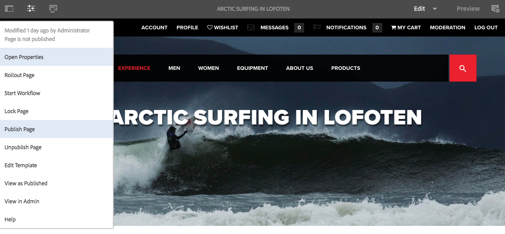
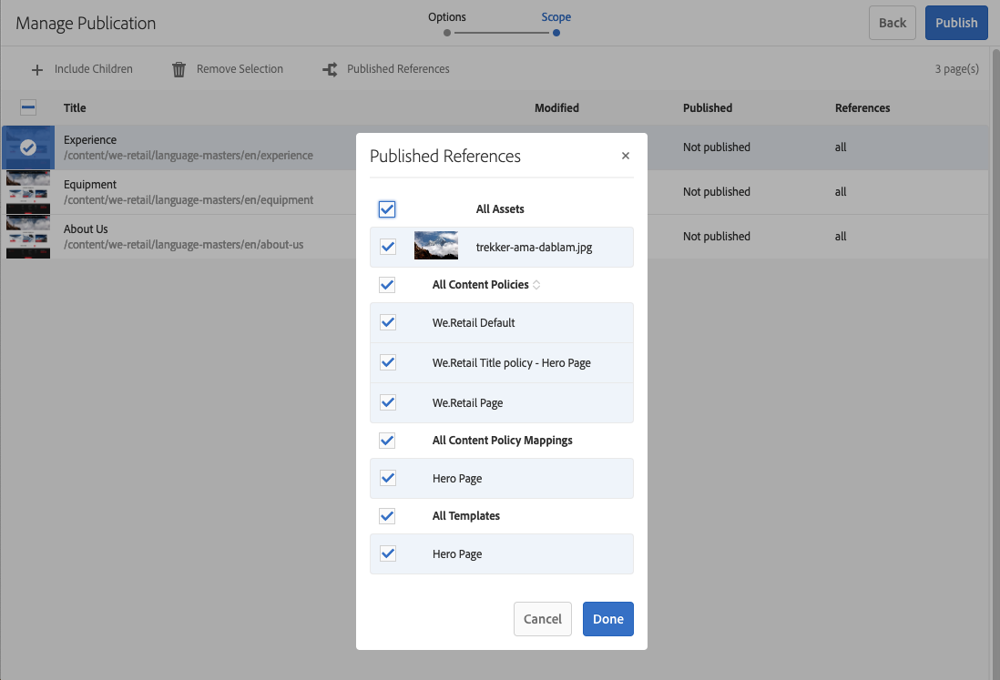

# 페이지 게시 {#publishing-pages}

작성 환경에서 컨텐츠를 작성 및 검토한 후에는 [공개 웹 사이트(게시 환경)에서 사용할 수 있도록](/help/sites-authoring/author.md#concept-of-authoring-and-publishing) 만들어야 합니다.

이를 페이지 게시라고도 합니다. 게시 환경에서 페이지를 제거하려는 경우 게시 취소라고 합니다. 게시 및 게시 취소할 때 작성 환경에서 페이지를 삭제할 때까지 계속 변경할 수 있습니다.

페이지를 즉시 또는 미래의 미리 정의된 날짜/시간에 게시/게시 취소할 수도 있습니다.

>[!NOTE]
>
>게시와 관련된 특정 용어는 헷갈릴 수 있습니다.
>
>* **게시/게시 취소**
   >  게시 환경에서 컨텐츠를 공개적으로 사용할 수 있도록(또는 사용할 수 없도록) 하는 작업에 대한 기본 용어입니다.
   >
   >
* **활성화/비활성화**
   >  이러한 용어는 게시/게시 취소와 동의어입니다.
   >
   >
* **복제**
   >  사용자 댓글을 게시하거나 역복제할 때와 같이 한 환경에서 다른 환경으로의 데이터(예: 페이지 컨텐츠, 파일, 코드, 사용자 댓글) 이동을 설명하는 기술 용어입니다.
>

>[!NOTE]
>
>특정 페이지 게시에 필요한 권한이 없는 경우:
>
>* 게시할 요청을 적절한 사람에게 알리도록 워크플로우가 트리거됩니다.
>* 이 [워크플로우는 개발 팀에서](/help/sites-developing/workflows-models.md#main-pars-procedure-6fe6) 사용자 지정했을 수 있습니다.
>* 워크플로우가 트리거되었음을 알리는 메시지가 짧게 표시됩니다.
>

## 페이지 게시 {#publishing-pages-1}

다음 위치에 따라 게시할 수 있습니다.

* [페이지 편집기에서](/help/sites-authoring/publishing-pages.md#publishing-from-the-editor)
* [사이트 콘솔에서](/help/sites-authoring/publishing-pages.md#publishing-from-the-console)

### 편집기에서 게시 {#publishing-from-the-editor}

페이지를 편집하는 경우 편집기에서 직접 게시할 수 있습니다.

1. Select the **Page Information** icon to open the menu and then the **Publish Page** option.

   

1. 페이지에 게시해야 하는 참조가 있는지에 따라 다음과 같이 달라집니다.

   * 게시할 참조가 없으면 페이지가 직접 게시됩니다.
   * 페이지에 게시해야 하는 참조가 있을 경우 **게시 마법사**&#x200B;에 나열되며 여기서 다음을 수행할 수 있습니다.

      * Specify which of the assets/tags/etc. you want to publish together with the page, then use **Publish** to complete the process.

      * **취소**&#x200B;를 사용하여 작업을 중단합니다.
   

1. Selecting **Publish** will replicate the page to the publish environment. 페이지 편집기에 게시 작업을 확인하는 정보 배너가 표시됩니다.

   

   콘솔에서 동일한 페이지를 볼 때 업데이트된 게시 상태가 표시됩니다.

   

>[!NOTE]
>
>편집기에서 게시하면 약식 공개가 아닙니다. 즉, 선택한 페이지만 게시되며 하위 페이지는 게시되지 않습니다.

### 콘솔에서 게시 {#publishing-from-the-console}

사이트 콘솔에는 게시에 대한 두 가지 옵션이 있습니다.

* [빠른 게시](/help/sites-authoring/publishing-pages.md#quick-publish)
* [게시 관리](/help/sites-authoring/publishing-pages.md#manage-publication)

#### 빠른 게시 {#quick-publish}

**빠른** 게시는 간단한 사례에 해당하며 추가 상호 작용 없이 선택한 페이지를 즉시 게시합니다. 이로 인해 게시되지 않은 참조도 자동으로 게시됩니다.

[빠른 게시]로 페이지를 게시하려면 다음을 수행하십시오.

1. Select the page or pages in the sites console and click on the **Quick Publish** button.

   

1. In the Quick Publish dialogue, confirm the publication by clicking on **Publish** or cancel by clicking on **Cancel**. 게시되지 않은 참조도 자동으로 게시됩니다.

   

1. 페이지가 게시되면 게시를 확인하는 알림이 표시됩니다.

>[!NOTE]
>
>빠른 게시는 약식 공개가 아닙니다. 즉, 선택한 페이지만 게시되며 하위 페이지는 게시되지 않습니다.

#### 게시 관리 {#manage-publication}

**[게시** 관리]는 [빠른 게시]보다 더 많은 옵션을 제공하므로 하위 페이지 포함, 참조 사용자 정의, 적용 가능한 워크플로우 시작 및 나중에 게시할 수 있는 옵션을 제공합니다.

[게시 관리]를 사용하여 페이지를 게시 또는 게시 취소하려면 다음을 수행하십시오.

1. Select the page or pages in the sites console and click on the **Manage Publication** button.

   

1. The **Manage Publication** wizard starts. The first step, **Options**, allows you to:

   * 선택한 페이지를 게시하거나 게시 취소하도록 선택합니다.
   * 지금 또는 나중에 해당 작업을 수행하도록 선택합니다.
   [나중에 게시]하면 지정된 시간에 선택한 페이지를 게시하기 위한 워크플로우를 시작합니다. 반대로 [나중에 게시 취소]하면 지정된 시간에 선택한 페이지를 게시 취소하기 위한 워크플로우를 시작합니다.

   나중에 게시/게시 취소를 취소하려면 [워크플로우 콘솔](/help/sites-administering/workflows.md)로 가서 해당 워크플로우를 종료합니다.

   

   계속하려면 **다음**&#x200B;을 클릭하십시오.

1. In the next step of the Manage Publication wizard, **Scope**, you can define the scope of the publication/unpublication such as including to include child pages and/or including references.

   

   You can use the **Add Content** button to add additional pages to the list of pages to be published in case you neglected to select one before starting the Manage Publication wizard.

   [컨텐츠 추가] 단추를 클릭하면 [경로 브라우저](/help/sites-authoring/author-environment-tools.md#path-browser)가 시작되어 컨텐츠를 선택할 수 있습니다.

   Select the required pages and then click **Select** to add the content to the wizard or **Cancel **to cancel the selection and return to the wizard.

   마법사로 돌아가 목록에서 항목을 선택한 뒤 다음과 같은 추가 옵션을 구성할 수 있습니다.

   * 하위 항목을 포함합니다.
   * 선택 사항에서 제거합니다.
   * 게시된 참조를 관리합니다.
   

   Clicking **Include Children** opens a dialogue allowing you to:

   * 바로 아래 하위만 포함.
   * 수정된 페이지만 포함.
   * 이미 게시된 페이지만 포함.
   Click **Add** to add the children pages to the list of pages to be published or unpublished based on the selection options. Click **Cancel** to cancel the selection and return to the wizard.

   

   마법사로 돌아가면 [하위 포함] 대화 상자의 옵션 선택에 따라 추가된 페이지가 표시됩니다.

   You can view and modify the references to be published or unpublished for a page by selecting it and then clicking the **Published References** button.

   

   The **Published References** dialogue displayes the references for the selected content. 기본적으로 모든 항목이 선택되어 있고 게시/게시 취소되지만 선택을 해제하여 취소하면 작업에 포함되지 않습니다.

   Click **Done** to save your changes or **Cancel** to cancel the selction and return to the wizard.

   마법사로 돌아가면 **참조** 열이 업데이트되어 게시되거나 게시되지 않을 참조에 대한 선택을 반영합니다.

   

1. Click **Publish** to complete.

   [사이트 콘솔]로 돌아가면 알림 메시지가 표시되어 게시를 확인합니다.

1. If the published pages are associated with workflows, they may be shown in a final **Workflows** step of the publication wizard.

   >[!NOTE]
   >
   >The **Workflows** step will be shown based on what rights your user may or may not have. See the [previous note on this page](/help/sites-authoring/publishing-pages.md#main-pars-note-0-ejsjqg-refd) regarding publishing privileges as well as [Managing Access to Workflows](/help/sites-administering/workflows-managing.md) and [Applying Workflows to Pages](/help/sites-authoring/workflows-applying.md#main-pars-text-5-bvhbkh-refd) for details.

   참조는 트리거된 워크플로우 및 지정된 옵션별로 그룹화되어 다음 작업을 수행할 수 있습니다.

   * 워크플로우의 제목을 정의합니다.
   * Keep the workflow package, provided that the workflow has [multi-resource support](/help/sites-developing/workflows-models.md#configuring-a-workflow-for-multi-resource-support).
   * 워크플로우 패키지를 유지하는 옵션이 선택된 경우 워크플로우 패키지의 제목을 정의합니다.
   Click **Publish** or **Publish Later** to complete the publication.

   

## 페이지 게시 취소 {#unpublishing-pages}

페이지 게시를 취소하면 더 이상 읽을 수 없도록 페이지가 게시 환경에서 제거됩니다.

In a [manner similar to publishing](/help/sites-authoring/publishing-pages.md#publishing-pages), one or more pages can be unpublished:

* [페이지 편집기에서](/help/sites-authoring/publishing-pages.md#unpublishing-from-the-editor)
* [사이트 콘솔에서](/help/sites-authoring/publishing-pages.md#unpublishing-from-the-console)

### 편집기에서 게시 취소 {#unpublishing-from-the-editor}

페이지를 편집할 때 해당 페이지의 게시를 취소하려는 경우 [페이지를 게시](/help/sites-authoring/publishing-pages.md#publishing-from-the-editor)한 만큼 **페이지 정보** 메뉴에서 **페이지 게시 취소**&#x200B;를 선택합니다.

### 콘솔에서 게시 취소 {#unpublishing-from-the-console}

[게시하기 위해 [게시 관리]를 사용](/help/sites-authoring/publishing-pages.md#manage-publication)하는 것과 같은 방식으로 게시 취소할 수 있습니다.

1. Select the page or pages in the sites console and click on the **Manage Publication** button.
1. The **Manage Publication** wizard starts. In the first step, **Options**, select to **Unpublish** instead of the default option of **Publish**.

   

   [나중에 게시]를 사용하면 지정된 시간에 이 페이지 버전을 게시하는 워크플로우가 시작됩니다. [나중에 비활성화]를 사용하면 특정 시간에 선택한 페이지를 게시 취소하는 워크플로우가 시작됩니다.

   나중에 게시/게시 취소를 취소하려면 [워크플로우 콘솔](/help/sites-administering/workflows.md)로 가서 해당 워크플로우를 종료합니다.

1. 게시 취소를 완료하려면 [페이지를 게시](/help/sites-authoring/publishing-pages.md#manage-publication)하는 것처럼 마법사를 계속 사용하십시오.

## 트리 게시 및 게시 취소 {#publishing-and-unpublishing-a-tree}

동일한 루트 페이지 아래에서 수많은 컨텐츠 페이지를 입력하거나 업데이트한 경우 전체 트리를 한 번에 게시하면 더욱 편리할 수 있습니다.

[사이트 콘솔]에서 [게시 관리](/help/sites-authoring/publishing-pages.md#manage-publication) 옵션을 사용하여 이 작업을 수행할 수 있습니다.

1. [사이트 콘솔]에서 게시 또는 게시 취소하려는 트리의 루트 페이지를 선택하고 **게시 관리**&#x200B;를 선택합니다.
1. The **Manage Publication** wizard starts. 게시 또는 게시 취소하도록 선택하고 해당 작업이 수행되면 **다음**&#x200B;을 클릭하여 계속 진행합니다.
1. **범위** 단계에서 루트 페이지를 선택하고 **하위 포함**&#x200B;을 선택합니다.

   

1. **하위 포함** 대화 상자에서 다음과 같은 옵션을 선택 취소합니다.

   * 바로 아래 하위만 포함
   * 이미 게시된 페이지만 포함
   이러한 옵션이 기본적으로 선택되므로 선택 취소해야 합니다. **추가**&#x200B;를 클릭하여 게시/게시 취소할 컨텐츠를 확인하고 추가합니다.

   

1. **게시 관리** 마법사에 검토할 트리 컨텐츠가 나열됩니다. 페이지를 추가하거나 선택한 페이지를 제거하여 선택 사항을 추가로 사용자 정의할 수 있습니다.

   

   Remember that you can also review the references to be published via the **Published References** option.

1. [게시 관리 마법사를 정상적으로](#manage-publication) 계속 진행하여 트리 게시 또는 게시 취소를 완료합니다.

## 게시 상태 확인 {#determining-publication-status}

페이지의 게시 상태를 확인할 수 있습니다.

* ](/help/sites-authoring/basic-handling.md#viewing-and-selecting-resources)사이트 콘솔의 리소스 개요 정보[에서

   

   게시 상태는 [사이트 콘솔]에 [카드](/help/sites-authoring/basic-handling.md#card-view), [열](/help/sites-authoring/basic-handling.md#column-view), [목록](/help/sites-authoring/basic-handling.md#list-view) 보기로 표시됩니다.

* In the [timeline](/help/sites-authoring/basic-handling.md#timeline)

   

* In the [Page Information menu](/help/sites-authoring/author-environment-tools.md#page-information) when editing a page

   
