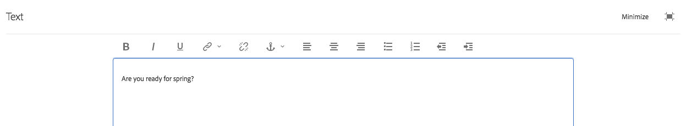

# 리치 텍스트 편집기를 사용한 컨텐츠 작성 {#use-rich-text-editor-to-author-content}

리치 텍스트 편집기(RTE)는 텍스트 컨텐츠를 AEM에 입력하는 기본 빌딩 블록입니다. 이 편집기는 다음과 같은 다양한 구성 요소의 기초가 됩니다., 다음 포함:

* 텍스트
* 텍스트 이미지
* 표

## 즉석 편집 {#in-place-editing}

탭/클릭하여 텍스트 기반 구성 요소를 선택하면 구성 요소에 [도구 모음](/help/sites-authoring/editing-content.md#edit-configure-copy-cut-delete-paste)이 표시됩니다.

다시 탭/클릭하거나 구성 요소를 느리게 더블 탭/클릭하여 처음 선택하면 도구 모음이 있는 즉석 편집이 열립니다. 여기에서 컨텐츠를 편집하고 기본적인 서식 변경을 수행할 수 있습니다.

이 도구 모음은 다음 옵션을 제공합니다.

* **형식**: 굵게, 기울임체 및 밑줄을 설정할 수 있도록 해줍니다.
* **목록**: 글머리 기호 또는 번호 목록을 만들거나 들여쓰기를 설정할 수 있습니다.
* **하이퍼링크**
* **연결 해제**
* **전체 화면**
* **닫기**
* **저장**

## 전체 화면 편집 {#full-screen-editing}

텍스트 기반 구성 요소의 경우 도구 모음에서 전체 화면 모드 를 탭합니다  리치 텍스트 편집기를 열고 나머지 페이지 콘텐츠를 숨깁니다.

전체 화면 모드에서는 작성에 사용할 수 있는 구성된 모든 옵션이 표시됩니다. 옵션 사용 가능 여부는 [구성에 따라 다릅니다](/help/sites-administering/rich-text-editor.md).

리치 텍스트 편집기 추가 옵션은 다음과 같습니다.

* **앵커**: 나중에 연결/참조할 수 있는 텍스트에 앵커를 생성합니다.
* **왼쪽으로 텍스트 정렬**
* **텍스트를 가운데로**
* **오른쪽으로 텍스트 정렬**

최소화 아이콘을 클릭하여 [전체 화면 모드]를 닫습니다.

>[!NOTE]
>
>중첩된 목록을 Microsoft Word에서 RTE로 복사하면 일관되지 않은 결과를 얻을 수 있고, 따라서 RTE에서 텍스트를 붙여넣은 후 수동으로 조정해야 할 수 있습니다.
