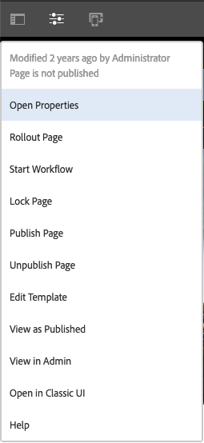

# UI 선택{#selecting-your-ui}

터치 지원 UI가 현재 표준 UI이고 사이트의 관리 및 편집에서 기능 패리티가 거의 달성되었지만, 사용자가 [클래식 UI](/help/sites-classic-ui-authoring/classicui.md)로 전환하려고 할 수 있습니다. 이를 위해 몇 가지 옵션을 제공합니다.

>[!NOTE]
>
>클래식 UI의 기능 패리티 상태에 대한 자세한 내용은 [터치 UI 기능 패리티](/help/release-notes/touch-ui-features-status.md) 문서를 참조하십시오.

어느 UI를 사용해야 하는지를 결정할 수 있는 다양한 위치가 있습니다.

* [인스턴스용 기본 UI 구성](#configuring-the-default-ui-for-your-instance)
이 옵션을 사용하면 사용자 로그인 시 기본 UI가 표시되도록 설정됩니다. 사용자는 이 설정을 무시할 수 있으며 계정 또는 현재 세션에 대해 다른 UI를 선택할 수 있습니다.

* [계정용 클래식 UI 작성 설정](/help/sites-authoring/select-ui.md#setting-classic-ui-authoring-for-your-account) 이 옵션을 사용하면 해당 UI가 페이지 편집 시 기본적으로 사용되도록 설정됩니다. 마찬가지로 사용자는 이 설정을 무시할 수 있으며 계정 또는 현재 세션에 대해 다른 UI를 선택할 수 있습니다.

* [현재 세션에 대한 클래식 UI로 전환](#switching-to-classic-ui-for-the-current-session)
이 설정은 현재 세션에 대한 클래식 UI로 전환합니다.

* 페이지 작성의 경우 [UI와 관련하여 특정 항목이 무시됩니다.](#ui-overrides-for-the-editor).

>[!CAUTION]
>
>클래식 UI로 전환에 대한 여러 옵션은 즉시 사용할 수 없습니다. 인스턴스에 대해 특별히 구성되어 있어야 합니다.
>
>자세한 내용은 [클래식 UI에 대한 액세스 활성화](/help/sites-administering/enable-classic-ui.md)를 참조하십시오.

>[!NOTE]
>
>이전 버전에서 업그레이드된 인스턴스는 페이지 작성을 위해 클래식 UI를 유지합니다.
>
>업그레이드 후 페이지 작성이 터치 지원 UI로 자동 전환되지 않지만, **WCM 작성 UI 모드 서비스**( `AuthoringUIMode` 서비스)의 [OSGi 구성](/help/sites-deploying/configuring-osgi.md)을 사용하여 구성할 수 있습니다. [편집기에 대해 UI 무시](#ui-overrides-for-the-editor)를 참조하십시오.

## 인스턴스용 기본 UI 구성 {#configuring-the-default-ui-for-your-instance}

시스템 관리자는 [루트 매핑](/help/sites-deploying/osgi-configuration-settings.md#daycqrootmapping)을 사용하여 시작 및 로그인 시 표시되는 UI를 구성할 수 있습니다.

사용자 기본값이나 세션 설정에 의해 무시될 수 있습니다.

## 계정용 클래식 UI 작성 설정 {#setting-classic-ui-authoring-for-your-account}

각 사용자는 [사용자 환경 설정](/help/sites-authoring/user-properties.md#userpreferences)에 액세스하여 페이지 작성을 위해 클래식 UI를 사용할지 여부를 정의할 수 있습니다(기본 UI 대신).

세션 설정에 의해 무시될 수 있습니다.

## 현재 세션을 위해 클래식 UI로 전환 {#switching-to-classic-ui-for-the-current-session}

터치 지원 UI 사용 시 데스크톱 사용자는 클래식(데스크톱 전용) UI로 되돌릴 수 있습니다. 현재 세션에 대한 클래식 UI로 전환하는 방법에는 몇 가지가 있습니다.

* **탐색 링크**

   >[!CAUTION]
   >
   >클래식 UI로 전환에 대한 이 옵션은 즉시 사용할 수 없습니다. 인스턴스에 대해 특별히 구성되어 있어야 합니다.
   >
   >
   >자세한 내용은 [클래식 UI에 대한 액세스 활성화](/help/sites-administering/enable-classic-ui.md)를 참조하십시오.

   활성화한 경우, 적용 가능한 콘솔에 마우스 커서를 가져다 댈 때마다 아이콘(모니터 기호)이 표시되며, 이 아이콘을 탭/클릭하는 경우 클래식 UI에서 해당 위치가 열립니다.

   예: **siteadmin**&#x200B;에 대한 **사이트**&#x200B;의 링크

   

* **URL**

   클래식 UI는 `welcome.html`의 시작 화면에 대한 URL을 사용하여 액세스할 수 있습니다.예:

   `https://localhost:4502/welcome.html`

   >[!NOTE]
   >
   >터치 지원 UI는 `sites.html`을 통해 액세스할 수 있습니다. 예:
   >
   >
   >`https://localhost:4502/sites.html`

### 페이지 편집 시 클래식 UI로 전환 {#switching-to-classic-ui-when-editing-a-page}

>[!CAUTION]
>
>클래식 UI로 전환에 대한 이 옵션은 즉시 사용할 수 없습니다. 인스턴스에 대해 특별히 구성되어 있어야 합니다.
>
>자세한 내용은 [클래식 UI에 대한 액세스 활성화](/help/sites-administering/enable-classic-ui.md)를 참조하십시오.

활성화된 경우 **페이지 정보** 대화 상자에서 **클래식 UI로 열기**&#x200B;를 사용할 수 있습니다.

### 편집기에 대해 UI 무시 {#ui-overrides-for-the-editor}

사용자나 시스템 관리자가 정의한 설정은 페이지 작성 시 시스템에 의해 무시될 수 있습니다.

* 페이지 작성 시:

   * URL에서 `cf#`을 사용하여 페이지에 액세스할 때는 클래식 편집기를 사용할 수 밖에 없습니다. 예:
      `https://localhost:4502/cf#/content/geometrixx/en/products/triangle.html`

   * URL에서 `/editor.html`을 사용하거나 터치 장치를 사용할 때는 터치 지원 편집기를 사용할 수 밖에 없습니다. 예:
      `https://localhost:4502/editor.html/content/geometrixx/en/products/triangle.html`

* 이러한 강제성은 모두 일시적이며 브라우저 세션에 대해서만 유효합니다.

   * 설정된 쿠키는 터치 활성화( `editor.html`) 또는 클래식( `cf#`) 사용 여부에 따라 다르게 설정됩니다.

* `siteadmin`을 통해 페이지를 열 때에는 다음 항목이 있는지 확인하게 됩니다.

   * 쿠키
   * 사용자 환경 설정
   * 어느 쪽도 없을 경우에는, [WCM 작성 UI 모드 서비스](/help/sites-deploying/configuring-osgi.md)(**서비스)의** OSGi 구성`AuthoringUIMode`에 설정된 정의가 기본값이 됩니다. 

>[!NOTE]
>
>사용자가 [페이지 작성에 대한 환경 설정을 이미 정의한 경우 ](#settingthedefaultauthoringuiforyouraccount)OSGi 속성을 변경하여 무시할 수 없습니다.

>[!CAUTION]
>
>위의 설명처럼 쿠키의 사용 때문에 다음 중 어느 것도 권장되지 않습니다.
>
>* URL 수동 편집. 비표준 브라우저 URL은 알 수 없는 상황과 기능 부족을 초래할 수 있습니다.
>* 두 편집기를 동시에 열기. 예를 들어 별도의 창으로 엽니다.

