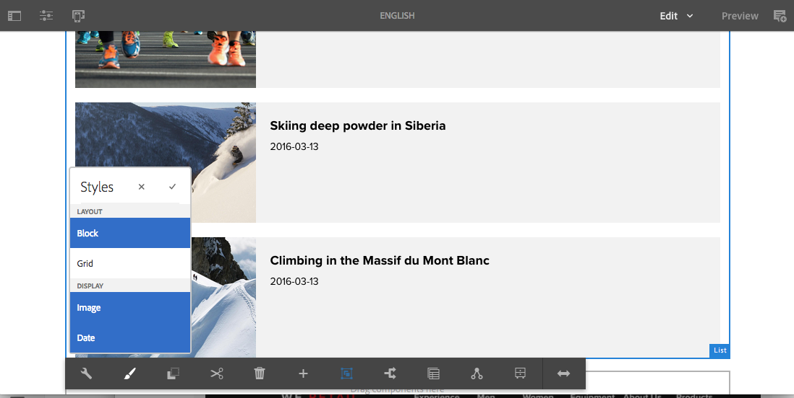
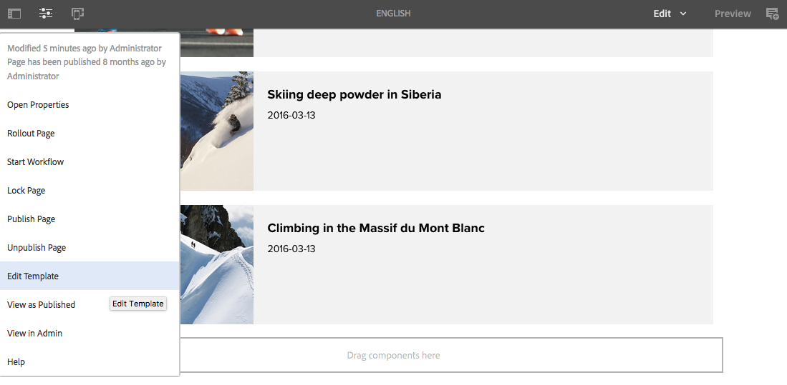
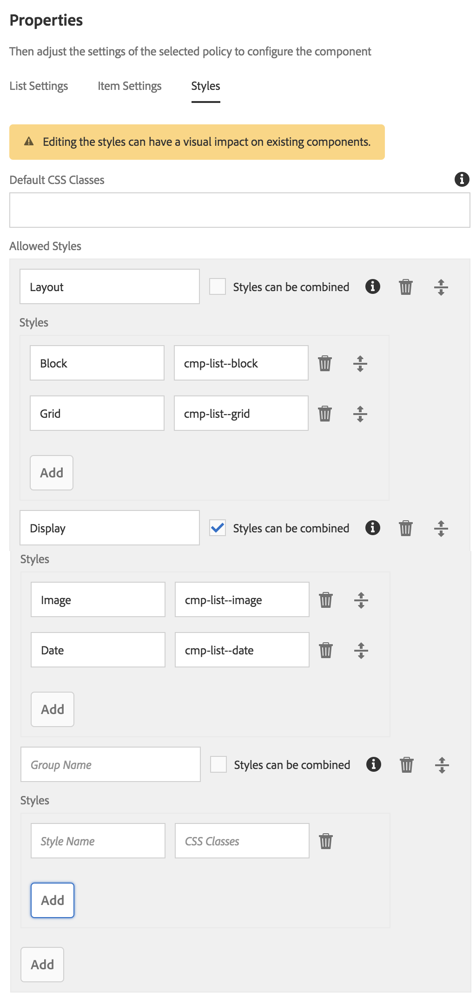

# 스타일 시스템{#style-system}

스타일 시스템을 사용하여 템플릿 작성자는 페이지에서 구성 요소를 편집할 때 컨텐츠 작성자가 선택할 수 있도록 구성 요소의 컨텐츠 정책에 스타일 클래스를 정의할 수 있습니다. 이러한 스타일은 보다 유연하게 사용할 수 있도록 구성 요소를 시각적으로 변형한 대체물일 수 있습니다.

따라서 각 스타일에 대해 사용자 지정 구성 요소를 개발하거나 이러한 스타일 기능을 사용하도록 구성 요소 대화 상자를 사용자 지정할 필요가 없습니다. 또한 AEM 백엔드 개발 없이 컨텐츠 작성자의 요구에 맞게 빠르고 쉽게 조정될 수 있는 재사용 가능한 구성 요소가 생성되게 됩니다.

## 사용 사례 {#use-case}

템플릿 작성자는 컨텐츠 작성자에 대해 구성 요소가 작동하는 방식을 구성해야 할 뿐만 아니라 구성 요소의 다양한 시각적 변형을 구성해야 합니다.

마찬가지로 컨텐츠 작성자는 컨텐츠를 구성하고 배열해야 할 뿐만 아니라 시각적으로 표시되는 방법도 선택해야 합니다.

스타일 시스템은 템플릿 작성자 및 컨텐츠 작성자 요구 사항을 둘 다 충족할 수 있는 통합된 솔루션을 제공합니다.

* 템플릿 작성자는 구성 요소의 컨텐츠 정책에 스타일 클래스를 정의할 수 있습니다.
* 그러면 컨텐츠 작성자가 페이지에서 구성 요소를 편집할 때 해당 스타일을 적용하기 위해 드롭다운에서 이러한 클래스를 선택할 수 있습니다.

그러면 해당 스타일 클래스가 구성 요소의 데코레이션 래퍼 요소에 삽입되므로 구성 요소 개발자는 CSS 규칙을 제공하는 것 이상의 스타일 처리를 수행할 필요가 없습니다.

## 개요 {#overview}

스타일 시스템을 사용할 경우 일반적으로 다음 양식이 사용됩니다.

1. 웹 디자이너는 구성 요소의 다른 시각적 변형을 만듭니다.

1. HTML 개발자에게는 구현을 위해 구성 요소의 HTML 출력과 원하는 시각적 변형이 제공됩니다.

1. HTML 개발자는 각 시각적 변형에 해당하고 구성 요소를 래핑하는 요소에 삽입해야 하는 CSS 클래스를 정의합니다.

1. HTML 개발자는 정의된 대로 표시되도록 각 시각적 변형에 대해 해당 CSS 코드(및 선택적으로 JS 코드)를 구현합니다.

1. AEM 개발자는 제공된 CSS(및 선택적 JS)를 [클라이언트 라이브러리](/help/sites-developing/clientlibs.md)에 배치하고 배포합니다.

1. AEM 개발자 또는 템플릿 작성자는 페이지 템플릿을 구성하고, 스타일이 지정된 각 구성 요소의 정책을 편집하고, 정의된 CSS 클래스를 추가하고, 각 스타일에 사용자에게 친숙한 이름을 지정하고, 결합할 수 있는 스타일을 지정합니다.

1. 그러면 AEM 페이지 작성자는 구성 요소 도구 모음의 스타일 메뉴를 통해 페이지 편집기에서 디자인된 스타일을 선택할 수 있습니다.

AEM에서는 마지막 세 단계만 실제로 수행됩니다. 즉, 필요한 CSS 및 Javascript의 모든 개발을 AEM 없이도 수행할 수 있습니다.

실제로 스타일을 구현할 때는 AEM에서 배포를 수행하고 원하는 템플릿의 구성 요소 내에서 선택하기만 하면 됩니다.

다음 다이어그램은 스타일 시스템의 아키텍처를 보여 줍니다.

## 사용 {#use}

이 기능을 이해하기 위해 구성 요소에 대해 스타일을 만들어야 합니다. 해당 기능을 탐색하려면 [We.Retail](/help/sites-developing/we-retail.md)에서 구현된 핵심 구성 요소의 [목록 구성 요소](https://helpx.adobe.com/experience-manager/core-components/using/list.html)를 기준으로 사용하여, 스타일을 포함하는 첨부된 패키지를 설치할 수 있습니다.

[스타일 시스템 데모 패키지 다운로드](assets/package_-_style_systemdemo.zip)

>[!NOTE]
>
>데모 패키지는 가장 잘 구현하는 방식에 대한 참조라기보다는, 작성자가 스타일 시스템을 사용하는 방법을 보여 주기 위한 것입니다.
>
>이 패키지는 We.Retail에서 내장된 예제 및 우수 사례 구현을 제공할 때까지만 필요합니다.

다음 섹션 [컨텐츠 작성자](/help/sites-authoring/style-system.md#as-a-content-author) 및 [템플릿 작성자](/help/sites-authoring/style-system.md#as-a-template-author)에서는 We.Retail 상단의 스타일 시스템 데모 패키지를 사용하여 스타일 시스템의 기능을 테스트하는 방법을 설명합니다.

사용자 고유의 구성 요소에 대해 스타일 시스템을 사용하려면 다음을 수행하십시오.

1. [개요](/help/sites-authoring/style-system.md#overview) 섹션에서 설명한 대로 CSS를 클라이언트 라이브러리로 설치합니다.
1. [템플릿 작성자](/help/sites-authoring/style-system.md#as-a-template-author) 섹션에 설명된 대로 컨텐츠 작성자가 사용할 수 있도록 하려는 CSS 클래스를 구성합니다.
1. 그러면 컨텐츠 작성자는 [컨텐츠 작성자](/help/sites-authoring/style-system.md#as-a-content-author) 섹션에 설명된 대로 스타일을 사용할 수 있습니다.

### 컨텐츠 작성자 {#as-a-content-author}

1. After installing the style system demo package, navigate to We.Retail&#39;s English language master home page at `http://localhost:4502/sites.html/content/we-retail/language-masters/en` and edit the page.
1. parsys의 맨 아래 또는 맨 위에 있는 **목록** 구성 요소를 선택합니다. Do not confuse it with the **Articles List** component.

   

1. **목록** 구성 요소의 도구 모음에서 **스타일** 단추를 탭하거나 클릭하여 스타일 메뉴를 열고 구성 요소의 모양을 변경합니다.

   

   >[!NOTE]
   >
   >In this example, the **Layout** styles (**Block** and **Grid**) are mutually exclusive, while the **Display** options (**Image** or **Date**) can be combined. 이 내용은 ](/help/sites-authoring/style-system.md#as-a-template-author)템플릿 작성자로서 템플릿에 구성[할 수 있습니다.

### 템플릿 작성자 {#as-a-template-author}

1. While editing We.Retail&#39;s English language master home page at `http://localhost:4502/sites.html/content/we-retail/language-masters/en`, edit the template of the page via **Page Information -> Edit Template**.

   

1. 구성 요소의 **정책** 단추를 탭하거나 클릭하여 **목록** 구성 요소의 정책을 편집합니다. **문서 목록** 구성 요소와 혼동하지 않도록 합니다.

   

1. 속성의 스타일 탭에서 스타일이 구성된 방식을 확인할 수 있습니다.

   

   * **그룹 이름:** 구성 요소의 스타일을 구성할 때 컨텐츠 작성자에게 표시될 스타일을 스타일 메뉴에서 함께 그룹화할 수 있습니다.
   * **스타일을 결합할 수 있음:** 해당 그룹 내의 여러 스타일을 은 한꺼번에 선택할 수 있습니다.
   * **스타일 이름:** 구성 요소의 스타일을 구성할 때 컨텐츠 작성자에게 표시할 스타일에 대한 설명입니다.
   * **CSS 클래스:** 스타일과 연관된 CSS 클래스의 실제 이름입니다.
   끌기 핸들을 사용하여 그룹의 순서와 그룹 내의 스타일을 정렬합니다. 추가 또는 삭제 아이콘을 사용하여 그룹 내에서 그룹 또는 스타일을 추가하거나 제거합니다.

>[!CAUTION]
>
>The CSS classes (as well as any necessary Javascript) configured as style properties of a component&#39;s policy must be deployed as [Client Libraries](/help/sites-developing/clientlibs.md) in order to work.

## 설정 {#setup}

>[!NOTE]
>
>코어 구성 요소의 버전 2는 추가 구성 없이 스타일 시스템을 활용하도록 완전히 활성화됩니다.
>
>다음 단계에 따라 사용자 지정 구성 요소에 대해 스타일 시스템을 활성화하거나 해당 기능을 활용하도록 버전 1 코어 구성 요소를 확장합니다.

구성 요소가 AEM의 스타일 시스템을 사용하고 디자인 대화 상자에 스타일 탭을 표시하도록 하려면 구성 요소 개발자가 다음 설정을 갖는 제품의 해당 탭을 구성 요소에 포함해야 합니다.

* `path = "/mnt/overlay/cq/gui/components/authoring/dialog/style/tab_design/styletab"`
* `sling:resourceType = "granite/ui/components/coral/foundation/include"`

구성 요소가 구성되면 페이지 작성자가 구성한 스타일이 AEM을 통해 데코레이션 요소에 자동으로 삽입됩니다. AEM은 이러한 스타일을 편집 가능한 모든 구성 요소에 자동으로 래핑합니다. 구성 요소 자체는 이를 위해 어떤 작업도 수행할 필요가 없습니다.

### 요소 이름을 갖는 스타일 {#styles-with-element-names}

개발자는 `cq:styleElements` 문자열 배열 속성을 사용하여 구성 요소의 스타일에 대해 허용되는 요소 이름 목록을 구성할 수도 있습니다. 그러면 템플릿 작성자는 디자인 대화 상자의 정책 스타일 탭에서 각 스타일에 대해 설정할 요소 이름을 선택할 수도 있습니다. 다음은 래퍼 요소의 요소 이름을 설정합니다.

This property is set on the `cq:Component` node. 예:

* `/apps/weretail/components/content/list@cq:styleElements=[div,section,span]`

>[!CAUTION]
>
>결합할 수 있는 스타일에 대해서는 요소 이름을 정의하지 마십시오. 여러 요소 이름이 정의된 경우 우선 순위 순서는 다음과 같습니다.
>
>1. HTL이 모든 것에 우선합니다. `data-sly-resource="${'path/to/resource' @ decorationTagName='span'}`
>1. 그런 다음 여러 활성 스타일 중에서 구성 요소의 정책에 구성된 스타일 목록의 첫 번째 스타일이 적용됩니다.
>1. Finally, the component&#39;s `cq:htmlTag`/ `cq:tagName` will be considered as a fallback value.
>

스타일 이름을 정의하는 기능은 레이아웃 컨테이너 또는 컨텐츠 조각 구성 요소와 같은 매우 일반적인 구성 요소에 추가적인 의미를 제공할 때 유용합니다.

For instance it allows a Layout Container to be given semantics like `<main>`, `<aside>`, `<nav>`, etc.
