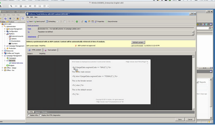

# Adobe Campaign 타깃팅{#targeting-your-adobe-campaign}

Adobe Campaign 뉴스레터를 타깃팅하려면 먼저 클래식 UI(Client Context용)에만 사용할 수 있는 세그멘테이션을 설정해야 합니다. 그 후 Adobe Campaign에 대한 타깃팅된 경험을 만들 수 있습니다. 모두 이 섹션에 설명되어 있습니다.

## AEM에서 세그멘테이션 설정 {#setting-up-segmentation-in-aem}

세그멘테이션을 설정하려면 클래식 UI를 사용하여 세그먼트를 설정해야 합니다. 나머지 단계는 표준 UI에서 수행할 수 있습니다.

세그멘테이션 설정에는 세그먼트, 브랜드, 캠페인 및 경험을 만드는 작업이 포함됩니다.

>[!NOTE]
>
>세그먼트 ID를 Adobe Campaign 측 세그먼트 ID에 매핑해야 합니다.

### 세그먼트 만들기 {#creating-segments}

세그먼트를 만들려면 다음을 수행하십시오.

1. [세그멘테이션 콘솔](http://localhost:4502/miscadmin#/etc/segmentation)(**&lt;호스트>:&lt;포트>/miscadmin#/etc/segmentation**&#x200B;에서)을 엽니다.
1. 새 페이지를 만들고 제목을 입력(예: **AC 세그먼트**) 및 **세그먼트(Adobe Campaign)** 템플릿)합니다.
1. 만들어진 페이지를 왼쪽에 있는 트리 보기에서 선택합니다.
1. &#39;남성&#39;이라는 이름으로 만든 세그먼트 아래에 새 페이지를 만들어 세그먼트를 만들고(예: 남성 사용자 타깃팅) **세그먼트(Adobe Campaign)** 템플릿을 선택합니다.
1. 만들어진 세그먼트 페이지를 열고 사이드 킥의 **세그먼트 ID**&#x200B;를 페이지에 드래그하여 놓습니다.
1. 트레이트를 두 번 클릭하고 이 경우 Adobe Campaign에 정의된 남성 세그먼트(예: **MALE**)를 나타내는 ID를 입력한 다음 **확인**&#x200B;을 클릭합니다. 다음 메시지가 나타납니다.*`targetData.segmentCode == "MALE"`*
1. 다른 세그먼트(예: 여성 사용자를 타깃팅하는 세그먼트)에 대해 이 절차를 반복합니다.

### 브랜드 만들기  {#creating-a-brand}

브랜드를 만들려면 다음을 수행하십시오.

1. **사이트**&#x200B;에서 **캠페인** 폴더(예를 들어, We.Retail에서)로 이동합니다.
1. **페이지 만들기**&#x200B;를 클릭하고 페이지용 제목을 입력(예: We.Retail 브랜드)한 다음, **브랜드** 템플릿을 선택합니다.

### 캠페인 만들기를 참조하십시오 {#creating-a-campaign}

캠페인을 만들려면:

1. 방금 만든 **브랜드** 페이지를 엽니다.
1. **페이지 만들기**&#x200B;를 클릭하고 페이지용 제목을 입력(예: We.Retail 캠페인)한 다음, **캠페인** 템플릿을 선택하고 **만들기**&#x200B;를 클릭합니다.

### 경험 만들기  {#creating-experiences}

세그먼트를 위한 경험을 만들려면 다음을 수행하십시오.

1. 방금 만든 **캠페인** 페이지를 엽니다.
1. **페이지 만들기**&#x200B;를 클릭하고 페이지 제목을 입력(예: 남성 세그먼트에 대한 경험을 만들고 있으므로 남성)하고 **경험** 템플릿을 선택합니다.
1. 만든 경험 페이지를 엽니다.
1. **편집**&#x200B;을 클릭한 다음, 세그먼트 아래의 **항목 추가**&#x200B;를 클릭합니다.
1. 남성 세그먼트의 경로(예: **/etc/segmentation/ac-segments/male**)를 입력하고 **확인**&#x200B;을 클릭합니다. 다음 메시지가 나타납니다.*경험이 타깃팅됨:남성*
1. 이전 절차를 반복하여 모든 세그먼트(예: 여성 타겟)를 위한 경험을 만듭니다.

## 타깃팅된 컨텐츠로 뉴스레터 만들기  {#creating-a-newsletter-with-targeted-content}

세그먼트, 브랜드, 캠페인 및 경험을 만든 후에는 타깃팅된 컨텐츠가 있는 뉴스레터를 만들 수 있습니다. 경험을 만든 후에는 경험을 세그먼트에 연결합니다.

>[!NOTE]
>
>[이메일 샘플은 Geometrixx에서만 사용할 수 있습니다](/help/sites-developing/we-retail.md). 패키지 공유에서 샘플 Geometrixx 컨텐츠를 다운로드하십시오.

타깃팅된 컨텐츠로 뉴스레터 만들려면 다음을 수행하십시오.

1. 타깃팅된 컨텐츠로 뉴스레터 만들기:Geometrixx Outdoors의 이메일 캠페인 아래에서 **만들기** > **페이지**&#x200B;를 클릭하거나 탭하고 Adobe Campaign 메일 템플릿 중 하나를 선택합니다.

   

1. 뉴스레터에서 [텍스트 및 개인화] 구성 요소를 추가합니다.
1. &quot;기본값입니다&quot;와 같은 텍스트를 [텍스트 및 개인화] 구성 요소에 추가합니다.
1. **편집** 옆의 화살표를 클릭하고 **타깃팅**&#x200B;을 선택합니다.
1. [브랜드] 드롭다운 메뉴에서 브랜드를 선택하고 해당 캠페인을 선택합니다. (앞서 만든 브랜드와 캠페인입니다.)
1. **타깃팅 시작**&#x200B;을 클릭합니다. [대상] 영역에 세그먼트가 표시됩니다. 정의된 세그먼트 중에 일치하는 세그먼트가 없으면 기본 경험이 사용됩니다.

   >[!NOTE]
   >
   >기본적으로 AEM용으로 포함된 이메일 샘플에서는 타깃팅 엔진으로 Adobe Campaign을 사용합니다. 사용자 지정 뉴스레터의 경우 타깃팅 엔진으로 Adobe Campaign을 선택해야 할 수 있습니다. 타깃팅 시 도구 모음에서 +를 탭하거나 클릭하고, 새로운 활동의 제목을 입력하고, 타깃팅 엔진으로 **Adobe Campaign**&#x200B;을 선택하십시오.

1. **기본값**&#x200B;을 클릭한 다음, 앞서 추가한 [텍스트 및 개인화] 구성 요소를 클릭하십시오. 그러면 안에 화살표가 있는 과녁 중앙 아이콘이 표시됩니다. 이 아이콘을 클릭하여 이 구성 요소를 타깃팅하십시오.

   

1. 다른 세그먼트(남성)로 이동하고 **오퍼 추가**&#x200B;를 클릭한 다음, 더하기 아이콘 +을 클릭합니다. 그런 다음 오퍼를 편집하십시오.
1. 다른 세그먼트(여성)로 이동하고 **오퍼 추가**&#x200B;를 클릭한 다음, 더하기 아이콘 +을 클릭합니다. 그런 다음 이 오퍼를 편집하십시오.
1. **다음**&#x200B;을 클릭하여 매핑을 본 다음 **다음**&#x200B;을 클릭하여 Adobe Campaign에 적용되지 않는 설정을 보고 **저장**&#x200B;을 클릭합니다.

   컨텐츠가 Adobe Campaign 내부의 배달에서 사용되면 AEM에서는 Adobe Campaign용의 올바른 타깃팅 코드를 자동으로 생성합니다.

1. Adobe Campaign에서 배달 방법을 만듭니다. **AEM 컨텐츠 포함 이메일 배달**&#x200B;을 선택하고 로컬 AEM 계정을 적절하게 선택한 다음, 해당 변경을 확인하십시오.

   HTML 보기에서 타깃팅된 구성 요소의 다양한 경험은 Adobe Campaign 타깃팅 코드로 묶입니다.

   

   >[!NOTE]
   >
   >Adobe Campaign에서 세그먼트도 설정하는 경우 **미리 보기**&#x200B;를 클릭하면 각 세그먼트에 대한 경험이 표시됩니다.

