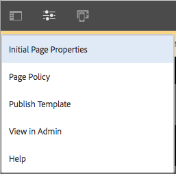

# 페이지 템플릿 만들기{#creating-page-templates}

페이지를 생성할 때 새 페이지를 만드는 기준으로 사용할 템플릿을 선택해야 합니다. 템플릿은 결과 페이지의 구조, 초기 컨텐츠 및 사용할 수 있는 구성 요소를 정의합니다.

**템플릿 편집기**&#x200B;를 사용하면 템플릿을 만들고 유지 관리하는 것이 더 이상 개발자 전용 작업이 아닙니다. **템플릿 작성자**&#x200B;라고 하는 고급 사용자 유형도 이 작업에 참여할 수 있습니다. 개발자는 여전히 환경을 설정하고, 클라이언트 라이브러리를 작성하고, 사용할 구성 요소를 작성해야 하지만, 이러한 기본 사항이 지정되면 **템플릿 작성자**&#x200B;가 개발 프로젝트 없이도 템플릿을 유연하게 작성하고 구성할 수 있습니다.

**템플릿 콘솔**&#x200B;을 사용하여 템플릿 작성자는 다음을 수행할 수 있습니다.

* 새 템플릿을 만들거나 기존 템플릿을 복사합니다.
* 템플릿의 라이프사이클을 관리합니다.

**템플릿 편집기**&#x200B;를 사용하여 템플릿 작성자는 다음을 수행할 수 있습니다.

* 템플릿에 구성 요소를 추가하고 응답형 격자에 배치합니다.
* 구성 요소를 미리 구성합니다.
* 템플릿으로 만든 페이지에서 편집할 수 있는 구성 요소를 정의합니다.

이 문서에서는 **템플릿 작성자**&#x200B;가 템플릿 콘솔 및 편집기를 사용하여 편집 가능한 템플릿을 만들고 관리하는 방법을 설명합니다.

편집 가능한 템플릿이 기술 수준에서 작동하는 방법에 대한 자세한 내용은 개발자 문서 [페이지 템플릿 - 편집 가능](/help/sites-developing/page-templates-editable.md)을 참조하십시오.

>[!NOTE]
>
>**템플릿 편집기**&#x200B;는 템플릿 수준에서 직접적으로 대상을 지정하도록 지원하지 않습니다. 편집 가능한 템플릿을 기준으로 만들어진 페이지는 대상으로 지정할 수 있지만 템플릿 자체는 대상이 될 수 없습니다.

>[!CAUTION]
>
>**템플릿 콘솔**&#x200B;으로 만든 페이지 및 템플릿은 클래식 UI에 사용할 수 없으며, 이러한 사용은 지원되지 않습니다.

## 시작하기 전에 {#before-you-start}

>[!NOTE]
>
>템플릿 작성자가 해당 폴더에서 템플릿을 만들려면 먼저 관리자가 **구성 브라우저**&#x200B;에서 템플릿 폴더를 구성하고 적절한 사용 권한을 적용해야 합니다.

시작하기 전에 다음 사항을 고려해야 합니다.

* 새 템플릿을 만들려면 공동 작업이 필요합니다. 이러한 이유로 각 작업에 대해 [역할](#roles)이 지정됩니다.

* 인스턴스가 구성되는 방법에 따라, AEM이 [두 가지 기본 유형의 템플릿](/help/sites-authoring/templates.md#editable-and-static-templates)을 제공한다는 것을 이해하는 것이 도움이 될 수 있습니다. 이 사실은 실제로 [템플릿을 사용하여 페이지 만드는](#using-a-template-to-create-a-page) 방법에는 영향을 주지 않지만, 만들 수 있는 템플릿 유형과 페이지가 해당 템플릿과 관련되는 방식에는 영향을 줍니다.

### 역할 {#roles}

**템플릿 콘솔** 및 **템플릿 편집기**&#x200B;를 사용하여 새 템플릿을 만들려면 다음 역할 간의 공동 작업이 필요합니다.

* **관리자**:

   * 템플릿에 대한 새 폴더를 만들려면 `admin` 권한이 필요합니다.

   * 종종 이러한 작업을 개발자가 수행할 수도 있습니다.

* **개발자**:

   * 기술/내부 세부 사항에 주력합니다.
   * 개발 환경에 대한 경험이 필요합니다.
   * 템플릿 작성자에게 필요한 정보를 제공합니다.

* **템플릿 작성자**:

   * `template-authors` 그룹의 멤버인 특정 작성자입니다.

      * 필요한 권한을 할당합니다.
   * 구성 요소의 사용 방식과 다음이 요구되는 기타 고급 세부 사항을 구성할 수 있습니다.

      * 일부 기술적인 지식

         * 예: 경로를 정의할 때 패턴 사용
      * 개발자의 기술 정보

폴더 작성과 같은 일부 작업의 특성으로 인해, 개발 환경이 필요하며, 이를 위해서는 지식과 경험이 필요합니다.

이 문서에 자세히 설명된 작업은 해당 작업을 수행하는 역할과 함께 나열됩니다.

### 편집 가능 및 정적 템플릿 {#editable-and-static-templates}

AEM은 이제 다음과 같은 두 가지 기본 유형의 템플릿을 제공합니다.

* [편집 가능한 템플릿](/help/sites-authoring/templates.md#creatingandmanagingnewtemplates)

   * 템플릿 작성자가 **템플릿** 콘솔 및 편집기를 사용하여 [작성](#creatinganewtemplate) 및 [편집](#editingatemplate)할 수 있습니다. **템플릿** 콘솔은 **도구** 콘솔의 **일반** 섹션에서 액세스할 수 있습니다.

   * 새 페이지가 작성되면 페이지와 템플릿 간에 동적 연결이 유지됩니다. 즉, 템플릿 구조 및/또는 잠긴 컨텐츠를 변경하면 해당 템플릿으로 만든 페이지에 반영됩니다. 잠금 해제된(즉, 초기) 컨텐츠를 변경하면 변경 사항이 반영되지 않습니다.
   * 디자인 속성을 유지하려면 템플릿 편집기에서 정의할 수 있는 컨텐츠 정책을 사용하십시오. 페이지 편집기 내의 디자인 모드는 편집 가능 템플릿에 더 이상 사용되지 않습니다.

* 정적 템플릿

   * 정적 템플릿은 여러 버전의 AEM에 사용할 수 있습니다.
   * 이 템플릿은 [개발자가 제공하므로](/help/sites-developing/page-templates-static.md) 작성자가 만들거나 편집할 수 없습니다.
   * 새 페이지를 만들기 위해 복사되지만, 그 이후에 동적 연결은 존재하지 않습니다(단, 템플릿 이름이 참고용으로 등록됨).
   * 디자인 속성을 유지하려면 [디자인 모드](/help/sites-authoring/default-components-designmode.md)를 사용합니다.
   * 정적 템플릿을 편집하는 것은 개발자의 유일한 작업이므로 자세한 내용은 개발자 문서 [페이지 템플릿 - 정적](/help/sites-developing/page-templates-static.md)을 참조하십시오.

정의에 따라, 템플릿 콘솔 및 템플릿 편집기는 편집 가능 템플릿의 작성 및 편집만 허용합니다. 따라서 이 문서는 편집 가능 템플릿에만 중점을 둡니다.

### 템플릿을 사용하여 페이지 만들기  {#using-a-template-to-create-a-page}

템플릿을 사용하여 [새 페이지를 만들 경우](/help/sites-authoring/managing-pages.md#creating-a-new-page) 정적 및 편집 가능 템플릿 간에 차이점은 없으며 구분하는 표시도 없습니다. 페이지 작성자를 위해 프로세스는 투명하게 진행됩니다.

## 템플릿 만들기 및 관리 {#creating-and-managing-templates}

편집 가능 템플릿을 새로 만들 때 다음을 수행합니다.

* **템플릿** 콘솔을 사용합니다. **도구** 콘솔의 **일반** 섹션에서 사용할 수 있습니다.

   * 또는 [에서 바로 사용할 수 있습니다.https://localhost:4502/libs/wcm/core/content/sites/templates.html/conf](https://localhost:4502/libs/wcm/core/content/sites/templates.html/conf)

* 필요한 경우 [템플릿용 폴더를 만들 수](#creating-a-template-folder-admin) 있습니다.
* 처음에는 빈 상태인 [새 템플릿을 만듭니다](#creatinganewtemplateauthor).  

* 필요한 경우 템플릿에 대한 [추가 속성을 정의](#definingtemplatepropertiesauthor)합니다.
* [템플릿을 편집](#editingtemplates)하여 다음을 정의합니다.

   * [구조](#editingatemplatestructureauthor) - 템플릿으로 만든 페이지에서 변경할 수 없는 사전 정의된 컨텐츠입니다.
   * [초기 컨텐츠](#editing-a-template-initial-content-author) - 템플릿으로 만든 페이지에서 변경할 수 있는 사전 정의된 컨텐츠입니다.
   * [레이아웃](#editingatemplatelayoutauthor) - 장치 범위에 해당합니다.
   * [스타일](/help/sites-authoring/style-system.md) - 템플릿 및 해당 구성 요소와 함께 사용할 스타일을 정의합니다.

* 페이지를 만들 때 사용할 [템플릿을 활성화](#enablingatemplateauthor)합니다.
* 웹 사이트의 필수 페이지 또는 분기에 대해 [템플릿을 허용](#allowing-a-template-author)합니다.
* [템플릿을 게시](#publishingatemplateauthor)하여 게시 환경에서 사용할 수 있도록 합니다.

>[!NOTE]
>
>**허용된 템플릿**&#x200B;은 주로 웹 사이트가 처음 설정될 때 미리 정의됩니다.

>[!CAUTION]
>
>[국제화](/help/sites-developing/i18n.md)해야 하는 정보는 템플릿에 입력하지 마십시오. 내부화를 위해 핵심 구성 요소](https://experienceleague.adobe.com/docs/experience-manager-core-components/using/get-started/localization.html)의 [현지화 기능이 권장됩니다.

### 템플릿 폴더 만들기 - 관리자 {#creating-a-template-folder-admin}

프로젝트에 프로젝트 특정 템플릿을 포함하려면 템플릿 폴더를 만들어야 합니다. 이것은 관리자 작업이며 [페이지 템플릿 - 편집 가능](/help/sites-developing/page-templates-editable.md#template-folders) 문서에 설명되어 있습니다.

### 새 템플릿 만들기 - 템플릿 작성자 {#creating-a-new-template-template-author}

1. **도구 ->** **일반**&#x200B;에서 **템플릿 콘솔**&#x200B;을 연 후 필요한 폴더로 이동합니다.

   >[!NOTE]
   >
   >표준 AEM 인스턴스에서는 **전역** 폴더가 템플릿 콘솔에 이미 있습니다. 이 폴더는 기본 템플릿을 보유하며, 현재 폴더에 정책 및/또는 템플릿 유형을 찾을 수 없는 경우 폴백으로 작동합니다.
   >
   >
   >[프로젝트용으로 만든 템플릿 폴더](/help/sites-developing/page-templates-editable.md#template-folders)를 사용하는 것이 가장 좋습니다.

1. **만들기**, **템플릿 만들기**&#x200B;를 차례로 선택하여 마법사를 엽니다.

1. **템플릿 유형**&#x200B;을 선택하고 **다음**&#x200B;을 선택합니다.

   >[!NOTE]
   >
   >템플릿 유형은 사전 정의된 템플릿 레이아웃이며 템플릿의 템플릿으로 간주할 수 있습니다. 이러한 템플릿은 개발자 또는 시스템 관리자가 미리 정의합니다. 개발자 문서 [페이지 템플릿 - 편집 가능](/help/sites-developing/page-templates-editable.md#template-type)에서 자세한 내용을 확인할 수 있습니다.

1. **템플릿 세부 정보**&#x200B;를 완료합니다.

   * **템플릿 이름**
   * **설명**

1. **만들기**&#x200B;를 선택합니다. 확인이 표시되면, **열기**를 선택하여 템플릿 편집을 시작하거나, **완료**&#x200B;를 선택하여 템플릿 콘솔로 돌아갑니다.

   >[!NOTE]
   >
   >새 템플릿이 작성되면 콘솔에서 **초안**&#x200B;으로 표시되어 페이지 작성자가 아직 사용할 수 없음을 나타냅니다.

### 템플릿 속성 정의 - 템플릿 작성자  {#defining-template-properties-template-author}

템플릿에는 다음 속성을 지정할 수 있습니다.

* 이미지

   * 페이지 만들기 마법사의 경우처럼 선택을 도와주기 위해 [템플릿의 썸네일](/help/sites-authoring/templates.md#template-thumbnail-image)로 사용할 이미지입니다.

      * 업로드할 수 있습니다.
      * 템플릿 컨텐츠를 기준으로 생성할 수 있습니다.

* 제목

   * **페이지 만들기** 마법사의 경우처럼 템플릿을 식별하는 데 사용되는 제목입니다.

* 설명

   * 템플릿 및 해당 사용 방법에 대한 자세한 내용을 제공하기 위한 선택적 설명으로, **페이지 만들기** 마법사와 같은 기능에서 볼 수 있습니다.

속성을 보거나 편집하려면:

1. **템플릿 콘솔**&#x200B;에서 템플릿을 선택합니다.
1. 도구 모음 또는 빠른 옵션에서&#x200B;**속성 보기**&#x200B;를 선택하여 대화 상자를 엽니다.
1. 이제 템플릿 속성을 보거나 편집할 수 있습니다.

>[!NOTE]
>
>템플릿은 페이지 작성 워크플로우를 간소화하기 위한 강력한 도구입니다. 그러나 너무 많은 템플릿이 작성자를 압도하고 페이지 생성을 혼동시킬 수 있습니다. 템플릿의 수를 100개 미만으로 유지하는 것이 효과적인 경험입니다.
>
>잠재적인 성능 영향 때문에 Adobe에서는 1,000개 이상의 템플릿을 사용하는 것이 권장되지 않습니다.

>[!NOTE]
>
>템플릿의 상태(초안, 활성화 또는 비활성화)가 콘솔에 표시됩니다.

#### 템플릿 썸네일 이미지 {#template-thumbnail-image}

템플릿 썸네일을 정의하려면:

1. 템플릿 속성을 편집합니다.
1. 썸네일을 업로드할지 또는 템플릿 컨텐츠에서 생성할지를 선택합니다.

   * 썸네일을 업로드하려면 **이미지 업로드**&#x200B;를 클릭하거나 탭합니다.
   * 썸네일을 생성하려면 **미리 보기 생성**&#x200B;을 클릭하거나 탭합니다.

1. 두 방법 모두, 썸네일의 미리 보기가 표시됩니다.

   결과가 만족스럽지 못할 경우 **지우기**&#x200B;를 클릭하거나 탭하여 다른 이미지를 업로드하거나 썸네일을 다시 생성하십시오.

1. 썸네일이 만족스러우면 **저장 및 닫기**&#x200B;를 클릭하거나 탭합니다.

### 템플릿 활성화 및 허용 - 템플릿 작성자  {#enabling-and-allowing-a-template-template-author}

페이지를 작성할 때 템플릿을 사용하려면 다음을 수행해야 합니다.

* [템플릿 활성화](#enablingatemplate): 페이지를 만들 때 사용할 수 있도록 합니다.
* [템플릿 허용](#allowingatemplate): 템플릿을 사용할 수 있는 컨텐츠 분기를 지정합니다.

#### 템플릿 활성화 - 템플릿 작성자 {#enabling-a-template-template-author}

템플릿을 활성화하거나 비활성화하여 **페이지 만들기** 마법사에서 사용 또는 사용할 수 없게 만들 수 있습니다.

>[!CAUTION]
>
>템플릿이 활성화된 상태에서 템플릿 작성자가 템플릿을 추가로 업데이트하기 시작하면 경고가 표시됩니다. 이 경고는 템플릿이 참조될 수 있으므로 변경을 수행할 경우 템플릿을 참조하는 페이지에 영향을 줄 수 있음을 나타냅니다.

1. **템플릿 콘솔**&#x200B;에서 템플릿을 선택합니다.
1. 도구 모음에서 **활성화** 또는 **비활성화**&#x200B;를 선택하고 다시 확인 대화 상자에서 선택한 옵션을 다시 선택합니다.
1. 이제 요구 사항에 따라 [템플릿을 편집](/help/sites-authoring/managing-pages.md#creating-a-new-page)할 수 있지만, [새 페이지를 만들 때](#editingatemplate) 템플릿을 사용할 수 있습니다.

>[!NOTE]
>
>템플릿의 상태(초안, 활성화 또는 비활성화)가 콘솔에 표시됩니다.

#### 템플릿 허용 - 작성자 {#allowing-a-template-author}

특정 페이지 분기에서 템플릿을 사용하거나 사용할 수 없게 지정할 수 있습니다.

1. 템플릿을 사용할 수 있도록 하려는 분기의 루트 페이지에 대한 [페이지 속성](/help/sites-authoring/editing-page-properties.md)을 엽니다.

1. **고급** 탭을 엽니다.

1. **템플릿 설정**&#x200B;에서 **필드 추가**&#x200B;를 사용하여 템플릿에 대한 경로를 지정합니다.

   경로는 명시적일 수도 있고 패턴을 사용할 수도 있습니다. 예:

   `/conf/<your-folder>/settings/wcm/templates/.*`

   경로 순서는 관련이 없으며 모든 경로가 검색되고 모든 템플릿이 검색됩니다.

   >[!NOTE]
   >
   >**허용된 템플릿** 목록을 비워 두면 값/목록을 찾을 때까지 상위 트리까지 검색됩니다.
   >
   >
   >[템플릿 가용성](/help/sites-developing/templates.md#template-availability)을 참조하십시오. 허용되는 템플릿에 대한 원칙은 동일하게 유지됩니다.

1. **저장**&#x200B;을 클릭하여 페이지 속성에 대한 변경 사항을 저장합니다.

>[!NOTE]
>
>종종 허용된 템플릿은 설정 시 전체 사이트에 대해 미리 정의됩니다.

### 템플릿 게시 - 템플릿 작성자 {#publishing-a-template-template-author}

페이지가 렌더링될 때 템플릿이 참조되면 게시 환경에서 사용할 수 있도록 완전히 구성된 템플릿을 게시해야 합니다.

1. **템플릿 콘솔**&#x200B;에서 템플릿을 선택합니다.
1. 도구 모음에서 **게시**&#x200B;를 선택하여 마법사를 엽니다.
1. 함께 게시할 **컨텐츠 정책**&#x200B;을 선택합니다.

1. 도구 모음에서 **게시**&#x200B;를 선택하여 작업을 완료합니다.

## 템플릿 편집 - 템플릿 작성자  {#editing-templates-template-authors}

템플릿을 만들거나 편집할 때 다양한 측면을 정의할 수 있습니다. 템플릿 편집 작업은 페이지 작성과 유사합니다.

템플릿의 다음 측면을 편집할 수 있습니다.

* [구조](#editingatemplatestructure)

   여기에 추가된 구성 요소는 페이지 작성자가 결과 페이지에서 이동/제거할 수 없습니다. 페이지 작성자가 결과 페이지에 구성 요소를 추가 및 제거할 수 있게 하려면, 템플릿에 단락 시스템을 추가해야 합니다.

   구성 요소가 잠긴 경우 컨텐츠를 추가할 수 있지만 이 컨텐츠를 페이지 작성자는 편집할 수 없습니다. 구성 요소의 잠금을 해제하여 [초기 컨텐츠](#editingatemplateinitialcontent)를 정의할 수 있습니다.

   >[!NOTE]
   >
   >구조 모드에서 잠금 해제된 구성 요소의 상위 구성 요소는 이동, 잘라내기 또는 삭제할 수 없습니다.

* [초기 컨텐츠](#editingatemplateinitialcontent)

   구성 요소 잠금이 해제된 경우 템플릿에서 만든 결과 페이지에 복사할 초기 컨텐츠를 정의할 수 있습니다. 잠금이 해제된 이러한 구성 요소는 결과 페이지에서 편집할 수 있습니다.

   >[!NOTE]
   >
   >결과 페이지 뿐만 아니라 **초기 컨텐츠** 모드에서 액세스 가능한 상위 구성 요소(즉, 레이아웃 컨테이너 내의 구성 요소)가 있는 잠금 해제된 모든 구성 요소를 삭제할 수 있습니다.

* [레이아웃](#editingatemplatelayout)

   여기에서 필요한 장치 형식에 대한 템플릿 레이아웃을 미리 정의할 수 있습니다. 템플릿 작성에 대한&#x200B;**레이아웃** 모드는 [**페이지 작성에 대한 레이아웃** 모드](/help/sites-authoring/responsive-layout.md#defining-layouts-layout-mode)와 동일한 기능을 갖습니다.

* [페이지 정책](#editingatemplatepagepolicies)

   페이지 정책 아래에서 사전 정의된 페이지 정책을 페이지에 연결할 수 있습니다. 이러한 페이지 정책은 다양한 디자인 구성을 정의합니다.

* [스타일](/help/sites-authoring/style-system.md)

   스타일 시스템을 사용하여 템플릿 작성자는 페이지에서 구성 요소를 편집할 때 컨텐츠 작성자가 선택할 수 있도록 구성 요소의 컨텐츠 정책에 스타일 클래스를 정의할 수 있습니다. 이러한 스타일은 보다 유연하게 사용할 수 있도록 구성 요소를 시각적으로 변형한 대체물일 수 있습니다.

   자세한 내용은 [스타일 시스템 설명서](/help/sites-authoring/style-system.md)를 참조하십시오.

도구 모음의 **모드** 선택기를 사용하여 템플릿의 해당 측면을 선택하고 편집할 수 있습니다.

* [구조](#editingatemplatestructure)
* [초기 컨텐츠](#editingatemplateinitialcontent)
* [레이아웃](#editingatemplatelayout)

반면에 **페이지 정보** 메뉴의 **페이지 정책** 옵션을 사용하여 [필요한 페이지 정책을 선택](#editingatemplatepagepolicies)할 수 있습니다.

>[!CAUTION]
>
>작성자가 이미 활성화된 템플릿을 편집하기 시작하면 경고가 표시됩니다. 이 경고는 템플릿이 참조될 수 있으므로 변경을 수행할 경우 템플릿을 참조하는 페이지에 영향을 줄 수 있음을 나타냅니다.

### 템플릿 편집 - 구조 - 템플릿 작성자 {#editing-a-template-structure-template-author}

**구조** 모드에서 템플릿에 대한 구성 요소 및 컨텐츠를 정의하고 템플릿 및 해당 구성 요소에 대한 정책을 정의합니다.

* 템플릿 구조에 정의된 구성 요소는 결과 페이지 안에서 이동하거나 결과 페이지에서 삭제할 수 없습니다.
* 페이지 작성자가 구성 요소를 추가 및 제거할 수 있도록 하려면 템플릿에 단락 시스템을 추가하십시오.
* [초기 컨텐츠](#editingatemplateinitialcontent)를 정의할 수 있도록 하려면 구성 요소 잠금을 해제했다가 다시 잠글 수 있습니다.

* 구성 요소 및 페이지에 대한 디자인 정책이 정의되어 있습니다.

템플릿 편집기의 **구조** 모드에서 다음을 수행합니다.

* **구성 요소 추가**

   템플릿에 구성 요소를 추가하기 위한 다음과 같은 몇 가지 메커니즘이 있습니다.

   * 사이드 패널의 **구성 요소**&#x200B;에서 브라우저에서
   * 템플릿에 이미 있는 구성 요소의 도구 모음에서 사용할 수 있는 **구성 요소 삽입** 옵션(**+** 아이콘) 또는 **구성 요소를 여기로 드래그하십시오.** 상자를 사용하여

   * 사이드 패널의 **자산** 브라우저에서 템플릿으로 직접 자산을 끌어와 제 위치에 해당 구성 요소를 생성하여

   일단 추가된 각 구성 요소는 다음으로 표시됩니다.

   * 테두리
   * 구성 요소 유형을 표시하는 마커
   * 구성 요소가 잠금 해제되었을 때 표시할 마커

   >[!NOTE]
   >
   >곧바로 사용 가능한 **제목** 구성 요소를 템플릿에 추가하면 기본 텍스트 **구조**&#x200B;가 포함됩니다.
   >
   >
   >이를 변경하고 사용자 고유의 텍스트를 추가하는 경우 템플릿에서 페이지를 만들 때 이 업데이트된 텍스트가 사용됩니다.
   >
   >
   >기본 텍스트(구조)를 그대로 두면 제목은 기본적으로 후속 페이지의 이름으로 설정됩니다.

   >[!NOTE]
   >
   >동일하지는 않지만 구성 요소 및 자산을 템플릿에 추가하는 것은 [페이지 작성](/help/sites-authoring/editing-content.md) 시 수행되는 작업과 매우 비슷합니다.

* **구성 요소 작업**

   구성 요소가 템플릿에 추가되면 구성 요소에 대해 작업을 수행합니다. 각 개별 인스턴스에는 사용 가능한 작업에 액세스할 수 있는 도구 모음이 있으며, 도구 모음은 구성 요소 유형에 따라 달라집니다.

   

   또한 정책이 구성 요소와 연관된 경우 디자인 구성 아이콘을 사용할 수 있는 것처럼 수행되는 작업에 따라서도 달라집니다.

* **편집 및 구성**

   이러한 두 가지 작업을 사용하여 구성 요소에 컨텐츠를 추가할 수 있습니다.

* **구조를 나타내는 테두리**

   **구조** 모드에서 작업할 경우 주황색 테두리는 현재 선택된 구성 요소를 나타냅니다. 또한 점선은 상위 구성 요소를 나타냅니다.

   예를 들어, 아래 스크린샷에서는 **텍스트** 구성 요소가 **레이아웃 컨테이너**(responsivegrid) 내에서 선택되어 있습니다.

   

* **정책 및 속성(일반)**

   컨텐츠(또는 디자인) 정책은 구성 요소의 디자인 속성을 정의합니다. 예: 사용 가능한 구성 요소 또는 최소/최대 크기. 이러한 속성은 템플릿(및 템플릿으로 만든 페이지)에 적용될 수 있습니다.

   구성 요소에 대해 컨텐츠 정책을 만들거나 기존 컨텐츠 정책을 선택합니다. 이를 통해 디자인 세부 사항을 정의할 수 있습니다.

    

   구성 창은 두 개로 나누어집니다.

   * **정책** 아래의 대화 상자 왼쪽에서는 새 정책을 만들거나 기존 정책을 선택할 수 있습니다.
   * **속성** 아래의 대화 상자 오른쪽에서는 구성 요소 유형과 관련된 속성을 설정할 수 있습니다.

   사용 가능한 속성은 선택한 구성 요소에 따라 다릅니다. 예를 들어 텍스트 구성 요소의 경우 속성은 여러 다른 옵션 중에서 복사 및 붙여넣기 옵션, 서식 옵션 및 단락 스타일을 정의합니다.

   ***정책***

   컨텐츠(또는 디자인) 정책은 구성 요소의 디자인 속성을 정의합니다. 예: 사용 가능한 구성 요소 또는 최소/최대 크기. 이러한 속성은 템플릿(및 템플릿으로 만든 페이지)에 적용될 수 있습니다.

   **정책** 아래에서 드롭다운을 통해 구성 요소에 적용할 기존 정책을 선택할 수 있습니다.

   

   **정책 선택** 드롭다운 옆에 있는 추가 단추를 선택하여 새 정책을 추가할 수 있습니다. 그런 후 **정책 제목** 필드에 새 제목을 지정해야 합니다.

   

   **정책 선택** 드롭다운에서 선택한 기존 정책은 드롭다운 옆에 있는 복사 단추를 사용하여 새 정책으로서 복사할 수 있습니다. 그런 후 **정책 제목** 필드에 새 제목을 지정해야 합니다. 기본적으로 복사된 정책 제목은 **X의 사본**&#x200B;으로 지정됩니다. 여기서 X는 복사된 정책의 제목입니다.

   

   **정책 설명** 필드에서 정책에 대한 설명은 선택 사항입니다.

   **선택한 정책을 사용하는 다른 템플릿** 섹션에서 **정책 선택** 드롭다운에서 선택한 정책을 사용하는 다른 템플릿을 쉽게 확인할 수 있습니다.

   

   >[!NOTE]
   >
   >동일한 유형의 여러 구성 요소가 초기 컨텐츠로 추가되는 경우, 동일한 정책이 모든 구성 요소에 적용됩니다. 이 경우 [**정적 템플릿에 대한 디자인 모드**](/help/sites-authoring/default-components-designmode.md)에도 동일한 제한이 적용됩니다.

   ***속성***

   **속성** 제목에서 구성 요소의 설정을 정의할 수 있습니다. 제목에는 다음과 같은 두 개의 탭이 있습니다.

   * 기본
   * 기능

   *기본*

   **기본** 탭에서는 구성 요소의 가장 중요한 설정이 정의됩니다.

   예를 들어, 이미지 구성 요소의 경우 지연 로드를 활성화하여 허용되는 너비를 정의할 수 있습니다.

   설정이 여러 구성을 허용하는 경우 **추가** 단추를 클릭하거나 탭하여 다른 구성을 추가합니다.

   

   구성을 제거하려면 구성 오른쪽에 있는 **삭제** 단추를 클릭하거나 탭합니다.

   구성을 제거하려면** 삭제** 버튼을 클릭하거나 탭합니다.

   

   *기능*

   **기능** 탭을 사용하여 구성 요소의 추가 기능을 활성화하거나 비활성화할 수 있습니다.

   예를 들어, 이미지 구성 요소의 경우 자르기 비율, 허용되는 이미지 방향 및 업로드가 허용되는지 여부를 정의할 수 있습니다.

   

   >[!CAUTION]
   >
   >AEM에서 자르기 비율은 **높이/폭**&#x200B;으로 정의됩니다. 이것은 종래의 폭/높이 정의와 다르며, 레거시 호환성을 위해 수행됩니다. **이름**&#x200B;을 명확히 정의한 경우 이 이름이 UI에 표시되므로 페이지 작성 사용자가 차이를 알지 못합니다.

   >[!NOTE]
   >
   >리치 텍스트 편집기를 구현하는 구성 요소에 대한 컨텐츠 정책은 RTE가 해당 UI 설정을 통해 사용 가능한 옵션에 대해서만 정의할 수 있습니다.  

* **정책 및 속성(레이아웃 컨테이너)**

   레이아웃 컨테이너의 정책 및 속성 설정은 일반적인 사용 방식과 유사하지만 일부 차이점이 있습니다.

   >[!NOTE]
   >
   >컨테이너 구성 요소의 경우 컨테이너에서 사용할 수 있는 구성 요소를 정의하는 데 필요하므로 정책을 반드시 구성해야 합니다.

   이 구성 창은 창의 일반적인 사용 방식과 마찬가지로 두 개로 나누어집니다.

   ***정책***

   컨텐츠(또는 디자인) 정책은 구성 요소의 디자인 속성을 정의합니다. 예: 사용 가능한 구성 요소 또는 최소/최대 크기. 이러한 속성은 템플릿(및 템플릿으로 만든 페이지)에 적용될 수 있습니다.

   **정책** 아래에서 드롭다운을 통해 구성 요소에 적용할 기존 정책을 선택할 수 있습니다. 이것은 창의 일반적인 사용 방식과 같습니다.

   ***속성***

   **속성** 제목에서는 레이아웃 컨테이너에 사용할 수 있는 구성 요소를 선택하고 해당 설정을 정의할 수 있습니다. 제목에는 다음과 같은 세 개의 탭이 있습니다.

   * 허용된 구성 요소
   * 기본 구성 요소
   * 응답형 설정

   *허용된 구성 요소*

   **허용된 구성 요소** 탭에서 레이아웃 컨테이너에 사용 가능한 구성 요소를 정의합니다.

   * 구성 요소는 확장 및 축소할 수 있는 구성 요소 그룹별로 그룹화됩니다.
   * 그룹 이름을 체크 표시하여 전체 그룹을 선택할 수 있으며, 체크 표시를 해제하여 전체 그룹을 선택 취소할 수 있습니다.
   * 빼기 기호는 그룹의 항목이 하나 이상 선택되어 있음을 나타냅니다.
   * 검색을 통해 구성 요소를 이름별로 필터링할 수 있습니다.
   * 구성 요소 그룹 이름의 오른쪽에 나열된 숫자는 필터와 관계없이 해당 그룹에서 선택한 구성 요소의 총 개수를 나타냅니다.

   

   *기본 구성 요소*

   **기본 구성 요소** 탭에서는 작성자가 자산 브라우저에서 자산을 끌어 오면 AEM에서 연결할 구성 요소를 알 수 있도록, 지정된 미디어 유형과 자동으로 연결되는 구성 요소를 정의합니다. 놓기 영역이 있는 구성 요소만 이렇게 구성할 수 있습니다.

   완전히 새로운 구성 요소 및 MIME 유형 매핑을 추가하려면 **매핑 추가**&#x200B;를 클릭하거나 탭하십시오.

   이미 매핑된 구성 요소에 추가 MIME 유형을 추가하려면 목록에서 구성 요소를 선택하고 **유형 추가**&#x200B;를 클릭하거나 탭하십시오. MIME 유형을 제거하려면 **삭제** 아이콘을 클릭하십시오.

   

   *응답형 설정*

   **응답형 설정** 탭에서 레이아웃 컨테이너의 결과 그리드에 포함되는 열 수를 구성할 수 있습니다.

* **구성 요소 잠금 해제/잠금**

   구성 요소를 잠금 해제/잠금 처리하여 **초기 컨텐츠** 모드에서 컨텐츠를 변경할 수 있는지 여부를 정의합니다.

   구성 요소 잠금이 해제될 경우:

   * 테두리에 열린 자물쇠 표시가 나타납니다.
   * 구성 요소 도구 모음이 그에 따라 조정됩니다.
   * 이미 입력한 컨텐츠는 **구조** 모드에 더 이상 표시되지 않습니다.

      * 이미 입력한 컨텐츠는 초기 컨텐츠로 간주되며 **초기 컨텐츠** 모드에서만 볼 수 있습니다.
   * 잠금 해제된 구성 요소의 상위 항목을 이동하거나, 잘라내거나, 삭제할 수 없습니다.

   

   여기에는 **초기 컨텐츠** 모드 또는 결과 페이지에서 추가 구성 요소를 추가할 수 있도록 컨테이너 구성 요소의 잠금을 해제하는 작업도 포함됩니다. 구성 요소/컨텐츠를 잠금 해제하기 전에 이미 컨테이너에 추가한 경우 **구조** 모드에서는 더 이상 표시되지 않지만 **초기 컨텐츠** 모드에서는 표시됩니다. **구조 모드**&#x200B;에서는 컨테이너 구성 요소 자체만 **허용된 구성 요소** 목록과 함께 표시됩니다.

   

   공간을 절약하기 위해 레이아웃 컨테이너는 허용된 구성 요소 목록을 수용하도록 확장되지 않습니다. 대신, 컨테이너는 스크롤 가능한 목록이 됩니다.

   구성 가능한 구성 요소는 **정책** 아이콘과 함께 표시됩니다. 이 아이콘을 탭하거나 클릭하여 해당 구성 요소의 정책 및 속성을 편집할 수 있습니다.

   

* **기존 페이지에 대한 관계**

   템플릿을 기준으로 페이지를 작성한 후 구조가 업데이트된 경우 이러한 페이지는 템플릿의 변경 사항을 반영합니다. 확인 대화 상자와 함께 이 사실을 알려주는 경고가 도구 모음에 표시됩니다.

   

### 템플릿 편집 - 초기 컨텐츠 - 작성자 {#editing-a-template-initial-content-author}

**초기 컨텐츠** 모드는 템플릿을 기반으로 페이지를 처음 만들 때 표시되는 컨텐츠를 정의하는 데 사용됩니다. 그런 후 초기 컨텐츠는 페이지 작성자가 편집할 수 있습니다.

**구조** 모드에서 생성된 모든 컨텐츠는 **초기 컨텐츠**&#x200B;에 표시되지만, 잠금이 해제된 구성 요소만 선택하고 편집할 수 있습니다.

>[!NOTE]
>
>**초기 컨텐츠** 모드는 해당 템플릿으로 만든 페이지의 편집 모드로 간주할 수 있습니다. 따라서 정책은 **초기 컨텐츠** 모드에서 정의되지 않고 [**구조** 모드](/help/sites-authoring/templates.md#editing-a-template-structure-template-author)에서 정의됩니다.

* 편집에 사용할 수 있는 잠금 해제된 구성 요소가 표시됩니다. 선택되면 파란색 테두리가 표시됩니다.

   

* 잠금 해제된 구성 요소에는 컨텐츠를 편집하고 구성할 수 있는 도구 모음이 있습니다.

   

* 컨테이너 구성 요소의 잠금이 해제된 경우(**구조** 모드에서) 새 구성 요소를 컨테이너에 추가할 수 있습니다(**초기 컨텐츠** 모드). **초기 컨텐츠** 모드에서 추가한 구성 요소는 결과 페이지에서 이동하거나 삭제할 수 있습니다.

   해당 컨테이너의 도구 모음에서 **구성 요소를 여기로 드래그하십시오.** 영역 또는 **새 구성 요소 삽입** 옵션을 사용하여 구성 요소를 추가할 수 있습니다.

    

* 페이지가 템플릿을 기준으로 작성된 후에 템플릿의 초기 컨텐츠가 업데이트될 경우 해당 페이지에는 템플릿의 초기 컨텐츠에 대한 변경 사항이 적용되지 않습니다.

>[!NOTE]
>
>초기 컨텐츠는 컨텐츠를 작성하기 위한 시작점으로 사용되는 구성 요소 및 페이지 레이아웃을 준비하기 위한 것입니다. 이는 그대로 남아 있어야 하는 실제 컨텐츠용이 아닙니다. 따라서 초기 컨텐츠를 변환할 수 없습니다.
>
>머리글이나 바닥글에서와 같이 번역 가능한 텍스트를 템플릿에 포함해야 하는 경우 [핵심 구성 요소의 로컬라이제이션 기능](https://docs.adobe.com/content/help/ko-KR/experience-manager-core-components/using/get-started/localization.html)을 사용할 수 있습니다.

### 템플릿 편집 - 레이아웃 - 템플릿 작성자 {#editing-a-template-layout-template-author}

장치 범위에 대한 템플릿 레이아웃을 정의할 수 있습니다. 템플릿에 대한 [응답형 레이아웃](/help/sites-authoring/responsive-layout.md)은 페이지 작성의 경우와 마찬가지로 작동합니다.

>[!NOTE]
>
>레이아웃에 대한 변경 사항은 **초기 컨텐츠** 모드에서 반영되지만, **구조** 모드에서는 표시되지 않습니다.

### 템플릿 편집 - 페이지 디자인 - 템플릿 작성자/개발자 {#editing-a-template-page-design-template-author-developer}

필수 클라이언트측 라이브러리 및 페이지 정책을 포함하는 페이지 디자인은 **페이지 정보** 메뉴의 **페이지 디자인** 옵션 아래에서 유지됩니다.

**페이지 디자인** 대화 상자에 액세스하려면:

1. **템플릿 편집기**&#x200B;의 도구 모음에서 **페이지 정보**&#x200B;를 선택한 다음 **페이지 디자인**&#x200B;을 선택하여 대화 상자를 엽니다.
1. **페이지 디자인** 대화 상자가 열리고 두 개의 섹션으로 나뉩니다.

   * 왼쪽 절반 섹션에서는 [페이지 정책](/help/sites-authoring/templates.md#page-policies)을 정의합니다.
   * 오른쪽 절반 섹션에서는 [페이지 속성](/help/sites-authoring/templates.md#page-properties)을 정의합니다.

   

#### 페이지 정책 {#page-policies}

템플릿 또는 결과 페이지에 컨텐츠 정책을 적용할 수 있습니다. 페이지의 기본 단락 시스템에 대한 컨텐츠 정책을 정의합니다.

* **정책 선택** 드롭다운에서 페이지에 대한 기존 정책을 선택할 수 있습니다.

   

   **정책 선택** 드롭다운 옆에 있는 추가 단추를 선택하여 새 정책을 추가할 수 있습니다. 그런 후 **정책 제목** 필드에 새 제목을 지정해야 합니다.

   

   **정책 선택** 드롭다운에서 선택한 기존 정책은 드롭다운 옆에 있는 복사 단추를 사용하여 새 정책으로서 복사할 수 있습니다. 그런 후 **정책 제목** 필드에 새 제목을 지정해야 합니다. 기본적으로 복사된 정책 제목은 **X의 사본**&#x200B;으로 지정됩니다. 여기서 X는 복사된 정책의 제목입니다.

   

* **정책 제목** 필드에 정책의 제목을 정의합니다. **정책 선택** 드롭다운에서 정책을 쉽게 선택하려면 정책에 제목이 있어야 합니다.

   

* **정책 설명** 필드에서 정책에 대한 설명은 선택 사항입니다.
* **선택한 정책을 사용하는 다른 템플릿** 섹션에서 **정책 선택** 드롭다운에서 선택한 정책을 사용하는 다른 템플릿을 쉽게 확인할 수 있습니다.

   

#### 페이지 속성 {#page-properties}

페이지 속성을 사용하면 **페이지 디자인** 대화 상자에서 필수 클라이언트 측 라이브러리를 정의할 수 있습니다. 이러한 클라이언트 측 라이브러리에는 템플릿과 함께 로드될 스타일 시트 및 Javascript와 해당 템플릿으로 작성된 페이지가 포함되어 있습니다.

* 이 템플릿으로 작성된 페이지에 적용할 클라이언트 측 라이브러리를 지정합니다. **클라이언트 측 라이브러리** 섹션의 텍스트 필드에 라이브러리 이름을 입력합니다.

   

* 여러 라이브러리가 필요한 경우 추가 단추를 클릭하여 라이브러리 이름에 대한 추가 텍스트 필드를 추가합니다.

   

   클라이언트 측 라이브러리에 필요한 수만큼 텍스트 필드를 추가합니다.

   

* 끌기 핸들을 사용하여 필드를 끌어 필요에 따라 라이브러리의 상대 위치를 정의합니다.

   

>[!NOTE]
>
>템플릿 작성자는 템플릿에 대한 페이지 정책을 지정할 수 있지만, 개발자로부터 해당 클라이언트 측 라이브러리의 세부 정보를 가져와야 합니다.

### 템플릿 편집 - 초기 페이지 속성 - 작성자 {#editing-a-template-initial-page-properties-author}

**초기 페이지 속성** 옵션을 사용하여 결과 페이지를 생성할 때 사용할 초기 [페이지 속성](/help/sites-authoring/editing-page-properties.md)을 정의할 수 있습니다.

1. 템플릿 편집기의 도구 모음에서 **페이지 정보**&#x200B;를 선택한 다음, **초기 페이지 속성**&#x200B;을 선택하여 대화 상자를 엽니다.

1. 이 대화 상자에서 이 템플릿으로 만든 페이지에 적용할 속성을 정의할 수 있습니다.

   

1. **완료**&#x200B;를 선택하여 정의를 확인합니다.

## 우수 사례 {#best-practices}

템플릿을 만들 때 다음을 고려해야 합니다.

1. 해당 템플릿에서 페이지를 작성한 후 변경 사항이 템플릿에 미칠 영향

   다음은 템플릿에 대해 수행할 수 있는 여러 다른 작업의 목록과 이러한 작업이 템플릿으로 만든 페이지에 영향을 미치는 방식입니다.

   * 구조에 대한 변경 사항:

      * 결과 페이지에 즉시 적용됩니다.
      * 방문자가 변경 사항을 보려면 변경된 템플릿을 계속 게시해야 합니다.
   * 컨텐츠 정책 및 디자인 구성 변경 사항:

      * 결과 페이지에 즉시 적용됩니다.
      * 방문자가 변경 사항을 보려면 변경 사항을 계속 게시해야 합니다.
   * 초기 컨텐츠에 대한 변경 사항:

      * 템플릿을 변경한 후에 만든 페이지에만 적용됩니다.
   * 레이아웃 변경 사항은 수정된 구성 요소가 다음에 속하는지 여부에 따라 달라집니다.

      * 구조만- 즉시 적용
      * 초기 컨텐츠 포함 - 변경 후에 생성된 페이지만

   다음 작업을 수행할 때는 특히 주의하십시오.

   * 활성화된 템플릿에서 구성 요소 잠금 또는 잠금 해제.
   * 기존 페이지에서 이미 해당 구성 요소를 사용하고 있을 수 있으므로 부작용이 있을 수 있습니다. 일반적으로 다음이 진행됩니다.

      * 구성 요소(잠겨 있는)의 잠금을 해제하면 기존 페이지에서 누락됩니다.
      * 구성 요소(편집 가능)를 잠그면 해당 컨텐츠가 페이지에 표시되지 않고 숨겨집니다.

   >[!NOTE]
   >
   >AEM은 더 이상 초안이 아닌 템플릿에서 구성 요소의 잠금 상태를 변경할 때 명시적인 경고를 제공합니다.

1. 사이트 특정 템플릿에 대한 [자체 폴더 생성](#creatingatemplatefolderdeveloper)
1. **템플릿** 콘솔에서 [템플릿 게시](#publishingatemplateauthor)
