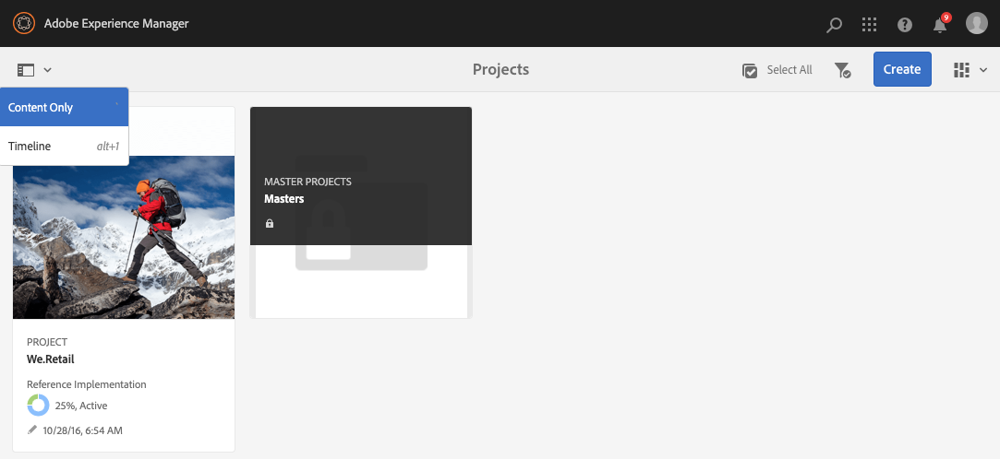

# 프로젝트 관리 {#managing-projects}

**프로젝트** 콘솔에서 프로젝트에 액세스하고 관리합니다.

콘솔을 사용하여 프로젝트를 만들고, 리소스를 프로젝트와 연결하며, 프로젝트나 리소스 링크를 삭제할 수도 있습니다.

## 액세스 요구 사항 {#access-requirements}

표준 AEM 기능을 프로젝트하므로 추가 설정이 필요하지 않습니다.

그러나 프로젝트의 사용자가 프로젝트를 만들 때, 작업/워크플로를 만들 때, 팀을 보고 관리할 때와 같이 프로젝트를 사용하는 동안 다른 사용자/그룹을 보려면 해당 사용자가 `/home/users` 및 `/home/groups`에 대한 읽기 액세스 권한을 보유해야 합니다.

이렇게 하는 가장 쉬운 방법은 **projects-users** 그룹에 `/home/users` 및 `/home/groups`에 대한 읽기 액세스 권한을 제공하는 것입니다.

## 프로젝트 만들기 {#creating-a-project}

다음 단계에 따라 프로젝트를 만듭니다.

1. **프로젝트** 콘솔에서 **만들기**&#x200B;를 클릭하여 **프로젝트 만들기** 마법사를 엽니다.
1. 템플릿을 선택하고 **다음**&#x200B;을(를) 클릭합니다. 표준 프로젝트 템플릿에 대한 자세한 내용은 [여기](/help/sites-authoring/projects.md#project-templates)를 참조하세요.

   

1. **제목** 및 **설명**&#x200B;을(를) 정의하고 필요한 경우 **썸네일** 이미지를 추가하십시오. 사용자와 사용자가 속한 그룹을 추가하거나 삭제할 수도 있습니다.

   마법사의 

1. **만들기**&#x200B;를 클릭합니다. 새 프로젝트를 열거나 콘솔로 돌아갈 것인지를 묻는 확인 메시지가 표시됩니다.

프로젝트를 만드는 절차는 모든 프로젝트 템플릿에 대해 동일합니다. 프로젝트 형식 간의 차이는 사용 가능한 [사용자 역할](/help/sites-authoring/projects.md) 및 [워크플로와 관련이 있습니다.](/help/sites-authoring/projects-with-workflows.md)

### 리소스를 프로젝트와 연결 {#associating-resources-with-your-project}

프로젝트를 사용하면 리소스를 하나의 엔티티로 그룹화하여 리소스를 전체적으로 관리할 수 있습니다. 따라서 리소스를 프로젝트에 연결해야 합니다. 이러한 리소스는 프로젝트 내에서 **타일**(으)로 그룹화됩니다. 추가할 수 있는 리소스 유형은 [프로젝트 타일](/help/sites-authoring/projects.md#project-tiles)에 설명되어 있습니다.

리소스를 프로젝트와 연결하려면 다음 작업을 수행하십시오.

1. **프로젝트** 콘솔에서 프로젝트를 엽니다.
1. **타일 추가**&#x200B;를 클릭하고 프로젝트에 연결할 타일을 선택합니다. 여러 유형의 타일을 선택할 수 있습니다.

   

1. **만들기**&#x200B;를 클릭합니다. 리소스는 프로젝트에 연결되며, 이제부터 프로젝트에서 이 리소스에 액세스할 수 있습니다.

### 타일에 항목 추가 {#adding-items-to-a-tile}

일부 타일에서는 두 개 이상의 항목을 추가할 수 있습니다. 예를 들어 한 번에 두 개 이상의 워크플로가 실행되거나 두 개 이상의 경험이 있을 수 있습니다.

타일에 항목을 추가하려면 다음 작업을 수행하십시오.

1. **프로젝트**&#x200B;에서 프로젝트로 이동한 다음 항목을 추가할 타일의 오른쪽 상단에 있는 아래쪽 V자 아이콘을 클릭하고 적절한 옵션을 선택합니다.

   * 옵션은 타일 유형에 따라 다릅니다. 예를 들어 **작업** 타일에 대한 **작업 만들기** 또는 **워크플로** 타일에 대한 **워크플로 시작**&#x200B;일 수 있습니다.

   

1. 타일을 만들 때처럼 타일에 항목을 추가합니다. 프로젝트 타일은 [여기에 설명되어 있습니다.](/help/sites-authoring/projects.md#project-tiles)

## 프로젝트 정보 보기 {#viewing-project-info}

프로젝트의 주요 목적은 연관된 정보를 한 곳에 그룹화하여 보다 쉽게 액세스하고 실행할 수 있도록 하는 것입니다. 이 정보에 액세스하는 방법에는 여러 가지가 있습니다.

### 타일 열기 {#opening-a-tile}

현재 타일에 포함된 항목을 보거나 타일의 항목을 수정 또는 삭제할 수 있습니다.

항목을 보거나 수정할 수 있도록 타일을 열려면 다음 작업을 수행하십시오.

1. 타일의 오른쪽 하단에 있는 줄임표 아이콘을 클릭합니다.

   

1. AEM에서는 선택한 프로젝트를 기반으로 타일과 연결된 항목 유형 및 필터에 대한 콘솔을 엽니다.

   

### 프로젝트 타임라인 보기 {#viewing-a-project-timeline}

프로젝트 타임라인에서는 프로젝트의 자산이 마지막으로 사용된 시기에 대한 정보를 제공합니다. 프로젝트 타임라인을 보려면 다음 단계를 따르십시오.

1. **프로젝트** 콘솔의 왼쪽 상단에 있는 레일 선택기에서 **타임라인**을 클릭합니다.
   
2. 콘솔에서 타임라인을 보려는 프로젝트를 선택합니다.
   

Assets이 레일에 표시됩니다. 완료되면 레일 선택기를 사용하여 일반 보기로 돌아갑니다.

### 비활성 프로젝트 보기 {#viewing-active-inactive-projects}

**프로젝트** 콘솔에서 활성 및 [비활성 프로젝트](#making-projects-inactive-or-active) 사이를 전환하려면 도구 모음의 **활성 프로젝트 전환** 아이콘을 클릭하십시오.

기본적으로 콘솔에는 활성 프로젝트가 표시됩니다. 비활성 프로젝트 보기로 전환하려면 **활성 프로젝트 전환** 아이콘을 한 번 클릭하십시오. 활성 프로젝트로 다시 전환하려면 다시 클릭합니다.

## 프로젝트 구성 {#organizing-projects}

**프로젝트** 콘솔을 관리 가능하게 유지하기 위해 프로젝트를 구성하는 데 도움이 되는 몇 가지 옵션을 사용할 수 있습니다.

### 프로젝트 폴더 {#project-folders}

**프로젝트** 콘솔에서 폴더를 만들어 유사한 프로젝트를 그룹화하고 구성할 수 있습니다.

1. **프로젝트** 콘솔에서 **만들기**&#x200B;를 클릭한 다음 **폴더 만들기**&#x200B;를 클릭합니다.

   

1. 폴더에 제목을 지정하고 **만들기**&#x200B;를 클릭합니다.

1. 폴더가 콘솔에 추가됩니다.

이제 폴더 내에 프로젝트를 만들 수 있습니다. 여러 폴더를 만들고 폴더를 중첩할 수도 있습니다.

### 프로젝트 비활성화 {#making-projects-inactive-or-active}

완료된 프로젝트는 비활성 상태로 표시할 수 있지만 프로젝트에 대한 정보는 계속 유지해야 합니다. [비활성 프로젝트는 이제 **프로젝트** 콘솔에 기본적으로 표시](#viewing-active-inactive-projects)됩니다.

프로젝트를 비활성화하려면 다음 단계를 따르십시오.

1. 프로젝트의 **프로젝트 속성** 창을 엽니다.
   * 콘솔에서 프로젝트를 선택하거나 **프로젝트 정보** 타일을 통해 프로젝트 내에서 이 작업을 수행할 수 있습니다.
1. **프로젝트 속성** 창에서 **프로젝트 상태** 슬라이더를 **활성**&#x200B;에서 **비활성**(으)로 변경하십시오.

   

1. 변경 내용을 저장하려면 **저장 및 닫기**&#x200B;를 클릭하십시오.

### 프로젝트 삭제 {#deleting-a-project}

프로젝트를 삭제하려면 다음 단계를 따르십시오.

1. **프로젝트** 콘솔의 최상위 수준으로 이동합니다.
1. 콘솔에서 프로젝트 선택.
1. 도구 모음에서 **삭제**&#x200B;를 클릭합니다.
1. AEM은 프로젝트 삭제 시 연결된 프로젝트 데이터를 제거/수정할 수 있습니다. **프로젝트 삭제** 대화 상자에서 필요한 옵션을 선택하십시오.
   * 프로젝트 그룹 및 역할 제거
   * 프로젝트 Assets 폴더 삭제
   * 프로젝트 워크플로우 종료

   
1. 옵션을 선택한 상태에서 프로젝트를 삭제하려면 **삭제**&#x200B;를 클릭하십시오.

프로젝트에서 자동으로 만든 그룹에 대한 자세한 내용은 [자동 그룹 만들기](/help/sites-authoring/projects.md#auto-group-creation)를 참조하세요.
