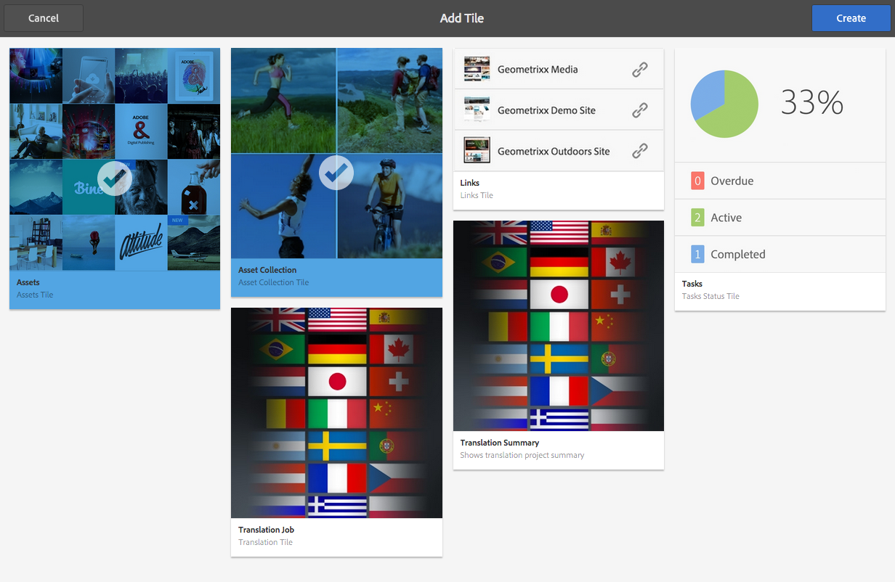
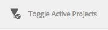

# 프로젝트 관리{#managing-projects}

프로젝트를 사용하면 리소스를 하나의 엔티티로 그룹화하여 프로젝트를 구성할 수 있습니다.

**프로젝트** 콘솔에서 다음과 같이 프로젝트에 액세스하여 작업을 수행합니다.

[프로젝트]에서 프로젝트를 작성하고 리소스를 프로젝트와 연결시키고 프로젝트 또는 리소스 링크를 삭제할 수도 있습니다. 타일을 열어 컨텐츠를 보고 타일에 항목을 추가할 수도 있습니다. 이 항목에서는 이러한 절차에 대해 설명합니다.

>[!NOTE]
>
>6.2에서는 프로젝트를 폴더로 구성하는 기능을 도입했습니다. 프로젝트 페이지에서 프로젝트나 폴더를 만들 수 있습니다.
>
>폴더가 만들어지면 해당 폴더가 표시되고 여기에서 다른 폴더 또는 프로젝트를 작성할 수 있습니다. 이 기능은 제품 캠페인, 위치, 번역 언어 등과 같은 카테고리를 기반으로 프로젝트들을 폴더로 구성하는 데 도움이 됩니다.
>
>프로젝트와 폴더는 목록 보기에서 볼 수 있으며 검색할 수도 있습니다.

>[!CAUTION]
>
>프로젝트 만들기, 작업/워크플로우 만들기, 팀 보기 및 관리와 같은 프로젝트 기능을 사용하는 동안 프로젝트의 사용자가 다른 사용자/그룹을 보려면 해당 사용자는 **/home/users** 및 **/home/groups**&#x200B;에 대한 읽기 액세스 권한이 있어야 합니다. 이를 구현하는 가장 쉬운 방법은 **projects-users** 그룹에 **/home/users** 및 **/home/groups**&#x200B;에 대한 읽기 권한을 제공하는 것입니다.

## 프로젝트 만들기 {#creating-a-project}

특히 AEM에서는 프로젝트를 작성할 때 선택할 수 있는 템플릿을 다음과 같이 제공합니다.

* 간단한 프로젝트
* 미디어 프로젝트
* 제품 사진 촬영 프로젝트
* 번역 프로젝트

프로젝트 작성 절차는 프로젝트 간에 동일합니다. 프로젝트 유형 간의 차이에는 사용 가능한 [사용자 역할](/help/sites-authoring/projects.md)과 [워크플로우](/help/sites-authoring/projects-with-workflows.md)가 포함됩니다.  새 프로젝트를 작성하려면 다음을 수행하십시오.

1. **프로젝트**&#x200B;에서 **만들기**&#x200B;를 탭/클릭하여 **프로젝트 만들기** 마법사를 엽니다.
1. 템플릿을 선택합니다. 미리 정의된 단순 프로젝트, 미디어 프로젝트, [번역 프로젝트](/help/sites-administering/tc-manage.md) 및 [제품 사진 촬영 프로젝트](/help/sites-authoring/managing-product-information.md)를 사용할 수 있습니다. **다음**&#x200B;을 클릭하십시오.

   

1. **제목** 및 **설명**&#x200B;을 정의하고 필요한 경우 **축소판** 이미지를 추가합니다. 사용자와 사용자가 속한 그룹을 추가하거나 삭제할 수도 있습니다. 또한 **고급**&#x200B;을 클릭하여 URL에 사용된 이름을 추가합니다.

   

1. **만들기**&#x200B;를 탭/클릭합니다. 새 프로젝트를 열거나 콘솔로 돌아갈 것 인지를 묻는 확인 메시지가 표시됩니다.

### 리소스를 프로젝트와 연결 {#associating-resources-with-your-project}

프로젝트를 사용하면 리소스들을 하나의 엔티티로 그룹화할 수 있으므로 리소스를 프로젝트에 연결할 수 있습니다. 이러한 리소스를 **타일**&#x200B;이라고 합니다. 추가할 수 있는 리소스 유형은 [프로젝트 타일](/help/sites-authoring/projects.md#project-tiles)에 설명되어 있습니다.

리소스를 프로젝트와 연결하려면 다음을 수행하십시오.

1. **프로젝트** 콘솔에서 프로젝트를 엽니다.
1. **타일 추가**&#x200B;를 탭/클릭하고 프로젝트에 연결할 타일을 선택합니다. 여러 유형의 타일을 선택할 수 있습니다.

   

   >[!NOTE]
   >
   >프로젝트와 연결할 수 있는 프로젝트 타일은 [프로젝트 타일](/help/sites-authoring/projects.md#project-tiles)에 자세히 설명되어 있습니다.

1. **만들기**&#x200B;를 탭/클릭합니다. 리소스는 프로젝트에 연결되며, 이제부터 프로젝트에서 이 리소스에 액세스할 수 있습니다.

### 프로젝트 또는 리소스 링크 삭제 {#deleting-a-project-or-resource-link}

콘솔에서 프로젝트를 삭제하거나 프로젝트에서 연결된 리소스를 삭제하는 데에는 동일한 방법이 사용됩니다.

1. 적절한 위치로 이동합니다.

   * 프로젝트를 삭제하려면 **프로젝트** 콘솔의 최상위 수준으로 이동하십시오.
   * 프로젝트 내의 리소스 링크를 삭제하려면 **프로젝트** 콘솔에서 프로젝트를 여십시오.

1. **선택**&#x200B;을 클릭하고 프로젝트나 리소스 링크를 선택하여 선택 모드에 들어갑니다.
1. **삭제**&#x200B;를 탭/클릭합니다.

1. 대화 상자에서 삭제를 확정해야 합니다. 확정하면, 프로젝트 또는 리소스 링크가 삭제됩니다. 선택 모드를 종료하려면 **선택 취소**&#x200B;를 탭/클릭하십시오.

>[!NOTE]
>
>프로젝트를 생성하고 사용자를 다양한 역할에 추가하면 연결된 권한을 관리하도록 프로젝트와 연결된 그룹이 자동으로 생성됩니다. 예를 들어 Myproject라는 프로젝트에는 세 개의 그룹 **Myproject 소유자**, **Myproject 편집자**, **Myproject 관찰자**&#x200B;가 있습니다. 그러나 프로젝트가 삭제되는 경우에는 해당 그룹이 자동으로 삭제되지 않습니다. 관리자는 **도구** > **보안** > **그룹**&#x200B;에서 직접 그룹을 삭제해야 합니다.

### 타일에 항목 추가 {#adding-items-to-a-tile}

일부 타일에서는 두 개 이상의 항목을 추가할 수 있습니다. 예를 들어, 한 번에 두 개 이상의 워크플로우가 실행되거나 두 개 이상의 경험이 있을 수 있습니다.

타일에 항목을 추가하려면 다음을 수행하십시오.

1. **프로젝트**&#x200B;에서 프로젝트를 탐색하고 항목을 추가할 타일의 추가 + 아이콘을 클릭합니다.

   

1. 새 타일을 만들 때처럼 타일에 항목을 추가합니다. 프로젝트 타일은 [여기](/help/sites-authoring/projects.md#project-tiles)에 설명됩니다. 이 예제에서는 워크플로우가 더 추가되었습니다.

   

### 타일 열기 {#opening-a-tile}

현재 타일에 포함된 항목을 보거나 타일의 항목을 수정 또는 삭제할 수 있습니다.

항목을 보거나 수정할 수 있도록 타일을 열려면 다음을 수행하십시오.

1. 프로젝트 콘솔에서 줄임표(...)를 탭/클릭합니다.

   

1. 해당 타일에 있는 항목이 나열됩니다. 선택 모드에 들어가 항목을 수정하거나 삭제할 수 있습니다.

   

## 프로젝트 통계 보기 {#viewing-project-statistics}

프로젝트 통계를 보려면 **프로젝트** 콘솔에서 **통계 보기 표시**&#x200B;를 클릭하십시오. 각 프로젝트에 대한 완료 수준이 표시됩니다. **통계 보기 표시**&#x200B;를 다시 클릭하여 **프로젝트** 콘솔로 이동합니다.

### 프로젝트 타임라인 보기 {#viewing-a-project-timeline}

프로젝트 타임라인에서는 프로젝트의 자산이 마지막으로 사용된 시기에 대한 정보를 제공합니다. 프로젝트 타임라인을 보려면 **타임라인**&#x200B;을 클릭/탭한 다음 선택 모드를 시작하고 프로젝트를 선택합니다. 자산은 왼쪽 창에 표시됩니다. **프로젝트** 콘솔로 돌아가려면 **타임라인**&#x200B;을 클릭/탭합니다.

### 활성/비활성 프로젝트 보기 {#viewing-active-inactive-projects}

활성 프로젝트와 비활성 프로젝트 간에 전환하려면 **프로젝트** 콘솔에서 **활성 프로젝트 전환**&#x200B;을 클릭합니다. 아이콘 옆에 확인 표시가 있으면 활성 프로젝트를 표시 중입니다.

아이콘 옆에 확인 x가 있으면 비활성 프로젝트를 표시 중입니다.

## 프로젝트 비활성화 또는 활성화 {#making-projects-inactive-or-active}

완료했지만 프로젝트에 대한 정보를 계속 유지하려는 경우 프로젝트를 비활성화할 수 있습니다.

프로젝트를 비활성(또는 활성) 상태로 만들려면 다음을 수행하십시오.

1. **프로젝트** 콘솔에서 프로젝트를 열고 **프로젝트 정보** 타일을 찾습니다.

   >[!NOTE]
   프로젝트 타일이 아직 프로젝트에 없을 경우 이 타일을 추가해야 할 수 있습니다. [타일 추가](#adding-items-to-a-tile)를 참조하십시오.

1. **편집**&#x200B;을 탭/클릭합니다.
1. 선택기를 **활성**&#x200B;에서 **비활성**(또는 그 반대)으로 변경합니다.

   

1. **완료**&#x200B;를 탭/클릭하여 변경 내용을 저장합니다.

