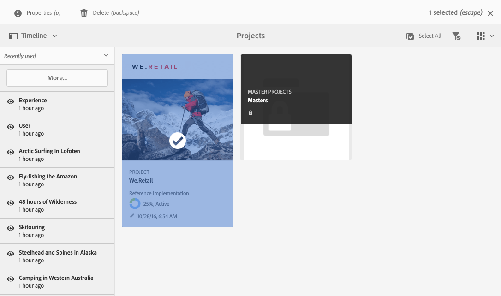

# 프로젝트 관리 {#managing-projects}

에서 **프로젝트** 콘솔에서는 프로젝트에 액세스하고 관리합니다.

콘솔을 사용하여 프로젝트를 만들고, 리소스를 프로젝트와 연결하며, 프로젝트 또는 리소스 링크를 삭제할 수도 있습니다.

## 액세스 요구 사항 {#access-requirements}

Project는 표준 AEM 기능을 제공하며 추가 설정이 필요하지 않습니다.

그러나 프로젝트의 사용자가 프로젝트를 만들거나, 작업/워크플로우를 만들거나, 팀을 보고 관리할 때와 같이 프로젝트를 사용하는 동안 다른 사용자/그룹을 보려면 해당 사용자에게는 읽기 액세스 권한이 있어야 합니다 `/home/users` 및 `/home/groups`.

이렇게 하는 가장 쉬운 방법은 **projects-users** 그룹 읽기 액세스 권한 `/home/users` 및 `/home/groups`.

## 프로젝트 만들기 {#creating-a-project}

다음 단계에 따라 새 프로젝트를 만듭니다.

1. 에서 **프로젝트** 콘솔, 탭 또는 클릭 **만들기** 열다 **프로젝트 만들기** 마법사
1. 템플릿을 선택하고 **다음**&#x200B;을 클릭합니다. 표준 프로젝트 템플릿에 대해 자세히 알 수 있습니다 [여기 있습니다.](/help/sites-authoring/projects.md#project-templates)

   

1. **제목** 및 **설명**&#x200B;을 정의한 다음 필요한 경우 **썸네일** 이미지를 추가합니다. 사용자와 사용자가 속한 그룹을 추가하거나 삭제할 수도 있습니다.

   

1. **만들기**&#x200B;를 탭/클릭합니다. 새 프로젝트를 열거나 콘솔로 돌아갈 것 인지를 묻는 확인 메시지가 표시됩니다.

프로젝트를 만드는 절차는 모든 프로젝트 템플릿에 대해 동일합니다. 사용 가능한 프로젝트 유형 간의 차이는 [사용자 역할](/help/sites-authoring/projects.md) 및 [워크플로우.](/help/sites-authoring/projects-with-workflows.md)

### 리소스를 프로젝트와 연결 {#associating-resources-with-your-project}

프로젝트를 사용하면 리소스를 하나의 엔티티로 그룹화하여 전체적으로 관리할 수 있습니다. 따라서 리소스를 프로젝트에 연결해야 합니다. 이러한 리소스는 프로젝트 내에서 다음과 같이 그룹화됩니다 **타일**. 추가할 수 있는 리소스 유형은 [프로젝트 타일](/help/sites-authoring/projects.md#project-tiles)에 설명되어 있습니다.

리소스를 프로젝트와 연결하려면 다음 작업을 수행하십시오.

1. **프로젝트** 콘솔에서 프로젝트를 엽니다.
1. **타일 추가**&#x200B;를 탭/클릭하고 프로젝트에 연결할 타일을 선택합니다. 여러 유형의 타일을 선택할 수 있습니다.

   

1. **만들기**&#x200B;를 탭/클릭합니다. 리소스는 프로젝트에 연결되며, 이제부터 프로젝트에서 이 리소스에 액세스할 수 있습니다.

### 타일에 항목 추가 {#adding-items-to-a-tile}

일부 타일에서는 두 개 이상의 항목을 추가할 수 있습니다. 예를 들어 한 번에 두 개 이상의 워크플로가 실행되거나 두 개 이상의 경험이 있을 수 있습니다.

타일에 항목을 추가하려면 다음을 수행합니다.

1. in **프로젝트**&#x200B;로 이동하고 항목을 추가할 타일의 오른쪽 상단에 있는 아래쪽 V자 모양 아이콘을 클릭하고 적절한 옵션을 선택합니다.

   * 옵션은 타일 유형에 따라 달라집니다. 예를 들면 다음과 같습니다 **작업 만들기** 대상 **작업** 타일 또는 **워크플로우 시작** 대상 **워크플로우** 타일.

   

1. 새 타일을 만들 때처럼 타일에 항목을 추가합니다. 프로젝트 타일은 [여기](/help/sites-authoring/projects.md#project-tiles)에 설명됩니다.

## 프로젝트 정보 보기 {#viewing-project-info}

프로젝트의 주요 목적은 관련 정보를 한 위치에 그룹화하여 보다 쉽게 액세스할 수 있고 실행 가능하게 하는 것입니다. 이 정보에 액세스하는 방법에는 여러 가지가 있습니다.

### 타일 열기 {#opening-a-tile}

현재 타일에 포함된 항목을 보거나 타일의 항목을 수정 또는 삭제할 수 있습니다.

항목을 보거나 수정할 수 있도록 타일을 열려면 다음 작업을 수행하십시오.

1. 타일의 오른쪽 하단에 있는 생략 부호 아이콘을 탭하거나 클릭합니다.

   

1. AEM에서 선택한 프로젝트에 따라 타일과 연결된 항목 유형과 필터 유형에 대한 콘솔을 엽니다.

   

### 프로젝트 타임라인 보기 {#viewing-a-project-timeline}

프로젝트 타임라인에서는 프로젝트의 에셋이 마지막으로 사용된 시기에 대한 정보를 제공합니다. 프로젝트 타임라인을 보려면 다음 단계를 따르십시오.

1. 에서 **프로젝트** 콘솔, 클릭 또는 탭 **타임라인** 콘솔 왼쪽 상단에 있는 레일 선택기에서 을 클릭합니다.
   
2. 콘솔에서 해당 타임라인을 볼 프로젝트를 선택합니다.
   

자산이 레일에 표시됩니다. 완료되면 레일 선택기를 사용하여 일반 보기로 돌아갑니다.

### 비활성 프로젝트 보기 {#viewing-active-inactive-projects}

활성 및 [비활성 프로젝트,](#making-projects-inactive-or-active) 에서 **프로젝트** 콘솔에서 **활성 프로젝트 전환** 아이콘 을 클릭하여 제품에서 사용할 수 있습니다.

기본적으로 콘솔에 활성 프로젝트가 표시됩니다. 을(를) 클릭합니다. **활성 프로젝트 전환** 아이콘을 한 번 클릭하여 비활성 프로젝트 보기로 전환합니다. 다시 클릭하여 활성 프로젝트로 다시 전환합니다.

## 프로젝트 구성 {#organizing-projects}

프로젝트를 구성하여 **프로젝트** 콘솔을 관리할 수 있습니다.

### 프로젝트 폴더 {#project-folders}

에서 폴더를 만들 수 있습니다 **프로젝트** 유사한 프로젝트를 그룹화하고 구성하는 콘솔.

1. 에서 **프로젝트** 콘솔 탭 또는 클릭 **만들기** 그리고 **폴더 만들기**.

   

1. 폴더에 제목을 지정하고 **만들기**.

1. 폴더가 콘솔에 추가됩니다.

이제 폴더 내에서 프로젝트를 만들 수 있습니다. 여러 폴더를 만들고 폴더를 중첩할 수도 있습니다.

### 프로젝트 비활성화 {#making-projects-inactive-or-active}

완료되었으나 프로젝트에 대한 정보를 계속 유지하려는 경우 프로젝트를 비활성 상태로 표시할 수 있습니다. [이제 비활성 프로젝트가 표시됩니다.](#viewing-active-inactive-projects) 기본적으로 **프로젝트** 콘솔.

프로젝트를 비활성화하려면 다음 단계를 따르십시오.

1. 를 엽니다. **프로젝트 속성** 프로젝트 창.
   * 콘솔에서 프로젝트를 선택하거나, **프로젝트 정보** 타일.
1. 에서 **프로젝트 속성** 창, 변경 **프로젝트 상태** 슬라이더 **활성** to **비활성**.

   

1. 탭 또는 클릭 **저장 및 닫기** 변경 사항을 저장하려면 을 클릭합니다.

### 프로젝트 삭제 {#deleting-a-project}

프로젝트를 삭제하려면 다음 단계를 따르십시오.

1. 의 최상위 수준으로 이동합니다 **프로젝트** 콘솔.
1. 콘솔에서 프로젝트 선택.
1. 탭 또는 클릭 **삭제** 클릭합니다.
1. AEM은 프로젝트 삭제 시 관련 프로젝트 데이터를 제거/수정할 수 있습니다. 에서 필요한 옵션을 선택합니다 **프로젝트 삭제** 대화 상자.
   * 프로젝트 그룹 및 역할 제거
   * 프로젝트 자산 폴더 삭제
   * 프로젝트 워크플로우 종료

   
1. 탭 또는 클릭 **삭제** 옵션을 선택하여 프로젝트를 삭제합니다.

프로젝트에 의해 자동으로 생성된 그룹에 대한 자세한 내용은 [자동 그룹 만들기](/help/sites-authoring/projects.md#auto-group-creation) 자세한 내용
