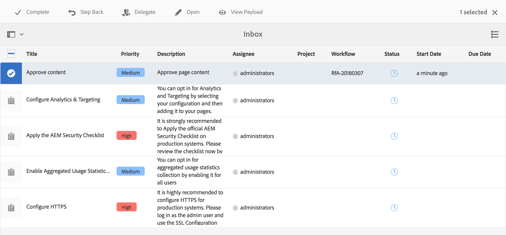
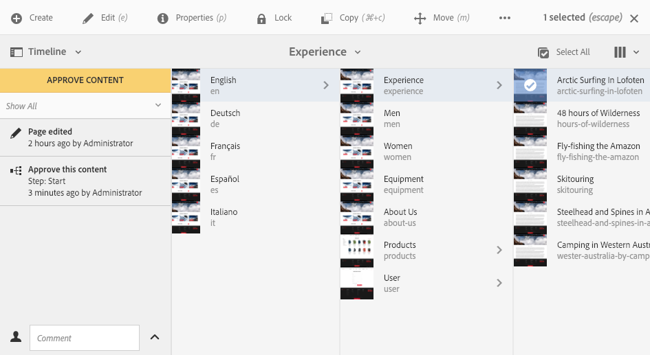
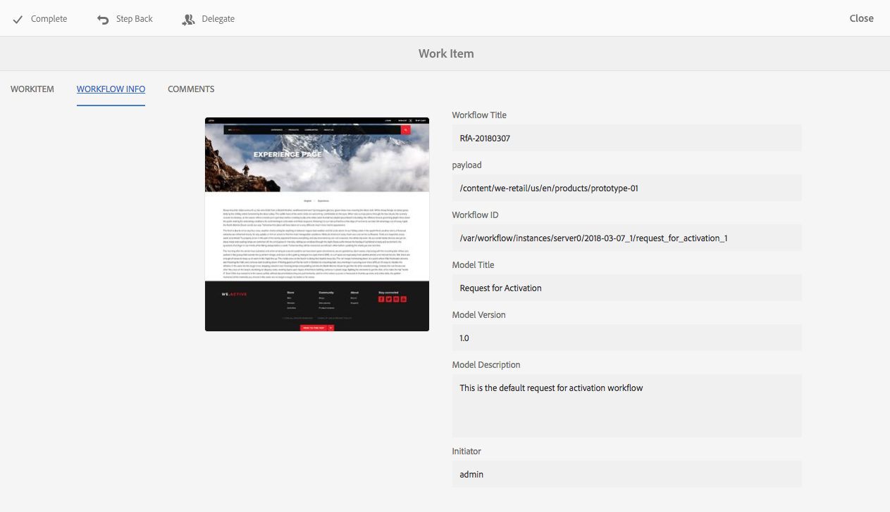
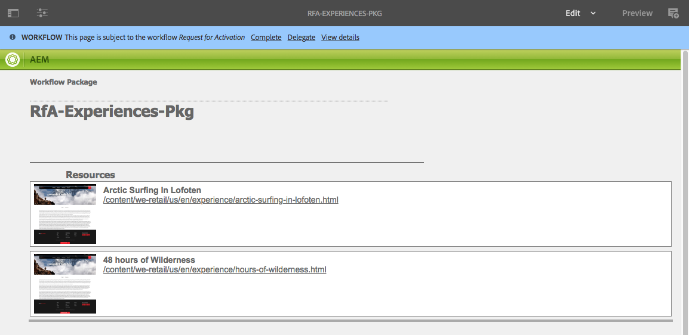

# 워크플로우에 참여{#participating-in-workflows}

워크플로우는 일반적으로 페이지나 자산에 대해 사람이 활동을 수행해야 하는 단계를 포함합니다. 워크플로우는 활동을 수행할 사용자 또는 그룹을 선택하고 해당 개인 또는 그룹에 작업 항목을 지정합니다. 사용자는 알림을 받은 다음, 적절한 작업을 수행할 수 있습니다.

* [알림 보기](#notifications-of-available-workflow-actions)
* [참가자 단계 완료](#completing-a-participant-step)
* [참가자 단계 위임](#delegating-a-participant-step)
* [참가자 단계에서 뒤로 이동 수행](#performing-step-back-on-a-participant-step)
* [워크플로우 항목을 열어 세부 사항 확인(및 작업 수행)](#opening-a-workflow-item-to-view-details-and-take-actions)
* [워크플로우 페이로드(여러 리소스) 보기](#viewing-the-workflow-payload-multiple-resources)

## 사용 가능한 워크플로우 작업의 알림 {#notifications-of-available-workflow-actions}

작업 항목(예: **컨텐츠 승인**)을 지정받으면 다양한 경고 및/또는 알림이 나타납니다.

* [알림](/help/sites-authoring/inbox.md) 표시기(도구 모음)가 증가합니다.

   

* 항목이 알림 [받은 편지함](/help/sites-authoring/inbox.md)에 나열됩니다.

   

* 페이지 편집기를 사용하는 경우 상태 표시줄에 다음 내용이 표시됩니다.

   * 페이지에 적용되는 워크플로우의 이름: 예를 들어, 활성화 요청.
   * 워크플로우의 현재 단계에 대해 현재 사용자가 사용할 수 있는 모든 작업: 예를 들어, 완료, 위임, 세부 사항 보기.
   * 페이지가 적용되는 워크플로우의 수. 다음을 작업을 수행할 수 있습니다.

      * 왼쪽/오른쪽 화살표를 사용하여 다양한 워크플로우의 상태 정보를 탐색할 수 있습니다.
      * 실제 숫자를 클릭/탭하여 적용 가능한 모든 워크플로우가 있는 드롭다운 목록을 연 다음, 상태 표시줄에 표시할 워크플로우를 선택할 수 있습니다.

   

   >[!NOTE]
   >
   >상태 표시줄은 워크플로우 권한이 있는 사용자(예: `workflow-users` 그룹의 구성원)에게만 표시됩니다.
   >
   >
   >현재 사용자가 워크플로우의 현재 단계와 직접적으로 관련이 있으면 작업이 표시됩니다.

* 리소스에 대해 **타임라인**&#x200B;이 열려 있으면 워크플로우 단계가 표시됩니다. 경고 배너를 클릭/탭하면 사용 가능한 작업도 표시됩니다.

   

### 참가자 단계 완료 {#completing-a-participant-step}

워크플로우가 다음 단계로 진행될 수 있도록 하는 항목을 완료할 수 있습니다.

이 작업에서는 다음 내용을 표시할 수 있습니다.

* **다음 단계**: 다음으로 수행할 단계입니다. 제공된 목록에서 선택할 수 있습니다.
* **주석**: 필요한 경우

다음 중 하나에서 참가자 단계를 완료할 수 있습니다.

* [받은 편지함](#completing-a-participant-step-inbox)
* [페이지 편집기](#completing-a-participant-step-page-editor)
* [타임라인](#completing-a-participant-step-timeline)
* [워크플로우를 열어 세부 사항을 볼](#opening-a-workflow-item-to-view-details-and-take-actions) 때

#### 참가자 단계 완료 - 받은 편지함  {#completing-a-participant-step-inbox}

다음 절차를 사용하여 작업 항목을 완료하십시오.

1. **[AEM 받은 편지함](/help/sites-authoring/inbox.md)**&#x200B;을 엽니다.
1. 작업을 수행할 워크플로우 항목을 선택합니다(썸네일 탭/클릭).
1. 도구 모음에서 **완료**&#x200B;를 선택합니다.
1. **작업 항목 완료** 대화 상자가 열립니다. 드롭다운 선택기에서 **다음 단계**&#x200B;를 선택하고 필요한 경우 **주석**&#x200B;을 추가합니다.
1. **OK**&#x200B;을 사용하여 단계를 완료하거나 **취소**&#x200B;를 사용하여 작업을 중단합니다.

#### 참가자 단계 완료 - 페이지 편집기 {#completing-a-participant-step-page-editor}

다음 절차를 사용하여 작업 항목을 완료하십시오.

1. [편집할 페이지](/help/sites-authoring/managing-pages.md#opening-a-page-for-editing)를 엽니다.
1. 맨 위의 상태 표시줄에서 **완료**&#x200B;를 선택합니다.
1. **작업 항목 완료** 대화 상자가 열립니다. 드롭다운 선택기에서 **다음 단계**&#x200B;를 선택하고 필요한 경우 **주석**&#x200B;을 추가합니다.
1. **OK**&#x200B;을 사용하여 단계를 완료하거나 **취소**&#x200B;를 사용하여 작업을 중단합니다.

#### 참가자 단계 완료 - 타임라인 {#completing-a-participant-step-timeline}

타임라인을 사용하여 단계를 완료하고 진행할 수도 있습니다.

1. 필요한 페이지를 선택하고 **타임라인**&#x200B;을 엽니다(또는 **타임라인**&#x200B;을 열고 페이지를 선택합니다.).

   

1. 경고 배너를 클릭/탭하여 사용 가능한 작업을 표시합니다. **고급**&#x200B;을 선택합니다.

   

1. 워크플로우에 따라 다음 단계를 선택할 수 있습니다.

   

1. **고급**&#x200B;을 선택하여 작업을 확인합니다.

### 참가자 단계 위임  {#delegating-a-participant-step}

하나의 단계가 사용자에게 지정되었지만 어떠한 이유로 작업을 수행할 수 없는 경우, 다른 사용자 또는 그룹에 해당 단계를 위임할 수 있습니다.

위임에 사용할 수 있는 사용자는 작업 항목이 지정된 사용자에게 따라 다릅니다.

* 작업 항목이 그룹에 지정된 경우 그룹 구성원을 사용할 수 있습니다.
* 작업 항목이 그룹에 지정된 후 사용자에게 위임된 경우 그룹 구성원과 그룹을 사용할 수 있습니다.
* 작업 항목이 단일 사용자에게 지정된 경우에는 작업 항목을 위임할 수 없습니다.

이 작업에서는 다음 내용을 표시할 수 있습니다.

* **사용자**: 위임을 받을 사용자. 제공된 목록에서 선택할 수 있습니다.
* **주석**: 필요한 경우

다음 중 하나에서 참가자 단계를 위임할 수 있습니다.

* [받은 편지함](#delegating-a-participant-step-inbox)
* [페이지 편집기](#delegating-a-participant-step-page-editor)
* [타임라인](#delegating-a-participant-step-timeline)
* [워크플로우를 열어 세부 사항을 볼](#opening-a-workflow-item-to-view-details-and-take-actions) 때

#### 참가자 단계 위임 - 받은 편지함  {#delegating-a-participant-step-inbox}

다음 절차를 사용하여 작업 항목을 위임하십시오.

1. **[AEM 받은 편지함](/help/sites-authoring/inbox.md)**&#x200B;을 엽니다.
1. 작업을 수행할 워크플로우 항목을 선택합니다(썸네일 탭/클릭).
1. 도구 모음에서 **위임**&#x200B;을 선택합니다.
1. 대화 상자가 열립니다. 드롭다운 선택기에서 **사용자**(그룹일 수도 있음)를 지정하고 필요한 경우 **주석**&#x200B;을 추가합니다.
1. **OK**&#x200B;을 사용하여 단계를 완료하거나 **취소**&#x200B;를 사용하여 작업을 중단합니다.

#### 참가자 단계 위임 - 페이지 편집기 {#delegating-a-participant-step-page-editor}

다음 절차를 사용하여 작업 항목을 위임하십시오.

1. [편집할 페이지](/help/sites-authoring/managing-pages.md#opening-a-page-for-editing)를 엽니다.
1. 맨 위의 상태 표시줄에서 **위임**&#x200B;을 선택합니다.
1. 대화 상자가 열립니다. 드롭다운 선택기에서 **사용자**(그룹일 수도 있음)를 지정하고 필요한 경우 **주석**&#x200B;을 추가합니다.
1. **OK**&#x200B;을 사용하여 단계를 완료하거나 **취소**&#x200B;를 사용하여 작업을 중단합니다.

#### 참가자 단계 위임 - 타임라인 {#delegating-a-participant-step-timeline}

타임라인을 사용하여 단계를 위임 및/또는 지정할 수도 있습니다.

1. 필요한 페이지를 선택하고 **타임라인**&#x200B;을 엽니다(또는 **타임라인**&#x200B;을 열고 페이지를 선택합니다.).
1. 경고 배너를 클릭/탭하여 사용 가능한 작업을 표시합니다. **할당자 변경**&#x200B;을 선택하십시오.

   

1. 새 할당자를 지정합니다.

   

1. **할당**&#x200B;을 선택하여 작업을 확인합니다.

### 참가자 단계에서 뒤로 이동 수행 {#performing-step-back-on-a-participant-step}

단계 또는 일련의 단계를 반복해야 하는 경우 다시 돌아갈 수 있습니다. 따라서 워크플로우에서 이전에 발생한 단계를 선택하여 다시 처리할 수 있습니다. 워크플로우가 사용자가 지정한 단계로 돌아가서 그 단계에서부터 진행됩니다.

이 작업에서는 다음 내용을 표시할 수 있습니다.

* **이전 단계**: 돌아갈 단계입니다. 제공된 목록에서 선택할 수 있습니다.
* **주석**: 필요한 경우

다음 중 하나에서 참가자 단계를 뒤로 이동할 수 있습니다.

* [받은 편지함](#performing-step-back-on-a-participant-step-inbox)
* [페이지 편집기](#performing-step-back-on-a-participant-step-page-editor)
* [타임라인](#performing-step-back-on-a-participant-step-timeline)
* [워크플로우를 열어 세부 사항을 볼](#opening-a-workflow-item-to-view-details-and-take-actions) 때

#### 참가자 단계에서 뒤로 이동 수행 - 받은 편지함  {#performing-step-back-on-a-participant-step-inbox}

다음 절차를 사용하여 뒤 단계로 이동하십시오.

1. **[AEM 받은 편지함](/help/sites-authoring/inbox.md)**&#x200B;을 엽니다.
1. 작업을 수행할 워크플로우 항목을 선택합니다(썸네일 탭/클릭).
1. **뒤로 이동**&#x200B;을 선택하여 대화 상자를 엽니다.

1. **이전 단계**&#x200B;를 지정하고 필요한 경우 **주석**&#x200B;을 추가합니다.
1. **OK**&#x200B;을 사용하여 단계를 완료하거나 **취소**&#x200B;를 사용하여 작업을 중단합니다.

#### 참가자 단계에서 뒤로 이동 수행 - 페이지 편집기 {#performing-step-back-on-a-participant-step-page-editor}

다음 절차를 사용하여 뒤 단계로 이동하십시오.

1. [편집할 페이지](/help/sites-authoring/managing-pages.md#opening-a-page-for-editing)를 엽니다.
1. 맨 위의 상태 표시줄에서 **뒤로 이동**&#x200B;을 선택합니다.
1. **이전 단계**&#x200B;를 지정하고 필요한 경우 **주석**&#x200B;을 추가합니다.
1. **OK**&#x200B;을 사용하여 단계를 완료하거나 **취소**&#x200B;를 사용하여 작업을 중단합니다.

#### 참가자 단계에서 뒤로 이동 수행 - 타임라인 {#performing-step-back-on-a-participant-step-timeline}

타임라인을 사용하여 이전 단계로 롤백(뒤로 이동)할 수도 있습니다.

1. 필요한 페이지를 선택하고 **타임라인**&#x200B;을 엽니다(또는 **타임라인**&#x200B;을 열고 페이지를 선택합니다.).
1. 경고 배너를 클릭/탭하여 사용 가능한 작업을 표시합니다. **롤백**&#x200B;을 선택하십시오.

   

1. 워크플로우가 돌아가야 하는 단계를 지정합니다.

   

1. **롤백**&#x200B;을 선택하여 작업을 확인합니다.

### 워크플로우 항목을 열어 세부 사항 확인(및 작업 수행) {#opening-a-workflow-item-to-view-details-and-take-actions}

워크플로우 작업 항목에 대한 세부사항을 보고 적절한 작업을 수행하십시오.

워크플로우 세부 사항은 탭으로 표시되며, 도구 모음에서 적절한 작업을 사용할 수 있습니다.

* **작업 항목** 탭:

   

* **워크플로우** 정보 탭:

   

   모델에 대해 [워크플로우 단계](/help/sites-developing/workflows.md#workflow-stages)가 구성된 경우 다음과 같이 진행 상태를 볼 수 있습니다.

   

* **주석** 탭:

   

다음 중 하나에서 작업 항목 세부 사항을 열 수 있습니다.

* [받은 편지함](#performing-step-back-on-a-participant-step-inbox)
* [페이지 편집기](#performing-step-back-on-a-participant-step-page-editor)

#### 워크플로우 세부 사항 열기 - 받은 편지함  {#opening-workflow-details-inbox}

워크플로우 항목을 열고 세부 사항을 보려면 다음을 수행하십시오.

1. **[AEM 받은 편지함](/help/sites-authoring/inbox.md)**&#x200B;을 엽니다.
1. 작업을 수행할 워크플로우 항목을 선택합니다(썸네일 탭/클릭).
1. **열기**&#x200B;를 선택하여 정보 탭을 엽니다.

1. 필요할 경우 적절한 작업을 선택하고 세부 사항을 제공한 후 **확인**&#x200B;을 클릭하여 적용합니다(확인하지 않으려면 **취소**&#x200B;를 클릭합니다.).
1. **저장** 또는 **취소**&#x200B;를 사용하여 종료합니다.

#### 워크플로우 세부 사항 열기 - 페이지 편집기 {#opening-workflow-details-page-editor}

워크플로우 항목을 열고 세부 사항을 보려면 다음을 수행하십시오.

1. [편집할 페이지](/help/sites-authoring/managing-pages.md#opening-a-page-for-editing)를 엽니다.
1. 상태 표시줄에서 **세부 사항 보기**&#x200B;를 선택하여 정보 탭을 엽니다.

1. 필요할 경우 적절한 작업을 선택하고 세부 사항을 제공한 후 **확인**&#x200B;을 클릭하여 적용합니다(확인하지 않으려면 **취소**&#x200B;를 클릭합니다.).
1. **저장** 또는 **취소**&#x200B;를 사용하여 종료합니다.

### 워크플로우 페이로드(여러 리소스) 보기 {#viewing-the-workflow-payload-multiple-resources}

워크플로우 인스턴스와 연결된 페이로드에 대한 세부 사항을 볼 수 있습니다. 처음에 패키지에 있는 리소스가 표시된 다음, 드릴다운하여 개별 페이지를 표시할 수 있습니다.

워크플로우 인스턴스의 페이로드 및 리소스를 보려면 다음을 수행하십시오.

1. **[AEM 받은 편지함](/help/sites-authoring/inbox.md)**&#x200B;을 엽니다.
1. 작업을 수행할 워크플로우 항목을 선택합니다(썸네일 탭/클릭).
1. 도구 모음에서 **페이로드 보기**&#x200B;를 선택하여 대화 상자를 엽니다.

   워크플로우 패키지는 단순히 저장소 내 경로에 대한 포인터 컬렉션이므로 여기에 항목을 추가/제거/수정하여 워크플로우 패키지에서 참조되는 내용을 조정할 수 있습니다. **리소스 정의** 구성 요소를 사용하여 새 항목을 추가하십시오.

   

1. 링크를 사용하여 개별 페이지를 열 수 있습니다.
