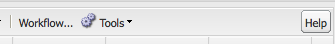

# 기본 처리{#basic-handling}

>[!NOTE]
>
>* 이 페이지는 AEM 작성 환경을 사용할 때 기본 처리에 대한 개요를 알 수 있도록 설계되었습니다. **사이트** 콘솔을 기본으로 사용합니다.
   >
   >
* 일부 기능을 일부 콘솔에서 사용할 수 없거나, 추가 기능을 일부 콘솔에서 사용할 수 있습니다. 개별 콘솔에 대한 특정 정보 및 관련 기능은 다른 페이지에서 더 자세히 다룹니다.
>* AEM 전체에서 키보드 단축키를 사용할 수 있습니다. 특히 [콘솔을 사용하고](/help/sites-classic-ui-authoring/author-env-keyboard-shortcuts.md) [페이지를 편집할 때 ](/help/sites-classic-ui-authoring/classic-page-author-keyboard-shortcuts.md)이러한 키보드 단축키를 사용할 수 있습니다.

>

## 시작 화면 {#the-welcome-screen}

클래식 UI는 클릭, 두 번 클릭 및 [컨텍스트 메뉴](#context-menus)를 비롯하여 작업을 탐색 및 시작하는 데 필요한 잘 알려진 메커니즘을 사용하여 콘솔 선택 기능을 제공합니다.

로그인 시 [시작] 화면이 표시되고, 이 화면에 콘솔 및 서비스에 대한 링크 목록이 제공됩니다.

## 콘솔 {#consoles}

기본 콘솔은 다음과 같습니다.

<table>
 <tbody>
  <tr>
   <td><strong>콘솔</strong></td>
   <td><strong>목적</strong></td>
  </tr>
  <tr>
   <td><strong>시작</strong></td>
   <td>AEM의 주요 기능에 대한 개요를 제공하며 직접 액세스(링크를 통해)할 수 있습니다.</td>
  </tr>
  <tr>
   <td><strong>디지털 에셋</strong>  </td>
   <td>이러한 콘솔에서는 이미지, 비디오, 문서 및 오디오 파일 등의 <a href="/help/sites-classic-ui-authoring/classicui-assets.md">디지털 자산을 관리하고 </a> 가져올 수 있습니다. 그런 다음 동일한 AEM 인스턴스에서 실행되는 웹 사이트에서 이러한 자산을 사용할 수 있습니다.   </td>
  </tr>
  <tr>
   <td><strong>론치</strong></td>
   <td>이것은 <a href="/help/sites-classic-ui-authoring/classic-launches.md">launch</a>를 관리하는 데 도움이 됩니다. 향후 하나 이상의 활성화된 웹 페이지 릴리스에 필요한 컨텐츠를 개발할 수 있도록 해줍니다.  <i>참고:터치 지원 UI에서는 참조 레일과 함께 사이트 콘솔에서 동일한 기능의 상당 부분을 사용할 수 있습니다.</i> <i>필요한 경우 [도구] 콘솔에서 이 콘솔을 사용할 수 있습니다. [작업]을 선택하고 [론치]를 선택하면 됩니다.</i></td>
  </tr>
  <tr>
   <td><strong>받은 편지함 </strong></td>
   <td>많은 경우, 매우 많은 사람이 워크플로우 하위 작업에 관련되어 있고, 각자는 다음 사람에게 작업을 넘겨주기 전에 자신의 단계를 완료해야 합니다. 받은 편지함에서 그러한 작업과 관련된 알림을 볼 수 있습니다. 자세한 내용은 <a href="/help/sites-administering/workflows.md">워크플로우 작업</a>을 참조하십시오.   </td>
  </tr>
  <tr>
   <td><strong>태깅</strong></td>
   <td>[태깅] 콘솔에서는 태그를 관리할 수 있습니다. 태그는 컨텐츠를 분류하고 컨텐츠에 주석을 다는 데 사용할 수 있는 간단한 이름 또는 구로서 컨텐츠를 찾고 구성하는 작업을 더 쉽게 해줍니다. 자세한 내용은 <a href="/help/sites-classic-ui-authoring/classic-feature-tags.md">태그 사용 및 관리</a>를 참조하십시오.</td>
  </tr>
  <tr>
   <td><strong>도구</strong></td>
   <td><a href="/help/sites-administering/tools-consoles.md">도구 콘솔</a>에서는 웹 사이트, 디지털 자산 및 컨텐츠 저장소의 다른 측면을 관리하는 데 도움이 되는 많은 전문 도구 및 콘솔에 액세스할 수 있습니다.</td>
  </tr>
  <tr>
   <td><strong>사용자</strong></td>
   <td>이러한 콘솔에서는 사용자와 그룹의 액세스 권한을 관리할 수 있습니다. 자세한 내용은 <a href="/help/sites-administering/security.md">사용자 관리 및 보안</a>을 참조하십시오.  </td>
  </tr>
  <tr>
   <td><strong>웹 사이트</strong></td>
   <td>사이트/웹 사이트 콘솔에서는 AEM 인스턴스에서 실행되는<a href="/help/sites-classic-ui-authoring/classic-page-author.md"> 웹 사이트를 만들고, 보고, 관리할 수 있습니다. </a> 이 콘솔을 통해 웹 사이트 페이지를 만들고, 복사하고, 이동하고 삭제하고, 워크플로우를 시작하고, (게시) 페이지를 활성화할 수 있습니다. 페이지를 열어 편집할 수도 있습니다.  </td>
  </tr>
  <tr>
   <td><strong>워크플로우</strong></td>
   <td>워크플로우는 일부 작업을 완료하는 프로세스를 설명하는 일련의 정의된 단계입니다. 많은 경우, 매우 많은 사람이 작업에 관련되어 있고, 각자는 다음 사람에게 작업을 넘겨주기 전에 자신의 단계를 완료해야 합니다. [워크플로우] 콘솔에서는 워크플로우 모델을 만들고 실행되는 워크플로우 인스턴스를 관리할 수 있습니다. 자세한 내용은 <a href="/help/sites-administering/workflows.md">워크플로우 작업</a>을 참조하십시오.  </td>
  </tr>
 </tbody>
</table>

**웹 사이트** 콘솔에서는 페이지를 탐색 및 관리할 수 있는 두 개의 창을 제공합니다.

* 왼쪽 창

   웹 사이트의 트리 구조와 이러한 웹 사이트 내의 페이지가 표시됩니다.

   프로젝트, Blueprint 및 자산 등 다른 측면이나 AEM에 대한 정보도 표시됩니다.

* 오른쪽 창

   왼쪽 창에서 선택한 위치에 페이지가 표시되며 작업을 수행하는 데 사용할 수 있습니다.

여기서 도구 모음이나 컨텍스트 메뉴를 사용하거나 추가 작업에 필요한 페이지를 열어 [페이지를 관리](/help/sites-authoring/managing-pages.md)할 수 있습니다.

>[!NOTE]
>
>기본적인 사용 방법은 모든 콘솔에서 동일합니다. 작성 시 사용되는 기본 콘솔은 **웹 사이트** 콘솔이므로 이 섹션에서는 웹 사이트 콘솔을 집중적으로 설명합니다.

## 도움말 액세스 {#accessing-help}

다양한 콘솔(예: 웹 사이트)에는 **도움말** 단추도 있으며, 이 단추를 사용하면 [패키지 공유] 또는 설명서 사이트가 열립니다.

페이지를 편집할 때 [도움말 액세스에 필요한 단추가 사이드 킥에도 제공됩니다](/help/sites-classic-ui-authoring/classic-page-author-env-tools.md#accessing-help).

## 웹 사이트 콘솔로 탐색 {#navigating-with-the-websites-console}

**웹 사이트** 콘솔에는 컨텐츠 페이지가 트리 구조로 나열됩니다(왼쪽 창). 편리한 탐색을 위해 트리 구조의 일부를 필요에 따라 확장(+) 또는 축소(-)할 수 있습니다:

* 왼쪽 창에서 페이지 이름을 한 번 클릭하면 다음과 같은 결과가 나타납니다.

   * 오른쪽 창에 하위 페이지 나열
   * 왼쪽 창에서 해당 구조 확장

      성능상의 이유로 이 동작은 하위 노드의 수에 따라 다릅니다. 표준 설치 환경에서는 하위 노드가 `30`개 이하일 때만 이 방법으로 확장할 수 있습니다.

* 페이지 이름을 두 번 클릭(왼쪽 창)해도 트리가 확장되지만, 이 경우 동시에 페이지가 열리므로 확장 동작이 눈에 띄지 않습니다.

>[!NOTE]
>
>siteadmin 위젯의 애플리케이션별 구성에서 콘솔에 따라 이 기본값(`30`)을 변경할 수 있습니다.
>
>siteadmin 노드에서 다음을 수행합니다.
>
>속성 값을 설정합니다.
>`treeAutoExpandMax`
>on:
>`/apps/wcm/core/content/siteadmin`
>
>또는 테마에서 전역 범위로 다음을 수행합니다.
>다음 값을 설정합니다.
>`TREE_AUTOEXPAND_MAX`
>in:
>`/apps/cq/ui/widgets/themes/default/widgets/wcm/SiteAdmin.js`
>
>자세한 내용은 [CQ 위젯 API의 SiteAdmin](https://helpx.adobe.com/experience-manager/6-5/sites/developing/using/reference-materials/widgets-api/index.html?class=CQ.wcm.SiteAdmin)을 참조하십시오.

## 웹 사이트 콘솔 상의 페이지 정보 {#page-information-on-the-websites-console}

**웹 사이트** 콘솔의 오른쪽 창에는 페이지 정보가 있는 목록 보기가 제공됩니다.

다음 항목을 사용할 수 있으며, 이 필드의 하위 집합이 기본값으로 표시됩니다.

<table>
 <tbody>
  <tr>
   <td><strong>열</strong></td>
   <td><strong>설명</strong></td>
  </tr>
  <tr>
   <td>썸네일</td>
   <td>페이지 썸네일이 표시됩니다.</td>
  </tr>
  <tr>
   <td>제목</td>
   <td>페이지에 표시되는 제목</td>
  </tr>
  <tr>
   <td>이름</td>
   <td>AEM에서 페이지를 참조하는 이름</td>
  </tr>
  <tr>
   <td>게시됨</td>
   <td>페이지가 게시되었는지 여부를 나타내며 게시 날짜와 시간을 알려 줍니다.</td>
  </tr>
  <tr>
   <td>수정됨</td>
   <td>페이지가 수정되었는지를 나타내며 수정 날짜와 시간을 알려 줍니다. 수정 내용을 저장하려면 페이지를 활성화해야 합니다.</td>
  </tr>
  <tr>
   <td>Scene7 게시</td>
   <td>페이지가 Scene7에 게시되었는지 여부를 나타냅니다.  </td>
  </tr>
  <tr>
   <td>상태</td>
   <td>페이지가 워크플로우나 Live Copy에 포함되었는지 또는 페이지가 잠겨 있는지와 같은 페이지의 현재 상태를 나타냅니다.</td>
  </tr>
  <tr>
   <td>노출 횟수</td>
   <td>페이지 활동을 조회 수로 표시합니다.</td>
  </tr>
  <tr>
   <td>템플릿</td>
   <td>페이지를 만드는 데 사용된 템플릿을 나타냅니다.</td>
  </tr>
  <tr>
   <td>워크플로우</td>
   <td>페이지가 워크플로우에 있는 시기를 가리킵니다.</td>
  </tr>
  <tr>
   <td>잠근 사람</td>
   <td>페이지가 잠겨있는 시기와 잠근 사용자 계정이 표시됩니다.</td>
  </tr>
  <tr>
   <td>Live Copy</td>
   <td>페이지가 live copy에 포함되는 시기를 가리킵니다.</td>
  </tr>
 </tbody>
</table>

>[!NOTE]
>
>보이는 열을 선택하려면 마우스를 열 제목 위에 놓습니다. 드롭다운 메뉴가 표시되며, 여기에서 **열** 옵션을 사용할 수 있습니다.

**게시됨** 및&#x200B;**수정됨**&#x200B;열의 페이지 옆에 있는 색상은 게시 상태를 나타냅니다.

| **열** | **색상** | **설명** |
|---|---|---|
| 게시됨 | 녹색 | 게시에 성공했습니다. 컨텐츠가 게시되었습니다. |
| 게시됨 | 노란색 | 게시가 보류 중입니다. 시스템에서 아직 게시가 확인되지 않았습니다. |
| 게시됨 | 빨간색 | 게시에 실패했습니다. 게시 인스턴스와 연결되지 않았습니다. 컨텐츠가 비활성화된 경우일 수도 있습니다. |
| 게시됨 | *을 비워두지 않을 것을 권장합니다* | 이 페이지는 게시된 적이 없습니다. |
| 수정됨 | 파란색 | 페이지가 지난 게시 이후로 수정되었습니다. |
| 수정됨 | *을 비워두지 않을 것을 권장합니다* | 이 페이지는 지난 게시 이후로 수정된 적이 없거나 수정되지 않았습니다. |

## 컨텍스트 메뉴 {#context-menus}

클래식 UI에서는 클릭 및 두 번 클릭 등, 잘 알려진 작업 탐색 및 시작 메커니즘을 사용합니다. 현재 상황에 따라, 다양한 컨텍스트 메뉴도(보통 마우스 오른쪽 단추로 열림) 사용할 수 있습니다.

