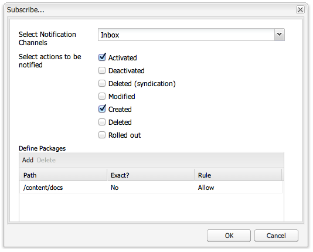

# 받은 편지함{#your-inbox}

페이지 콘텐츠에서 수행해야 하는 작업을 나타내는 작업 항목 또는 작업에 대한 알림과 같이 다양한 AEM 영역에서 알림을 받을 수 있습니다.

이러한 알림은 알림 유형으로 구분된 두 개의 받은 편지함으로 수신됩니다.

* 가입 결과로 받은 알림을 볼 수 있는 받은 편지함은 다음 섹션에 설명되어 있습니다.
* 워크플로 항목에 대한 전문 받은 편지함은에 설명되어 있습니다. [워크플로우에 참여](/help/sites-classic-ui-authoring/classic-workflows-participating.md) 문서.

## 알림 보기 {#viewing-your-notifications}

알림을 보려면:

1. 알림 받은 편지함 열기: **웹 사이트** 콘솔에서 오른쪽 상단의 사용자 버튼을 클릭하고 을(를) 선택합니다. **알림 받은 편지함**.

   

   >[!NOTE]
   >
   >브라우저에서 직접 콘솔에 액세스할 수도 있습니다. 예를 들면 다음과 같습니다.
   >
   >
   >` https://<host>:<port>/libs/wcm/core/content/inbox.html`

1. 알림이 나열됩니다. 필요에 따라 작업을 수행할 수 있습니다.

   * [알림 구독 중](#subscribing-to-notifications)
   * [알림 처리](#processing-your-notifications)

   

## 알림 구독 중 {#subscribing-to-notifications}

알림을 구독하려면 다음 작업을 수행하십시오.

1. 알림 받은 편지함 열기: **웹 사이트** 콘솔에서 오른쪽 상단의 사용자 버튼을 클릭하고 을(를) 선택합니다. **알림 받은 편지함**.

   

   >[!NOTE]
   >
   >브라우저에서 직접 콘솔에 액세스할 수도 있습니다. 예를 들면 다음과 같습니다.
   >
   >
   >`https://<host>:<port>/libs/wcm/core/content/inbox.html`

1. 클릭 **구성...** 왼쪽 상단 모서리에서 구성 대화 상자를 엽니다.

   

1. 알림 채널 선택:

   * **받은 편지함**: 알림이 AEM 받은 편지함에 표시됩니다.
   * **이메일**: 알림은 사용자 프로필에 정의된 이메일 주소로 이메일로 전송됩니다.

   >[!NOTE]
   >
   >전자 메일로 알림을 받으려면 몇 가지 설정을 구성해야 합니다. 이메일 템플릿을 사용자 정의하거나 새 언어에 대한 이메일 템플릿을 추가할 수도 있습니다. 다음을 참조하십시오 [이메일 알림 구성](/help/sites-administering/notification.md#configuringemailnotification) AEM에서 이메일 알림을 구성합니다.

1. 알림을 받을 페이지 작업 선택:

   * 활성화됨: 페이지가 활성화되면 표시됩니다.
   * 비활성화됨: 페이지가 비활성화되었을 때.
   * 삭제됨(신디케이션): 페이지가 삭제-복제되었을 때, 즉 페이지에서 수행된 삭제 작업이 복제되었을 때.
페이지를 삭제하거나 이동하면 삭제 작업이 자동으로 복제됩니다. 삭제 작업이 수행된 소스 인스턴스와 복제 에이전트가 정의한 대상 인스턴스에서 페이지가 삭제됩니다.

   * 수정됨: 페이지가 수정된 경우.
   * 생성됨: 페이지를 생성할 때.
   * 삭제됨: 페이지 삭제 작업을 통해 페이지가 삭제된 경우.
   * 롤아웃: 페이지가 롤아웃된 때입니다.

1. 알림을 받을 페이지의 경로를 정의합니다.

   * 클릭 **추가** 테이블에 새 행을 추가합니다.
   * 다음을 클릭합니다. **경로** 테이블 셀 및 경로 입력(예: ) `/content/docs`.

   * 하위 트리에 속하는 모든 페이지에 대한 알림을 받으려면 을 설정합니다. **정확합니까?** 끝 **아니요**.
경로에 의해 정의된 페이지의 작업에 대해서만 알림을 받으려면 을 설정합니다. **정확합니까?** 끝 **예**.

   * 규칙을 허용하려면 다음을 설정하십시오. **규칙** 끝 **허용**. 로 설정된 경우 **거부**, 규칙이 거부되지만 제거할 수 없으며 나중에 허용할 수 있습니다.

   정의를 제거하려면 테이블 셀을 눌러 행을 선택하고 **삭제**.

1. 클릭 **확인** 구성을 저장합니다.

## 알림 처리 {#processing-your-notifications}

AEM 받은 편지함에서 알림을 받도록 선택한 경우 받은 편지함이 알림으로 가득 채워집니다. 다음을 수행할 수 있습니다. [알림 보기](#viewing-your-notifications)필요한 알림을 선택하여 다음 작업을 수행합니다.

* 다음을 클릭하여 수락 **승인**: 의 값 **읽기** 열이 다음으로 설정됨 **true**.

* 다음을 클릭하여 제거 **삭제**.

