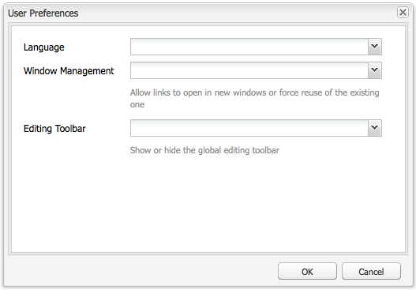

# 계정 환경 구성{#configuring-your-account-environment}

Adobe Experience Manager(AEM)에서는 계정과, 작성 환경의 특정 측면들을 구성하는 기능을 제공합니다.

[계정 설정](#account-settings) 및 [사용자 환경 설정](#user-preferences)을 사용하여 다음 옵션과 환경 설정을 정의할 수 있습니다.

* **도구 모음 편집**
전역 편집 도구 모음을 사용할지 여부를 선택합니다. 브라우저 창의 맨 위에 표시되는 이 도구 모음은 해당 페이지의 단락 구성 요소와 함께 사용할 수 있는 **복사**, **잘라내기**, **붙여넣기**, **삭제** 단추를 제공합니다.

   * 필요 시 표시(기본값)
   * 항상 표시
   * 숨김 상태로 유지

* **다음 사용자로 가장**
[다음 사용자로 가장](/help/sites-administering/security.md#impersonating-another-user) 기능을 사용하면 사용자가 다른 사용자를 대신하여 작업할 수 있습니다.

* **언어**
작성 환경의 UI에 사용할 언어입니다. 사용 가능한 목록에서 필요한 언어를 선택합니다.

* **창 관리**
다음 중 하나를 선택합니다.

   * 여러 창(기본값)
페이지가 새 창에서 열립니다.
   * 단일 창
페이지가 현재 창에서 열립니다.

## 계정 설정 {#account-settings}

사용자 아이콘을 사용하면 다음 옵션에 액세스할 수 있습니다.

* 로그아웃
* [가장 대상](/help/sites-administering/security.md#impersonating-another-user)
* [사용자 환경 설정](#user-preferences)
* [알림 받은 편지함](/help/sites-classic-ui-authoring/author-env-inbox.md)

### 사용자 환경 설정 {#user-preferences}

각 사용자는 자신에 대한 특정 속성을 설정할 수 있습니다. 콘솔의 오른쪽 상단에 있는 **기본 설정** 대화 상자에서 사용할 수 있습니다.

이 대화 상자에는 다음과 같은 옵션이 있습니다.

