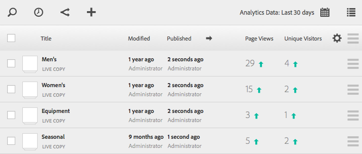

# 페이지 분석 데이터 보기{#seeing-page-analytics-data}

페이지 컨텐츠의 효율성을 측정하려면 페이지 분석 데이터를 사용하십시오.

페이지 분석 데이터는 사이트 콘솔에 표시됩니다. 사이트가 목록 형식으로 표시되면 기본적으로 다음 열을 사용할 수 있습니다.

* 페이지 보기 수
* 고유 방문자 수
* 페이지 시간

>[!NOTE]
>
>콘솔에서 바로 사이트 분석 데이터를 표시하는 것은 터치에 적합한 UI에서만 사용할 수 있습니다. 자세한 내용은 표준 작성 설명서의 [페이지 분석 데이터 보기](/help/sites-authoring/page-analytics-using.md)를 참조하십시오.
