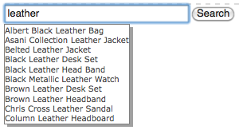
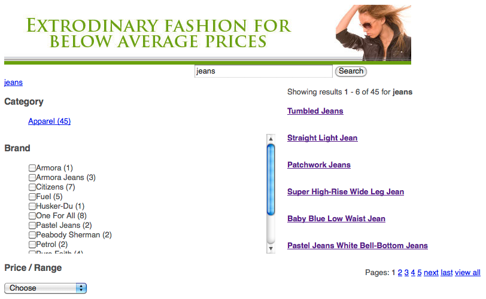

# Search&amp;Promote 기능을 페이지에 추가{#adding-search-promote-features-to-your-page}

웹 사이트에서 Search&amp;Promote 기능을 통합하려면 Search&amp;Promote 구성 요소를 사용하여 페이지에 다음 기능을 추가하십시오.

* 키워드 검색
* 검색 결과 페이지
* 상세 검색
* 배너

AEM 관리자가 활성화한 경우에만 Search&amp;Promote 기능을 사용할 수 있습니다. [Adobe Search&amp;Promote과 통합](/help/sites-administering/search-and-promote.md)을 참조하십시오.

패싯은 각 구성 요소가 제공하는 정보처럼 Search&amp;Promote 서버에서 구성됩니다. 다음 표에서는 각 구성 요소에 대해 간략히 설명합니다. 이어지는 섹션들에서는 그 사용에 대해 자세히 설명합니다.

<table>
 <tbody>
  <tr>
   <th>Search &amp; Promote 구성 요소</th>
   <th>설명</th>
  </tr>
  <tr>
   <td>배너</td>
   <td>배너 광고를 표시합니다. 배너는 Search &amp; Promote을 통해 수집된 데이터를 기반으로 선택됩니다.  </td>
  </tr>
  <tr>
   <td>탐색 표시</td>
   <td>사용자가 검색 결과에 적용한 검색 키워드 및 필터 시퀀스를 표시합니다.</td>
  </tr>
  <tr>
   <td>확인란 목록-패싯</td>
   <td>검색 결과 필터링을 위한 패싯을 선택하는 확인란 목록입니다.</td>
  </tr>
  <tr>
   <td>드롭다운 패싯</td>
   <td>검색 결과 필터링을 위한 패싯 드롭다운 목록입니다.</td>
  </tr>
  <tr>
   <td>링크 목록 패싯</td>
   <td>검색 결과 필터링을 위한 패싯 링크 목록입니다.</td>
  </tr>
  <tr>
   <td>페이지 매김</td>
   <td>검색 결과 페이지를 탐색하는 컨트롤입니다.</td>
  </tr>
  <tr>
   <td>결과</td>
   <td>키워드 검색 결과를 표시합니다.</td>
  </tr>
  <tr>
   <td>검색</td>
   <td>페이지에 검색 필드를 추가합니다.</td>
  </tr>
 </tbody>
</table>

## 검색 결과 페이지 만들기 {#creating-the-search-results-page}

WCM 웹 사이트 콘솔을 사용하여 검색 결과를 표시할 페이지를 만들 수 있습니다. [검색] 구성 요소의 검색 결과는 동일한 Search&amp;Promote 서비스를 사용하는 경우 이 페이지에 표시될 수 있습니다.

사용자가 검색 결과를 검토할 수 있는 구성 요소는 [결과]와 [페이지 매김]입니다. **결과** 구성 요소에는 편집 모드나 디자인 모드에서 구성 가능한 속성이 없습니다. [결과] 구성 요소는 다른 페이지에 연결하는 링크를 제공하는 검색 결과를 단순히 나열하고 검색 키워드에 대한 결과 개수를 표시합니다.

**페이지 매김** 구성 요소는 사용자가 여러 페이지의 검색 결과를 탐색할 수 있도록 해줍니다. 사용자는 페이지 개수를 확인하거나 다음 페이지나 이전 페이지로 이동하거나, 열려는 페이지를 선택하거나, 모든 결과를 하나의 페이지에 통합할 수 있습니다.

편집 모드에서 다음 구성 요소 속성을 구성하여 런타임 동작을 제어할 수 있습니다.

* 단일 결과 페이지 숨기기:검색에서 단일 결과 페이지를 반환할 때 페이지 탐색 컨트롤을 숨기려면 이 옵션을 선택합니다.
* 처음/마지막 숨기기: 사용자가 결과의 첫 번째 또는 마지막 페이지로 이동하지 못하도록 하려면 이 선택 사항을 선택합니다.
* 이전/다음 숨기기: 사용자가 현재 페이지와 관련된 결과 페이지를 탐색할 수 있는지 여부를 결정합니다.
* 모든 보기 숨기기: 사용자가 하나의 페이지에서 모든 검색 결과를 통합할 수 있는지 여부를 결정합니다. 일반적으로 페이지를 사용하는 데이터를 제공하면 서버 리소스를 더 효율적으로 사용할 수 있습니다. 큰 데이터 세트가 하나의 응답 메시지로 전송되지 않도록 하려면 이 선택 사항을 선택하십시오.

### 패싯을 사용한 결과 필터링 활성화 {#enabling-the-filtering-of-results-by-facets}

사용자가 패싯으로 검색 결과를 필터링하는 것이 가능하도록 할 수 있습니다. **확인란 목록 패싯**, **드롭다운 패싯** 및 **링크 목록 패싯** 구성 요소를 사용하면 사용자는 필터링할 패싯을 하나 이상 선택할 수 있습니다. 이러한 구성 요소를 사용할 경우에는 **탐색 표시** 구성 요소도 포함해야 합니다. 탐색 표시는 사용되는 현재 필터를 표시합니다.

**확인란 목록 패싯**, **드롭다운 패싯** 및 **링크 목록 패싯** 구성 요소에는 각각 **편집** 모드에서 구성하는 다음 속성이 있습니다.

* **패싯 이름**: 필터에 사용되는 패싯의 이름입니다.

**확인란 목록 패싯** 구성 요소에는 확인란이 함께 표시되는 패싯 목록이 표시됩니다. **확인란 목록 패싯**&#x200B;을 사용하여 사용자가 여러 패싯의 항목들을 포함하는 일부 결과를 볼 수 있도록 하십시오. 예를 들어, 여러 브랜드에서는 동일한 유형의 제품을 제공하므로 **브랜드 패싯이 적절합니다.**

검색 결과와 연결된 각 패싯에 대해 확인란이 표시됩니다. 사용자가 확인란을 선택하면 업데이트된 결과 세트가 있는 페이지가 다시 로드됩니다. 모든 확인란은 고객이 언제든지 필터에 패싯을 추가하거나 제거할 수 있도록 해당 페이지에 남아 있습니다.

**드롭다운 패싯** 구성 요소를 사용하면 고객이 드롭다운 목록에서 패싯 항목을 선택할 수 있습니다. 이 구성 요소는 고객이 한 번에 하나의 패싯 항목에 집중하도록 할 때 유용합니다. 예를 들어, 부서 패싯은 고객이 성별별로 제품 검색 범위를 좁힐 수 있도록 하는 데 적합합니다. 예를 들어 고객은 *청바지*&#x200B;를 검색한 다음 남성용품 부서를 필터링합니다.

드롭다운 목록은 모든 검색 결과와 연결된 패싯으로 채워집니다. 드롭다운 목록에서 항목을 선택하면 업데이트된 결과 세트가 있는 페이지가 다시 로드됩니다. 드롭다운 목록의 항목은 고객이 언제든지 패싯에서 패싯으로 전환할 수 있도록 변경되지 않습니다.

**링크 목록 패싯** 구성 요소를 사용하면 고객이 여러 패싯 구성원 또는 패싯 아래에 분류된 항목에 대한 포커스를 점진적으로 좁힐 수 있습니다.

패싯 구성원은 링크 목록으로 나타납니다. 각 링크의 텍스트는 현재 검색 결과와 연결된 패싯 구성원의 이름입니다. 고객이 패싯 링크를 클릭하면 페이지가 다시 로드되고 일부 검색 결과가 나타납니다. 링크 목록이 업데이트되므로 그에 따라 더 좁은 포커스를 사용할 수 있습니다.

목록에 있는 링크는 다른 유형의 Search&amp;Promote 구성 요소에서 필터가 적용되어도 변경됩니다. 여러 유형의 필터 구성 요소를 사용하면 효과적인 필터 조합을 제공할 수 있습니다.

**탐색 표시** 구성 요소를 사용하면 고객이 현재 검색 결과에 적용된 필터를 적용된 순서대로 볼 수 있습니다. 고객은 탐색 표시의 항목을 클릭하여 해당 필터 조합으로 되돌릴 수 있습니다.

편집 모드에서 탐색 표시에 대해 다음 속성을 구성하여 구성 요소의 모습을 사용자 지정할 수 있습니다.

* 구분 기호: 각 탐색 표시 사이의 구분 기호로 작동할 문자 또는 문자열을 정의하십시오. [구분 기호] 필드는 문자열을 입력으로 허용합니다. 기본 설정은 &quot;>&quot;(따옴표 제외)입니다.
* 후행 구분 기호: 탐색 표시의 끝에 표시할 문자 또는 문자열을 정의하십시오. [후행 구분 기호] 필드는 문자열을 입력으로 허용합니다. 기본 설정은 *공백*(즉, 탐색 표시 행의 끝에 아무 것도 표시되지 않음)입니다.

### 검색 상자 추가  {#adding-search-boxes}

검색 구성 요소를 사용하면 고객이 키워드 검색을 수행할 수 있습니다. 검색에 액세스 권한을 제공할 각 페이지에 [검색] 구성 요소를 추가하십시오.

런타임 동작을 제어하려면 편집 모드에서 다음 속성을 구성하십시오.

* 결과 페이지 경로: 검색 결과를 표시하는 페이지의 경로입니다.
* 자동 완성 사용: 고객이 검색 상자에서 입력을 시작하면 추천 검색 키워드가 표시되도록 하려면 선택하십시오.

### 배너 추가 {#adding-banners}

배너 구성 요소에는 고객의 Search &amp; Promote 검색에 따른 배너 광고가 표시됩니다. Search&amp;Replace 서버의 논리는 표시할 배너를 결정합니다. 예를 들어, 청바지에 대해 검색하면 패션 관련 배너가 표시될 수 있습니다. 남성용품 부서에 대한 필터링은 배너 선택 범위를 더 좁힐 수 있습니다.

[배너] 구성 요소는 [배너 영역]이라는 하나의 구성 가능한 속성을 제공합니다. 편집 모드에서 속성 값 중 하나를 선택하여 배너가 표시되는 방식을 지정하십시오. Search&amp;Promote 서비스는 선택할 수 있는 값 목록을 결정합니다.

### Search&amp;Promote 검색 페이지 예 {#example-search-promote-search-page}

이 다이어그램은 아래의 완전히 작동하는 Search&amp;Promote 검색 결과 페이지를 만들기 위해 페이지에 추가되는 구성 요소를 보여줍니다.

 
