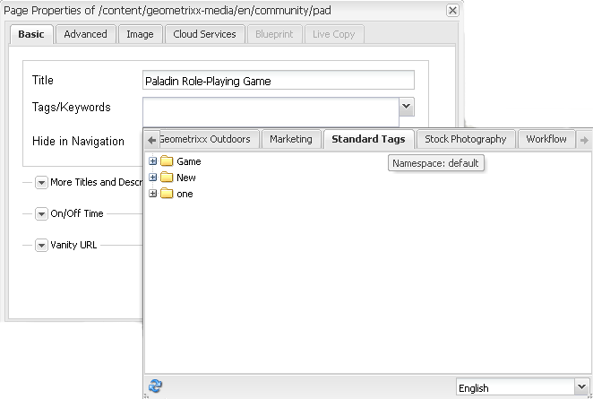

# 태그 사용{#using-tags}

태그는 웹 사이트에 포함된 컨텐츠를 빠르고 손쉽게 분류할 수 있는 방법입니다. 태그는 검색을 통해 해당 컨텐츠 및 관련 컨텐츠를 찾을 수 있도록 하기 위해 페이지, 자산 또는 컨텐츠에 첨부할 수 있는 키워드 또는 레이블이라고 할 수 있습니다.

* 태그 작성 및 관리 방법과 컨텐츠 태그가 적용되는 항목에 대한 내용은 [태그 관리](/help/sites-administering/tags.md)를 참조하십시오.
* 사용자 지정 애플리케이션에서 태그를 포함 및 확장하는 방법과 태깅 프레임워크에 대한 내용은 [개발자를 위한 태깅](/help/sites-developing/tags.md)을 참조하십시오.

## 태깅을 사용해야 하는 10가지 이유 {#ten-reasons-to-use-tagging}

1. 컨텐츠 구성: 태깅을 수행하면 작성자가 크게 노력하지 않고도 컨텐츠를 빠르게 구성할 수 있으므로 작업이 편리해집니다.
1. 태깅 구성: 태그는 컨텐츠를 구성하지만, 계층 구조 분류/네임스페이스에 따라 태그가 구성됩니다.
1. 심층 구성 태그: 태그와 하위 태그를 만들 수 있으므로 전체 분류 체계 시스템, 상위 개념, 하위 개념 및 상호 간의 관계를 표현할 수 있습니다. 이를 통해 정식 계층 구조 이외에 두 번째 또는 세 번째 컨텐츠 계층 구조를 만들 수 있습니다.
1. 제어된 태깅: 태그 및/또는 네임스페이스에 권한을 적용하여 태그 작성 및 적용을 제어함으로써 태깅을 제어할 수 있습니다.
1. 유연한 태깅: 태그에는 태그, 분류 용어, 카테고리, 레이블 등의 많은 이름과 특성이 있습니다. 따라서 다양한 컨텐츠 모델에서 다양한 방식으로 태그를 사용할 수 있습니다. 예를 들어 타겟 인구집단을 선정하거나, 컨텐츠를 분류하거나, 컨텐츠에 등급을 매기거나, 두 번째 컨텐츠 계층 구조를 만들 수 있습니다.
1. 향상된 검색: AEM의 기본 검색 구성 요소는 관련 있는 내용으로 결과의 범위를 좁히기 위해 필터를 적용할 수 있는 작성된 태그 및 적용된 태그를 광범위하게 포함합니다.
1. SEO 사용: 페이지 속성으로 적용된 태그는 페이지의 메타태그에 자동으로 표시되므로 검색 엔진에서 확인 가능합니다.
1. 단순한 정교성: 단순히 단어와 단추 터치만으로 태그를 만들 수 있습니다. 그런 다음, 제목, 설명 및 무제한 레이블을 추가하여 태그에 더 많은 의미 체계를 제공할 수 있습니다.
1. 핵심 일관성: 태깅 시스템은 AEM의 핵심 구성 요소로서 모든 AEM 기능에서 컨텐츠를 분류하는 데 사용됩니다. 또한 태깅 API는 개발자가 동일한 분류법에 액세스할 수 있는 태깅 지원 애플리케이션을 작성하는 데 사용할 수 있습니다.
1. 구조 및 유연성 조합: AEM은 페이지 및 경로 중첩으로 인해 구조화된 정보로 작업하는 데 이상적입니다. 전체 텍스트 검색 기능이 내장되어 있으므로 비구조적인 정보로 작업할 때에도 동일한 성능을 발휘합니다. 태깅은 구조 및 유연성의 장점을 결합합니다.

사이트의 컨텐츠 구조 및 자산의 메타데이터 스키마를 디자인할 때는 태깅이 제공하는 액세스 가능한 간단한 접근 방법을 고려하십시오.

## 태그 적용 {#applying-tags}

작성 환경에서 작성자는 페이지 속성에 액세스하고 **태그/키워드** 필드에 하나 이상의 태그를 입력하여 태그를 적용할 수 있습니다.

[사전 정의된 태그](/help/sites-administering/tags.md)를 적용하려면 **페이지 속성** 창에서 `Tags/Keywords` 필드 풀다운을 사용하여 페이지에 대해 허용되는 태그 목록에서 선택합니다. **표준 태그** 탭은 기본 네임스페이스이므로 택소노법에 `namespace-string:` 접두사가 없습니다.

### 태그 게시 {#publishing-tags}

페이지와 마찬가지로 태그 및 네임스페이스에 대해 다음 작업을 수행할 수 있습니다.

**활성화**

* 개별 태그를 활성화합니다.

   페이지와 마찬가지로 새로 만든 태그를 활성화해야 게시 환경에서 사용할 수 있습니다.

>[!NOTE]
>
>페이지를 활성화하면 페이지에 속하면서 활성화되지 않은 태그를 활성화할 수 있는 대화 상자가 자동으로 열립니다.

**비활성화**

* 선택한 태그를 비활성화합니다.

## 태그 클라우드 {#tag-clouds}

태그 클라우드는 현재 페이지, 전체 웹 사이트 또는 가장 일반적으로 액세스하는 태그의 클라우드를 보여줍니다. 태그 클라우드는 사용자에게 관심이 있는 문제점을 강조 표시하는 수단입니다. 태그를 표시하는 데 사용되는 텍스트의 크기는 용도에 따라 다릅니다.

[태그 클라우드](/help/sites-classic-ui-authoring/classic-page-author-edit-mode.md#tag-cloud) 구성 요소(일반 구성 요소 그룹)는 태그 클라우드를 페이지에 추가하는 데 사용됩니다.

## 태그 검색  {#searching-on-tags}

작성 환경과 게시 환경 모두에서 태그를 검색할 수 있습니다.

### 검색 구성 요소 사용  {#using-search-component}

페이지에 [검색 구성 요소](/help/sites-classic-ui-authoring/classic-page-author-edit-mode.md#search)를 추가하면 태그를 포함하는 검색 기능이 제공되며 작성 환경과 게시 환경 모두에서 사용할 수 있습니다.

