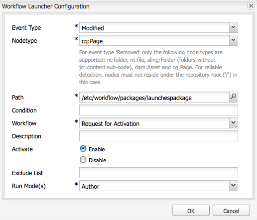

# 론치 홍보{#promoting-launches}

게시 전에 컨텐츠를 소스(프로덕션)로 다시 이동하려면 론치 페이지를 홍보해야 합니다. 론치 페이지가 홍보되면 해당 소스 페이지가 홍보된 페이지의 컨텐츠로 바뀝니다. 론치 페이지 홍보 시 다음 옵션을 사용할 수 있습니다.

* 현재 페이지만 홍보할지 아니면 전체 론치를 홍보할지 여부.
* 현재 페이지의 하위 페이지를 홍보할지 여부.
* 전체 론치를 홍보할지 아니면 변경된 페이지만 홍보할지 여부.

## 론치 페이지 홍보 {#promoting-launch-pages}

페이지를 홍보하려면 홍보할 론치 페이지를 편집하는 동안 다음 절차를 수행하십시오.

1. 사이드 킥의 **페이지** 탭에서 **론치 홍보**&#x200B;를 클릭합니다.
1. 승격할 페이지를 지정합니다.

   * (기본값) 현재 페이지만 홍보하려면 **프로덕션 버전으로 페이지 변경 사항 승격**&#x200B;을 선택합니다.
   * 현재 페이지의 하위 페이지도 홍보하려면 **하위 페이지 포함**&#x200B;을 선택합니다.
   * 론치에 있는 모든 페이지를 홍보하려면, **프로덕션 버전에 대한 전체 출시 홍보**&#x200B;를 선택합니다.

1. 프로덕션 페이지를 워크플로우 패키지에 추가하려면, **워크플로우 패키지에 추가**&#x200B;를 선택한 다음 해당 워크플로우를 선택합니다.
1. **홍보**&#x200B;를 클릭합니다.

## AEM Workflow를 사용하여 승격된 페이지 처리 {#processing-promoted-pages-using-aem-workflow}

작업 흐름 모델을 사용하여 다음과 같이 승격된 론치 페이지의 일괄 프로세스를 수행할 수 있습니다.

1. 작업 흐름 패키지를 만듭니다.
1. 작성자는 론치 페이지를 승격할 때 이 페이지를 작업 흐름 패키지에 저장합니다.
1. 패키지를 페이로드로 사용하여 작업 흐름 모델을 시작합니다.

페이지가 홍보될 때 워크플로우를 자동으로 시작하려면 패키지 노드에 대한 [워크플로우 런처를 구성](/help/sites-administering/workflows-starting.md#workflows-launchers)합니다.

예를 들어, 작성자가 론치 페이지를 승격하면 페이지 활성화 요청을 자동으로 생성할 수 있습니다. 패키지 노드가 수정될 때 작업 흐름 론쳐를 구성하여 요청 활성화 작업 흐름을 시작합니다.

