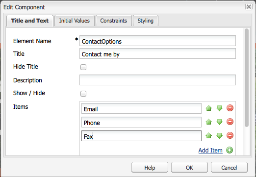

# 액세스 가능한 컨텐츠 만들기(WCAG 2.0 적합성){#creating-accessible-content-wcag-conformance}

>[!CAUTION]
>
>클래식 UI는 AEM 6.4에서 더 이상 사용되지 않으므로 이 페이지의 컨텐츠는 WCAG 2.1용으로 업데이트되지 않았습니다.
>
>AEM 및 WCAG 2.1과 관련된 자세한 내용은 다음 페이지를 참조하십시오.
>
>* [AEM 및 웹 접근성 지침](/help/managing/web-accessibility.md)
>* [WCAG 2.1에 대한 빠른 안내서](/help/managing/qg-wcag.md)
>* [액세스 가능한 컨텐츠 만들기(WCAG 2.1 적합성)](/help/sites-authoring/creating-accessible-content.md)

WCAG 2.0은 장애가 있는 사용자가 웹 컨텐츠를 액세스하여 사용할 수 있도록 하는 데 도움이 되는 기술 독립적 지침 및 성능 기준으로 구성되어 있습니다.

>[!NOTE]
>
>참고 항목:
>
>* [WCAG 2.0에 대한 빠른 안내서](/help/managing/qg-wcag.md)
>* [액세스 가능한 컨텐츠를 만들려면 리치 텍스트 편집기 구성 참조](/help/sites-administering/rte-accessible-content.md)
>

이러한 지침은 레벨 A(가장 낮음), 레벨 AA 및 레벨 AAA(가장 높음)의 세 가지 적합성 수준에 따라 등급이 지정됩니다. 이러한 등급을 간단히 정의하면 다음과 같습니다.

* **레벨 A:** 사이트가 기본적인 최소 접근성 수준에 도달합니다. 이 수준에 도달하려면 모든 레벨 A 성공 기준이 충족되어야 합니다.
* **레벨 AA:** 추구할만한 이상적인 액세서빌러티 수준으로서, 사이트는 대부분의 기술을 사용하여 대부분의 상황에서 대부분의 사람에게 액세스할 수 있도록 향상된 액세서빌러티 수준에 도달합니다. 이 수준에 도달하려면 모든 레벨 A 및 레벨 AA 성공 기준을 충족해야 합니다.
* **레벨 AAA:** 귀하의 사이트는 높은 수준의 접근성을 제공합니다. To meet this level, all Level A, Level AA and Level AAA Success Criteria are satisfied.

사이트를 만들 때에는 사이트가 따라야 할 전반적인 수준을 결정해야 합니다.

다음 섹션에서는 레벨 A 및 레벨 AA [적합성 수준](https://www.w3.org/TR/WCAG20/#guidelines)에 대한 관련 성공 기준이 있는 [WCAG 2.0 지침](https://www.w3.org/TR/UNDERSTANDING-WCAG20/conformance.html)에 대해 설명합니다.

>[!NOTE]
>
>특정 유형의 컨텐츠에 대한 Level AAA 성공 기준을 모두 충족할 수는 없으므로 이러한 수준의 적합성 을 일반적인 정책으로 요구하지 않는 것이 좋습니다.

>[!NOTE]
>
>이 문서에서는 다음 항목을 사용합니다.
>
>* [WCAG 2.0 지침](https://www.w3.org/TR/WCAG20/#guidelines)에 대해 간단한 이름을 사용합니다.
>* WCAG 웹 사이트 상호 참조에 도움이 되도록 [WCAG 2.0 지침](https://www.w3.org/TR/WCAG20/#guidelines)에 사용되는 번호 지정 방법을 사용합니다.
>

## 원칙 1: 인지 가능 {#principle-perceivable}

[원칙 1: 인지 가능 - 정보 및 사용자 인터페이스 구성 요소는 사용자가 인지할 수 있는 방식으로 사용자에게 표시될 수 있어야 합니다.](https://www.w3.org/TR/WCAG20/#perceivable)

### 텍스트 대체 요소 (1.1) {#text-alternatives}

[지침 1.1 텍스트 대체 요소: 대형 인쇄물, 점자, 음성, 기호 또는 더 간결한 언어와 같이, 사람들이 필요로 하는 다른 형식으로 변경시킬 수 있도록 텍스트가 아닌 콘텐츠에 대해 텍스트 대체 요소를 제공하십시오.](https://www.w3.org/TR/WCAG20/#text-equiv)

### 텍스트가 아닌 콘텐츠 (1.1.1) {#non-text-content}

* 성공 기준 1.1.1
* 레벨 A
* 텍스트가 아닌 콘텐츠: 아래 나열된 상황을 제외하고, 사용자에게 제시되는 모든 텍스트가 아닌 콘텐츠에는 동등한 목적을 제공하는 텍스트 대체 요소가 있습니다.

#### 목적 - 텍스트가 아닌 콘텐츠 (1.1.1) {#purpose-non-text-content}

웹 페이지에 대한 정보는 사진, 비디오, 애니메이션, 차트 및 그래프와 같은 다양한 텍스트가 아닌 형식으로 제공될 수 있습니다. 앞이 안 보이거나 심각한 시각적 장애가 있는 사람은 텍스트가 아닌 콘텐츠를 볼 수 없지만, 스크린 리더로 읽거나 점자 표시 디바이스로 촉각 형식으로 표시하여 텍스트 콘텐츠에 액세스할 수 있습니다. 따라서 그래픽 형식의 콘텐츠에 텍스트 대체 요소를 제공하면 해당 그래픽 콘텐츠를 볼 수 없는 사람도 콘텐츠가 제공하는 정보에 해당하는 버전에 액세스할 수 있습니다.

유용한 추가 이점은 텍스트 대체 요소를 통해 텍스트가 아닌 콘텐츠를 검색 엔진 기술로 색인화할 수 있다는 것입니다.

#### 충족 방법 - 텍스트가 아닌 콘텐츠 (1.1.1) {#how-to-meet-non-text-content}

정적 그래픽의 경우, 기본 요건은 그래픽에 대해 동등한 텍스트 대체 요소를 제공하는 것입니다. 이 방법은 **대체 텍스트** 필드:

>[!NOTE]
>
>**회전판**&#x200B;이나 **Slideshow**&#x200B;처럼 기본적으로 제공되는 몇 가지 구성 요소에서는 이미지에 대체 텍스트 설명을 추가하는 수단을 제공하지 않습니다. AEM 인스턴스에 대해 이러한 구성 요소의 버전을 구현하는 경우 개발 팀은 다음을 지원하도록 해당 구성 요소를 구성해야 합니다. `alt` 특성. 이렇게 하면 작성자가 콘텐츠에 해당 설명을 추가할 수 있습니다([추가 HTML 요소 및 속성에 대한 지원 추가](/help/sites-administering/rte-accessible-content.md#add-support-for-more-html-elements-and-attributes) 참조).

**이미지** 구성 요소 대화 상자의 **고급**&#x200B;이미지 속성 탭에서 **대체 텍스트**&#x200B;필드를 사용할 수 있습니다.


AEM에서는 기본적으로 이미지에 **대체 텍스트**&#x200B;를 추가합니다. 클래식 UI의 경우, 기본 속성이 만들어지는 방식에 대해 두 가지 다른 시나리오가 있지만, 기본값이 대체 요소로서 충분하지 않을 수 있으므로 **고급** 이미지 속성 탭:

* 파일:

사용자의 하드 드라이브에서 이미지가 업로드됩니다. 이미지 구성 요소를 페이지에 추가한 다음 하드 드라이브나 다른 소스에서 이미지를 선택하는 경우 **대체 텍스트**&#x200B;에 대한 기본값은 `file`입니다. 이 값은 다음에서 변경해야 합니다. **고급** 이미지 속성 탭입니다. 이 값은에 표시되지 않습니다 **대체 텍스트** 필드이지만 값이 변경되면 새 값이 필드에 표시됩니다.

* 자산:

디지털 자산 저장소에서 이미지가 추가됩니다. 디지털 자산 저장소에서 웹 페이지로 이미지를 드래그하면 **제목** 및 **대체 텍스트** 해당 이미지에 대한 값은 해당 이미지에 대한 메타데이터에서 가져옵니다.

>[!NOTE]
>
>위의 시나리오 양쪽에서 기본 **대체 텍스트** 값은 **고급 이미지 속성** 탭에 표시되지 않습니다. 기본값을 변경하려면 **대체 텍스트** 필드에 새 값을 입력하면 됩니다.

>[!NOTE]
>
>이미지가 순전히 장식용이라면([좋은 텍스트 대체 요소 만들기](#creating-good-text-alternatives) 참조), 스페이스바를 사용하여 **대체 텍스트**&#x200B;필드에 공백을 추가할 수 있습니다. 이렇게 하면 빈 항목이 만들어집니다. `alt` 속성 : 스크린 리더에게 이미지를 무시하라는 메시지가 표시됩니다.

#### 좋은 텍스트 대체 요소 만들기 {#creating-good-text-alternatives}

텍스트가 아닌 콘텐츠의 양식은 다양하므로, 텍스트 대체 요소의 값은 웹 페이지에서 그래픽이 수행하는 역할에 따라 달라집니다. 몇 가지 일반적인 경험법칙에는 다음이 포함됩니다.

* 텍스트 대체 요소는 간결해야 하지만 동시에 텍스트가 아닌 콘텐츠에서 제공하는 본질적인 정보를 명료하게 담고 있어야 합니다.
* 너무 길게(100자 이상) 설명하지 않아야 합니다. 텍스트 대체 요소에 세부 정보가 더 필요한 경우,

   * 대체 텍스트로 짧은 설명을 제공합니다.
   * 동일한 페이지의 다른 위치나 별도의 웹 페이지에서 텍스트로 더 길게 설명해 놓은 후 이미지를 링크로 만들거나 이미지 옆에 텍스트 링크를 배치하여 이 별도의 설명에 연결합니다.

* 대체 텍스트는 동일한 페이지의 근처에서 텍스트 양식으로 제공되는 콘텐츠를 그대로 복사한 것이 아닙니다. 이미 많은 이미지가 페이지의 텍스트에서 다루는 핵심 사항의 삽화로 제공되고 있으므로, 이미지에 해당하는 상세한 텍스트 대체 요소가 이미 존재할 수 있습니다.
* 텍스트가 아닌 콘텐츠가 다른 페이지나 문서에 대한 링크이고 동일한 링크의 일부를 형성하는 다른 텍스트가 없는 경우 이미지에 대한 대체 텍스트는 링크 대상을 가리켜야 합니다. 단순히 이미지를 설명하면 안 됩니다.
* 텍스트가 아닌 콘텐츠가 버튼 요소에 들어 있고 동일한 버튼의 일부를 형성하는 텍스트가 없다면 이미지의 대체 텍스트는 이미지를 설명하는 것이 아니라 버튼의 기능을 가리켜야 합니다.
* 이미지에 대체 텍스트가 없는 경우에만 빈(null) 대체 텍스트를 제공하는 것은 허용됩니다. 예를 들어, 순전히 장식용 그래픽입니다. 또는 동등한 텍스트가 이미 페이지 텍스트에 있는 경우

다음 [W3C 초안: 유용한 텍스트 대체 요소를 제공하기 위한 HTML5 기술](https://html.spec.whatwg.org/multipage/images.html#alt) 에는 다양한 유형의 이미지에 적절한 대체 텍스트 제공에 대한 더 자세한 내용과 예가 있습니다.

텍스트 대체 요소를 필요로 하는 특정 유형의 텍스트가 아닌 컨텐츠에는 다음 내용이 포함될 수 있습니다.

* 삽화 사진:

사람, 사물 또는 장소의 이미지입니다. 페이지에서 사진의 역할에 대해 생각해 보십시오. 텍스트에 상당하는 적절한 요소는 다음과 같을 수 있습니다. *사진 / [오브젝트]*: 주변 텍스트에 따라 달라질 수 있습니다.

* 아이콘:

특정 정보를 전달하는 작은 그림 문자(그래픽) 페이지 및 사이트에서 일관되게 사용해야 합니다. 페이지나 사이트에 있는 아이콘의 모든 인스턴스는 인접한 텍스트의 불필요한 복제가 발생하지 않는 한 동일한 짧고 간결한 대체 텍스트를 포함해야 합니다.

* 차트 및 그래프:

일반적으로 숫자 데이터를 나타냅니다. 따라서 텍스트 대체 요소를 제공하기 위한 한 가지 옵션은 차트나 그래픽에 표시된 주요 경향에 대한 간단한 요약을 포함하는 것일 수 있습니다. 필요할 경우 **고급** 이미지 속성 탭의&#x200B;**설명**&#x200B;필드를 사용하여 보다 자세한 설명을 텍스트로 제공할 수도 있습니다. 소스 데이터를 페이지나 사이트의 다른 위치에서 표 형식으로 제공할 수도 있습니다.


이 예제 차트에 대한 대체 요소를 제공하려면 이미지 자체에 간결한 `alt` 텍스트를 추가한 다음 이미지 다음에 전체 텍스트 대체 요소가 오게 합니다.

```xml
<p></p>
<p> Figure 1. Distribution of Articles by Journal Category.
Pie chart: Language=68%, Education=14% and Science=18%.</p>
```

>[!NOTE]
>
>위의 코드 조각은 순서를 보여주는 데에만 사용됩니다. 사용 **이미지** 구성 요소 `img src` 위에서 사용된 참조.

AEM에서는 **대체 텍스트** 및 **설명** 이미지 구성 대화 상자의 필드 - 에서와 같음 [충족하는 방법 - 텍스트가 아닌 콘텐츠(1.1.1)](#how-to-meet-non-text-content).

* 맵, 다이어그램, 순서도:

공간 데이터를 제공하는 그래픽의 경우(예: 개체나 프로세스 간 관계를 설명하는 데 도움이 되도록), 핵심 메시지가 텍스트 형식으로 제공되는지 확인하십시오. 맵의 경우, 상응하는 전체 텍스트를 제공하는 것은 비현실적일 수 있지만, 맵이 특정 위치까지 가는 방법을 찾는 사람들을 돕는 방법으로 제공되는 경우, 맵 이미지의 대체 텍스트는 간단히 *X 지도*&#x200B;를 가리킨 다음, 페이지의 다른 곳이나 **이미지** 구성 요소의 **고급** 탭에 있는 **설명** 필드를 통해 해당 위치로 가는 방향을 텍스트로 제공할 수 있습니다.

* CAPTCHA:

CAPTCHA는 *컴퓨터와 인간을 구분하기 위해 완전히 자동화된 공공 튜링 테스트*&#x200B;입니다. 이 테스트는 인간을 악성 소프트웨어로부터 구별하기 위해 웹 페이지에서 사용되는 보안 검사지만, 접근성 장벽을 생성할 수 있습니다. 보안 테스트를 통과하기 위해 사용자에게 보이는 내용을 설명할 것을 요구하는 이미지가 여기에 해당합니다. 이 이미지에 대한 대체 텍스트를 제공하는 것은 불가능하므로 대신 그래픽이 아닌 대체 솔루션을 고려해 보아야 합니다.

W3C에서는 다음과 같은 몇 가지 제안을 제공합니다. 이러한 각각의 접근 방식에는 고유한 장점과 단점이 있습니다.

    * 논리 퍼즐
    * 이미지 대신 사운드 출력 사용
    * 제한된 계정 및 스팸 필터 사용.

* 배경 이미지:

이러한 이미지는 HTML이 아닌 CSS(계단식 스타일 시트)를 사용하여 만들어집니다. 대체 텍스트 값을 지정할 수 없습니다. 따라서 배경 이미지는 중요한 텍스트 정보를 제공해서는 안 됩니다. 그럴 경우, 이 정보가 페이지의 텍스트로도 제공되어야 합니다.

하지만 이미지를 표시할 수 없을 때에는 대체 배경을 표시하는 것이 중요합니다.

>[!NOTE]
>
>배경색과 전경 텍스트 사이에 적절한 수준의 대비가 있어야 합니다. 이 대비는 다음에서 자세히 설명합니다. [대비(최소)(1.4.3)](#contrast-minimum).

#### 추가 정보 - 텍스트가 아닌 콘텐츠 (1.1.1) {#more-information-non-text-content}

* [성공 기준 이해 1.1.1](https://www.w3.org/TR/UNDERSTANDING-WCAG20/text-equiv-all.html)
* [성공 기준을 충족하는 방법 1.1.1](https://www.w3.org/WAI/WCAG21/quickref/?versions=2.0#text-alternatives)
* [W3C: 유용한 텍스트 대체 요소를 제공하기 위한 HTML5 기술](https://html.spec.whatwg.org/multipage/images.html#alt)
* [CAPTCHA에 대한 W3C 설명 및 대안](https://www.w3.org/TR/turingtest/)

### 시간 기반 미디어 (1.2) {#time-based-media}

[지침 1.2 시간 기반 미디어: 시간 기반 미디어에 대한 대체 요소를 제공합니다.](https://www.w3.org/TR/WCAG20/#text-equiv)

이 정보는 다음과 같은 웹 콘텐츠를 다룹니다. *시간 기반*. 여기에는 사용자가 재생할 수 있고(예: 비디오, 오디오 및 애니메이션 콘텐츠) 사전 녹화된 스트림이나 라이브 스트림일 수 있는 콘텐츠가 포함됩니다.

### 오디오 전용 및 비디오 전용(사전 녹화된)(1.2.1) {#audio-only-and-video-only-pre-recorded}

* 성공 기준 1.2.1
* 레벨 A
* 오디오 전용 및 비디오 전용(사전 녹화): 사전 녹음된 오디오 전용 및 사전 녹화된 비디오 전용 미디어의 경우 오디오나 비디오가 텍스트에 대한 대체 미디어이고 다음과 같이 레이블로 명시된 경우를 제외하면 다음 사항이 적용됩니다.

   * 사전 녹음된 오디오 전용: 사전 녹음된 오디오 전용 콘텐츠에 대해 이에 상당하는 정보를 나타내는 시간 기반 미디어의 대체 요소가 제공됩니다.
   * 사전 녹화된 비디오: 사전 녹화된 비디오 전용 콘텐츠에 대해 이에 상당하는 정보를 나타내는 시간 기반 미디어나 오디오 트랙에 대한 대체 요소가 제공됩니다.

#### 목적 - 오디오 전용 및 비디오 전용(사전 녹화된)(1.2.1) {#purpose-audio-only-and-video-only-pre-recorded}

다음 사용자의 경우 비디오 및 오디오에 대한 접근성 문제를 경험할 수 있습니다.

* 사운드트랙이 없거나 사운드트랙이 비디오나 애니메이션에서 일어나고 있는 일을 알려 주기에 충분하지 않은데 시각 장애가 있는 사람
* 청각 장애가 있거나 소리를 아예 들을 수 없거나 사운드트랙을 들을 수 없는 사람
* 사운드트랙을 들을 수 있지만, 말하는 내용을 이해하지 못하는 사람(예를 들어 이해할 수 없는 언어로 된 경우).

Adobe Flash와 같은 특정 미디어 형식의 콘텐츠 재생을 지원하지 않는 브라우저나 디바이스를 사용하는 사람도 비디오나 오디오를 사용하지 못할 수 있습니다.

텍스트(또는 오디오가 없는 비디오를 위한 오디오) 등의 다른 형식으로 이러한 정보를 제공하면 원래 콘텐츠에 액세스할 수 없는 사람이 액세스할 수 있게 됩니다.

#### 충족하는 방법 - 오디오 전용 및 비디오 전용(사전 녹화된)(1.2.1) {#how-to-meet-audio-only-and-video-only-pre-recorded}

* 컨텐츠가 비디오가 없는 사전 녹음된 오디오인 경우(예: 팟캐스트)

   * 컨텐츠의 바로 앞 또는 뒤의 링크를 오디오 컨텐츠의 텍스트 스크립트에 연결합니다.

  트랜스크립트는 모든 음성 콘텐츠 및 중요한 비음성 콘텐츠에 해당하는 텍스트가 있는 HTML 페이지여야 합니다. 또한 말하고 있는 사람, 설정 설명, 음성 표현 및 기타 중요한 오디오의 설명을 표시해야 합니다.

* 콘텐츠가 오디오가 없는 애니메이션 또는 사전 녹화된 비디오인 경우

   * 콘텐츠의 바로 앞 또는 뒤의 링크를 비디오가 제공하는 정보에 상응하는 텍스트 설명에 연결합니다.
   * 또는 MP3와 같이 일반적으로 사용되는 오디오 형식의 상응하는 오디오 설명에 연결합니다.

>[!NOTE]
>
>오디오 또는 비디오 컨텐츠가 웹 페이지에 다른 형식으로 존재하는 컨텐츠에 대한 대체 요소로 제공되는 경우 위의 요구 사항을 따를 필요가 없습니다. 예를 들어 비디오에서 텍스트 지침 목록을 보여 주는 경우 텍스트 지침이 이미 비디오에 대한 대체 요소로 작동하므로 이 비디오에는 대체 요소가 필요하지 않습니다.

멀티미디어(특히 Flash 컨텐츠)를 AEM 웹 페이지에 삽입하는 방법은 이미지를 삽입하는 방법과 유사합니다. 그러나 멀티미디어 콘텐츠는 정지 이미지보다 훨씬 크므로 멀티미디어가 재생되는 방식을 제어하기 위한 다양한 설정 및 옵션이 있습니다.

>[!NOTE]
>
>정보성 콘텐츠가 있는 멀티미디어를 사용하는 경우 대체 요소에 대한 링크도 만들어야 합니다. 예를 들어 텍스트 스크립트를 포함하려면 HTML 페이지를 만들어 텍스트 스크립트를 표시한 다음 오디오 콘텐츠의 옆이나 아래에 링크를 추가합니다.

#### 추가 정보 - 오디오 전용 및 비디오 전용(사전 녹화된)(1.2.1) {#more-information-audio-only-and-video-only-pre-recorded}

* [성공 기준 이해 1.2.1](https://www.w3.org/TR/UNDERSTANDING-WCAG20/media-equiv-av-only-alt.html)
* [성공 기준을 충족하는 방법 1.2.1](https://www.w3.org/WAI/WCAG21/quickref/?versions=2.0#time-based-media)

### 캡션(사전 기록된)(1.2.2) {#captions-pre-recorded}

* 성공 기준 1.2.2
* 레벨 A
* 캡션(사전 기록된): 미디어가 텍스트의 미디어 대체 요소이고 이것이 레이블로 명시된 경우를 제외하면 동기화된 미디어에 있는 사전 녹음된 모든 오디오 컨텐츠에 대해 캡션이 제공됩니다.

#### 목적 - 캡션(사전 기록된)(1.2.2) {#purpose-captions-pre-recorded}

귀가 들리지 않거나 난청인 사람은 오디오 콘텐츠에 액세스할 수 없거나 액세스하는 데 큰 어려움을 겪습니다. 캡션은 음성 오디오 및 비음성 오디오에 상응하는 텍스트로서, 비디오가 재생되는 동안 적절한 시점에 화면에 표시됩니다. 캡션을 사용하면 오디오를 들을 수 없는 사람이 비디오의 내용을 이해할 수 있습니다.

>[!NOTE]
>
>비디오나 애니메이션과 동일한 페이지에서 적절한 텍스트나 텍스트가 아닌 동등한 정보(직접 동등한 정보를 제공)를 사용할 수 있는 경우에는 캡션이 필요하지 않습니다.

#### 충족하는 방법 - 캡션(사전 기록된)(1.2.2) {#how-to-meet-captions-pre-recorded}

다음 중 한 방법으로 캡션을 사용할 수 있습니다.

* 열림: 비디오가 재생될 때 항상 표시
* 닫힘: 사용자가 캡션을 켜거나 끌 수 있음

가능할 경우 자막 을 사용하십시오. 캡션을 볼지 여부를 사용자가 선택할 수 있도록 합니다.

닫힘 캡션의 경우 다음과 같은 적절한 형식으로 동기화된 캡션 파일을 만들어 제공합니다. [SMIL](https://www.w3.org/AudioVideo/)와 비디오 파일을 함께 사용하십시오.

에서 튜토리얼 보기 [추가 정보 - 캡션(사전 기록된)(1.2.2)](#more-information-captions-pre-recorded). 사용자에게 비디오에 캡션을 사용할 수 있음을 알리는 메모를 제공해야 합니다.

열림 캡션을 사용해야 하는 경우 텍스트를 비디오 트랙에 임베드하십시오. 이 방법은 비디오에 제목을 오버레이할 수 있는 비디오 편집 애플리케이션을 사용하여 수행됩니다.

#### 추가 정보 - 캡션(사전 기록된)(1.2.2) {#more-information-captions-pre-recorded}

* [성공 기준 이해 1.2.2](https://www.w3.org/TR/UNDERSTANDING-WCAG20/media-equiv-captions.html):
* [성공 기준을 충족하는 방법 1.2.2](https://www.w3.org/WAI/WCAG21/quickref/?versions=2.0#time-based-media)
* [W3C: 동기화된 멀티미디어](https://www.w3.org/AudioVideo/)
* [캡션, 텍스트 스크립트 및 오디오 설명 - WebAIM 사용](https://webaim.org/techniques/captions/)

### 오디오 설명 또는 미디어 대체 요소(사전 녹음된)(1.2.3) {#audio-description-or-media-alternative-pre-recorded}

* 성공 기준 1.2.3
* 레벨 A
* 오디오 설명 또는 미디어 대체 요소(사전 녹음된): 미디어가 텍스트의 미디어 대체 요소이고 이것이 레이블로 명시된 경우를 제외하면 동기화된 미디어에 대해 사전 녹화된 비디오 컨텐츠의 시간 기반 미디어나 오디오 설명에 대한 대체 요소가 제공됩니다.

#### 목적 - 오디오 설명 또는 미디어 대체 요소(사전 녹음된)(1.2.3) {#purpose-audio-description-or-media-alternative-pre-recorded}

앞이 안 보이거나 시각 장애가 있는 사람은 비디오나 애니메이션에 있는 정보가 시각적으로만 제공되는 경우 접근성 장벽을 경험하게 된다. 또는 사운드트랙이 시각적으로 일어나고 있는 일을 이해할 수 있도록 충분한 정보를 제공하지 않는 경우.

#### 충족하는 방법 - 오디오 설명 또는 미디어 대체 요소(사전 녹음된)(1.2.3) {#how-to-meet-audio-description-or-media-alternative-pre-recorded}

이러한 성공 기준을 충족하기 위해 채택할 수 있는 접근 방법은 두 가지가 있습니다. 다음 중 한 방법을 사용하면 됩니다.

1. 비디오 콘텐츠에 대한 추가 오디오 설명을 포함합니다. 다음 세 가지 방법 중 하나로 이 방법을 수행할 수 있습니다.

   * 기존 대화에서 잠시 중단한 동안, 기존 오디오 트랙의 일부로서 표현되지 않은 장면의 변화에 대한 정보를 제공합니다.
   * 원래의 사운드트랙뿐만 아니라 장면 변화에 대한 추가 오디오 정보도 포함하는 새로운 선택적 추가 오디오 트랙을 제공합니다.

      * 사용자는 기존 오디오 트랙(다음 항목) 간에 전환할 수 있습니다. *다음이 아님* 오디오 설명 포함) 및 새 오디오 트랙(다음 항목 포함) *다음과 같음* 오디오 설명을 포함합니다).
      * 이 방법을 사용하면 추가 설명이 필요하지 않은 사용자가 중단되는 것을 방지할 수 있습니다.

   * 확장된 오디오 설명을 허용하는 비디오 콘텐츠의 두 번째 버전을 만듭니다. 이렇게 하면 적절한 지점에서 오디오와 비디오를 일시적으로 일시 중지하여 기존 대화 상자 사이의 간격 내에 자세한 오디오 설명을 제공하는 것과 관련된 어려움을 줄일 수 있습니다. 따라서 작업이 다시 시작되기 전에 훨씬 더 긴 오디오 설명이 가능합니다. 앞의 예에서처럼 이 방법은 추가 설명이 필요하지 않은 사용자에게 지장을 주지 않도록 선택 가능한 추가 오디오 트랙으로 제공되면 가장 좋습니다.

1. 비디오나 애니메이션의 오디오 요소와 시각적 요소에 상응하는 적절한 텍스트인 텍스트 스크립트를 제공합니다. 적절한 경우 말하고 있는 사람, 설정 설명, 음성 표현 등에 대한 표시가 포함되어야 합니다. 길이에 따라 텍스트 스크립트를 비디오 또는 애니메이션과 동일한 페이지에 배치하거나 별도의 페이지에 배치할 수 있습니다. 후자를 선택하는 경우 비디오 또는 애니메이션 옆에 있는 텍스트 스크립트에 링크를 제공하십시오.

이 안내서에서는 오디오 설명이 있는 비디오를 만드는 방법에 대해 자세히 다루지 않습니다. 비디오와 오디오 설명을 만드는 것은 시간이 많이 소요될 수 있지만, 다른 Adobe 제품을 사용하면 이런 작업을 수행하는 데 도움이 될 수 있습니다. Adobe Flash Professional에서 컨텐츠를 만드는 경우 사용자에게 적절한 플러그인을 다운로드하라는 메시지를 표시하는 스크립트도 만들고 `<noscript>` 요소를 통해 텍스트 대체 요소도 제공해야 합니다.

#### 추가 정보 - 오디오 설명 또는 미디어 대체 요소(사전 녹음된)(1.2.3) {#more-information-audio-description-or-media-alternative-pre-recorded}

* [성공 기준 이해 1.2.3](https://www.w3.org/TR/UNDERSTANDING-WCAG20/media-equiv-audio-desc.html):
* [성공 기준을 충족하는 방법 1.2.3](https://www.w3.org/WAI/WCAG21/quickref/?versions=2.0#qr-media-equiv-audio-desc)
* [Adobe Encore CS5](https://helpx.adobe.com/premiere-pro/using/whats-new.html)

### 캡션(라이브) (1.2.4)  {#captions-live}

* 성공 기준 1.2.4
* 레벨 AA
* 캡션(라이브): 동기화된 미디어에 있는 모든 라이브 오디오 콘텐츠에 대해 캡션이 제공됩니다.

#### 목적 - 캡션 (라이브) (1.2.4) {#purpose-captions-live}

이 성공 기준이 웹캐스트와 같은 라이브 프레젠테이션을 다루는 경우를 제외하면 이 성공 기준은 소리를 아예 들을 수 없거나 청각 장애가 있는 사람이 경험하는 액세서빌러티 장벽을 해결한다는 점에서 [캡션(사전 녹음된)](#captions-pre-recorded)과 동일합니다.

#### 충족하는 방법 - 캡션 (라이브) (1.2.4) {#how-to-meet-captions-live}

에 제공된 지침을 따르십시오. [캡션(사전 기록된)](#captions-pre-recorded) 위. 하지만, 미디어의 라이브 특성 때문에, 캡션 제공은 가능한 한 빨리 그리고 일어나고 있는 일에 대응하여 만들어져야 합니다. 따라서 실시간 캡션 기능이나 음성을 텍스트로 변환하는 도구의 사용을 고려해 보아야 합니다.

이 문서에서는 지침을 자세히 다루지 않지만 다음 리소스에서 유용한 정보를 확인할 수 있습니다.

* [WebAIM: 실시간 캡션 기능](https://webaim.org/techniques/captions/realtime)
* [AccessIT(워싱턴 대학교): 음성 인식 기능을 사용하여 캡션을 자동으로 생성할 수 있습니까?](https://www.washington.edu/doit/programs/accessit?1209)

#### 추가 정보 - 캡션 (라이브) (1.2.4) {#more-information-captions-live}

* [성공 기준 이해 1.2.4](https://www.w3.org/TR/UNDERSTANDING-WCAG20/media-equiv-real-time-captions.html)
* [성공 기준을 충족하는 방법 1.2.4](https://www.w3.org/WAI/WCAG21/quickref/?versions=2.0#qr-media-equiv-real-time-captions)

### 오디오 설명(사전 녹음된)(1.2.5)  {#audio-description-pre-recorded}

* 성공 기준 1.2.5
* 레벨 AA
* 오디오 설명(사전 녹음된): 동기화된 미디어에 있는 모든 사전 녹화된 비디오 콘텐츠에 대해 오디오 설명이 제공됩니다.

#### 목적 - 오디오 설명(사전 녹음된)(1.2.5) {#purpose-audio-description-pre-recorded}

이 성공 기준은 와 동일합니다. [오디오 설명 또는 미디어 대체 요소(사전 녹음된)](#audio-description-or-media-alternative-pre-recorded), 단, 작성자가 레벨 AA에 부합하는 훨씬 더 상세한 오디오 설명을 제공해야 합니다.

#### 충족하는 방법 - 오디오 설명(사전 녹음된)(1.2.5) {#how-to-meet-audio-description-pre-recorded}

에 제공된 지침을 따르십시오. [오디오 설명 또는 미디어 대체 요소(사전 녹음된)](#audio-description-or-media-alternative-pre-recorded).

#### 추가 정보 - 오디오 설명(사전 녹음된)(1.2.5) {#more-information-audio-description-pre-recorded}

* [성공 기준 이해 1.2.5](https://www.w3.org/TR/UNDERSTANDING-WCAG20/media-equiv-audio-desc-only.html)
* [성공 기준을 충족하는 방법 1.2.5](https://www.w3.org/WAI/WCAG21/quickref/?versions=2.0#qr-media-equiv-audio-desc-only)

### 적응성 (1.3) {#adaptable}

[지침 1.3 적응성: 정보나 구조의 손상 없이 다양한 방식으로 보여 줄 수 있는 콘텐츠(예: 간단한 레이아웃)를 만드십시오.](https://www.w3.org/TR/WCAG20/#content-structure-separation)

이 지침에는 다음과 같은 사람을 지원하는 데 필요한 요구 사항이 포함됩니다.

* 에서 작성자가 제공한 정보에 액세스할 수 없습니다. *표준* 2차원, 다중 열, 컬러 웹 페이지 레이아웃

* 오디오만 사용할 수 있거나, 큰 텍스트나 높은 대비와 같은 대체 시각적 표시만 사용할 수 있는 사람

### 정보 및 관계 (1.3.1)  {#info-and-relationships}

* 성공 기준 1.3.1
* 레벨 A
* 정보 및 관계: 프레젠테이션을 통해 전달된 정보, 구조 및 관계는 프로그래밍 방식으로 결정되거나 텍스트에서 사용할 수 있습니다.

#### 목적 - 정보 및 관계 (1.3.1) {#purpose-info-and-relationships}

장애를 가진 사람이 사용하는 많은 보조 기술은 콘텐츠를 효과적으로 표시하거나 출력하기 위해 구조적 정보에 의존합니다. 이러한 구조적 정보는 페이지 제목, 테이블 행 및 열 제목, 목록 유형 등의 형태를 취할 수 있습니다. 예를 들어 스크린 리더를 사용하는 사용자는 머리글에서 머리글까지 페이지를 탐색할 수 있습니다. 하지만 페이지 콘텐츠가 기본 HTML이 아니라 시각적 스타일링을 통해서만 구조를 갖는 것으로 나타나면 보조 기술에 사용할 수 있는 구조적 정보가 없어서 더 쉬운 탐색을 지원하는 것으로 기능이 제한됩니다.

이 성공 기준은 그와 같은 구조적 정보가 HTML을 통해 제공되도록 하여 브라우저와 보조 기술이 정보에 액세스하여 이용할 수 있도록 하기 위한 것입니다.

#### 충족하는 방법 - 정보 및 관계 (1.3.1) {#how-to-meet-info-and-relationships}

AEM을 사용하면 적절한 HTML 요소를 사용하여 웹 페이지를 만들기가 쉬워집니다. RTE(텍스트 구성 요소)로 페이지 콘텐츠를 열고 **형식** 메뉴를 사용하여 적절한 구조적 요소(예: 단락 및 제목)를 지정할 수 있습니다.

다음 이미지는 단락 텍스트로 스타일이 지정된 텍스트를 보여 줍니다. 사용 중인 소스 코드 뷰는 올바른 열고 닫기를 보여 줍니다 &lt;p> 및 &lt;/p> 태그 사이에 코드를 삽입하지 마십시오.


다음과 같이 웹 페이지에 적절한 구조가 지정되었는지 확인합니다.

* **머리말 사용:**

RTE의 액세서빌러티 기능이 활성화되어 있는 한( 참조) [AEM 및 접근성](/help/sites-administering/rte-accessible-content.md)), AEM은 세 가지 수준의 페이지 머리글을 제공합니다. 이를 사용하여 콘텐츠의 섹션과 하위 섹션을 확인할 수 있습니다. 제목 1은 가장 높은 수준의 제목이고, 제목 3은 가장 낮은 수준의 제목입니다. 시스템 관리자는 더 많은 머리말 수준을 사용할 수 있도록 시스템을 구성할 수 있습니다.

다음 이미지는 여러 가지 머리글 유형의 예를 보여줍니다.


* **강조된 텍스트**:

강조를 나타내려면 또는 요소를 사용합니다. 머리글을 사용하여 단락 내 텍스트를 강조 표시하지 마십시오.

    * 강조할 텍스트를 강조 표시합니다.
    * **등록 정보** 패널에 표시된 **B** 아이콘(&amp;lt;strong&amp;gt;용) 또는 I** 아이콘(&amp;lt;em&amp;gt;용)을 클릭합니다(HTML이 선택되어 있는지 확인**.

>[!NOTE]
>
>표준 AEM 설치의 RTE는 다음을 사용하도록 설정되어 있습니다.
>
>* &lt;b> 대상 &lt;strong>
* &lt;i> 대상 &lt;em>
>
이러한 요소는 효과가 동일하지만 과 가 의미상 올바른 html이므로 더 많이 사용합니다. 개발팀은 프로젝트 인스턴스를 개발할 때 및 (및 대신)을 사용하도록 RTE를 구성할 수 있습니다.

* **목록 사용**: HTML을 사용하여 세 가지 서로 다른 유형의 목록을 지정할 수 있습니다.

   * `<ul>` 요소는 *무순서*&#x200B;목록(글머리 기호 목록)에 사용됩니다. 개별 목록 항목이 `<li>` 요소를 사용하여 식별됩니다.

  RTE에서는 **글머리 기호 목록** 아이콘을 사용하십시오.

   * `<ol>` 요소는 *번호* 목록에 사용됩니다. 개별 목록 항목이 `<li>` 요소를 사용하여 식별됩니다.

  RTE에서는 **번호 목록** 아이콘을 사용하십시오.

기존 콘텐츠를 특정 목록 유형으로 변경하려면 적절한 텍스트를 강조 표시하고 적절한 목록 유형을 선택합니다. 단락 텍스트 입력 방법을 보여 주는 앞의 예에서처럼 적절한 목록 요소가 HTML에 자동으로 추가되지만 소스 편집 보기에서 볼 수 있습니다.

>[!NOTE]
>
다음 `<dl>` 요소는 RTE에서 지원되지 않습니다.

* **표 사용**:

데이터 표는 HTML 표 요소를 사용하여 식별해야 합니다.

    * 1 `&lt;table>` 요소
    * `&lt;tr>테이블의 각 행에 대한 ` 요소
    * `&lt;th>각 행 및 열 제목의 ` 요소
    * `&lt;td>모든 데이터 셀에 대한 ` 요소

>[!NOTE]
>
표는 **표** 구성 요소로 구현해야 합니다. 텍스트 구성 요소에서 표를 만들 수 있지만 권장되는 방법은 아닙니다.

또한 액세스 가능한 표에서는 다음 요소와 속성을 사용합니다.

    * `&lt;caption>` 요소는 테이블에 표시되는 캡션을 제공하는 데 사용됩니다. 기본적으로 캡션은 표 중앙에 표시되지만 CSS를 사용하여 적절하게 배치할 수 있습니다. 캡션은 표와 프로그래밍 방식으로 연결되어 있으므로 콘텐츠에 소개를 제공하는 데 유용한 방법입니다.
    * `&lt;h3 class=&quot;summary&quot;>` 요소는 시력이 정상인 사용자가 볼 수 있는 내용에 대한 개요를 제공함으로써, 안 보이는 사용자가 표 내에 제시된 정보를 더 쉽게 이해할 수 있도록 지원합니다. 이 요소는 복잡하거나 색다른 표 레이아웃을 사용할 때 유용합니다(이 속성은 브라우저에 표시되지 않고 보조 기술에만 인식됨).
    * &#39;scope&#39; 속성&lt;th>` 요소는 셀이 특정 행 또는 특정 열에 대한 헤더를 표현하는지 여부를 나타내는 데 사용됩니다. 유사한 접근 방법은 복잡한 표에서 헤더와 id 속성을 사용하는 것입니다. 이 경우 데이터 셀이 하나 이상의 헤더와 연결되어 있을 수 있습니다.

>[!NOTE]
>
시스템 관리자가 **표 속성**[ 대화 상자에서 이러한 값에 대한 지원을 추가할 수 있지만, 기본적으로 이러한 요소와 속성을 직접 사용할 수는 없습니다(추가 HTML 요소 및 속성에 대한 지원 추가 참조](/help/sites-administering/rte-accessible-content.md#add-support-for-more-html-elements-and-attributes)).

를 추가할 때 **표**, 다음을 구성할 수 있습니다. **표 속성** 대화 상자를 사용합니다.

    * 적절한 **캡션**.
    * 이상적으로 **Width**, **Height**, **Border**, **셀 패딩**, **셀 간격**에 대한 기본값을 제거합니다. 이 속성은 글로벌 스타일 시트에서 설정할 수 있습니다.


그런 다음 **셀 속성**&#x200B;을 사용하여 셀이 데이터인지 헤더 셀인지를 선택하고, 헤더 셀인 경우 이 셀이 행과 관련되는지, 열과 관련되는지, 아니면 열과 행 둘 다에 관련되는지를 선택할 수 있습니다.


* **복잡한 데이터 표:**

경우에 따라 두 개 이상의 헤더 수준이 있는 복잡한 표가 있을 때 기본 표 속성이 모든 필요한 구조적 정보를 제공하기에 충분하지 않을 수 있습니다. 이러한 종류의 복잡한 표의 경우, **머리글** 및 **id** 속성. 예를 들어, 아래 표에서 headers와 id는 보조 기술 사용자를 위해 프로그램 방식으로 연계되도록 일치됩니다.

>[!NOTE]
>
기본적으로 제공되는 설치에서는 id 속성을 사용할 수 없습니다. RTE에서 HTML 규칙과 직렬 변환기를 구성하여 사용하도록 만들 수 있습니다.

>[!NOTE]
>
표는 **표** 구성 요소로 구현해야 합니다. 텍스트 구성 요소에서 표를 만들 수 있지만 권장되는 방법은 아닙니다.

```xml
<table>
   <tr>
     <th rowspan="2" id="h">Homework</th>
     <th colspan="3" id="e">Exams</th>
     <th colspan="3" id="p">Projects</th>
   </tr>
   <tr>
     <th id="e1" headers="e">1</th>
     <th id="e2" headers="e">2</th>
     <th id="ef" headers="e">Final</th>
     <th id="p1" headers="p">1</th>
     <th id="p2" headers="p">2</th>
     <th id="pf" headers="p">Final</th>
   </tr>
   <tr>
    <td headers="h">15%</td>
    <td headers="e e1">15%</td>
    <td headers="e e2">15%</td>
    <td headers="e ef">20%</td>
    <td headers="p p1">10%</td>
    <td headers="p p2">10%</td>
    <td headers="p pf">15%</td>
   </tr>
  </table>
```

AEM에서 이렇게 하려면 소스 편집 모드를 사용하여 직접 마크업을 추가해야 합니다.

>[!NOTE]
>
표준 설치에서는 이 기능을 즉시 사용할 수 없습니다. RTE, HTML 규칙 및 직렬 변환기의 구성이 필요합니다.

#### 추가 정보 - 정보 및 관계 (1.3.1) {#more-information-info-and-relationships}

* [성공 기준 이해 1.3.1](https://www.w3.org/TR/UNDERSTANDING-WCAG20/content-structure-separation-programmatic.html)
* [성공 기준을 충족하는 방법 1.3.1](https://www.w3.org/WAI/WCAG21/quickref/?versions=2.0#qr-content-structure-separation-programmatic)

### 감각 특성 (1.3.3)  {#sensory-characteristics}

* 성공 기준 1.3.3
* 레벨 A
* 감각 특성: 콘텐츠를 이해하고 작동시키기 위해 제공된 지침은 모양, 크기, 시각적 위치, 방향 또는 소리와 같은 구성 요소의 감각 특성에만 전적으로 의지하지는 않습니다.

#### 목적 - 감각 특성 (1.3.3) {#purpose-sensory-characteristics}

디자이너는 정보를 표현할 때 색상, 모양, 텍스트 스타일 또는 콘텐츠의 절대적 또는 상대적 위치와 같은 시각적 디자인 기능에 초점을 맞추는 경우가 많습니다. 이러한 기능은 정보를 전달하는 데 강력한 디자인 기술일 수 있지만, 시각 장애가 있는 사람은 위치, 색상 또는 모양과 같은 속성을 시각적으로 식별해야 하는 정보에 액세스하지 못할 수 있습니다.

마찬가지로, 서로 다른 소리를 구별해야 하는 정보(예: 여성 또는 남성 음성 콘텐츠)가 오디오 콘텐츠의 텍스트 대체 요소에 반영되지 않으면 청각 장애가 있는 사람에게 액세서빌러티 장벽을 제공합니다.

>[!NOTE]
>
색상에 대한 대체 요소와 관련된 요구 사항을 알려면 [색상 사용](#use-of-color)을 참조하십시오.

#### 충족하는 방법 - 감각 특성 (1.3.3) {#how-to-meet-sensory-characteristics}

페이지 콘텐츠의 시각적 특성에 의존하는 모든 정보가 대체 형식으로도 제공되도록 하십시오.

* 시각적 위치에 의존하여 정보를 제공하지 마십시오. 예를 들어 추가 정보에 액세스하기 위해 페이지의 오른쪽에 있는 메뉴를 사용자가 참조하도록 하려는 경우, *오른쪽에 있는 메뉴*&#x200B;를 참조하도록 하지 말고, 대신 메뉴에 이름을 지정(예를 들어 머리글을 통해)하고 텍스트에 있는 해당 이름을 참조하도록 하십시오.
* 정보를 전달하는 유일한 방법으로 볼드체 또는 이탤릭체 텍스트와 같은 텍스트 스타일에만 의존하지 마십시오.

>[!NOTE]
>
수사적 용어의 사용이 비시각적 맥락에서 의미를 갖는 것으로 이해된다면 허용될 수 있다. 예를 들어 *위* 및 *아래* 는 각각 특정 콘텐츠 항목의 앞 콘텐츠와 뒤 콘텐츠를 의미하므로 일반적으로 수락할 수 있습니다. 콘텐츠를 큰 소리로 말할 때에도 여전히 적절할 것입니다.

#### 추가 정보 - 감각 특성 (1.3.3) {#more-information-sensory-characteristics}

* [성공 기준 이해 1.3.3](https://www.w3.org/TR/UNDERSTANDING-WCAG20/content-structure-separation-understanding.html)
* [성공 기준을 충족하는 방법 1.3.3](https://www.w3.org/WAI/WCAG21/quickref/?versions=2.0#qr-content-structure-separation-understanding)

### 구별 가능성 (1.4) {#distinguishable}

[지침 1.4 구별 가능성: 배경에서 전경을 구별하는 것을 포함하여 사용자가 콘텐츠를 더 쉽게 보고 들을 수 있도록 하십시오.](https://www.w3.org/TR/WCAG20/#visual-audio-contrast)

### 색상 사용 (1.4.1)  {#use-of-color}

* 성공 기준 1.4.1
* 레벨 A
* 색상 사용: 색상은 정보를 전달하거나, 작업을 나타내거나, 응답을 요구하거나, 시각적 요소를 구별하기 위한 유일한 시각적 수단으로 사용되지는 않습니다.

>[!NOTE]
>
이 성공 기준에서는 색상 지각에 대해 자세히 설명합니다. 색상 및 다른 시각 표현 코딩에 대한 프로그래밍 방식 액세스를 포함하여 지각의 다른 형식은 [적응성 (1.3)](#adaptable)에서 다룹니다.

#### 목적 - 색상 사용 (1.4.1) {#purpose-use-of-color}

색상은 웹 페이지의 미적 호소력을 향상하는 효과적인 방법이며 정보를 전달하는 데에도 유용합니다. 하지만 실명에서 색약에 이르기까지 시각 장애의 종류는 다양하며, 이는 일부 사용자는 특정 색상을 구별하지 못함을 의미합니다. 이 문제로 인해 색상 코딩은 신뢰할 수 없는 정보 제공 방법입니다.

예를 들어, 적색-녹색 색각 결핍이 있는 사람은 녹색 색조와 빨간색 색조를 구별할 수 없습니다. 이들은 두 색상을 모두 제3의 색상(예: 갈색)으로 인식하므로 빨간색, 녹색 및 갈색을 구분할 수 없을 것입니다.

또한 텍스트 전용 브라우저 또는 단색 표시 디바이스를 사용하거나 페이지의 흑백 인쇄물을 보는 사용자는 색상을 인식할 수 없습니다.

#### 충족하는 방법 - 색상 사용 (1.4.1) {#how-to-meet-use-of-color}

색상을 사용하여 정보를 전달할 때마다, 색상을 보지 않고도 정보를 사용할 수 있도록 하십시오.

예를 들어, 색상으로 제공된 정보가 텍스트에서도 명시적으로 제공되도록 하십시오. 아래 그림은 색상 및 텍스트가 모두 공연을 위한 좌석 가용성을 나타내는 방법을 보여 줍니다.

<table>
 <tbody>
  <tr>
   <td><p><strong>공연</strong></p> </td>
   <td><p><strong>사용 가능</strong></p> </td>
  </tr>
  <tr>
   <td><p>3월 16일 화요일<sup>번째</sup></p> </td>
   <td><p>사용 가능한 시트</p> </td>
  </tr>
  <tr>
   <td><p>3월 17일 수요일<sup>번째</p> </td>
   <td><p>사용 가능한 시트</p> </td>
  </tr>
  <tr>
   <td><p>3월 18일 목요일<sup>번째</sup></p> </td>
   <td><p>매진</p> </td>
  </tr>
 </tbody>
</table>

색상이 정보를 제공하는 단서로 사용되는 경우 스타일(예: 볼드체, 이탤릭체)이나 글꼴을 변경하는 등 추가적인 시각적 단서를 제공해야 합니다. 이렇게 하면 시력이 약하거나 색약인 사람이 정보를 식별하는 데 도움이 됩니다. 하지만, 이 방법은 페이지를 전혀 볼 수 없는 사람에게는 도움을 줄 수 없으므로 여기에 전적으로 의존할 수는 없습니다.

#### 추가 정보 - 색상 사용 (1.4.1) {#more-information-use-of-color}

* [성공 기준 이해 1.4.1](https://www.w3.org/TR/2008/NOTE-WCAG20-TECHS-20081211/working-examples/G183/link-contrast.html)
* [성공 기준을 충족하는 방법 1.4.1](https://www.w3.org/TR/2008/NOTE-WCAG20-TECHS-20081211/working-examples/G183/link-contrast.html)
* [3:1 대비율 충족 및 &quot;웹에 사용 가능한&quot; 색상 목록 포함에 대한 지침](https://www.w3.org/TR/2008/NOTE-WCAG20-TECHS-20081211/working-examples/G183/link-contrast.html)

### 대비 (최소) (1.4.3) {#contrast-minimum}

* 성공 기준 1.4.3
* 레벨 AA
* 대비(최소): 텍스트 및 텍스트 이미지의 시각적 표현에는 다음을 제외하고 최소 4.5:1의 대비율이 있습니다.

   * 큰 텍스트: 대규모 텍스트와 대규모 텍스트 이미지에는 최소 3:1의 대비율이 있습니다.
   * 부수적: 비활성 사용자 인터페이스 구성 요소에 속하거나, 순수 장식이거나, 아무도 볼 수 없거나, 상당한 다른 시각적 컨텐츠를 포함하는 사진에 속하는 텍스트나 텍스트 이미지에는 대비 요구 사항이 없습니다.
   * 로고: 로고나 브랜드 이름에 속하는 텍스트에는 최소 대비 요구 사항이 없습니다.

#### 목적 - 대비 (최소) (1.4.3) {#purpose-contrast-minimum}

특정 시각 장애가 있는 사람은 특정의 낮은 대비 색상 쌍 간을 구별하지 못할 수 있습니다. 다음 중 하나의 경우 이러한 사람에 대해 접근성 문제가 발생할 수 있습니다.

* 텍스트와 배경색의 대비가 제대로 이루어지지 않는 경우
* 텍스트의 색상 코딩(링크 텍스트와 비링크 텍스트 등)은 정보를 구별하는 데 중요합니다.

>[!NOTE]
>
순전히 장식 목적으로 사용된 텍스트는 이 성공 기준에서 제외되었습니다.

#### 충족하는 방법 - 대비 (최소) (1.4.3) {#how-to-meet-contrast-minimum}

텍스트가 배경과 충분히 대비되는지 확인하십시오. 대비율은 해당 텍스트의 크기와 스타일에 따라 달라집니다.

* 크기가 18포인트(또는 14포인트 굵은 글꼴) 미만인 포인트의 경우, 텍스트/텍스트 이미지와 배경 간의 대비율은 최소 4.5:1이어야 합니다.
* 크기가 18포인트(또는 14포인트 굵은 글꼴) 이상인 텍스트의 경우 대비율은 최소 3:1이어야 합니다.
* 배경에 패턴이 있다면 모든 텍스트 주변의 배경은 4.5:1이나 3:1 비율이 유지되도록 음영을 처리해야 합니다.

대비율을 확인하려면 [Paciello Group Color Contrast Analyzer](https://www.paciellogroup.com/resources/contrast-analyser.html)나 [WebAIM 색상 대비 검사기](https://webaim.org/resources/contrastchecker/)와 같은 색상 대비 도구를 사용하십시오. 이러한 도구를 사용하여 색상 쌍을 확인하고 대비 문제를 보고할 수 있습니다.

또는 페이지의 모양을 지정하는 것에 대해 관심이 별로 없다면 배경과 전경 텍스트 색상을 지정하지 않도록 선택할 수 있습니다. 사용자의 브라우저가 텍스트와 배경의 색상을 결정하면 대비 검사가 필요하지 않습니다.

권장 대비 수준을 충족할 수 없는 경우 색상 대비 문제가 없는 대체 동급 페이지 버전에 대한 링크를 제공하십시오. 또는 사용자가 페이지 색상 구성표의 대비를 자신의 요구 사항에 맞게 조정하도록 합니다.

#### 추가 정보 - 대비 (최소) (1.4.3) {#more-information-contrast-minimum}

* [성공 기준 이해 1.4.3](https://www.w3.org/TR/UNDERSTANDING-WCAG20/visual-audio-contrast-contrast.html)
* [성공 기준을 충족하는 방법 1.4.3](https://www.w3.org/WAI/WCAG21/quickref/?versions=2.0#qr-visual-audio-contrast-contrast)

### 텍스트 이미지 (1.4.5) {#images-of-text}

* 성공 기준 1.4.5
* 레벨 AA
* 텍스트 이미지: 사용되는 기술에서 시각적 프레젠테이션을 구현할 수 있는 경우 다음의 경우를 제외하고 정보를 전달하는 데 텍스트 이미지보다는 텍스트가 사용됩니다.

   * 사용자 정의 가능: 텍스트 이미지를 사용자의 요구 사항에 맞게 시각적으로 사용자 정의할 수 있습니다.
   * 필수: 전달되고 있는 정보에 텍스트의 특별한 프레젠테이션이 필요합니다.

>[!NOTE]
>
로고(로고나 브랜드 이름에 속하는 텍스트)는 필수로 간주됩니다.

#### 목적 - 텍스트 이미지 (1.4.5) {#purpose-images-of-text}

텍스트 이미지는 특별한 스타일의 텍스트를 선호하는 경우 많이 사용됩니다. 예를 들어 로고나 다른 소스(예: 종이 문서의 스캔)에서 생성된 텍스트가 여기에 해당합니다. 하지만 HTML로 표시되거나 CSS를 사용하여 스타일링된 텍스트와 비교하면 텍스트 이미지는 시각 장애나 읽기에 어려움이 있는 사람에게 필요할 수 있는 크기나 모양 변경 면에서 유연성이 부족합니다.

#### 충족하는 방법 - 텍스트 이미지 (1.4.5) {#how-to-meet-images-of-text}

텍스트 이미지를 사용해야 하는 경우 텍스트를 사용자 정의가 가능한 방식으로 사용할 수 있도록 CSS를 사용하여 텍스트 이미지를 HTML에서 상응하는 텍스트로 바꾸십시오. 예를 보려면 다음을 참조하십시오. [C30: CSS를 사용하여 텍스트를 텍스트 이미지로 바꾸고 전환할 사용자 인터페이스 컨트롤을 제공](https://www.w3.org/TR/2008/NOTE-WCAG20-TECHS-20081211/C30).

#### 추가 정보 - 텍스트 이미지 (1.4.5) {#more-information-images-of-text}

* [성공 기준 이해 1.4.5](https://www.w3.org/TR/UNDERSTANDING-WCAG20/visual-audio-contrast-text-presentation.html)
* [성공 기준을 충족하는 방법 1.4.5](https://www.w3.org/WAI/WCAG21/quickref/?versions=2.0#qr-visual-audio-contrast-text-presentation)

## 원칙 2: 작동 가능 {#principle-operable}

[원칙 2: 작동 가능 - 사용자 인터페이스 구성 요소와 탐색 기능은 작동 가능해야 합니다.](https://www.w3.org/TR/WCAG20/#operable)

### 일시 중단, 중지, 숨기기 (2.2.2)  {#pause-stop-hide}

* 성공 기준 2.2.2
* 레벨 A
* 일시 중단, 중지, 숨기기: 이동, 깜박임, 스크롤 또는 자동 업데이트 정보에 대해서는 다음 내용이 적용됩니다.

   * 이동, 깜박임, 스크롤: (a) 자동으로 시작되고, (b) 5초 이상 지속되고, (c) 다른 콘텐츠와 병렬로 표시되는 이동, 깜박임 또는 스크롤 정보의 경우, 이동, 깜박임 또는 스크롤이 중요한 활동의 일부가 아니면 사용자가 일시 중지하거나, 중단하거나, 숨길 수 있는 메커니즘이 있습니다.
   * 자동 업데이트: (a) 자동으로 시작되고, (b) 다른 콘텐츠와 병렬로 표시되는 자동 업데이트 정보의 경우, 자동 업데이트가 중요한 활동의 일부가 아니면 사용자가 일시 중단하거나, 중지하거나, 숨길 수 있는 메커니즘이 있습니다.

주목할 점은 다음과 같습니다.

1. 깜박이거나 발광하는 컨텐츠와 관련한 요구 사항에 대해서는 [발작을 초래하는 것으로 알려진 방법으로 컨텐츠 디자인 안하기(2.3)](#seizures)를 참조하십시오.
1. 이 성공 기준을 충족하지 않는 콘텐츠는 전체 페이지를 사용하는 사용자의 능력을 방해할 수 있으므로 웹 페이지의 모든 콘텐츠(다른 성공 기준을 충족하는 데 사용되는지 여부에 상관없이)는 이 성공 기준을 충족해야 합니다. [적합성 요구 사항 5: 비간섭](https://www.w3.org/TR/WCAG20/#cc5)을 참조하십시오.
1. 주기적으로 소프트웨어에 의해 업데이트되거나, 사용자 에이전트에게 스트리밍되는 콘텐츠는 일시 중단의 시작과 프레젠테이션 재개 간에 생성되었거나 받은 정보를 보존하거나 제공할 필요가 없습니다. 왜냐하면 기술적으로 가능하지 않을 수도 있고 많은 경우 그래야 한다고 오해할 수도 있습니다.
1. 미리 로드된 단계나 유사한 상황의 일부로서 발생하는 애니메이션은 모든 사용자에 대해 해당 단계 중에 상호 작용이 발생할 수 없는 경우와 진행 상태를 나타내지 않음으로써 사용자를 혼동시키거나 콘텐츠가 동결되었거나 손상되었다고 생각하게 하는 경우 극히 중요하다고 간주할 수 있습니다.

#### 목적 - 일시 중단, 중지, 숨기기 (2.2.2) {#purpose-pause-stop-hide}

특정 사용자에게는 움직이는 콘텐츠가 주의를 분산시키고 페이지의 다른 부분에 집중하기 어렵게 할 수 있습니다. 움직이는 텍스트를 따라잡는 데 힘든 사람들에게는 읽기 어려울 수도 있습니다.

#### 충족하는 방법 - 일시 중단, 중지, 숨기기 (2.2.2) {#how-to-meet-pause-stop-hide}

콘텐츠의 특성에 따라 이동하거나, 발광하거나, 깜박이는 콘텐츠가 포함된 웹 페이지를 만들 때 다음의 제안 사항 중 하나 이상을 적용할 수 있습니다.

* 사용자가 읽을 시간이 충분하도록 컨텐츠 스크롤을 일시 중지하는 수단을 제공하십시오. 예를 들어 뉴스 티커 또는 자동 업데이트된 텍스트가 여기에 해당합니다.
* 깜박이는 컨텐츠가 5초 후 깜박임을 중지하는지 확인하십시오.
* 적절한 기술을 사용하여 브라우저로 비활성화할 수 있는 깜박이는 컨텐츠를 표시하십시오. 예를 들어, GIF(Graphics Interchange Format) 또는 APNG(Animated Portable Network Graphics) 파일이 여기에 해당합니다.
* 웹 페이지에서 양식 컨트롤을 제공하여 페이지에 깜박이는 모든 콘텐츠를 사용자가 비활성화할 수 있도록 하십시오.
* 위의 방법 모두가 불가능할 경우 깜박이는 기능을 제외한 모든 콘텐츠가 들어 있는 페이지에 대한 링크를 제공하십시오.

#### 추가 정보 - 일시 중단, 중지, 숨기기 (2.2.2) {#more-information-pause-stop-hide}

* [성공 기준 이해 2.2.2](https://www.w3.org/TR/UNDERSTANDING-WCAG20/time-limits-pause.html)
* [충족하는 방법 - 성공 기준 2.2.2](https://www.w3.org/WAI/WCAG21/quickref/?versions=2.0#qr-time-limits-pause)

### 발작(2.3) {#seizures}

[지침 2.3 발작: 발작을 초래하는 것으로 알려진 방법으로 컨텐츠 디자인 안하기](https://www.w3.org/TR/WCAG20/#seizure)

### 세 번 발광 또는 임계값 미만 (2.3.1) {#three-flashes-or-below-threshold}

* 성공 기준 2.3.1
* 레벨 A
* 세 번 발광 또는 임계값 미만: 웹 페이지는 1초 범위 내에 세 번 넘게 발광하는 콘텐츠를 포함하지 않아야 합니다. 또는 발광이 일반적인 발광 및 빨간색 발광 임계값 미만이어야 합니다.

>[!NOTE]
>
이 성공 기준을 충족하지 않는 콘텐츠는 전체 페이지를 사용하는 사용자의 능력을 방해할 수 있으므로 웹 페이지의 모든 콘텐츠(다른 성공 기준을 충족하는 데 사용되는지 여부에 상관없이)는 이 성공 기준을 충족해야 합니다. [적합성 요구 사항 5: 비간섭](https://www.w3.org/TR/WCAG20/#cc5)을 참조하십시오.

#### 목적 - 세 번 발광 또는 임계값 미만 (2.3.1) {#purpose-three-flashes-or-below-threshold}

때에 따라 발광하는 콘텐츠가 감광성 발작을 초래할 수 있습니다. 이 성공 기준은 이와 같은 사용자가 발광하는 콘텐츠에 대한 걱정 없이 모든 콘텐츠에 액세스하여 경험할 수 있도록 해 줍니다.

#### 충족하는 방법 - 세 번 발광 또는 임계값 미만 (2.3.1) {#how-to-meet-three-flashes-or-below-threshold}

다음 기술이 적용되었는지 확인하는 단계가 필요합니다.

* 구성 요소가 1초 동안 세 번 넘게 발광하지 않도록 하십시오.
* 위의 조건을 충족할 수 없으면 발광하는 콘텐츠를 화면에서 픽셀 단위의 *작은 안전 영역* 내에 표시하십시오. 이 영역은 [G176: 발광하는 영역을 충분히 작게 유지하기](https://www.w3.org/TR/2008/NOTE-WCAG20-TECHS-20081211/G176)에 설명된 복잡한 공식을 사용하여 계산되며, 따라서 이 기술은 발광 콘텐츠가 필요한 경우에만 수행해야 합니다.

#### 추가 정보 - 세 번 발광 또는 임계값 미만 (2.3.1) {#more-information-three-flashes-or-below-threshold}

* [성공 기준 이해 2.3.1](https://www.w3.org/TR/UNDERSTANDING-WCAG20/seizure-does-not-violate.html)
* [충족하는 방법 - 성공 기준 2.3.1](https://www.w3.org/WAI/WCAG21/quickref/?versions=2.0#seizure)

### 제목이 있는 페이지 (2.4.2)  {#page-titled}

* 성공 기준 2.4.2
* 레벨 A
* 제목이 있는 페이지: 웹 페이지에는 주제나 목적을 설명하는 제목이 있습니다.

#### 목적 - 제목이 있는 페이지 (2.4.2) {#purpose-page-titled}

이 성공 기준은 특정 장애에 상관없이, 페이지를 완전히 읽지 않아도 모든 사람이 웹 페이지의 콘텐츠를 빨리 파악하는 데 도움이 됩니다. 이 디자인은 페이지 제목이 탭에 표시되므로 빠르게 찾을 수 있으므로 여러 웹 페이지를 브라우저 탭에서 여는 경우에 유용합니다.

#### 충족하는 방법 - 제목이 있는 페이지 (2.4.2) {#how-to-meet-page-titled}

새 HTML 페이지를 AEM에서 만들 때 페이지 제목을 지정할 수 있습니다. 콘텐츠가 방문자의 필요와 관련이 있는지 여부를 방문자가 신속히 파악할 수 있게 제목이 페이지 콘텐츠를 적절히 설명하도록 하십시오.

또한 페이지를 편집할 때 **사이드 킥** - **페이지** 탭 - **페이지 속성...**&#x200B;으로 이동하여 페이지 제목을 편집할 수도 있습니다.

#### 추가 정보 - 제목이 있는 페이지 (2.4.2) {#more-information-page-titled}

* [성공 기준 이해 2.4.2](https://www.w3.org/TR/UNDERSTANDING-WCAG20/navigation-mechanisms-title.html)
* [충족하는 방법 - 성공 기준 2.4.2](https://www.w3.org/WAI/WCAG21/quickref/?versions=2.0#qr-navigation-mechanisms-title)

### 링크 목적 (컨텍스트 내) (2.4.4)  {#link-purpose-in-context}

* 성공 기준 2.4.4
* 레벨 A
* 링크 목적(컨텍스트 내): 각 링크의 목적은 링크 텍스트에서만 결정하거나, 프로그래밍 방식으로 결정된 링크 컨텍스트와 함께 링크 텍스트에서 결정할 수 있습니다. 예외는 링크의 목적이 일반적으로 사용자에게 모호한 경우입니다.

#### 목적 - 링크 목적 (컨텍스트 내) (2.4.4) {#purpose-link-purpose-in-context}

장애에 상관없이 모든 사용자에 대해, 적절한 링크 텍스트를 통해 링크의 방향을 명확히 나타내는 것이 매우 중요합니다. 이 디자인은 사용자가 실제로 링크를 따라갈지 여부를 결정하는 데 도움이 됩니다. 시력이 정상인 사용자의 경우, 의미 있는 링크 텍스트가 대상 페이지의 기능을 더 명확하게 보여 주기 때문에, 페이지에 여러 링크가 있는 경우(특히 페이지에 텍스트가 많은 경우) 의미 있는 링크 텍스트가 유용합니다. 단일 페이지에 있는 모든 링크의 목록을 생성할 수 있는 보조 기술 사용자는 컨텍스트에서 벗어난 링크 텍스트를 보다 쉽게 이해할 수 있습니다.

#### 충족하는 방법 - 링크 목적 (컨텍스트 내) (2.4.4) {#how-to-meet-link-purpose-in-context}

특히 링크의 목적이 링크의 텍스트 내에 명확하게 설명되도록 하십시오.

* 나쁜 예:

   * 텍스트: 2010년 가을 학기 저녁 강의에 대한 자세한 내용은 여기를 클릭하십시오.
   * 이유: 대상을 명료하고 분명하게 나타내지 않습니다.

* 좋은 예:

   * 텍스트: 2010년 가을 학기 저녁 강의 – 세부 정보.
   * 이유: 링크 요소의 텍스트와 위치를 약간 조정하여 링크 텍스트를 개선할 수 있습니다.

페이지 간에 링크를 일관되게 표현해야 합니다(특히 탐색 막대의 경우). 예를 들어, 특정 페이지에 연결된 링크를 한 페이지에서 **게시물**&#x200B;이라고 이름을 지정했으면 다른 페이지에서도 이 텍스트를 사용하여 일관성을 보장해야 합니다.

그러나 작성 시 제목 사용을 둘러싼 몇 가지 문제가 있습니다.

* 제목 속성에 포함된 텍스트는 마우스 사용자만 도구 설명 팝업으로 사용할 수 있으며 키보드를 사용하여 액세스할 수 없습니다.
* 스크린 리더는 제목 속성을 소리내어 읽을 수 있지만 이 기능은 기본적으로 활성화되어 있지 않을 수 있으므로 사용자가 제목 속성이 존재하는지 알지 못할 수 있습니다.
* 제목 텍스트의 모양을 변경하기가 어렵습니다. 이는 어떤 사람들은 읽기 어렵거나 읽을 수 없을 수 있음을 의미합니다.

따라서 title 속성을 사용하여 링크에 추가 컨텍스트를 제공할 때에는 그 한계를 알고 적절한 링크 텍스트에 대한 대체 요소로 사용하지 마십시오.

링크가 이미지로 이루어져 있을 경우 이미지에 대한 대체 텍스트가 링크 대상에 대해 설명하도록 하십시오. 예를 들어 책장 이미지가 어떤 사람의 발행물에 대한 링크로 설정된 경우 대체 텍스트는 **책장**&#x200B;이 아닌 **John Smith의 발행물**&#x200B;이라고 읽어야 합니다.

또는 링크 앵커에 이미지 요소 이외에 링크의 목적을 설명하는 텍스트가 들어 있으면(그래서 해당 텍스트가 이미지와 함께 표시된다면), 이미지에 빈 alt 속성을 사용하십시오.

```xml
<a href="publications.html">

John Smith's publications
</a>
```

>[!NOTE]
>
위의 스니펫은 일러스트레이션이며, **이미지** 구성 요소를 사용하는 것이 좋습니다.

추가 컨텍스트를 필요로 하지 않고 링크의 목적을 알려주는 링크 텍스트를 제공하는 것이 좋지만, 이것이 항상 가능하지는 않습니다. 컨텍스트가 없는 링크는 다음 경우에 사용할 수 있습니다. HTML 예는 [성공 기준 충족 방법 2.4.4](https://www.w3.org/WAI/WCAG21/quickref/?versions=2.0#qr-navigation-mechanisms-refs)에서 찾을 수 있습니다.

* 링크 텍스트가 밀접히 관련된 링크의 일부이고 이 링크를 둘러싼 목록 항목에서 컨텍스트를 충분히 제공하는 경우
* 링크의 목적을 *이전*(이후가 아닌) 단락 텍스트에서 명확히 식별할 수 있는 경우
* 링크가 데이터 표 내에 들어 있어서 연결된 머리글에서 해당 목적을 명확히 식별할 수 있는 경우
* 링크 목록이 일련의 머리글 내에 있고 머리글 자체에서 적절한 컨텍스트를 제공하는 경우
* 링크 목록이 중첩된 링크 내에 있고 중첩된 목록의 위에 있는 상위 목록 항목이 적절한 컨텍스트를 제공하는 경우

경우에 따라 한 페이지에 링크가 여러 개 있고 각 링크는 복잡하지만 필요한 세부 정보로 링크의 방향을 제공하는 경우, 정확히 동일한 콘텐츠를 표시하지만 링크 텍스트가 세부적이지 않은 웹 페이지의 대체 버전을 제공하는 것이 적절한 방법일 수 있습니다.

대안적으로, 스크립트는 링크 자체 내에 최소의 텍스트가 제공되도록 사용될 수 있다. 하지만 페이지 위쪽에 있는 적절한 컨트롤을 활성화하면 링크 텍스트가 *확장됨* 자세히 살펴보십시오. CSS를 사용하여 다음과 같은 작업을 수행하는 것이 좋습니다. *숨기기* 시력이 정상인 사용자의 전체 링크이지만 화면 판독기 사용자에게 완전히 출력됩니다. 이 작업은 이 문서의 범위를 벗어나지만 이 작업을 수행하는 방법에 대한 자세한 내용은 [추가 정보 - 링크 목적(컨텍스트 내)(2.4.4)](#more-information-link-purpose-in-context) 섹션.

#### 추가 정보 - 링크 목적 (컨텍스트 내) (2.4.4) {#more-information-link-purpose-in-context}

* [성공 기준 이해 2.4.4](https://www.w3.org/TR/UNDERSTANDING-WCAG20/navigation-mechanisms-refs.html)
* [충족하는 방법 - 성공 기준 2.4.4](https://www.w3.org/WAI/WCAG21/quickref/?versions=2.0#qr-navigation-mechanisms-refs)
* [C7: CSS를 사용하여 링크 텍스트 일부 숨기기](https://www.w3.org/TR/2008/NOTE-WCAG20-TECHS-20081211/C7)

## 원칙 3: 이해 가능 {#principle-understandable}

[원칙 3: 이해 가능 - 사용자 인터페이스의 정보 및 작업은 이해가 가능해야 합니다.](https://www.w3.org/TR/WCAG20/#understandable)

### 텍스트 콘텐츠를 읽기 가능하고 이해 가능하도록 만들기 (3.1) {#make-text-content-readable-and-understandable}

[지침 3.1 읽기 가능: 텍스트 콘텐츠를 읽기 가능하고 이해 가능하도록 만들기](https://www.w3.org/TR/WCAG20/#meaning)

### 페이지 언어 (3.1.1) {#language-of-page}

* 성공 기준 3.1.1
* 레벨 A
* 페이지 언어: 각 웹 페이지의 기본 인간 언어는 프로그래밍 방식으로 결정될 수 있습니다.

#### 목적 - 페이지 언어 (3.1.1) {#purpose-language-of-page}

이 성공 기준의 목적은 텍스트 및 기타 언어적 콘텐츠를 올바로 렌더링하도록 하는 것입니다. 스크린 리더 사용자의 경우, 이렇게 하면 콘텐츠를 올바로 발음하면서도 시각적 브라우저에는 특정 문자 집합이 올바로 표시될 가능성이 커집니다.

#### 충족하는 방법 - 페이지 언어 (3.1.1) {#how-to-meet-language-of-page}

이 성공 기준을 충족하기 위해 페이지의 상단에 있는 `<html>` 요소 내에서 `lang` 속성을 사용하여 웹 페이지의 기본 언어를 식별할 수 있습니다. 예:

* 페이지가 영국 영어로 작성되면, `<html>` 요소는 다음과 같이 읽어야 합니다.

`<html lang = "en-gb">`

* 반면에 미국 영어로 렌더링할 페이지는 다음 표준을 채택해야 합니다.

`<html lang = "en-us">`

AEM에서는 페이지를 생성할 때 페이지의 기본 언어가 설정되어 있지만 **사이드 킥** - **페이지** 탭 - **페이지 속성...** - **고급** 탭으로 이동하여 페이지를 편집할 때도 변경할 수 있습니다.

#### 추가 정보 - 페이지 언어 (3.1.1) {#more-information-language-of-page}

* [성공 기준 이해 3.1.1](https://www.w3.org/TR/UNDERSTANDING-WCAG20/meaning-doc-lang-id.html)
* [충족하는 방법 - 성공 기준 3.1.1](https://www.w3.org/WAI/WCAG21/quickref/?versions=2.0#qr-meaning-doc-lang-id)
* 코드는 ISO 639-1을 기반으로 합니다. 각 언어에 대한 더 확장된 코드 목록은 [W3 Schools 사이트](https://www.w3schools.com/tags/ref_language_codes.asp)에서 찾을 수 있습니다.

### 부분 언어 (3.1.2)  {#language-of-parts}

* 성공 기준 3.1.2
* 레벨 AA
* 부분 언어: 콘텐츠에 있는 각 구절 또는 구의 인간 언어는 적절한 이름, 기술적 용어, 정확히 가늠할 수 없는 언어의 단어 및 바로 둘러싼 텍스트의 토착어 부분이 된 단어나 구를 제외하고, 프로그래밍 방식으로 결정될 수 있습니다.

#### 목적 - 부분 언어 (3.1.2) {#purpose-language-of-parts}

이 성공 기준의 목적은 한 페이지에 여러 언어로 된 콘텐츠가 들어 있는(예를 들어 인용구나 흔하지 않은 외래어로 인해) 웹 페이지에 적용된다는 점을 제외하면 [페이지 언어](#language-of-page)성공 기준과 유사합니다.

이 성공 기준을 적용하는 페이지에서는 다음을 허용합니다.

* 억양 있는 문자를 삽입하는 점자 전환 소프트웨어
* 기본 언어가 아닌 단어를 올바르게 발음하는 화면 판독기입니다.
* 콘텐츠를 한 언어에서 다른 언어로 올바르게 번역할 수 있는 Google 번역과 같은 번역 도구

#### 충족하는 방법 - 부분 언어 (3.1.2) {#how-to-meet-language-of-parts}

`lang` 속성을 사용하여 콘텐츠 언어에 대한 변경 내용을 식별할 수 있습니다. 예를 들어 독일어(ISO 639-1 코드 “de”) 인용구를 다음과 같이 표시할 수 있습니다.

```xml
<blockquote cite = "John F. Kennedy" lang = "de">
     <p>Ich bin ein Berliner</p>
 </blockquote>
```

>[!NOTE]
>
기본 인스턴스에서는 긴 인용구(Blockquote)를 지원하지 않습니다. 사용자 정의 구성 요소를 개발하여 이 기능을 지원할 수는 있습니다.

마찬가지로 `span` 요소를 다음과 같이 사용하면 브라우저가 흔하지 않은 외래어나 구를 올바르게 렌더링할 수 있습니다.

```xml
<p>The only French phrase I know is <span lang = "fr">je ne sais quoi</span>.</p>
```

>[!NOTE]
>
이름이나 도시를 서로 다른 언어로 포함할 때 또는 기본 언어에서 흔하게 사용하게 된 외래나 구(예: 영어의 *schadenfreude*)를 사용할 때에는 이 성공 기준을 따를 필요가 없습니다.

적절한 언어를 사용하여 span 요소를 추가하려면 위와 같이 읽을 수 있도록 RTE의 소스 편집 모드에서 HTML 마크업을 수동으로 편집할 수 있습니다. 또는 시스템 관리자가 `lang`[ 속성을 RTE에 포함할 수 있습니다(추가 HTML 요소 및 속성에 대한 지원 추가 참조](/help/sites-administering/rte-accessible-content.md#add-support-for-more-html-elements-and-attributes)).

#### 추가 정보 - 부분 언어 (3.1.2) {#more-information-language-of-parts}

* [성공 기준 이해 3.1.2](https://www.w3.org/TR/UNDERSTANDING-WCAG20/meaning-other-lang-id.html)
* [충족하는 방법 - 성공 기준 3.1.2](https://www.w3.org/WAI/WCAG21/quickref/?versions=2.0#qr-meaning-other-lang-id)

### 사용자가 실수를 방지하고 수정하도록 지원(3.3) {#help-users-avoid-and-correct-mistakes}

[지침 3.3 입력 지원: 사용자가 실수를 하지 않고 실수를 수정하도록 돕기](https://www.w3.org/TR/WCAG20/#minimize-error)

### 레이블 또는 지침(3.3.2) {#labels-or-instructions}

* 성공 기준 3.3.2
* 레벨 A
* 레이블 또는 지침: 콘텐츠에 사용자 입력이 필요할 때에는 레이블이나 지침이 제공됩니다.

#### 목적 - 레이블 또는 지침(3.3.2) {#purpose-labels-or-instructions}

양식을 완료하는 데 도움이 되도록 지침을 제공하는 것은 인터페이스 유용성 면에서 좋은 관행의 기본적인 부분입니다. 이 메서드는 양식의 레이아웃과 특정 양식 필드에 제공할 데이터의 종류를 이해하는 데 어려움이 있을 수 있는 시각 또는 인지 장애가 있는 사용자에게 유용합니다.

AEM에서 과 같은 양식 구성 요소를 추가할 때 기본 레이블이 추가됩니다. **텍스트 필드**&#x200B;을 눌러 페이지를 엽니다. 이 기본 제목은 구성 요소 유형에 따라 다릅니다. 해당 필드에 대한 편집 대화 상자의 **제목 및 텍스트** 탭에서 원하는 제목을 추가할 수 있습니다. 레이블은 사용자가 각 양식 구성 요소와 연결된 데이터를 이해하는 데 도움이 되도록 해야 합니다.


이 **제목** 필드는 보조 기술에 사용할 수 있는 레이블을 제공할 때 필드 요소에 사용해야 합니다. 필드의 옆에 텍스트로 레이블을 쓰는 것만으로는 충분하지 않습니다.

일부 양식 구성 요소의 경우 **제목 숨기기** 확인란. 이러한 방식으로 숨겨진 레이블은 여전히 보조 기술에 사용할 수 있지만 화면에 표시되지 않습니다. 이 방법은 일부 상황에서 좋은 접근 방법일 수 있지만 가능한 경우 시각적 레이블을 포함하는 것이 가장 좋습니다. 일부 사용자는 화면의 작은 부분(한 번에 하나의 필드)을 보고 있을 수 있으며 필드를 올바르게 식별하기 위해 레이블이 필요합니다.

#### 이미지 버튼 {#image-buttons}

이미지 단추를 사용하면(예: **이미지 단추** 구성 요소) 편집 대화 상자의 **제목 및 텍스트** 탭에 있는 **제목** 필드에서 실제로 레이블이 아니라 이미지에 대한 대체 텍스트를 제공합니다. 따라서 아래 예에는 `Submit`이라는 텍스트가 있는 이미지에 편집 대화 상자의 `Submit`제목 필드를 사용하여 추가된 ****&#x200B;이라는 대체 텍스트가 있습니다.


#### 양식 필드 그룹 {#groups-of-form-fields}

다음과 같은 관련 컨트롤 그룹이 있는 경우 **라디오 그룹**&#x200B;그룹 및 개별 컨트롤에 대한 제목이 필요할 수 있습니다. 라디오 단추(**항목**)가 생성될 때 개별 제목이 지정되는 반면, AEM에서 라디오 단추 집합을 추가하면 **제목** 필드가 이 그룹 제목을 제공합니다.



하지만 그룹 제목과 라디오 버튼 자체 간에 프로그래밍 방식의 연결은 없습니다. 템플릿 편집자는 필요한 경우 제목을 둘러싸야 합니다. `fieldset` 및 `legend` 태그로 이 연결을 만들 수 있으며, 이 작업은 페이지 소스 코드를 편집해야만 수행할 수 있습니다. 또는 시스템 관리자가 이러한 요소가 **필드 속성**[ 대화 상자에 나타나도록 이에 대한 지원을 추가할 수 있습니다(추가 HTML 요소 및 속성에 대한 지원 추가 참조](/help/sites-administering/rte-accessible-content.md#add-support-for-more-html-elements-and-attributes)).

#### Forms에 대한 추가 고려 사항 {#additional-considerations-for-forms}

데이터를 특정 형식으로 입력해야 하는 경우 레이블 텍스트에서 이를 분명히 하십시오. 예를 들어 날짜를 `DD-MM-YYYY` 형식으로 입력해야 하는 경우, 특히 레이블 일부로 이 형식을 표현하십시오. 이는 스크린 리더 사용자가 해당 필드를 만나면 형식에 대한 추가 정보와 함께 레이블을 자동으로 알림을 의미합니다.

양식 필드에 대한 입력이 필수인 경우, 레이블의 일부로 필요한 단어를 사용하여 이 항목을 명확히 합니다. AEM에서는 필드가 필수이면 별표를 추가하지만, 레이블 자체에 `required` 라는 단어를 포함하는 것이 좋을 것입니다(편집 대화 상자의 **제목** 필드).


레이블의 위치 지정은 적절한 필드를 찾는 데 도움이 되므로 역시 중요하며 복잡한 양식이 있을 때 특히 중요합니다. 다음 규칙을 따르십시오.

* 확인란 또는 라디오 버튼:

필드의 바로 오른쪽에 레이블이 배치됩니다.

* 기타 모든 양식 구성 요소(예: 텍스트 상자, 콤보 상자):

필드의 바로 위나 왼쪽에 레이블이 배치됩니다.

기능이 제한된 간단한 양식에서는 `Submit` 단추는 인접 필드에 대한 레이블로 작동할 수 있습니다(예: `Search`). 이는 레이블 텍스트를 배치할 공간을 찾는 것이 어려운 상황에서 유용합니다.

#### 추가 정보 - 레이블 또는 지침(3.3.2) {#more-information-labels-or-instructions}

* [성공 기준 이해 3.3.2](https://www.w3.org/TR/UNDERSTANDING-WCAG20/minimize-error-cues.html)
* [충족하는 방법 - 성공 기준 3.3.2](https://www.w3.org/WAI/WCAG21/quickref/?versions=2.0#qr-minimize-error-cues)
