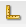

# 디자인 모드에서 구성 요소 구성{#configuring-components-in-design-mode}

AEM 인스턴스를 즉시 설치하면 사이드 킥에서 다양한 구성 요소를 즉시 사용할 수 있습니다.

이들 외에도 다양한 다른 구성 요소도 사용할 수 있습니다. 디자인 모드를 사용하여 다음을 수행할 수 있습니다. [이러한 구성 요소 활성화/비활성화](#enabledisablecomponentsusingdesignmode). 활성화되어 페이지에 있는 경우 디자인 모드를 사용하여 다음과 같은 작업을 수행할 수 있습니다 [구성 요소 디자인의 측면 구성](#configuringcomponentsusingdesignmode) 속성 매개 변수를 편집하여

>[!NOTE]
>
>이러한 구성 요소를 편집할 때는 주의해야 합니다. 디자인 설정은 종종 전체 웹 사이트 디자인의 필수적인 부분이므로 적절한 권한(및 경험)을 가진 사람(관리자 또는 개발자)만 변경해야 합니다. 다음을 참조하십시오 [구성 요소 개발](/help/sites-developing/components.md) 추가 정보.

이 작업에는 페이지의 단락 시스템에서 허용되는 구성 요소를 추가하거나 제거하는 작업이 실제로 포함됩니다. 단락 시스템( `parsys`)는 다른 모든 단락 구성 요소를 포함하는 컴파운드 구성 요소입니다. 단락 시스템을 사용하면 작성자가 다른 모든 단락 구성 요소를 포함하므로 페이지에 다른 유형의 구성 요소를 추가할 수 있습니다. 각 단락 유형은 구성 요소로 표시됩니다.

예를 들어 제품 페이지의 콘텐츠에는 다음을 포함하는 단락 시스템이 포함될 수 있습니다.

* 제품 이미지(이미지 또는 텍스트 단락 형태)
* 제품 설명(텍스트 단락)
* 기술 데이터가 포함된 표(표 단락으로 표시)
* 양식 사용자가 작성(양식 시작 시, 양식 요소 및 양식 끝 단락)

>[!NOTE]
>
>다음을 참조하십시오 [구성 요소 개발](/help/sites-developing/components.md#paragraphsystem) 및 [템플릿 및 구성 요소 사용 지침](/help/sites-developing/dev-guidelines-bestpractices.md#guidelines-for-using-templates-and-components) 에 관한 추가 정보를 위하여 `parsys`.

## 구성 요소 활성화/비활성화 {#enable-disable-components}

디자인 모드에서 사이드 킥은 최소화되며 작성에 액세스할 수 있는 구성 요소를 구성할 수 있습니다.

1. 디자인 모드로 전환하려면 편집할 페이지를 열고 사이드 킥 아이콘을 사용합니다.

   

1. 클릭 **편집** 단락 시스템 (**파스 디자인**).

   

1. Sidekick에 표시되는 구성 요소 그룹을 포함된 개별 구성 요소와 함께 나열하는 대화 상자가 열립니다.

   필요에 따라 사이드 킥에서 사용할 수 있는 구성 요소를 추가하거나 제거합니다.

   

1. 디자인 모드에서 Sidekick이 최소화됩니다. 화살표를 클릭하여 Sidekick을 최대화하고 편집 모드로 돌아갈 수 있습니다.

   

## 구성 요소 디자인 구성 {#configuring-the-design-of-a-component}

디자인 모드에서 개별 구성 요소에 대한 속성을 구성할 수도 있습니다. 각 구성 요소에는 자체 매개 변수가 있습니다. 다음 예제에서는 **이미지** 구성 요소:

1. 디자인 모드로 전환하려면 편집할 페이지를 열고 사이드 킥 아이콘을 사용합니다.

   

1. 구성 요소 디자인을 구성할 수 있습니다.

   예를 들어 **편집** 이미지 구성 요소(**이미지 디자인**) 구성 요소별 매개 변수를 구성할 수 있습니다.

   

1. 클릭 **확인** 변경 사항을 저장합니다.

1. 디자인 모드에서 Sidekick이 최소화됩니다. 화살표를 클릭하여 Sidekick을 최대화하고 편집 모드로 돌아갈 수 있습니다.

   
