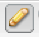

# 페이지 콘텐츠 편집{#editing-page-content}

페이지가 만들어지면(launch 또는 live copy의 일부 또는 신규) 콘텐츠를 편집하여 필요한 업데이트 작업을 수행할 수 있습니다.

콘텐츠는 페이지로 끌 수 있는 [구성 요소](/help/sites-classic-ui-authoring/classic-page-author-default-components.md)(콘텐츠 유형에 맞는)를 사용하여 추가됩니다. 그런 다음 그 자리에서 편집하거나, 이동하거나 삭제할 수 있습니다.

>[!NOTE]
>
>구성 요소 추가, 편집 또는 삭제, 주석 달기, 잠금 해제 등과 같은 페이지를 편집하려면 계정에 [적절한 액세스 권한](/help/sites-administering/security.md) 및 [권한](/help/sites-administering/security.md#permissions)이 필요합니다.
>
>문제가 발생하면 시스템 관리자에게 문의하십시오.

## Sidekick {#sidekick}

사이드 킥은 페이지를 작성할 때의 주요 도구입니다. 페이지를 작성할 때 부동 되므로 항상 표시됩니다.

다음을 포함한 몇 가지 탭과 아이콘을 사용할 수 있습니다.

* 구성 요소
* 페이지
* 정보
* 버전 관리
* 워크플로
* 모드
* 스캐폴딩
* ClientContext
* 웹 사이트

이를 통해 다음을 포함한 다양한 기능에 액세스할 수 있습니다.

* [구성 요소 선택](/help/sites-classic-ui-authoring/classic-page-author-env-tools.md#sidekick)
* [참조 표시](/help/sites-classic-ui-authoring/classic-page-author-env-tools.md#showing-references)
* [감사 로그 액세스](/help/sites-classic-ui-authoring/classic-page-author-env-tools.md#audit-log)
* [모드 전환](/help/sites-classic-ui-authoring/classic-page-author-env-tools.md#page-modes)
* [만들기](/help/sites-classic-ui-authoring/classic-page-author-work-with-versions.md#creating-a-new-version), [복원](/help/sites-classic-ui-authoring/classic-page-author-work-with-versions.md#restoring-a-page-version-from-sidekick) 및 [비교](/help/sites-classic-ui-authoring/classic-page-author-work-with-versions.md#comparing-with-a-previous-version) 버전

* 페이지 [게시](/help/sites-classic-ui-authoring/classic-page-author-publish-pages.md#publishing-a-page), [게시 취소](/help/sites-classic-ui-authoring/classic-page-author-publish-pages.md#unpublishing-a-page)

* [페이지 속성 편집](/help/sites-classic-ui-authoring/classic-page-author-edit-page-properties.md)

* [스캐폴딩](/help/sites-authoring/scaffolding.md)

* [client context](/help/sites-administering/client-context.md)

## 구성 요소 삽입 {#inserting-a-component}

### 구성 요소 삽입 {#inserting-a-component-1}

페이지를 열면 콘텐츠를 추가할 수 있습니다. 구성 요소(단락이라고도 함)를 추가하여 이 작업을 수행합니다.

새 구성 요소를 삽입하려면 다음 작업을 수행하십시오.

1. 삽입할 단락 유형을 선택하는 방법에는 여러 가지가 있습니다.

   * **구성 요소 또는 자산을 여기로 드래그하십시오..** 영역을 두 번 클릭합니다. **새 구성 요소 삽입** 도구 모음이 열립니다. 구성 요소를 선택하고 **확인**&#x200B;을 클릭합니다.

   * 부동 도구 모음(사이드 킥이라고 함)에서 구성 요소를 드래그하여 새 단락을 삽입합니다.
   * 기존 단락을 마우스 오른쪽 단추로 클릭하고 **새로 만들기...**&#x200B;을 선택합니다. 새 구성 요소 삽입 도구 모음이 열립니다. 구성 요소를 선택하고 **확인**&#x200B;을 클릭합니다.

   

1. 사이드 킥과 **새 구성 요소 삽입** 도구 모음 모두에서 사용 가능한 구성 요소 목록(단락 유형)을 볼 수 있습니다. 이러한 세그먼트는 필요에 따라 확장할 수 있는 다양한 섹션(예: 일반, 열 등)으로 분할할 수 있습니다.

   프로덕션 환경에 따라 이러한 선택 사항이 다를 수 있습니다. 구성 요소에 대한 자세한 내용은 [기본 구성 요소](/help/sites-classic-ui-authoring/classic-page-author-default-components.md)를 참조하십시오.

1. 페이지에 원하는 구성 요소를 삽입합니다. 단락을 두 번 클릭하면 단락을 구성하고 콘텐츠를 추가할 수 있는 창이 열립니다.

### 콘텐츠 파인더를 사용하여 구성 요소 삽입 {#inserting-a-component-using-the-content-finder}

[콘텐츠 파인더](/help/sites-classic-ui-authoring/classic-page-author-env-tools.md#the-content-finder)에서 자산을 끌어 페이지에 새 구성 요소를 추가할 수도 있습니다. 이렇게 하면 자산이 포함된 적절한 유형의 구성 요소가 자동으로 만들어집니다.

다음은 다음 자산 유형에 대해 유효합니다(일부는 페이지/단락 시스템에 따라 다름).

| 에셋 유형 | 결과 구성 요소 유형 |
|---|---|
| 이미지 | 이미지 |
| 문서 | 다운로드 |
| 제품 | 제품 |
| 비디오 | 플래시 |

>[!NOTE]
>
>이 동작은 설치에 대해 구성할 수 있습니다. 자세한 내용은 [단락 시스템 구성 및 자산 드래그를 통한 구성 요소 인스턴스 만들기](/help/sites-developing/developing-components.md#configuring-a-paragraph-system-so-that-dragging-an-asset-creates-a-component-instance)를 참조하십시오.

위의 자산 유형 중 하나를 끌어 구성 요소를 만들려면

1. 페이지가 [**편집** 모드](/help/sites-classic-ui-authoring/classic-page-author-env-tools.md#page-modes)인지 확인합니다.
1. [콘텐츠 파인더](/help/sites-classic-ui-authoring/classic-page-author-env-tools.md#the-content-finder)를 엽니다.
1. 필요한 자산을 필요한 위치로 드래그합니다. [구성 요소 자리 표시자](#componentplaceholder)은 구성 요소가 위치할 곳을 보여 줍니다.

   에셋 유형에 적절한 구성 요소가 필요한 위치에 만들어지게 됩니다. 여기에 선택한 에셋이 포함됩니다.

1. 필요한 경우 구성 요소를 [편집](#editmovecopypastedelete)합니다.

## 구성 요소 편집(컨텐츠 및 속성) {#editing-a-component-content-and-properties}

기존 단락을 편집하려면 다음 중 하나를 수행하십시오.

* 단락을 열려면 **두 번 클릭**&#x200B;합니다. 기존 내용으로 단락을 만들 때와 동일한 창이 표시됩니다. 변경한 후 **확인**&#x200B;을 클릭합니다.

* **단락을 마우스 오른쪽 단추로 클릭**&#x200B;한 다음 **편집**&#x200B;을 클릭합니다.

* **단락에서**&#x200B;을(를) 두 번 클릭(느린 두 번 클릭)하여 바로 편집 모드로 전환합니다. 대화 상자 창 내부가 아닌 페이지에서 텍스트를 직접 편집할 수 있습니다. 이 모드에서는 페이지 상단에 도구 모음이 제공됩니다. 변경하기만 하면 자동으로 저장됩니다.

## 구성 요소 이동 {#moving-a-component}

단락을 이동하려면 다음을 수행합니다.

>[!NOTE]
>
>[잘라내기 및 붙여넣기](#cut-copy-paste-a-component)를 사용하여 구성 요소를 이동할 수도 있습니다.

1. 이동할 단락을 선택합니다.

   

1. 단락을 새 위치로 드래그합니다. AEM에서 녹색 확인 표시로 단락을 이동할 수 있는 위치를 보여 줍니다. 원하는 위치에 드롭합니다.
1. 단락이 이동됩니다.

   

## 구성 요소 삭제 {#deleting-a-component}

단락을 삭제하려면:

1. 단락을 선택하고 **마우스 오른쪽 단추 클릭**:

   

1. 메뉴에서 **삭제**&#x200B;를 선택합니다. AEM WCM은 이 작업을 실행 취소할 수 없으므로 단락을 삭제하라는 확인을 요청합니다.
1. **확인**&#x200B;을 클릭합니다.

>[!NOTE]
>
>[사용자 속성을 전역 편집 도구 모음을 표시하도록 설정한 경우](/help/sites-classic-ui-authoring/author-env-user-props.md) 사용 가능한 **복사**, **잘라내기**, **붙여넣기**, **삭제** 단추를 사용하여 단락에서 특정 작업을 수행할 수도 있습니다.
>
>다양한 [키보드 단축키](/help/sites-classic-ui-authoring/classic-page-author-keyboard-shortcuts.md)도 사용할 수 있습니다.

## 구성 요소 잘라내기/복사/붙여넣기 {#cut-copy-paste-a-component}

[구성 요소 삭제](#deleting-a-component)와 마찬가지로 컨텍스트 메뉴를 사용하여 구성 요소를 복사, 잘라내기 및/또는 붙여넣을 수 있습니다.

>[!NOTE]
>
>[사용자 속성을 전역 편집 도구 모음을 표시하도록 설정한 경우](/help/sites-classic-ui-authoring/author-env-user-props.md) 사용 가능한 **복사**, **잘라내기**, **붙여넣기**, **삭제** 단추를 사용하여 단락에서 특정 작업을 수행할 수도 있습니다.
>
>다양한 [키보드 단축키](/help/sites-classic-ui-authoring/classic-page-author-keyboard-shortcuts.md)도 사용할 수 있습니다.

>[!NOTE]
>
>콘텐츠 잘라내기, 복사 및 붙여넣기는 동일한 페이지 내에서만 지원됩니다.

## 상속된 구성 요소 {#inherited-components}

상속된 구성 요소는 다음을 포함하여 다양한 시나리오의 제품일 수 있습니다.

* [다중 사이트 관리](/help/sites-administering/msm.md); [스캐폴딩](/help/sites-classic-ui-authoring/classic-feature-scaffolding.md#scaffolding-with-msm-inheritance)과(와) 함께 사용됩니다.

* [시작](/help/sites-classic-ui-authoring/classic-launches.md)(livecopy를 기반으로 할 때).
* 특정 구성 요소(예: Geometrixx 내의 상속된 단락 시스템)

상속을 취소(그런 다음 다시 활성화)할 수 있습니다. 구성 요소에 따라 다음 위치에서 사용할 수 있습니다.

1. **Live Copy**

   구성 요소가 라이브 카피 또는 론치의 일부인 경우 자물쇠 아이콘으로 표시됩니다. 자물쇠를 클릭하여 상속을 취소할 수 있습니다.

   * 구성 요소를 선택하면 자물쇠 아이콘이 표시됩니다. 예:

   

   * 자물쇠는 구성 요소 대화 상자에도 표시됩니다. 예:

   

1. **상속된 단락 시스템**

   구성 대화 상자 예를 들어 Geometrixx 내의 상속된 단락 시스템과 마찬가지로

   

## 주석 추가 {#adding-annotations}

[주석](/help/sites-classic-ui-authoring/classic-page-author-annotations.md)을 사용하면 다른 작성자가 콘텐츠에 대한 피드백을 제공할 수 있습니다. 이는 종종 검토 및 유효성 검사 목적으로 사용됩니다.

## 페이지 미리보기 {#previewing-pages}

사이드 킥의 하단 테두리에 페이지를 미리 보는 데 중요한 두 가지 아이콘이 있습니다.

* 연필 아이콘은 콘텐츠를 추가, 수정, 이동 또는 삭제할 수 있는 편집 모드에 있음을 보여 줍니다.

  

* 돋보기 아이콘을 사용하면 페이지가 게시 환경에 표시될 상태로 표시되는 미리보기 모드를 선택할 수 있습니다(경우에 따라 페이지 새로 고침이 필요함).

  

  미리보기 모드에서 사이드 킥이 줄어들게 됩니다. 아래 화살표 아이콘을 클릭하여 편집 모드로 돌아갑니다.

  

## 찾기 및 바꾸기 {#find-replace}

동일한 구문을 대규모로 편집하는 경우 **[찾기 및 바꾸기](/help/sites-classic-ui-authoring/author-env-search.md#find-and-replace)** 메뉴 옵션을 사용하여 웹 사이트의 섹션 내에서 문자열의 여러 인스턴스를 검색하고 바꿀 수 있습니다.

## 페이지 잠금 {#locking-a-page}

AEM을 사용하면 다른 사람이 컨텐츠를 변경할 수 없도록 페이지를 잠글 수 있습니다. 이 기능은 하나의 특정 페이지를 여러 번 편집하거나 잠시 동안 페이지를 동결해야 할 때 유용합니다.

>[!CAUTION]
>
>페이지 잠금은 페이지를 잠근 사용자(또는 관리자 권한이 있는 계정)만이 페이지 잠금을 해제할 수 있으므로 주의하여 사용해야 합니다.

페이지를 잠그려면 다음을 수행하십시오.

1. **웹 사이트** 탭에서 잠글 페이지를 선택합니다.
1. 편집할 페이지를 두 번 클릭하여 엽니다.
1. 사이드 킥의 **페이지** 탭에서 **페이지 잠금**&#x200B;을 선택합니다.

   

   페이지가 다른 사용자에게 잠겨 있다는 메시지가 표시됩니다. 또한 **웹 사이트** 콘솔의 오른쪽 창에서 AEM WCM은 페이지를 잠긴 것으로 표시하고 어느 사용자가 페이지를 잠갔는지를 나타냅니다.

   

## 페이지 잠금 해제 {#unlocking-a-page}

페이지 잠금을 해제하려면:

1. **웹 사이트** 탭에서 잠금 해제할 페이지를 선택합니다.
1. 페이지를 두 번 클릭하여 엽니다.
1. 사이드 킥의 **페이지** 탭에서 **페이지 잠금 해제**&#x200B;를 선택합니다.

## 페이지 편집 실행 취소 및 재실행 {#undoing-and-redoing-page-edits}

페이지의 콘텐츠 프레임에 포커스가 있는 동안 다음 키보드 단축키를 사용하십시오.

* 실행 취소: Ctrl+Z (Windows) 또는 Cmd+Z (Mac)
* 다시 실행: Ctrl+Y(Windows) 또는 Cmd+Y(Mac)

하나 이상의 단락의 제거, 추가 또는 재배치를 실행 취소하거나 재실행하면 깜박임(기본 비헤이비어) 강조 표시가 영향을 받는 단락을 나타냅니다.

>[!NOTE]
>
>페이지 편집 내용을 실행 취소하거나 재실행할 때 가능한 사항에 대한 모든 세부 사항은 [페이지 편집 실행 취소 및 재실행 - 이론](#undoing-and-redoing-page-edits-the-theory)을 참조하십시오.

## 페이지 편집 내용 실행 취소 및 재실행 - 이론 {#undoing-and-redoing-page-edits-the-theory}

>[!NOTE]
>
>시스템 관리자는 인스턴스에 대한 요구 사항에 따라 [실행 취소/다시 실행 기능의 다양한 측면을 구성](/help/sites-administering/config-undo.md)할 수 있습니다.

AEM은 사용자가 수행한 작업 내역과 해당 작업을 수행한 순서를 저장합니다. 따라서 수행한 순서대로 여러 작업을 실행 취소합니다. 그런 다음 다시 실행을 사용하여 하나 이상의 작업을 다시 적용할 수 있습니다.

컨텐트 페이지의 요소를 선택하면 실행 취소 및 다시 실행 명령이 텍스트 구성 요소와 같이 선택한 항목에 적용됩니다.

실행 취소 및 재실행 명령의 동작은 다른 소프트웨어 프로그램의 동작과 유사합니다. 명령을 사용하여 콘텐츠에 대한 결정을 내릴 때 웹 페이지의 최근 상태를 복원합니다. 예를 들어 텍스트 단락을 페이지의 다른 위치로 이동한 후 실행 취소 명령을 사용하여 단락을 원래 위치로 되돌릴 수 있습니다. 그런 다음 단락을 다시 이동하려면 다시 실행 명령을 사용합니다.

>[!NOTE]
>
>다음과 같은 작업을 수행할 수 있습니다.
>
>* 실행 취소를 사용한 이후 페이지 편집을 하지 않는 한 작업을 재실행합니다.
>* 최대 20개의 편집 작업을 실행 취소합니다(기본 설정).
>* 실행 취소하거나 다시 실행하려면 [키보드 단축키](/help/sites-classic-ui-authoring/classic-page-author-keyboard-shortcuts.md)도 사용하십시오.
>

다음과 같은 유형의 페이지 변경을 취소하거나 재실행할 수 있습니다.

* 단락 추가, 편집, 삭제 및 이동
* 단락 내용 즉석 편집
* 페이지 내 항목 복사, 잘라내기 및 붙여넣기
* 페이지 간에 항목 복사, 잘라내기 및 붙여넣기
* 파일 및 이미지 추가, 제거 및 변경
* 주석 및 스케치 추가, 제거 및 변경
* 스캐폴드 변경 사항
* 참조 추가 및 제거
* 구성 요소 대화 상자에서 속성 값 변경.

양식 구성 요소가 렌더링되는 양식 필드는 페이지를 작성하는 동안 지정된 값을 갖지 않습니다. 따라서 실행 취소 및 재실행 명령은 이러한 유형의 구성 요소 값에 대한 변경 내용에 영향을 주지 않습니다. 예를 들어 드롭다운 목록에서 값 선택을 실행 취소할 수 없습니다.

>[!NOTE]
>
>파일 및 이미지 변경을 실행 취소하거나 재실행하려면 특수 권한이 필요합니다. 또한 파일 및 이미지에 대한 변경 내용 실행 취소 기록은 최소 시간 동안 지속됩니다. 이 시간이 지나면 변경을 취소하지 못할 수 있습니다. 관리자가 권한을 제공하고 기본 시간인 10시간을 변경할 수 있습니다.
