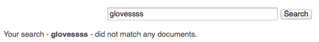
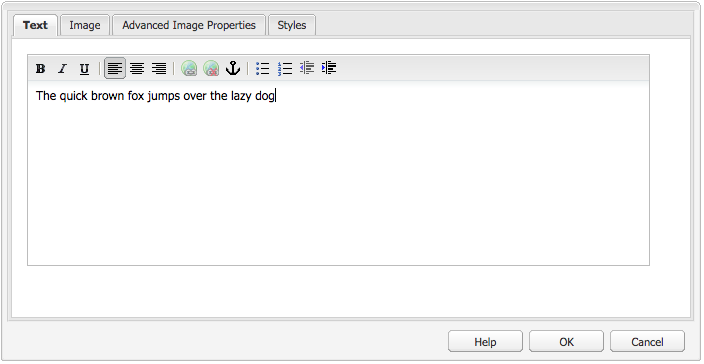
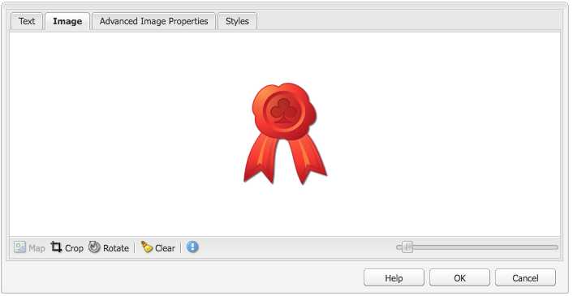
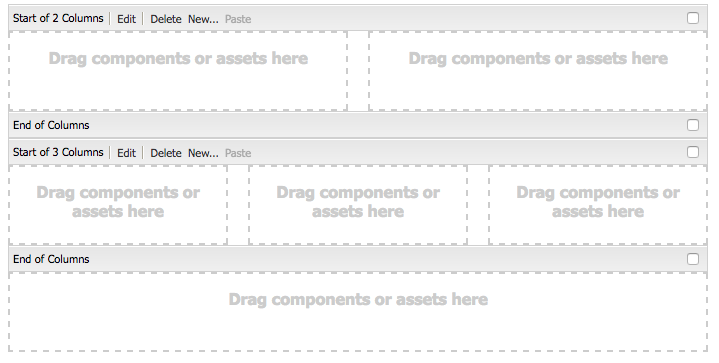
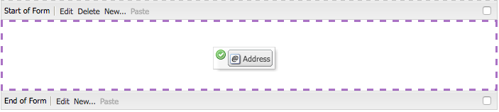
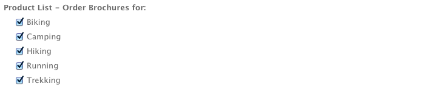

# 페이지 작성용 구성 요소{#components-for-page-authoring}

다음 구성 요소는 표준 웹 페이지에 대한 컨텐츠를 작성할 때 사용하기 위한 것입니다. 이러한 구성 요소는 AEM의 표준 설치 시 기본적으로 제공되는 구성 요소의 하위 집합을 형성합니다.

일부 구성 요소는 사이드 킥을 통해 즉시 사용할 수 있고, 그 밖의 다양한 구성 요소는 [디자인 모드](/help/sites-classic-ui-authoring/classic-page-author-design-mode.md)로 활성화/비활성화하여 사용할 수도 있습니다.

>[!CAUTION]
>
>이 섹션에서는 표준 AEM 설치 시 기본적으로 사용할 수 있는 구성 요소에 대해서만 설명합니다.
>
>사용자 인스턴스에 따라 사용자 요구 사항에 맞게 명시적으로 개발된 구성 요소를 사용자 지정했을 수 있습니다. 이러한 구성 요소는 여기서 설명한 구성 요소 중 일부와 이름이 같을 수도 있습니다.

구성 요소는 사이드 킥의 **구성 요소** 탭 및 **새 구성 요소 삽입** 선택기에서 페이지](/help/sites-classic-ui-authoring/classic-page-author-edit-content.md)을(를) 편집할 때 사용할 수 있습니다(**구성 요소 또는 자산을 여기로 드래그하십시오** 영역).[

구성 요소를 선택하고 페이지에서 필요한 위치로 드래그한 다음 [콘텐츠 및 속성 편집](/help/sites-classic-ui-authoring/classic-page-author-edit-content.md#editing-a-component-content-and-properties)을 선택합니다.

구성 요소는 다음을 포함하여(페이지 작성용) 다양한 카테고리(구성 요소 그룹)에 따라 정렬됩니다.

* [일반](#general): 텍스트, 이미지, 표, 차트 등의 기본적인 구성 요소를 포함합니다.
* [열](#columns): 컨텐츠의 레이아웃을 구성하는 데 필요한 구성 요소를 포함합니다.
* [양식](#formgroup): 양식을 만드는 데 필요한 모든 구성 요소를 포함합니다.

## 일반 {#general}

일반 구성 요소는 컨텐츠를 만드는 데 사용하는 기본 구성 요소입니다.

### 계정 항목 {#account-item}

제목 및 설명을 사용하여 링크를 정의할 수 있습니다.


### 응용 이미지 {#adaptive-image}

응용 이미지 기초 구성 요소는 웹 페이지가 열려 있는 창에 맞게 크기가 조정된 이미지를 생성합니다. 이 구성 요소를 사용하기 위해서는 파일 시스템 또는 DAM에서 이미지 리소스를 제공합니다. 웹 페이지가 열리면 웹 브라우저는 현재 창에 맞도록 크기가 조정된 이미지 사본을 다운로드합니다.

다음 특성이 창의 크기를 결정할 수 있습니다.

* 장치 화면: 모바일 장치에서는 웹 페이지가 일반적으로 전체 화면에 걸쳐 확장되도록 표시됩니다.
* 웹 브라우저 창 크기: 랩탑 및 데스크톱 컴퓨터 사용자는 웹 브라우저 창의 크기를 변경할 수 있습니다.

예를 들어, 구성 요소는 웹 페이지가 휴대폰에서 열리면 작은 이미지를 생성하고 태블릿에서 열리면 중간 크기 이미지를 생성합니다. 랩탑에서는 페이지가 최대화된 웹 브라우저에서 열리면 구성 요소가 큰 이미지를 만들어 제공합니다. 웹 브라우저 크기가 화면의 일부에 맞게 변경되면 구성 요소는 더 작은 이미지를 제공하여 맞추고 보기를 새로 고칩니다.

#### 지원되는 이미지 형식 {#supported-image-formats}

응용 이미지 구성 요소에 사용할 수 있는 이미지 파일 확장명은 다음과 같습니다.

* .jpg
* .jpeg
* .png
* .gif **

>[!CAUTION]
>
>** 애니메이션된 .gif 파일은 적응형 표현물에 대해 AEM에서 지원되지 않습니다.

#### 이미지 크기 및 품질 {#images-sizes-and-quality}

다음 표에는 주어진 뷰포트 너비에 대해 생성되는 이미지의 너비가 나열됩니다. 생성된 이미지의 높이는 일정한 종횡비를 유지하도록 계산되며 이미지 가장자리 내부에 공백은 생기지 않습니다. 자르기를 사용하여 공백을 방지할 수 있습니다.

이미지가 JPEG이면, 뷰포트 크기가 JPEG 품질에 영향을 줄 수 있습니다. 가능한 JPEG 품질은 다음과 같습니다.

* 낮음(0.42)
* 중간(0.82)
* 높음(1.00)

| 뷰포트 너비 범위(픽셀) | 이미지 너비(픽셀) | JPEG 품질 | 타깃 장치 유형 |
|---|---|---|---|
| 너비 &lt;= 319 | 320 | 낮음 |  |
| 너비 = 320 | 320년 | 중간 | 휴대폰(세로) |
| 320 &lt; 너비 &lt; 481 | 480 | 중간 | 휴대폰(가로) |
| 480 &lt; 너비 &lt; 769 | 476 | 높음 | 태블릿(세로) |
| 768 &lt; 너비 &lt; 1025 | 620 | 높음 | 태블릿(가로) |
| 너비 &lt;= 1025 | 전체(원래 크기) | 높음 | 데스크톱 |

#### 속성 {#properties}

이 대화 상자에서는 응용 이미지 구성 요소의 인스턴스에 대한 속성을 편집할 수 있습니다. 많은 응용 이미지 구성 요소는 기반이 되는 이미지 구성 요소와 공통입니다. 속성은 다음 두 가지 탭에서 사용할 수 있습니다.

* **이미지**

   * **이미지**
컨텐츠 파인더에서 이미지를 끌어 놓거나 클릭하여 이미지를 로드할 수 있는 찾아보기 창을 엽니다. 이미지가 로드되면 이미지를 자르거나, 회전하거나, 삭제할 수 있습니다. 이미지를 확대/축소하려면 이미지 아래에서 확인 및 취소 단추 위에 있는 슬라이드 막대를 사용합니다.

   * **자르기**
이미지를 자릅니다. 테두리를 끌어서 이미지를 자릅니다.

   * **회전**
회전을 계속 클릭하여 이미지를 원하는 대로 회전합니다.

   * **지우기**
현재 이미지를 제거합니다.

* **고급**

   * **제목**
응용 이미지 구성 요소에서는 이 속성을 사용하지 않습니다.

   * **대체 텍스트**
이미지에 사용하는 대체 텍스트.

   * **다음으로 링크**
응용 이미지 구성 요소에서는 이 속성을 사용하지 않습니다.

   * **설명**
응용 이미지 구성 요소에서는 이 속성을 사용하지 않습니다.

#### 응용 이미지 구성 요소 확장 {#extending-the-adaptive-image-component}

응용 이미지 구성 요소 사용자 지정에 대한 자세한 내용은 [응용 이미지 구성 요소의 이해](/help/sites-developing/responsive.md#using-adaptive-images)를 참조하십시오.

### 회전판 {#carousel}

회전판 구성 요소를 사용하면 개별 페이지에 연결된 이미지를 표시할 수 있습니다.

* 한 번에 하나씩
* 짧은 시간 동안
* 사용자가 지정하는 순서로
* 사용자가 지정하는 시간 간격으로

클릭 가능한 컨트롤을 통해 사용자가 표시되는 페이지를 원하는 대로 실시간으로 순환하게 할 수도 있습니다. 현재 표시된 페이지를 클릭하면 해당 페이지로 이동합니다. 즉, 회전판은 탐색 컨트롤의 역할을 합니다.

#### 속성 {#properties-1}

속성은 다음 두 가지 탭에서 사용할 수 있습니다.

* **회전판**
여기서 회전판이 작동하는 방식을 지정합니다.

   * 재생 속도
다음 슬라이드를 표시하기 전에 대기할 시간(밀리초 단위)
   * 전환 시간
두 슬라이드 간에 전환하는 데 걸리는 시간(밀리초 단위)
   * 컨트롤 스타일
풀다운 메뉴로 다양한 옵션 제공(예: 이전 / 다음 단추, 오른쪽 위 스위치).

* **목록**
여기서는 회전판에 페이지가 포함되는 방법을 지정합니다.

   * **목록 작성 방법**
여러 가지 방법으로 페이지 목록을 만들 수 있습니다. 이러한 방법으로는 하위 페이지, 고정 목록, 검색 또는 고급 검색이 있으며 아래에서 자세히 설명합니다.
선택한 방법과 관계없이 목록에 포함된 각 페이지에는 이미지가 이미 연결되어 있어야 합니다. 회전판에 표시될 이 이미지입니다. 특정 페이지의 속성에 이미지가 없는 경우 작업을 시작하기 전에 페이지에 이미지를 연결해야 합니다. 그러지 않으면 회전판에 완전히 비어 있거나 대부분이 비어 있는 페이지가 표시됩니다. [페이지 속성 편집](/help/sites-classic-ui-authoring/classic-page-author-edit-page-properties.md)을 참조하십시오.
선택하는 항목에 따라 새 패널이 다르게 나타납니다.

      * **하위 페이지 옵션**

         * **상위 페이지**
수동으로 또는 선택기를 사용하여 경로를 지정하십시오. 현재 페이지를 상위 페이지로 사용하려면 비워 두십시오.
      * **고정 목록 옵션**

         * ****
페이지페이지 목록을 선택합니다.사용 
`+` 항목을 더 추가하고 위쪽/아래쪽 단추를 추가하여 순서를 조정합니다.
      * **검색 옵션**

         * **시작 위치**
시작 경로를 수동으로 또는 선택기를 사용하여 입력합니다.

         * **검색 쿼리**
일반 텍스트 검색 쿼리를 입력할 수 있습니다.
      * **고급 검색 옵션**

         * **Querybuilder 설명 표기법**
QueryBuilder 설명 표기법을 사용하여 검색 쿼리를 입력할 수 있습니다. 예를 들어 &quot;fulltext=Marketing&quot;을 입력하면 컨텐츠에 &quot;Marketing&quot;이 포함된 모든 페이지를 회전판에 표시할 수 있습니다.
쿼리 표현식 및 추가적인 예에 대한 전체 논의는 [QueryBuilder API](/help/sites-developing/querybuilder-api.md)를 참조하십시오.
   * **정렬**
기준 선택 
`jcr:title`,  `jcr:created` `cq:lastModified` 또는 드롭다운 메뉴 `cq:template` 에서 다운로드할 수 있습니다.

   * **제한**
회전판에서 사용할 최대 항목 수로서, 선택 사항입니다.


>[!NOTE]
AEM DAM에 있는 디지털 자산을 표시하는 Adobe Experience Manager용의 사용자 지정 회전판 구성 요소를 만들 수 있습니다. 자세한 내용은 [Adobe Experience Manager용 사용자 지정 회전판 구성 요소 만들기](https://helpx.adobe.com/kr/experience-manager/using/custom-carousel-components.html)를 참조하십시오.

### Chart  {#chart}

차트 구성 요소로 막대, 라인 또는 파이 차트를 추가할 수 있습니다. 입력한 데이터를 바탕으로 AEM에서 차트를 만듭니다. 데이터 탭에 데이터를 직접 입력하거나 스프레드시트를 복사하여 붙여넣을 수 있습니다.

* **데이터**

   * **차트 데이터**
CSV 형식을 사용하여 차트 데이터를 입력합니다. CSV 형식은 쉼표로 구분된 값 형식으로서 각 필드를 쉼표(&quot;,&quot;)로 구분합니다.

* **고급**

   * **차트 유형**
파이 차트, 라인 차트, 막대 차트 중에서 선택합니다.

   * **대체 텍스트**
차트 대신 표시되는 대체 텍스트입니다.

   * **너비**
차트의 픽셀 단위 너비입니다.

   * **높이**
차트의 픽셀 단위 높이입니다.

다음은 결과 막대 차트의 앞에 오는 차트 데이터의 예입니다.

 

>[!NOTE]
AEM JCR에 있는 데이터를 표시하는 사용자 지정 AEM 차트 컨트롤을 만들 수 있습니다. 자세한 내용은 [차트에 Adobe Experience Manager 데이터 표시](https://helpx.adobe.com/kr/experience-manager/using/displaying-experience-manager-data-chart.html)를 참조하십시오.

### 콘텐츠 조각 {#content-fragment}

>[!CAUTION]
컨텐츠 조각 관리의 전체 기능은 터치에 적합한 UI에서만 사용할 수 있습니다.
컨텐츠 조각 구성 요소는 클래식 UI 사이드 킥에서 볼 수 있지만, 세부 기능은 사용할 수 없습니다.

[컨텐츠 조각](/help/sites-classic-ui-authoring/classic-page-author-content-fragments.md)은 페이지와 독립된 자산으로 작성 및 관리됩니다. 그런 다음 컨텐츠 페이지를 작성할 때 이러한 조각과 해당 변형을 사용할 수 있습니다.

### 디자인 가져오기 {#design-importer}

디자인 패키지를 포함하는 zip 파일을 업로드할 수 있도록 해줍니다.

### 다운로드 {#download}

다운로드 구성 요소는 선택한 웹 페이지에 특정 파일을 다운로드할 수 있는 링크를 만듭니다. 컨텐츠 파인더에서 자산을 드래그하거나 파일을 업로드할 수 있습니다.

* **다운로드**

   * **설명**
다운로드 링크에 표시되는 짧은 설명입니다.

   * **파일**
결과 웹 페이지에서 다운로드할 수 있는 파일입니다. Content Finder에서 자산을 끌어 놓거나 영역을 클릭하여 다운로드하도록 제공할 파일을 업로드합니다.

다음 예제는 Geometrixx의 다운로드 구성 요소입니다.


### 외부 {#external}

외부 애플리케이션 통합 구성 요소(**외부**)는 iframe을 사용하여 외부 애플리케이션을 AEM 페이지에 포함할 수 있도록 해줍니다.

* **외부**

   * **대상 애플리케이션**

      통합할 웹 애플리케이션의 URL을 지정합니다. 예를 들면 다음과 같습니다.

      ```
      https://en.wikipedia.org/wiki/Main_Page
      ```

   * **매개 변수 전달**

      필요할 때 애플리케이션에 전달될 매개 변수에 대한 확인란을 선택합니다.

   * **폭과 높이**

      iframe 크기를 정의합니다.

외부 애플리케이션이 AEM 페이지의 단락 시스템에 통합됩니다. 예를 들어, `https://en.wikipedia.org/wiki/Main_Page`의 대상 애플리케이션을 사용하는 경우입니다.


>[!NOTE]
사용 사례에 따라 외부 애플리케이션 통합을 위해 다른 옵션을 사용할 수도 있습니다. 예를 들어 [포틀릿 통합](/help/sites-administering/aem-as-portal.md)이 있습니다.

### Flash {#flash}

Flash 구성 요소로 Flash 동영상을 로드할 수 있습니다. 컨텐츠 파인더에서 Flash 자산을 드래그하거나 대화 상자를 사용할 수 있습니다.

* **Flash**

   * **Flash 동영상**

      Flash 동영상 파일입니다. Content Finder에서 자산을 드래그하거나 클릭하여 찾아보기 창을 엽니다.

   * **크기**

      동영상을 표시할 영역의 픽셀 단위 크기입니다.

* **대체 이미지**

   표시할 대체 이미지입니다.

* **고급**

   * **컨텍스트 메뉴**

      컨텍스트 메뉴를 표시할지 여부를 나타냅니다.

   * **창 모드**

      창을 표시할 방법(예: 불투명, 투명 또는 별도의 창)을 지정합니다.

   * **배경색**

      제공된 색상 차트에서 선택한 배경색입니다.

   * **최소 버전**

      동영상을 재생하는 데 필요한 Adobe Flash Player의 최소 버전입니다. 기본값은 9.0.0입니다.

   * **속성**

      필요한 기타 속성입니다.

### 이미지 {#image}

이미지 구성 요소는 지정된 매개 변수에 따라 이미지와 추가 텍스트를 표시합니다.

이미지를 업로드한 다음 편집하고 조작(예: 자르기, 회전, 링크/제목/텍스트 추가)할 수 있습니다.

[컨텐츠 파인더](/help/sites-classic-ui-authoring/classic-page-author-env-tools.md#the-content-finder)의 이미지를 구성 요소나 그 편집 대화 상자에 바로 끌어다 놓을 수 있습니다. 편집 대화 상자의 가운데 영역을 두 번 클릭하여 로컬 파일 시스템을 탐색하고 이미지를 업로드할 수도 있습니다. 편집 대화 상자의 두 탭은 이미지의 모든 정의 및 조작도 제어합니다.


>[!NOTE]
Internet Explorer에서는 업로드의 진행 상태를 모니터링할 수 없습니다.
Internet Explorer 사용자는 이미지를 업로드하고 **확인**&#x200B;을 클릭한 다음, 이미지를 다시 열어 업로드한 파일을 미리 보기에서 확인하고 수정할 수 있습니다(예: 자르기).
AEM에 사용되는 HTML5 기능에 대한 자세한 내용은 [인증된 플랫폼](/help/release-notes/release-notes.md#certifiedplatforms) 섹션을 참조하십시오.

이미지가 로드되면 다음 항목을 구성할 수 있습니다.

* **맵**

   이미지를 매핑하려면 맵을 선택합니다. 이미지 맵을 만들 방법(사각형, 다각형 등)과 영역이 가리킬 대상 위치를 지정할 수 있습니다.

* **자르기**

   자르기를 선택하여 이미지를 자릅니다. 마우스를 사용하여 이미지를 자를 수 있습니다.

* **회전**

   이미지를 회전하려면 회전을 선택합니다. 이미지가 원하는 방향으로 회전할 때까지 반복적으로 사용합니다.

* **지우기**

   현재 이미지를 제거합니다.

* **확대/축소 막대**

   이미지를 확대/축소하려면 이미지 아래에서 [확인] 및 [취소] 단추 위에 있는 슬라이드 막대를 사용합니다.

* **제목**

   이미지의 제목입니다.

* **대체 텍스트**

   액세스 가능한 컨텐츠를 만들 때 사용할 대체 텍스트입니다.

* **링크 대상**

   웹 사이트 내의 자산 또는 다른 페이지로 이동하는 링크를 만듭니다.

* **설명**

   이미지의 설명입니다.

* **크기**

   이미지의 높이와 폭을 설정합니다.

최종 이미지( **제목**&#x200B;과 **설명**&#x200B;포함)는 다음과 같이 표시될 수 있습니다.


### 레이아웃 컨테이너 {#layout-container}

>[!CAUTION]
[레이아웃 컨테이너] 구성 요소는 클래식 UI에서 사용할 수 있지만 전체 기능은 터치 가능 UI에서만 사용 가능합니다. 자세한 내용은 [응답형 레이아웃](/help/sites-classic-ui-authoring/classic-page-author-responsive-layout.md)을 참조하십시오.

### 목록 {#list}

목록 구성 요소로 목록을 표시할 검색 기준을 구성할 수 있습니다.

* **목록**

   * **목록 작성 방법**

      여기에서 목록의 내용을 가져올 위치를 지정합니다. 다음과 같은 방법을 사용할 수 있습니다.

   * 선택하는 항목에 따라 새 패널이 다르게 나타납니다.

      * **하위 페이지 옵션**

         * **하위**(상위 페이지)
수동으로 또는 선택기를 사용하여 경로를 지정합니다. 현재 페이지를 상위 페이지로 사용하려면 비워 두십시오.
      * **고정 목록 옵션**

         * **페이지**

            페이지 목록을 선택합니다. 항목을 더 추가하려면 +를 사용하고, 순서를 조정하려면 위쪽/아래쪽 단추를 사용하십시오.
      * **검색 옵션**

         * **시작 위치**

            시작 경로를 수동으로 또는 선택기를 사용하여 입력 시작 위치.

         * **검색 쿼리**

            일반 텍스트 검색 쿼리를 입력할 수 있습니다.
      * **고급 검색 옵션**

         * **QueryBuilder 설명 표기법**

            QueryBuilder 설명 표기법을 사용하여 검색 쿼리를 입력할 수 있습니다. 예를 들어 &quot;fulltext=Marketing&quot;을 입력하면 컨텐츠에 &quot;Marketing&quot;이 포함된 모든 페이지를 회전판에 표시할 수 있습니다.

            쿼리 표현식 및 추가적인 예에 대한 전체 논의는 [QueryBuilder API](/help/sites-developing/querybuilder-api.md)를 참조하십시오.
      * **태그**

         **상위 페이지**, **태그/키워드**&#x200B;및 필요한 일치 기준을 지정합니다.
   * **다음으로 표시**

      항목을 나열할 방법입니다. 링크, 티저 및 뉴스를 포함합니다.

   * **정렬 기준**

      목록을 정렬할지 여부 및 정렬 기준입니다. 기준을 입력하거나 제공된 드롭다운 목록에서 기준을 선택할 수 있습니다.

   * **제한**

      목록에 표시할 항목의 최대 개수를 지정합니다.

   * **피드 사용**

      목록에 대해 RSS 피드를 활성화할지 여부를 지정합니다.

   * **페이지의 게시물 수**

      한 번에 표시할 목록 항목 수를 지정할 수 있습니다. 지정된 개수보다 항목이 많은 목록은 여러 페이지로 분할되어 표시됩니다.


다음 예제는 하위 페이지 목록을 표시하는 **목록** 구성 요소를 보여줍니다. 디자인은 사이트 디자인의 사용자 지정 CSS 정의에 따라 결정됩니다.


### 로그인 {#login}

사용자 이름과 암호 필드를 제공합니다.


다음을 구성할 수 있습니다.

* 로그인

   * 섹션 레이블

      입력 필드에 대한 시작 텍스트입니다.

   * 사용자 이름 레이블

      사용자 이름 필드에 레이블을 지정하는 텍스트입니다.

   * 암호 레이블

      암호 필드에 레이블을 지정하는 텍스트입니다.

   * 로그인 단추 레이블

      로그인 단추에 대한 텍스트입니다.

   * 리디렉션 대상

      웹 사이트에서 사용자가 로그인한 경우 열려야 하는 페이지를 지정할 수 있습니다.

* 이미 로그인됨

   * 계속 버튼 레이블

      사용자가 이미 로그인되어 있음을 나타내는 텍스트입니다.

### 주문 상태 {#order-status}

* **제목**

   * **제목**

      표시할 제목 텍스트를 지정합니다.

   * **링크**

      주문 상태를 표시해야 하는 페이지(제품)를 지정합니다.

   * **유형 / 크기**

      제공된 선택 사항에서 선택합니다.


### 참조 {#reference}

**참조** 구성 요소로 현재 인스턴스 내에서 AEM 웹 사이트의 다른 페이지에 있는 텍스트를 참조할 수 있습니다. 그러면 참조된 단락의 컨텐츠가 현재 페이지에 있었던 것처럼 표시됩니다. 소스 단락이 변경되면 컨텐츠가 업데이트됩니다. 이 경우 페이지를 새로 고쳐야 할 수 있습니다.

* **단락 참조**

   * **참조**

      참조할 페이지 및 단락(컨텐츠 포함)의 경로를 지정합니다.

단락에 대한 경로를 지정하려면 경로(페이지 경로)에 다음을 접미사로 추가해야 합니다.

`.../jcr:content/par/<paragraph-ID>`

예:

`/content/geometrixx-outdoors/en/equipment/biking/cajamara/jcr:content/par/similar-products`

특정 단락을 참조할 뿐만 아니라 경로를 수정하여 전체 단락 시스템을 지정할 수도 있습니다. 이렇게 하려면 다음을 경로의 끝에 추가하면 됩니다.

`/jcr:content/par`

예:

`/content/geometrixx-outdoors/en/equipment/biking/cajamara/jcr:content/par`

구성이 완료되면 컨텐츠가 소스 페이지에서처럼 정확히 나타납니다. 참조된다는 사실은 편집을 위해 구성 요소를 열었을 때에만 보입니다.


### 검색 {#searching}

검색 구성 요소는 페이지에 검색 기능을 추가합니다.

다음을 구성할 수 있습니다.

* 검색

   * **노드 유형**

      검색을 특정 노드 유형으로 제한하려면 여기에 나열합니다. 예: `cq:Page`

   * **검색할 경로**

      검색할 분기의 루트 페이지를 지정합니다.

   * **검색 단추 텍스트**

      실제 검색 단추에 표시되는 이름입니다.

   * **통계 텍스트**

      검색 결과 위에 표시되는 텍스트입니다.

   * **결과 없음 텍스트**

      결과가 없으면 여기에 입력한 텍스트가 표시됩니다.

   * **맞춤법 검사 텍스트**

      유사한 단어를 입력하면 단어 앞에 이 텍스트가 표시됩니다.
예를 들어 geometrixxe를 입력하면 &quot;추천 단어: geometrixx&quot;가 표시됩니다.

   * **유사 페이지 텍스트**

      비슷한 페이지 결과 옆에 표시되는 텍스트입니다. 이 링크를 클릭하면 비슷한 컨텐츠가 있는 페이지가 표시됩니다.

   * **관련 검색 텍스트**

      연관 검색어 및 주제 검색 옆에 표시되는 텍스트입니다.

   * **검색 트렌드 텍스트**

      사용자가 입력하는 검색어 위의 제목입니다.

   * **결과 페이지 레이블**

      이 목록 아래에 표시되는 텍스트로서 다른 결과 페이지로 링크됩니다.

   * **이전 레이블**

      이전 검색 페이지 링크에 표시되는 이름입니다.

   * **다음 레이블**

      이후 검색 페이지 링크에 표시되는 이름입니다.

다음 예제는 표준 설치의 루트 디렉토리에서 *geometrixx*&#x200B;라는 단어를 검색한 후의 검색 구성 요소를 보여 줍니다. 그리고 결과의 페이지 매김도 표시됩니다.


다음 예제에서는 철자가 잘못되어 사용할 수 없는 검색어를 보여 줍니다.



### Sitemap {#sitemap}

기본 설정을 사용할 경우 현재 웹 사이트의 모든 페이지(활성 링크)를 나열하는 자동 사이트 맵 목록입니다. 예를 들어 추출은 다음과 같이 표시됩니다.


 필요할 경우 다음을 구성할 수 있습니다.

* **Sitemap**

   * **루트 경로**

      나열을 시작할 경로입니다.

### Slideshow  {#slideshow}

이 구성 요소는 일련의 이미지를 순서대로 로드하여 페이지에 표시합니다. 이미지를 추가 또는 제거하고 각 이미지에 제목을 지정할 수 있습니다. 고급 설정에서 표시 영역의 크기를 지정할 수도 있습니다.

다음을 구성할 수 있습니다.

* **슬라이드**

   * **새 슬라이드**

      **추가**(및 **제거**) 단추를 사용하여 일련의 슬라이드를 지정할 수 있습니다.

   * **제목**

      필요한 경우 제목을 지정합니다. 적절한 슬라이드에 오버레이됩니다.

* **고급**

   * **크기**

      너비 및 높이를 픽셀 단위로 지정합니다.

그러면 Slideshow 구성 요소는 다음 슬라이드로 전환하기 전에 짧은 시간 동안 각 이미지를 순서대로 반복하여 표시합니다.


### 표 {#table}

>[!NOTE]
**표** 구성 요소는 **[텍스트](#text)** 구성 요소처럼 [리치 텍스트 편집기](/help/sites-classic-ui-authoring/classic-page-author-rich-text-editor.md)를 기반으로 합니다.
표를 **텍스트** 구성 요소로도 만들 수 있지만 표에는 **표** 구성 요소를 사용하는 것이 좋습니다.

**표** 구성 요소는 표를 만들고, 채우고, 형식을 지정할 수 있도록 미리 구성되어 있습니다. 이 대화 상자를 사용하면 표를 구성하고 다음 방법 중 하나를 사용하여 컨텐츠를 만들 수 있습니다.

* 처음부터 새로 만들기
* 외부 편집기(예: Excel, OpenOffice, 메모장 등)에서 스프레드시트나 표를 복사하여 붙여넣는 방법으로 만들기


다음 스크린샷에서는 표 구성 요소의 예를 보여줍니다. 디자인은 사이트 범위 CSS로 결정됩니다.


### 태그 클라우드 {#tag-cloud}

태그 클라우드는 웹 사이트 내에서 컨텐츠에 적용되는 태그들을 그래픽으로 보여 줍니다.


태그 클라우드 구성 요소 구성 시 다음과 같은 사항을 지정할 수 있습니다.

* **표시할 태그**
표시할 태그를 가져올 위치. 모든 하위 태그 또는 모든 태그가 있는 페이지에서 선택하십시오.

* **페이지**
참조할 페이지를 선택합니다.

* **태그에 링크 없음**
표시된 태그가 링크로 작동하는지 여부.

태그 적용에 대한 자세한 내용은 [태그 사용](/help/sites-classic-ui-authoring/classic-feature-tags.md)을 방문하십시오.

### 텍스트 {#text}

>[!NOTE]
**텍스트** 구성 요소는 [](/help/sites-classic-ui-authoring/classic-page-author-rich-text-editor.md)표&#x200B;**[구성 요소처럼 리치 텍스트 편집기](#table)**&#x200B;를 기반으로 합니다.
표를 **텍스트** 구성 요소로도 만들 수 있지만 표에는 **표** 구성 요소를 사용하는 것이 좋습니다.

텍스트 구성 요소를 사용하면 [리치 텍스트 편집기](/help/sites-classic-ui-authoring/classic-page-author-rich-text-editor.md)로 제공된 기능과 함께 WYSIWYG 편집기를 사용하여 텍스트 블록을 입력할 수 있습니다. 여러 가지 아이콘을 사용하여 글꼴 특성, 정렬, 링크, 목록 및 들여쓰기 등의 텍스트 서식을 지정할 수 있습니다.


**편집** 대화 상자에서 **스타일** 탭을 열면 다음을 설정할 수도 있습니다.

* **스페이서**
* **텍스트 스타일**

그런 다음 서식이 지정된 텍스트가 페이지에 표시됩니다. 실제 디자인은 사이트 CSS에 따라 달라집니다.


텍스트 구성 요소 및 리치 텍스트 편집기로 제공된 기능에 대한 자세한 내용은 [리치 텍스트 편집기](/help/sites-classic-ui-authoring/classic-page-author-rich-text-editor.md) 페이지를 참조하십시오.

#### 즉석 편집 {#inplace-editing}

대화 상자를 사용하는 리치 텍스트 편집 모드 이외에도 AEM에서 제공하는 [즉석 편집](/help/sites-authoring/editing-content.md)을 통해 페이지 레이아웃에 표시된 대로 텍스트를 직접 편집할 수도 있습니다.

### 텍스트 및 이미지 {#text-image}

텍스트 및 이미지 구성 요소는 텍스트 블록과 이미지를 추가합니다. 텍스트와 이미지를 별도로 추가하고 편집할 수도 있습니다. 자세한 내용은 [텍스트](#text) 및 [이미지](#image) 구성 요소를 참조하십시오.

 

다음을 구성할 수 있습니다.

* **구성 요소 스타일**(**스타일**)

   이미지를 왼쪽 또는 오른쪽으로 정렬할 수 있습니다. 기본값은 **왼쪽** 정렬로서 이미지를 왼쪽에 맞춥니다.

* **이미지 속성**(**고급 이미지 속성**)

   다음을 지정할 수 있습니다.

   * **이미지 자산**

      필요한 이미지를 업로드합니다.

   * **제목**

      블록의 제목으로서 마우스로 가리킬 때 표시됩니다.

   * **대체 텍스트**

      이미지를 표시할 수 없을 때 표시되는 대체 텍스트입니다. 비워 두면 제목이 사용됩니다.

   * **링크 대상**

      대상 경로를 지정합니다.

   * **설명**

      이미지의 설명입니다.

   * **크기**

      이미지의 높이와 폭을 설정합니다.

다음 예제는 왼쪽 정렬된 이미지를 표시하는 텍스트 이미지 구성 요소입니다.


### 제목 {#title}

제목 구성 요소의 기능은 다음과 같습니다.

* 현재 페이지의 이름을 표시합니다. 이렇게 하려면 제목 필드를 비워 둡니다.
* 제목 필드에 지정된 텍스트를 표시합니다.

다음을 구성할 수 있습니다.

* **제목**

   페이지 제목 이외의 이름을 사용하려면 여기에 입력합니다.

* **링크**

   제목을 링크로 사용하려는 경우의 URL입니다.

* **유형 / 크기**

   드롭다운 목록에서 작음 또는 큼을 선택합니다. 작음은 이미지로 생성됩니다. &#39;크게&#39;는 텍스트로 생성됩니다.

다음 예제는 **제목** 구성 요소가 표시된 모습입니다. 디자인은 사이트 범위 CSS로 결정됩니다.


### 비디오 {#video}

**비디오** 구성 요소를 사용하면 사전 정의된 &quot;특별&quot; 비디오 요소를 페이지에 가져올 수 있습니다.

HTML5 요소와 함께 사용하도록 [비디오 프로필 구성](/help/sites-administering/config-video.md#configuringvideoprofiles)을 참조하십시오.

페이지에서 구성 요소의 인스턴스를 배치한 후 다음 항목을 구성할 수 있습니다.

* 비디오

   * **비디오 자산**

      비디오 자산을 업로드하거나 삭제합니다.

   * **크기**

      크기 옆의 상자에 비디오의 원래 크기(픽셀 단위 폭 x 높이)가 나타납니다(위 그림 참조). 비디오의 원래 크기를 변경하려는 경우 여기에 너비와 높이를 직접 입력합니다. **확인**&#x200B;을 클릭하여 대화 상자를 닫습니다.

>[!NOTE]
지원되는 형식은 다음과 같습니다.
* `.mp4`
* `Ogg`
* `FLV`(Flash 비디오)


## 열 {#columns}

열은 AEM의 컨텐츠 레이아웃을 제어하는 메커니즘입니다. 표준 설치에서 2 및/또는 3개의 열을 만들기 위한 구성 요소가 제공됩니다.

다음은 2열 및 3열 구성 요소를 사용한 예입니다. 새 구성 요소를 위한 자리 표시자를 사용할 수 있습니다.



### 2열 {#columns-1}

기본적으로 2개의 동일한 열로 설정되는 열 컨트롤 구성 요소입니다.

### 3열 {#columns-2}

기본적으로 3개의 동일한 열로 설정되는 열 컨트롤 구성 요소입니다.

### 열 컨트롤 {#column-control}

열 컨트롤 구성 요소를 사용하면 사용자는 웹 페이지의 주 패널에 있는 컨텐츠를 여러 열로 어떻게 분할할 것인지 선택할 수 있습니다. 필요한 열 개수를 선택(사전 정의된 목록에서)한 후 각 열 안에서 컨텐츠를 만들거나, 삭제하거나, 이동할 수 있습니다.

* **열 컨트롤**

   * **열 레이아웃**

      렌더링할 열 개수를 선택합니다. 만들어진 각 열에는 컨텐츠를 추가하는 구성 요소나 자산을 드래그하기 위한 링크가 생깁니다.

## 양식 {#form}

양식 구성 요소는 방문자가 입력하여 전송하는 양식을 만드는 데 사용됩니다. 양식 및 양식 구성 요소는 사용자 피드백(예: 고객 만족도 질문) 및 사용자 정보(예: 사용자 등록)을 비롯한 정보를 수집하는 데 사용할 수 있습니다.

>[!NOTE]
AEM 양식에 대한 자세한 내용은 [AEM 양식 도움말](/help/forms/home.md)을 참조하십시오.

양식은 여러 가지 구성 요소로 이루어집니다.

* **양식**

   양식 구성 요소는 페이지에서 새 양식의 시작 부분과 끝 부분을 정의합니다. 이러한 요소 사이에 표, 다운로드 등의 다른 구성 요소를 배치할 수 있습니다.

* **양식 필드 및 요소**

   양식 필드 및 요소에는 텍스트 상자, 라디오 단추, 이미지 등이 포함될 수 있습니다. 사용자는 양식 필드에서 텍스트 입력 등의 작업을 수행하는 경우가 많습니다. 자세한 내용은 개별 양식 요소를 참조하십시오.

* **프로필 구성 요소**

   프로필 구성 요소는 소셜 협업에 사용되는 방문자 프로필 및 방문자별 개인화가 필요한 기타 영역과 관련됩니다.

다음은 **양식** 구성 요소(시작 및 끝), 두 개의 입력용 **양식** **텍스트** 필드, 안내 텍스트용으로 사용되는 하나의 **일반** **텍스트** 필드 및 **제출** 단추로 구성된 예제 양식입니다.


>[!NOTE]
양식의 개발 및 사용자 지정에 대한 자세한 내용은 [양식 개발 페이지](/help/sites-developing/developing-forms.md)에서 확인할 수 있습니다.여기에는 작업 추가, 제한, 필드 미리 로드 및 스크립트를 사용한 수행할 서비스 호출이 포함됩니다.

### (많은) 양식 구성 요소에 공통되는 설정{#settings-common-to-many-form-components}

각 양식 구성 요소가 다른 용도로 사용되더라도 비슷한 옵션 및 매개 변수로 구성되는 경우가 많습니다.

양식 구성 요소를 구성할 때, 대화 상자에서 다음 탭을 사용할 수 있습니다.

* **제목 및 텍스트**

   여기서는 기본 정보(예: 양식의 제목 및 추가 텍스트)를 지정해야 합니다. 적절한 경우 필드의 다중 선택 여부 및 항목 선택 가능 여부 등 기타 핵심 정보를 정의할 수도 있습니다.

* **초기값**

   기본값을 지정할 수 있습니다.

* **제한**

   여기에서 필수 필드인지와 필드의 제한 조건(예: 숫자여야 함)을 지정할 수 있습니다.

* **스타일링**

   필드의 크기 및 스타일을 지정합니다.

>[!NOTE]
표시되는 필드는 개별 구성 요소에 따라 상당히 다릅니다.

다음 탭에서는 필요한 매개 변수를 제공합니다. 필요한 매개 변수는 개별 구성 요소 유형에 따라 달라질 수 있지만 다음을 포함합니다.

* **제목 및 텍스트**

   * **요소 이름**

      양식 요소의 이름입니다. 저장소 내 데이터가 저장되는 위치를 나타냅니다.
필수 필드이며 다음 문자만 포함할 수 있습니다.

      * 영숫자
      * `_ . / : -`
   * **제목**

      필드에 표시되는 제목입니다. 비워 두면 기본 제목이 표시됩니다.

   * **설명**

      필요한 경우 사용자에 대한 추가 정보를 입력할 수 있습니다. 양식에서 제목보다 더 작은 글꼴로 필드 아래에 표시됩니다.

   * **표시 / 숨기기**

      언제 필드를 표시할지 결정합니다.


* **초기값**

   * **기본 값**

      양식을 열 때(예: 사용자가 입력을 하기 전) 필드에 표시되는 값입니다.

* **제한**

   * **필수**

      이 항목은 양식 구성 요소 유형에 따라 다르지만, 이 필드나 이 필드의 특정 부분이 필수임을 나타내는 클릭 상자를 하나 이상 제공합니다.

   * **필수 메시지**

      이 필드가 필수임을 사용자에게 알려주는 메시지입니다. 필수 필드는 별표로 표시되기도 합니다.

   * **제한**

      선택할 수 있는 제한 사항은 양식 구성 요소 유형에 따라 다릅니다.

   * **제한 메시지**

      사용자에게 필수인 항목을 알려주는 메시지입니다.

* **스타일링**

   * **크기**

      행 및 열 단위입니다.

   * **너비**

      픽셀 단위입니다.

   * **CSS**

### 양식(구성 요소)  {#form-component}

양식 구성 요소는 **양식 시작** 및 **양식 끝** 요소를 사용하여 양식의 시작과 끝을 정의합니다. 이러한 단락이 항상 쌍을 이루어야 양식이 올바르게 정의됩니다.



양식의 시작과 끝 사이에 사용자를 위한 실제 입력 필드를 정의하는 양식 구성 요소를 추가할 수 있습니다.

#### 양식 시작 {#start-of-form}

이 구성 요소는 페이지에서 새 양식의 시작을 정의하는 데 필요합니다. 다음을 구성할 수 있습니다.

* **양식**

   * **감사 인사 페이지**

      방문자의 정보 입력에 대한 감사 인사를 표시하는 참조 페이지입니다. 비워 두면 전송 후 양식이 다시 표시됩니다.

   * **워크플로우 시작**

      양식 전송 후에 시작되는 워크플로우를 결정합니다.

* **고급**

   * **작업 유형**

      양식에는 작업이 필요합니다. 작업은 사용자가 제출한 데이터를 사용하여 실행되도록 트리거되는 작업을 정의합니다(HTML의 action=와 비슷함). 경우에 따라 해당 **작업 구성**&#x200B;이 필요합니다.

      표준 AEM 설치에는 다양한 작업 유형이 포함되어 있습니다.

      * **계정 요청**
      * **컨텐츠 만들기**
      * **리드 만들기**
      * **계정 만들기 및 업데이트**
      * **이메일 서비스: 가입자 만들기 및 목록에 추가**
      * **이메일 서비스: 자동 응답자 이메일 보내기**
      * **이메일 서비스: 목록에서 사용자 가입 취소**
      * **커뮤니티 편집**
      * **리소스 편집**
      * **워크플로우 제어 리소스 편집**
      * **메일**
      * **주문 세부 사항**
      * **프로필 업데이트**
      * **암호 재설정**
      * **암호 설정**
      * **컨텐트 저장**

         기본 작업 유형입니다.

      * **업로드로 컨텐츠 저장**
      * **주문 제출**
      * **가입자 가입 해제**
      * **주문 업데이트**
   * **양식 식별자**

      양식 식별자는 양식을 고유하게 식별합니다. 단일 페이지에 여러 개의 양식이 있는 경우 양식 식별자를 사용하십시오. 양식마다 각기 다른 식별자가 있어야 합니다.

   * **로드 경로**

      사전 정의된 값을 양식 필드에 로드하는 데 사용되는 노드 속성의 경로입니다.
저장소의 노드에 대한 경로를 지정하는 선택적 필드입니다. 이 노드의 속성이 필드 이름과 일치하면 양식의 해당 필드에 이러한 속성의 값이 미리 로드됩니다. 일치하는 속성이 없으면 필드에 기본값이 포함됩니다.
**로드 경로**&#x200B;를 사용하여 필수 필드에 값이 있는 양식을 미리 로드할 수 있습니다. [양식 값 미리 로드](/help/sites-developing/developing-forms.md#preloading-form-values)를 참조하십시오.

   * **클라이언트 유효성 검사**

      이 양식에 대해 클라이언트 유효성 검사가 필수인지 여부를 지정합니다(서버 유효성 검사 *항상* 수행). **양식 Captcha** 구성 요소와 연계하여 유효성을 검사할 수 있습니다.

   * **유효성 검사 리소스 유형**

      개별 필드가 아닌 전체 양식의 유효성을 검사하려는 경우 양식 유효성 검사 리소스 유형을 정의합니다. 전체 양식의 유효성을 검사하는 경우 다음 중 하나를 포함해야 합니다.

      * 클라이언트 유효성 검사용 스크립트:

         `/apps/<myApp>/form/<myValidation>/formclientvalidation.jsp`

      * 서버 쪽의 유효성 검사용 스크립트:

         `/apps/<myApp>/form/<myValidation>/formservervalidation.jsp`
   * **작업 구성**

      **작업 구성**&#x200B;에서 사용할 수 있는 옵션은 선택한 **작업 유형**&#x200B;에 따라 달라집니다.

      * **계정 요청**

         * **계정 페이지 만들기**
새 계정을 만들 때 사용되는 페이지입니다.
      * **컨텐츠 만들기**

         * 컨텐츠 경로
양식에 포함된 내용을 저장할 컨텐츠 경로입니다.슬래시 `/`로 끝나는 경로를 입력합니다.즉, 양식을 게시할 때마다 지정된 위치에 새 노드가 만들어집니다.예를 들면 다음과 같습니다.
            `/forms/feedback/`

         * **유형**

            필요한 유형을 선택합니다.

         * **양식**

            양식을 지정합니다.

         * **렌더링**

            목록에서 필요한 언어를 선택합니다.

         * **리소스 유형**

            설정된 경우 각 주석에 `sling:resourceType`으로 추가됩니다.

         * **보기 선택기**
      * **리드 만들기**

         * **리드가 이 목록에 추가됩니다.**
필요한 리드 목록을 지정합니다.
      * **계정 만들기 및 업데이트**

         * **초기 그룹**

            새 사용자가 속할 그룹입니다.

         * **홈**

            로그인 성공 후 표시할 페이지입니다.

         * **경로**

            새 계정이 만들고 저장하는 위치에 대한 경로(상대적)입니다.

         * **데이터 보기...**

            양식 결과에 대한 정보를 Bulk Editor에서 액세스하려면 이 단추를 클릭합니다. 여기에서 정보를 `.tsv`(탭으로 구분) 파일로 내보낼 수 있습니다(예를 들면 Excel 스프레드시트에서 사용하기 위해).
      * **메일**

         * **시작**

            이메일을 보낼 이메일 주소를 입력합니다.

         * **수신자**

            양식을 보낼 이메일 주소를 입력합니다.

         * **참조**

            참조 이메일 주소를 입력합니다.

         * **숨은 참조**

            숨은 참조 이메일 주소를 입력합니다.

         * **제목**

            이메일의 제목을 입력합니다.
      * **암호 재설정**

         * **암호 변경 페이지**

            암호를 변경할 때 사용하는 페이지입니다.
      * **콘텐츠 저장**

         * **컨텐츠 경로**

            양식에 포함된 내용을 저장할 컨텐츠 경로입니다. 슬래시 `/`로 끝나는 경로를 입력합니다. 즉, 양식을 게시할 때마다 지정된 위치에 새 노드가 만들어집니다(예: /).
            `/forms/feedback/`

         * **데이터 보기...**

            양식 결과에 대한 정보를 Bulk Editor에서 액세스하려면 이 단추를 클릭합니다. 여기에서 정보를 .tsv(탭으로 구분) 파일로 내보낼 수 있습니다(예를 들면 Excel 스프레드시트에서 사용하기 위해).
      * **업로드로 콘텐츠 저장**

         여기에 **컨텐츠 저장**&#x200B;과 동일한 옵션이 있습니다.

      * **가입자 가입 해제**

         * **리드가 이 목록에서 삭제됩니다.**

            필요한 리드 목록을 지정합니다.


#### 양식 끝 {#end-of-form}

양식의 끝을 표시합니다. 다음을 구성할 수 있습니다.

* **양식 끝**

   * **전송 단추 표시**

      전송 단추를 표시할지를 나타냅니다.

   * **전송 이름**

      양식에 전송 단추가 여러 개인 경우에 사용할 식별자입니다.

   * **전송 제목**

      단추에 표시되는 이름(예: 전송 또는 보내기)입니다.

   * **재설정 단추 표시**

      이 확인란을 선택하면 재설정 단추가 표시됩니다.

   * **재설정 제목**

      재설정 단추에 표시되는 이름입니다.

   * **설명**

      단추 아래에 표시되는 정보입니다.

### 계정 이름 {#account-name}

사용자가 계정 이름을 입력할 수 있습니다.


### 주소 {#address}

다음과 같은 형식의 국제 주소 필드를 추가할 수 있습니다.


구성 요소는 즉시 사용할 수 있도록 구성되지만 필요한 경우 구성을 변경할 수 있습니다. 예를 들어, 주소의 개별 요소에 대해 제한 사항을 추가할 수 있습니다. 필드를 비워 두면 기본 설정이 사용됩니다.

### Captcha  {#captcha}

Captcha 구성 요소는 사용자가 화면에 표시된 영숫자 문자열을 입력하도록 요청합니다. 이 문자열은 새로 고칠 때마다 변경됩니다.


이 구성 요소의 다양한 매개 변수를 구성할 수 있습니다. 예를 들어 Captcha 문자열을 잘못 입력한 경우에 표시할 메시지를 구성할 수 있습니다.

### 확인란 그룹  {#checkbox-group}

확인란을 사용하여 동시에 선택 가능한 하나 이상의 확인란으로 구성된 목록을 만들 수 있습니다.



제목, 설명 및 요소 이름을 포함하여 다양한 매개 변수를 지정할 수 있습니다. + 및 - 단추를 사용하여 항목을 추가하거나 제거하고 위쪽 및 아래쪽 화살표로 위치를 지정할 수 있습니다.

>[!NOTE]
**항목 로드 경로**&#x200B;를 사용하여 값을 포함하는 확인란 그룹 목록을 미리 로드할 수 있습니다.
[여러 값이 있는 양식 필드 미리 로드](/help/sites-developing/developing-forms.md#preloading-form-fields-with-multiple-values)를 참조하십시오.

### 신용 카드 세부 사항 {#credit-card-details}

신용 카드 세부 사항을 입력하는 데 필요한 필드를 제공할 수 있도록 해줍니다. 허용된 카드 유형과 필요한 정보(예: 보안 카드)를 지정하도록 구성할 수 있습니다.


### 드롭다운 목록 {#dropdown-list}

선택 가능한 값 범위를 사용하여 드롭다운 목록을 구성할 수 있습니다.


목록에 표시할 제목과 항목을 지정할 수 있습니다. + 및 - 단추를 사용하여 목록 항목을 추가하거나 제거하고 위쪽 및 아래쪽 화살표로 위치를 지정할 수 있습니다. 사용자가 목록에서 여러 항목을 선택하도록 허용할지 여부와, 처음 목록을 열 때 자동으로 선택되어야 하는 항목이 있다면 이러한 항목(초기값)을 지정할 수 있습니다.

>[!NOTE]
**항목 로드 경로**&#x200B;를 사용하여 값을 포함하는 드롭다운 목록을 미리 로드할 수 있습니다.
[여러 값이 있는 양식 필드 미리 로드](/help/sites-developing/developing-forms.md#preloading-form-fields-with-multiple-values)를 참조하십시오.

### 파일 업로드 {#file-upload}

파일 업로드 구성 요소는 사용자가 파일을 선택하여 업로드하는 메커니즘을 제공합니다.


>[!NOTE]
사용자 지정 업로드 구성 요소를 만들어 파일을 Sling 서블릿에 업로드할 수 있습니다. 자세한 내용은 [Adobe Experience Manager에 파일 업로드](https://helpx.adobe.com/kr/experience-manager/using/uploading-files-aem1.html)를 참조하십시오.

### 숨김 필드  {#hidden-field}

이 구성 요소로 숨김 필드를 만들어 다양한 용도로 사용할 수 있습니다. 예를 들어 양식을 제출한 후 작업을 수행해야 할 때, 또는 사후 처리에서 데이터를 숨겨야 할 때가 있습니다.


>[!NOTE]
양식의 다른 필드 값에 따라 특정 양식 구성 요소를 표시하거나 숨기도록 양식을 사용자 지정할 수도 있습니다. 양식 필드의 표시 여부를 변경하는 방법은 해당 필드가 특정한 조건에서만 필요한 경우에 유용합니다.
[양식 구성 요소 표시 및 숨기기](/help/sites-developing/developing-forms.md#showing-and-hiding-form-components)를 참조하십시오.

### 이미지 단추 {#image-button}

이미지 단추로 이미지 및 텍스트를 직접 입력하여 단추를 만들 수 있습니다.


### 이미지 업로드 {#image-upload}

이미지 업로드 구성 요소는 사용자가 이미지 파일을 선택하여 업로드하는 메커니즘을 제공합니다.


### 링크 필드 {#link-field}

링크 필드는 사용자가 URL을 지정할 수 있도록 합니다.


달력 이벤트 양식에서 이벤트의 URL/링크 필드로 가장 일반적으로 사용됩니다.

### 암호 필드  {#password-field}

사용자가 암호를 입력할 수 있도록 하는 데 사용됩니다.


### 암호 재설정 {#password-reset}

이 구성 요소는 사용자에게 다음과 같은 두 필드를 제공합니다.

* 암호 입력
* 암호를 다시 입력하여 정확히 입력했는지 확인

기본 설정을 사용하면 구성 요소가 다음과 같이 표시됩니다.


### 라디오 그룹 {#radio-group}

라디오 그룹은 한 번에 하나만 선택할 수 있는 하나 이상의 라디오 확인란 목록을 제공합니다.

제목 및 설명과 함께 요소 이름 지정할 수 있습니다. + 및 - 단추를 사용하여 항목을 추가하거나 제거하고 위쪽 및 아래쪽 화살표로 위치를 지정하고 필요하면 기본값을 지정할 수도 있습니다.


>[!NOTE]
**항목 로드 경로**&#x200B;를 사용하여 값을 포함하는 라디오 그룹을 미리 로드할 수 있습니다.
[여러 값이 있는 양식 필드 미리 로드](/help/sites-developing/developing-forms.md#preloading-form-fields-with-multiple-values)를 참조하십시오.

### 전송 단추 {#submit-button}

이 구성 요소로 다음과 같은 기본 텍스트를 갖는 전송 단추를 만들 수 있습니다.


텍스트를 직접 입력할 수도 있습니다.


### 태그 필드 {#tags-field}

이 필드에서 태그를 선택할 수 있습니다.


다음과 같이 전문화된 탭들을 사용하여 사용 가능한 네임스페이스와 같은 다양한 매개 변수를 지정할 수 있습니다.

* **태그 필드**

   * **허용되는 네임스페이스**

      * **Geometrixx Outdoors**
      * **워크플로우**
      * **포럼**
      * **스탁 포토**
      * **Geometrixx Media**
      * **표준 태그**
      * **마케팅**
      * **자산 속성**
   * **너비(픽셀 단위)**
   * **팝업 크기**


### 텍스트 필드 {#text-field}

표준 텍스트 필드를 필요한 크기로 구성하고 안내 메시지를 직접 입력할 수 있습니다.


### 워크플로우 제출 단추 {#workflow-submit-button-s}

워크플로우에서 사용할 제출 단추를 만들 수 있도록 해줍니다.


