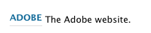
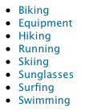
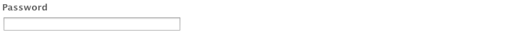

# 페이지 작성을 위한 구성 요소{#components-for-page-authoring}

다음 구성 요소는 표준 웹 페이지의 콘텐츠를 작성할 때 사용됩니다. 구성 요소는 AEM 표준 설치에 즉시 사용할 수 있는 구성 요소의 하위 집합을 구성합니다.

일부는 사이드 킥을 통해 즉시 사용할 수 있으며, 다른 일부는 를 사용하여 사용할 수 있습니다. [디자인 모드](/help/sites-classic-ui-authoring/classic-page-author-design-mode.md) 활성화/비활성화합니다.

>[!CAUTION]
>
>이 섹션에서는 표준 AEM 설치 시 기본적으로 사용할 수 있는 구성 요소에 대해서만 설명합니다.
>
>인스턴스에 따라 요구 사항에 맞게 명시적으로 개발된 구성 요소를 사용자 정의했을 수 있습니다. 이러한 맞춤형 구성 요소는 여기에서 설명한 일부 구성 요소와 동일한 이름을 가질 수도 있습니다.

구성 요소는 다음과 같은 경우에 사용할 수 있습니다. [페이지 편집](/help/sites-classic-ui-authoring/classic-page-author-edit-content.md) 다음에서 **구성 요소** 사이드 킥의 탭과 **새 구성 요소 삽입** 선택기(를 두 번 클릭할 때) **여기에 구성 요소 또는 자산을 끌어 놓으십시오.** area).

구성 요소를 선택하여 페이지에서 필요한 위치로 드래그한 다음 [컨텐츠 및 속성 편집](/help/sites-classic-ui-authoring/classic-page-author-edit-content.md#editing-a-component-content-and-properties).

구성 요소는 (페이지 작성용) 을 비롯한 다양한 카테고리 (구성 요소 그룹)에 따라 정렬됩니다.

* [일반](#general): 텍스트, 이미지, 표, 차트 등을 포함한 기본 구성 요소를 포함합니다.
* [열](#columns): 컨텐츠 레이아웃을 구성하는 데 필요한 구성 요소를 포함합니다.
* [양식](#formgroup): 양식을 만드는 데 필요한 모든 구성 요소를 포함합니다.

## 일반 {#general}

일반 구성 요소는 콘텐츠를 만드는 데 사용하는 기본 구성 요소입니다.

### 계정 항목 {#account-item}

제목 및 설명을 사용하여 링크를 정의할 수 있습니다.



### 응용 이미지 {#adaptive-image}

응용 이미지 기초 구성 요소는 웹 페이지가 열리는 창에 맞는 크기의 이미지를 생성합니다. 구성 요소를 사용하려면 파일 시스템 또는 DAM에서 이미지 리소스를 제공합니다. 웹 페이지가 열리면 웹 브라우저는 현재 창에 맞게 크기가 조정된 이미지 복사본을 다운로드합니다.

창의 크기를 결정할 수 있는 특성은 다음과 같습니다.

* 장치 화면: 모바일 장치에서는 웹 페이지가 일반적으로 전체 화면에 걸쳐 확장되도록 표시됩니다.
* 웹 브라우저 창 크기: 랩톱 및 데스크톱 컴퓨터의 사용자는 웹 브라우저 창의 크기를 조정할 수 있습니다.

예를 들어, 구성 요소는 휴대폰에서 웹 페이지를 열면 작은 이미지를 생성하고, 태블릿에서 열면 중간 크기의 이미지를 생성합니다. 랩톱에서 구성 요소는 최대화 웹 브라우저에서 페이지를 열면 큰 이미지를 만들어 전달합니다. 웹 브라우저가 화면의 일부에 맞게 크기가 조정되면 구성 요소는 더 작은 이미지를 전달하여 크기를 조정하고 보기를 새로 고칩니다.

#### 지원되는 이미지 형식 {#supported-image-formats}

응용 이미지 구성 요소에 사용할 수 있는 이미지 파일 확장명은 다음과 같습니다.

* .jpg
* .jpeg
* .png
* .gif &#42;&#42;

>[!CAUTION]
>
>&#42;&#42; 애니메이션 .gif 파일은 적응형 변환용 AEM에서 지원되지 않습니다.

#### 이미지 크기 및 품질 {#images-sizes-and-quality}

다음 표에는 주어진 뷰포트 너비에 대해 생성된 이미지의 너비가 나열되어 있습니다. 생성된 영상의 높이는 일정한 종횡비를 유지하기 위해 계산되며, 영상 에지 내부에는 공백이 발생하지 않는다. 자르기 를 사용하여 공백을 방지할 수 있습니다.

이미지가 JPEG 이미지인 경우, 뷰포트 크기는 또한 JPEG 품질에 영향을 미칠 수 있다. 다음과 같은 JPEG 품질을 사용할 수 있습니다.

* 낮음(0.42)
* 중간(0.82)
* 높음(1.00)

| 뷰포트 폭 범위(픽셀) | 이미지 너비(픽셀) | JPEG 품질 | 대상 장치 유형 |
|---|---|---|---|
| 폭 &lt;= 319 | 320 | 낮음 |  |
| 폭 = 320 | 320 | 중간 | 휴대폰(세로) |
| 320 &lt; 너비 &lt; 481 | 480 | 중간 | 휴대폰(가로) |
| 480 &lt; 너비 &lt; 769 | 476 | 높음 | 태블릿(세로) |
| 768 &lt; 너비 &lt; 1025 | 620 | 높음 | 태블릿(가로) |
| 너비 &lt;= 1025 | 전체(원래 크기) | 높음 | 데스크탑 |

#### 속성 {#properties}

이 대화 상자를 통해 응용 이미지 구성 요소의 인스턴스에 대한 속성을 편집할 수 있습니다. 이 속성 중 대부분은 기반이 되는 이미지 구성 요소와 공통입니다. 속성은 다음 두 가지 탭에서 사용할 수 있습니다.

* **이미지**

   * **이미지**
컨텐츠 파인더에서 이미지를 끌어 놓거나 클릭하여 이미지를 로드할 수 있는 찾아보기 창을 엽니다. 이미지가 로드되면 이미지를 자르거나, 회전하거나, 삭제할 수 있습니다. 이미지를 확대/축소하려면 이미지 아래에서 확인 및 취소 단추 위에 있는 슬라이드 막대를 사용합니다.

   * **자르기**
이미지의 일부를 잘라낼 수 있습니다. 테두리를 드래그하여 이미지를 자릅니다.

   * **회전**
회전을 계속 클릭하여 이미지를 원하는 대로 회전합니다.

   * **지우기**
현재 이미지를 제거합니다.

* **고급**

   * **제목**
응용 이미지 구성 요소에서는 이 속성을 사용하지 않습니다.

   * **대체 텍스트**
이미지에 사용하는 대체 텍스트.

   * **다음으로 링크**
응용 이미지 구성 요소에서는 이 속성을 사용하지 않습니다.

   * **설명**
응용 이미지 구성 요소에서는 이 속성을 사용하지 않습니다.

#### 응용 이미지 구성 요소 확장 {#extending-the-adaptive-image-component}

응용 이미지 구성 요소 사용자 지정에 대한 자세한 내용은 [응용 이미지 구성 요소의 이해](/help/sites-developing/responsive.md#using-adaptive-images)를 참조하십시오.

### 슬라이드 {#carousel}

슬라이드 구성 요소를 사용하여 개별 페이지와 연결된 이미지를 표시할 수 있습니다.

* 한번에 하나씩
* 단시간에
* 지정한 순서대로
* 지정한 시간 지연 포함

또한 클릭 가능한 컨트롤을 사용하면 표시된 페이지를 실시간으로 필요할 때마다 순환할 수 있습니다. 현재 표시되는 페이지 이미지를 선택하면 해당 페이지로 이동합니다. 즉, 회전판은 탐색 컨트롤 역할을 합니다.

#### 속성 {#properties-1}

속성은 다음 두 가지 탭에서 사용할 수 있습니다.

* **회전판**
여기서 회전판이 작동하는 방식을 지정합니다.

   * 재생 속도
다음 슬라이드를 표시하기 전에 대기할 시간(밀리초 단위)
   * 전환 시간 두 슬라이드 간의 전환 시간(밀리초)입니다.
   * 컨트롤 스타일
풀다운 메뉴로 다양한 옵션 제공(예: 이전 / 다음 단추, 오른쪽 위 스위치).

* **목록**
여기서는 회전판에 페이지가 포함되는 방법을 지정합니다.

   * **목록 작성 방법**
페이지 목록을 만드는 방법에는 여러 가지가 있습니다 - 하위 페이지, 고정 목록, 검색 또는 고급 검색 (모두 아래에 설명됨). 어떤 방법을 선택하든 목록에 포함하는 페이지에는 각각 해당 페이지와 연결된 이미지가 있어야 합니다. 회전판에 표시되는 이 이미지입니다. 해당 페이지의 페이지 속성 아래에 페이지에 대한 이미지가 없으면 시작하기 전에 이미지를 페이지에 연결해야 합니다. 그렇지 않으면 회전판에 빈 페이지가 표시됩니다. 다음을 참조하십시오 [페이지 속성 편집](/help/sites-classic-ui-authoring/classic-page-author-edit-page-properties.md).
선택한 항목에 따라 새 패널이 나타납니다.

      * **하위 페이지 옵션**

         * **상위 페이지**
수동으로 또는 선택기를 사용하여 경로를 지정하십시오. 현재 페이지를 상위 페이지로 사용하려면 비워 두십시오.

      * **고정 목록 옵션**

         * **페이지**
페이지 목록을 선택합니다. 항목을 더 추가하려면 `+`를 사용하고, 순서를 조정하려면 위쪽/아래쪽 단추를 사용합니다.

      * **검색 옵션**

         * **시작 위치**
시작 경로를 수동으로 또는 선택기를 사용하여 입력합니다.

         * **검색 쿼리**
일반 텍스트 검색 쿼리를 입력할 수 있습니다.

      * **고급 검색 옵션**

         * **Querybuilder 설명 표기법**
QueryBuilder 설명 표기법을 사용하여 검색 쿼리를 입력할 수 있습니다. 예를 들어 &quot;fulltext=Marketing&quot;을 입력하면 컨텐츠에 &quot;Marketing&quot;이 포함된 모든 페이지를 회전판에 표시할 수 있습니다.
쿼리 표현식 및 추가적인 예에 대한 전체 논의는 [QueryBuilder API](/help/sites-developing/querybuilder-api.md)를 참조하십시오.

   * **정렬 기준**
드롭다운 메뉴에서 `jcr:title`, `jcr:created`, `cq:lastModified` 또는 `cq:template`을 선택합니다.

   * **제한**
선택 사항입니다. 회전판에서 사용할 최대 항목 수입니다.

>[!NOTE]
>
>AEM DAM에 디지털 에셋을 표시하는 Adobe Experience Manager용 사용자 지정 회전 메뉴 구성 요소를 만들 수 있습니다.

### 차트 {#chart}

차트 구성 요소를 사용하여 막대, 선 또는 원형 차트를 추가할 수 있습니다. AEM은 사용자가 제공하는 데이터에서 차트를 생성합니다. 데이터 탭에 직접 입력하거나 스프레드시트를 복사하여 붙여 넣어 데이터를 제공합니다.

* **데이터**

   * **차트 데이터**
CSV 형식을 사용하여 차트 데이터를 입력합니다. CSV 형식은 쉼표로 구분된 값 형식으로서 각 필드를 쉼표(&quot;,&quot;)로 구분합니다.

* **고급**

   * **차트 유형**
파이 차트, 라인 차트, 막대 차트 중에서 선택합니다.

   * **대체 텍스트**
차트 대신 표시되는 텍스트입니다.

   * **폭**
차트의 픽셀 단위 폭입니다.

   * **높이**
차트의 픽셀 단위 높이입니다.

다음은 결과 막대 차트의 앞에 오는 차트 데이터의 예입니다.

 


### 콘텐츠 조각 {#content-fragment}

>[!CAUTION]
>
>콘텐츠 조각 관리의 전체 기능은 터치에 적합한 UI를 통해서만 사용할 수 있습니다.
>
>콘텐츠 조각 구성 요소는 클래식 UI 사이드 킥에서 볼 수 있지만, 추가 기능은 사용할 수 없습니다.

[컨텐츠 조각](/help/sites-classic-ui-authoring/classic-page-author-content-fragments.md) 는 페이지에 영향을 받지 않는 에셋으로 제작되고 관리됩니다. 그런 다음 콘텐츠 페이지를 작성할 때 이러한 조각과 해당 변형을 사용할 수 있습니다.

### 디자인 가져오기 {#design-importer}

디자인 패키지를 포함하는 zip 파일을 업로드할 수 있습니다.

### 다운로드 {#download}

다운로드 구성 요소는 선택한 웹 페이지에 특정 파일을 다운로드할 수 있는 링크를 만듭니다. 콘텐츠 파인더에서 에셋을 끌어 놓거나 파일을 업로드할 수 있습니다.

* **다운로드**

   * **설명**
다운로드 링크에 표시되는 짧은 설명입니다.

   * **파일**
결과 웹 페이지에서 다운로드할 수 있는 파일입니다. 콘텐츠 파인더에서 에셋을 끌어 놓거나, 다운로드할 파일을 업로드할 수 있도록 영역을 선택하십시오.

다음 예제는 Geometrixx의 다운로드 구성 요소입니다.


### 외부 {#external}

외부 애플리케이션 통합 구성 요소(**외부**)는 iframe을 사용하여 외부 애플리케이션을 AEM 페이지에 포함할 수 있도록 해줍니다.

* **외부**

   * **대상 애플리케이션**

     통합할 웹 애플리케이션의 URL을 지정합니다. 예:

     ```
     https://en.wikipedia.org/wiki/Main_Page
     ```

   * **매개 변수 전달**

     필요할 때 애플리케이션에 전달될 매개변수에 대한 확인란을 선택합니다.

   * **폭과 높이**

     iframe의 크기 정의

외부 애플리케이션이 AEM 페이지의 단락 시스템에 통합됩니다. 예를 들어, `https://en.wikipedia.org/wiki/Main_Page`의 대상 애플리케이션을 사용하는 경우입니다.


>[!NOTE]
>
>사용 사례에 따라 외부 애플리케이션 통합에 다른 옵션을 사용할 수 있습니다. 예: [포틀릿 통합](/help/sites-administering/aem-as-portal.md).

### Flash {#flash}

Flash 구성 요소를 사용하여 Flash 동영상을 로드할 수 있습니다. Flash 에셋을 콘텐츠 파인더에서 구성 요소로 드래그하거나 대화 상자를 사용할 수 있습니다.

* **Flash**

   * **Flash 동영상**

     Flash 동영상 파일입니다. 컨텐츠 파인더에서 자산을 끌어 놓거나 클릭하여 찾아보기 창을 엽니다.

   * **크기**

     동영상을 표시할 영역의 픽셀 단위 크기입니다.

* **대체 이미지**

  표시할 대체 이미지입니다.

* **고급**

   * **컨텍스트 메뉴**

     컨텍스트 메뉴를 표시할지 여부를 나타냅니다.

   * **창 모드**

     창을 표시할 방법(예: 불투명, 투명 또는 별도의 창)을 지정합니다.

   * **배경색**

     제공된 색상 차트에서 선택한 배경색입니다.

   * **최소 버전**

     동영상을 실행하는 데 필요한 최소 Adobe Flash Player 버전입니다. 기본값은 9.0.0입니다.

   * **속성**

     필요한 기타 속성입니다.

### 이미지 {#image}

이미지 구성 요소는 지정된 매개 변수에 따라 이미지와 추가 텍스트를 표시합니다.

이미지를 업로드한 다음 편집하고 조작할 수 있습니다(예: 자르기, 회전, 링크/제목/텍스트 추가).

에서 이미지를 드래그하여 놓을 수 있습니다. [콘텐츠 파인더](/help/sites-classic-ui-authoring/classic-page-author-env-tools.md#the-content-finder) 구성 요소나 해당 편집 대화 상자로 바로 이동합니다. 편집 대화 상자의 중앙 영역을 두 번 클릭하여 로컬 파일 시스템을 탐색하고 이미지를 업로드할 수도 있습니다. 편집 대화 상자의 두 탭은 이미지의 모든 정의와 조작을 제어합니다.


>[!NOTE]
>
>Internet Explorer에서는 업로드의 진행 상태를 모니터링할 수 없습니다.
>
>Internet Explorer 사용자는 이미지를 업로드하고 **확인**&#x200B;를 클릭한 다음 이미지를 다시 열어 업로드된 파일을 미리 보기에서 확인하고 수정할 수 있습니다(즉, 자르기).
>
>AEM에 사용되는 HTML5 기능에 대한 자세한 내용은 [인증된 플랫폼](/help/release-notes/release-notes.md#certifiedplatforms) 섹션을 참조하십시오.

이미지가 로드되면 다음 항목을 구성할 수 있습니다.

* **맵**

  이미지를 매핑하려면 맵을 선택합니다. 이미지 맵을 만들 방법(사각형, 다각형 등)과 영역이 가리킬 대상 위치를 지정할 수 있습니다.

* **자르기**

  이미지의 일부를 잘라낼 수 있도록 자르기 를 선택합니다. 마우스를 사용하여 이미지를 자를 수 있습니다.

* **회전**

  이미지를 회전하려면 회전을 선택합니다. 이미지가 원하는 방향으로 회전할 때까지 반복적으로 사용합니다.

* **지우기**

  현재 이미지를 제거합니다.

* **확대/축소 막대**

  이미지를 확대/축소하려면 이미지 아래에서 확인 및 취소 단추 위에 있는 슬라이드 막대를 사용합니다

* **제목**

  이미지의 제목입니다.

* **대체 텍스트**

  액세스 가능한 컨텐츠를 만들 때 사용할 대체 텍스트입니다.

* **링크 대상**

  웹 사이트 내의 자산 또는 다른 페이지로 이동하는 링크를 만듭니다.

* **설명**

  이미지에 대한 설명.

* **크기**

  이미지의 높이와 폭을 설정합니다.

최종 이미지( **제목**&#x200B;과 **설명**&#x200B;포함)는 다음과 같이 표시될 수 있습니다.


### 레이아웃 컨테이너 {#layout-container}

>[!CAUTION]
>
>레이아웃 컨테이너 구성 요소는 클래식 UI에서 사용할 수 있지만, 전체 기능은 터치 기능이 활성화된 UI에서만 사용할 수 있습니다. 자세한 내용은 다음을 참조하십시오. [응답형 레이아웃](/help/sites-classic-ui-authoring/classic-page-author-responsive-layout.md).

### 목록 {#list}

목록 구성 요소를 사용하여 목록을 표시하기 위한 검색 기준을 구성할 수 있습니다.

* **목록**

   * **목록 작성 방법**

     여기에서 목록이 콘텐츠를 검색하는 위치를 지정합니다. 다음과 같은 몇 가지 방법이 있습니다.

   * 선택한 항목에 따라 새 패널이 나타납니다.

      * **하위 페이지 옵션**

         * **하위**(상위 페이지)
수동으로 또는 선택기를 사용하여 경로를 지정합니다. 현재 페이지를 상위로 사용하려면 비워 둡니다.

      * **고정 목록 옵션**

         * **페이지**

           페이지 목록을 선택합니다. 항목을 더 추가하려면 +를 사용하고, 순서를 조정하려면 위쪽/아래쪽 단추를 사용하십시오.

      * **검색 옵션**

         * **시작 위치**

           시작 경로를 수동으로 또는 선택기를 사용하여 입력 시작 위치.

         * **검색 쿼리**

           일반 텍스트 검색 쿼리를 입력할 수 있습니다.

      * **고급 검색 옵션**

         * **QueryBuilder 설명 표기법**

           QueryBuilder 설명 표기법을 사용하여 검색 쿼리를 입력할 수 있습니다. 예를 들어 &quot;fulltext=Marketing&quot;을 입력하면 컨텐츠에 &quot;Marketing&quot;이 포함된 모든 페이지를 회전판에 표시할 수 있습니다.

           쿼리 표현식 및 추가적인 예에 대한 전체 논의는 [QueryBuilder API](/help/sites-developing/querybuilder-api.md)를 참조하십시오.

      * **태그**

        다음을 지정합니다. **상위 페이지**, **태그/키워드**&#x200B;및 필요한 일치 기준입니다.

   * **다음으로 표시**

     항목을 나열할 방법입니다. 링크, 티저 및 뉴스를 포함합니다.

   * **정렬 기준**

     목록 정렬 여부 및 정렬에 사용할 기준. 기준을 입력하거나 제공된 드롭다운 목록에서 기준을 선택할 수 있습니다.

   * **제한**

     목록에 표시할 항목의 최대 개수를 지정합니다.

   * **피드 사용**

     목록에 대해 RSS 피드를 활성화할지 여부를 지정합니다.

   * **페이지의 게시물 수**

     여기에서 한 번에 표시할 목록 항목의 수를 지정할 수 있습니다. 지정한 것보다 많은 항목이 있는 목록은 페이지 매김을 사용하여 여러 부분으로 목록을 표시합니다.

다음 예제는 **목록** 구성 요소를 사용하여 하위 페이지 목록을 표시할 수 있습니다(디자인은 사이트 디자인의 사용자 지정 CSS 정의에 의해 제어됨).



### 로그인 {#login}

사용자 이름 및 암호 필드를 제공합니다.


다음을 구성할 수 있습니다.

* 로그인

   * 섹션 레이블

     입력 필드에 대한 시작 텍스트입니다.

   * 사용자 이름 레이블

     사용자 이름 필드에 레이블을 지정하는 텍스트입니다.

   * 암호 레이블

     암호 필드에 레이블을 지정하는 텍스트입니다.

   * 로그인 단추 레이블

     로그인 단추에 대한 텍스트입니다.

   * 리디렉션 대상

     웹 사이트에서 사용자가 로그인한 경우 열려야 하는 페이지를 지정할 수 있습니다.

* 이미 로그인됨

   * 계속 버튼 레이블

     사용자가 이미 로그온했음을 나타내는 텍스트입니다.

### 주문 상태 {#order-status}

* **제목**

   * **제목**

     표시할 제목 텍스트를 지정합니다.

   * **링크**

     주문 상태를 표시해야 하는 페이지(제품)를 지정합니다.

   * **유형 / 크기**

     제공된 선택 사항에서 선택합니다.


### 참조 {#reference}

다음 **참조** 구성 요소를 사용하면 AEM 웹 사이트의 다른 페이지(현재 인스턴스 내)에서 텍스트를 참조할 수 있습니다. 참조된 단락의 콘텐츠가 현재 페이지에 있는 것처럼 표시됩니다. 소스 단락이 변경되면 콘텐츠가 업데이트됩니다( 페이지를 새로 고쳐야 할 수 있음).

* **단락 참조**

   * **참조**

     참조할 페이지 및 단락(컨텐츠 포함)의 경로를 지정합니다.

단락에 대한 경로를 지정하려면 페이지에 대한 경로를 다음과 같이 접미사로 붙여야 합니다.

`.../jcr:content/par/<paragraph-ID>`

예:

`/content/geometrixx-outdoors/en/equipment/biking/cajamara/jcr:content/par/similar-products`

특정 단락을 참조하는 것 외에도 전체 면 시스템을 지정하도록 경로를 수정할 수도 있습니다. 경로에 다음 접미사를 추가합니다.

`/jcr:content/par`

예:

`/content/geometrixx-outdoors/en/equipment/biking/cajamara/jcr:content/par`

구성 후 콘텐츠는 소스 페이지에서처럼 정확하게 표시됩니다. 참조라는 사실은 편집을 위해 구성 요소를 열 때만 표시됩니다.


### 검색 {#searching}

검색 구성 요소는 페이지에 검색 기능을 추가합니다.

다음을 구성할 수 있습니다.

* 검색

   * **노드 유형**

     검색을 특정 노드 유형으로 제한하려면 여기에 나열합니다. 예: `cq:Page`

   * **검색할 경로**

     검색할 분기의 루트 페이지를 지정합니다.

   * **검색 단추 텍스트**

     실제 검색 단추에 표시되는 이름입니다.

   * **통계 텍스트**

     검색 결과 위에 표시되는 텍스트입니다.

   * **결과 없음 텍스트**

     결과가 없으면 여기에 입력한 텍스트가 표시됩니다.

   * **맞춤법 검사 텍스트**

     유사한 단어를 입력하면 단어 앞에 이 텍스트가 표시됩니다.
예를 들어, `Geometrixxe`, 시스템에 &quot;을 의미했습니까? Geometrixx&quot;.

   * **유사 페이지 텍스트**

     유사한 페이지에 대한 결과 옆에 표시되는 텍스트입니다. 이미지의 일부를 잘라내려면 이 링크를 클릭합니다.

   * **관련 검색 텍스트**

     연관 검색어 및 주제 검색 옆에 표시되는 텍스트입니다.

   * **검색 트렌드 텍스트**

     사용자가 입력하는 검색어 위의 제목입니다.

   * **결과 페이지 레이블**

     이 목록 아래에 표시되는 텍스트로서 다른 결과 페이지로 링크됩니다.

   * **이전 레이블**

     이전 검색 페이지 링크에 표시되는 이름입니다.

   * **다음 레이블**

     이후 검색 페이지 링크에 표시되는 이름입니다.

다음 예제는 표준 설치의 루트 디렉토리에서 *`geometrixx`*&#x200B;라는 단어를 검색한 후의 검색 구성 요소를 보여 줍니다. 또한 결과의 페이지 매김도 표시됩니다.


다음 예제에서는 철자가 잘못되어 사용할 수 없는 검색어를 보여 줍니다.


### Sitemap {#sitemap}

기본 설정을 사용하여 현재 웹 사이트의 모든 페이지를 활성 링크로 나열하는 자동 사이트 맵 목록입니다. 예를 들어 추출은 다음을 표시합니다.


필요한 경우 다음을 구성할 수 있습니다.

* **Sitemap**

   * **루트 경로**

     목록이 시작되는 경로.

### Slideshow {#slideshow}

이 구성 요소를 사용하여 페이지에 슬라이드쇼로 표시할 일련의 이미지를 로드할 수 있습니다. 이미지를 추가하거나 제거하고 각 제목을 지정할 수 있습니다. 고급 아래에서 표시 영역의 크기를 지정할 수도 있습니다.

다음을 구성할 수 있습니다.

* **슬라이드**

   * **새 슬라이드**

     **추가**(및 **제거**) 단추를 사용하여 일련의 슬라이드를 지정할 수 있습니다.

   * **제목**

     필요한 경우 제목을 지정합니다. 이 제목은 해당 슬라이드에 오버레이됩니다.

* **고급**

   * **크기**

     너비 및 높이를 픽셀 단위로 지정합니다.

그런 다음 Slideshow 구성 요소는 다음 슬라이드로 전환하기 전에 짧은 시간 동안 각 이미지를 순서대로 반복하여 표시합니다.


### 표 {#table}

>[!NOTE]
>
>다음 **표** 구성 요소는 [리치 텍스트 편집기](/help/sites-classic-ui-authoring/classic-page-author-rich-text-editor.md), 다음과 같음 **[텍스트](#text)** 구성 요소.
>
>Adobe은 **표** 구성 요소를 테이블에 사용할 수도 있습니다. **텍스트** 구성 요소.

다음 **표** 구성 요소는 테이블을 만들고, 채우고, 형식을 지정할 수 있도록 사전 구성되어 있습니다. 대화 상자를 사용하면 표를 구성하고 내용을 처음부터 만들거나 Excel, OpenOffice 또는 메모장과 같은 외부 편집기에서 스프레드시트나 표를 복사하여 붙여 넣을 수 있습니다.


다음 스크린샷에서는 표 구성 요소의 예를 보여줍니다. 디자인은 사이트 범위 CSS로 결정됩니다.


### 태그 클라우드 {#tag-cloud}

태그 클라우드는 웹 사이트 내에서 컨텐츠에 적용되는 태그들을 그래픽으로 보여 줍니다.


태그 클라우드 구성 요소 구성 시 다음과 같은 사항을 지정할 수 있습니다.

* **표시할 태그**
표시할 태그를 가져올 위치. 모든 하위 태그 또는 모든 태그가 있는 페이지에서 선택하십시오.

* **페이지**
참조할 페이지를 선택합니다.

* **태그에 링크 없음**
표시된 태그가 링크로 작동하는지 여부.

태그 적용에 대한 자세한 내용은 [태그 사용](/help/sites-classic-ui-authoring/classic-feature-tags.md)을 방문하십시오.

### 텍스트 {#text}

>[!NOTE]
>
>다음 **텍스트** 구성 요소는 [리치 텍스트 편집기](/help/sites-classic-ui-authoring/classic-page-author-rich-text-editor.md), 다음과 같음 **[표](#table)** 구성 요소.
>
>Adobe은 **표** 구성 요소를 테이블에 사용할 수도 있습니다. **텍스트** 구성 요소.

텍스트 구성 요소를 사용하면 WYSIWYG 편집기를 사용하여 텍스트 블록을 입력할 수 있습니다. [리치 텍스트 편집기](/help/sites-classic-ui-authoring/classic-page-author-rich-text-editor.md). 다양한 아이콘을 사용하여 글꼴 특성, 정렬, 링크, 목록, 들여쓰기 등 텍스트 서식을 지정할 수 있습니다.


를 열 때 **스타일** 의 탭 **편집** 대화 상자에서 다음을 설정할 수도 있습니다.

* **스페이서**
* **텍스트 스타일**

그러면 서식이 지정된 텍스트가 페이지에 표시됩니다. 실제 디자인은 사이트 CSS에 따라 다릅니다.


텍스트 구성 요소 및 리치 텍스트 편집기로 제공된 기능에 대한 자세한 내용은 [리치 텍스트 편집기](/help/sites-classic-ui-authoring/classic-page-author-rich-text-editor.md) 페이지를 참조하십시오.

#### 즉석 편집 {#inplace-editing}

대화 상자를 사용하는 리치 텍스트 편집 모드 이외에도 AEM에서 제공하는 기능도 있습니다 [즉석 편집](/help/sites-authoring/editing-content.md): 페이지 레이아웃에 표시된 대로 텍스트를 직접 편집할 수 있습니다.

### 텍스트 및 이미지 {#text-image}

텍스트 및 이미지 구성 요소는 텍스트 블록과 이미지를 추가합니다. 텍스트와 이미지를 별도로 추가하고 편집할 수도 있습니다. 다음을 참조하십시오. [텍스트](#text) 및 [이미지](#image) 구성 요소 를 참조하십시오.

 

다음을 구성할 수 있습니다.

* **구성 요소 스타일**(**스타일**)

  이미지를 왼쪽 또는 오른쪽으로 정렬할 수 있습니다. 기본값은 **왼쪽** 정렬로서 이미지를 왼쪽에 맞춥니다.

* **이미지 속성**(**고급 이미지 속성**)

  다음을 지정할 수 있습니다.

   * **이미지 자산**

     필요한 이미지를 업로드합니다.

   * **제목**

     블록의 제목입니다. 마우스오버로 표시됩니다.

   * **대체 텍스트**

     이미지를 표시할 수 없는 경우 표시할 대체 텍스트입니다. 비워 두면 제목이 사용됩니다.

   * **링크 대상**

     대상 경로를 지정합니다.

   * **설명**

     이미지에 대한 설명.

   * **크기**

     이미지의 높이와 너비를 설정합니다.

다음 예는 왼쪽 정렬된 이미지를 표시하는 텍스트 이미지 구성 요소입니다.


### 제목 {#title}

제목 구성 요소는 다음 중 하나를 수행할 수 있습니다.

* 제목 필드를 비워 두고 현재 페이지의 이름을 표시합니다.
* 제목 필드에 지정하는 텍스트를 표시합니다.

다음을 구성할 수 있습니다.

* **제목**

  페이지 제목 이외의 이름을 사용하려면 여기에 입력합니다.

* **링크**

  제목을 링크로 사용하려는 경우의 URL입니다.

* **유형 / 크기**

  드롭다운 목록에서 Small 또는 Large 를 선택합니다. 작은 가 이미지로 생성됩니다. 큰 은 텍스트로 생성됩니다.

다음 예제는 **제목** 표시되는 구성 요소. 디자인은 사이트별 CSS에 의해 결정됩니다.


### 비디오 {#video}

다음 **비디오** 구성 요소를 사용하여 페이지에 사전 정의된 기본 비디오 요소를 배치할 수 있습니다.

참조: [비디오 프로필 구성](/help/sites-administering/config-video.md#configuringvideoprofiles) HTML5 요소와 함께 사용됩니다.

페이지에 구성 요소의 인스턴스를 배치한 후 다음을 구성할 수 있습니다.

* 비디오

   * **비디오 자산**

     비디오 자산을 업로드하거나 삭제합니다.

   * **크기**

     크기 옆의 상자에 비디오의 원래 크기(픽셀 단위 폭 x 높이)가 표시됩니다(위 참조). 비디오의 기본 치수를 재정의하려면 여기에 너비와 높이 치수를 수동으로 입력합니다. 선택 **확인** 대화 상자를 닫습니다.

>[!NOTE]
>
>지원되는 형식은 다음과 같습니다.
>
>* `.mp4`
>* `Ogg`
>* `FLV`(Flash 비디오)
>

## 열 {#columns}

열은 AEM에서 컨텐츠 레이아웃을 제어하는 메커니즘입니다. 표준 설치에서 2개 및/또는 3개의 열을 만들기 위한 구성 요소가 제공됩니다.

다음 예에서는 사용 중인 두 개의 열 및 세 개의 열 구성 요소를 보여 줍니다. 새 컴포넌트에 자리 표시자를 사용할 수 있습니다.


### 2열 {#columns-1}

기본적으로 두 개의 동일한 열로 설정되는 열 컨트롤 구성 요소입니다.

### 3열 {#columns-2}

기본적으로 3개의 동일한 열로 설정되는 열 컨트롤 구성 요소입니다.

### 열 컨트롤 {#column-control}

사용자는 열 컨트롤 구성 요소를 사용하여 웹 페이지의 기본 패널에서 여러 열로 콘텐츠를 분할하는 방법을 선택할 수 있습니다. 사용자는 사전 정의된 목록에서 필요한 열 수를 선택한 다음 각 열 내에서 콘텐츠를 만들거나 삭제하거나 이동할 수 있습니다.

* **열 컨트롤**

   * **열 레이아웃**

     렌더링할 열 수를 선택합니다. 생성되면 각 열에는 컨텐츠를 추가할 때 구성 요소나 에셋을 드래그하는 자체 링크가 있습니다.

## 양식 {#form}

양식 구성 요소는 방문자가 입력을 제출할 양식을 만드는 데 사용됩니다. Forms 및 양식 구성 요소를 사용하여 사용자 피드백(예: 고객 만족 설문지) 및 사용자 정보(예: 사용자 등록)를 포함한 정보를 수집할 수 있습니다.

>[!NOTE]
>
>다음을 참조하십시오 [AEM Forms 도움말](/help/forms/home.md) AEM Forms에 대한 자세한 내용

Forms은 다음과 같은 몇 가지 구성 요소로 구성됩니다.

* **양식**

  양식 구성 요소는 페이지에서 새 양식의 시작과 끝을 정의합니다. 그런 다음 표 및 다운로드와 같이 이러한 요소 사이에 다른 구성 요소를 배치할 수 있습니다.

* **양식 필드 및 요소**

  양식 필드 및 요소에는 텍스트 상자, 라디오 단추 및 이미지가 포함될 수 있습니다. 사용자는 종종 텍스트 입력처럼 양식 필드에서 작업을 완료합니다. 자세한 내용은 개별 양식 요소 를 참조하십시오.

* **프로필 구성 요소**

  프로필 구성 요소는 소셜 공동 작업에 사용되는 방문자 프로필 및 방문자 개인화가 필요한 기타 영역과 관련됩니다.

다음은 예제 양식입니다. 이 템플릿은 **양식** 구성 요소 (시작 및 끝), 2개 포함 **양식** **텍스트** 입력에 사용되는 필드, **일반** **텍스트** 리드 인 텍스트 및 **제출** 단추를 클릭합니다.


>[!NOTE]
>
>양식 개발 및 사용자 지정에 대한 자세한 내용은 [Forms 페이지 개발](/help/sites-developing/developing-forms.md). 이러한 사용자 정의 양식에는 작업, 제한, 필드 미리 로드 및 스크립트를 사용한 서비스 대상 작업 호출이 포함됩니다.

### (많은) 양식 구성 요소에 공통되는 설정 {#settings-common-to-many-form-components}

양식 구성 요소 각각에는 다른 용도가 있지만 대다수는 유사한 옵션과 매개 변수로 구성됩니다.

양식 구성 요소를 구성할 때 대화 상자에서 다음 탭을 사용할 수 있습니다.

* **제목 및 텍스트**

  여기에서 양식 제목 및 관련 텍스트와 같은 기본 정보를 지정해야 합니다. 또한 해당하는 경우 필드를 다중 선택 가능한지 여부, 선택 가능한 항목 등과 같은 다른 키 정보를 정의할 수 있습니다.

* **초기값**

  기본값을 지정할 수 있습니다.

* **제한**

  여기에서 필드가 필요한지 여부를 지정하고 해당 필드에 숫자 등의 제약 조건을 배치할 수 있습니다.

* **스타일링**

  필드의 크기 및 스타일을 나타냅니다.

>[!NOTE]
>
>표시되는 필드는 개별 구성 요소에 따라 크게 다릅니다.

이 탭에서는 필요한 매개 변수를 제공합니다. 탭은 개별 구성 요소 유형에 따라 다르지만 다음을 포함할 수 있습니다.

* **제목 및 텍스트**

   * **요소 이름**

     양식 요소 이름. 저장소 내 데이터가 저장되는 위치를 나타냅니다.
이 필드는 필수이며 다음 문자만 포함해야 합니다.

      * 영숫자 문자
      * `_ . / : -`

   * **제목**

     필드에 표시되는 제목입니다. 비워 두면 기본 제목이 표시됩니다.

   * **설명**

     필요한 경우 사용자에게 추가 정보를 제공할 수 있습니다. 양식에서 이 설명은 필드 아래에 제목보다 작은 글꼴로 표시됩니다.

   * **표시 / 숨기기**

     필드가 표시되는 시기를 결정합니다.

* **초기값**

   * **기본 값**

     양식을 열 때 필드에 표시되는 값입니다. 즉, 사용자가 입력을 수행하기 전입니다.

* **제한**

   * **필수**

     이 제약 조건은 양식 구성 요소 유형에 따라 다르지만 이 필드가 필수이거나 이 필드의 특정 부분이 필수임을 나타내는 클릭 상자를 하나 이상 제공합니다.

   * **필수 메시지**

     이 필드가 필요함을 사용자에게 알리는 메시지입니다. 필수 필드는 별표로 표시됩니다.

   * **제한**

     선택할 수 있는 제한 사항은 양식 구성 요소 유형에 따라 다릅니다.

   * **제한 메시지**

     사용자에게 필수인 항목을 알려주는 메시지입니다.

* **스타일링**

   * **크기**

     행 및 열 단위입니다.

   * **너비**

     픽셀 단위입니다.

   * **CSS**

### 양식(구성 요소) {#form-component}

양식 구성 요소는 **양식 시작** 및 **양식 끝** 요소. 양식이 올바르게 정의되었는지 확인하기 위해 시작 요소와 끝 요소가 항상 쌍을 이룹니다.


양식의 시작과 끝 사이에 사용자를 위한 실제 입력 필드를 정의하는 양식 구성 요소를 추가할 수 있습니다.

#### 양식 시작 {#start-of-form}

이 필요한 구성 요소는 페이지에서 새 양식의 시작을 정의합니다. 다음을 구성할 수 있습니다.

* **양식**

   * **감사 인사 페이지**

     방문자가 입력을 제공한 것에 대해 감사하는 의미로 참조되는 페이지입니다. 비워 두면 제출 후 양식이 다시 표시됩니다.

   * **워크플로우 시작**

     양식 전송 후에 시작되는 워크플로우를 결정합니다.

* **고급**

   * **작업 유형**

     양식에는 작업이 필요합니다. 작업은 사용자가 제출한 데이터를 사용하여 실행되도록 트리거되는 작업을 정의합니다(HTML의 action=와 비슷함). 경우에 따라 해당 **작업 구성**&#x200B;이 필요합니다.

     표준 AEM 설치에는 다양한 작업 유형이 포함되어 있습니다.

      * **계정 요청**
      * **컨텐츠 만들기**
      * **리드 만들기**
      * **계정 만들기 및 업데이트**
      * **이메일 서비스: 가입자를 만들고 목록에 추가합니다.**
      * **이메일 서비스: 자동 응답자 이메일을 보냅니다.**
      * **이메일 서비스: 목록에서 사용자 가입을 취소합니다.**
      * **커뮤니티 편집**
      * **리소스 편집**
      * **워크플로우 제어 리소스 편집**
      * **메일**
      * **주문 세부 사항**
      * **프로필 업데이트**
      * **암호 재설정**
      * **암호 설정**
      * **콘텐츠 저장**

        기본 작업 유형입니다.

      * **업로드로 콘텐츠 저장**
      * **주문 제출**
      * **가입자 가입 해제**
      * **주문 업데이트**

   * **양식 식별자**

     양식 식별자는 양식을 고유하게 식별합니다. 단일 페이지에 여러 개의 양식이 있는 경우 양식 식별자를 사용하십시오. 양식마다 각기 다른 식별자가 있어야 합니다.

   * **로드 경로**

     사전 정의된 값을 양식 필드에 로드하는 데 사용되는 노드 속성의 경로입니다.
이 필드는 선택 사항이며 저장소의 노드에 대한 경로를 지정합니다. 이 노드에 필드 이름과 일치하는 속성이 있으면 양식의 해당 필드에 해당 속성 값이 미리 로드됩니다. 일치하는 항목이 없으면 필드에 기본값이 포함됩니다.
**로드 경로**&#x200B;를 사용하여 필수 필드에 값이 있는 양식을 미리 로드할 수 있습니다. [양식 값 미리 로드](/help/sites-developing/developing-forms.md#preloading-form-values)를 참조하십시오.

   * **클라이언트 유효성 검사**

     이 양식에 클라이언트 유효성 검사가 필요한지 여부를 나타냅니다(서버 유효성 검사). *항상* 발생.). 유효성 검사는 다음을 통해 수행됩니다. **Forms Captcha** 구성 요소.

   * **유효성 검사 리소스 유형**

     개별 필드가 아닌 전체 양식의 유효성을 검사하려는 경우 양식 유효성 검사 리소스 유형을 정의합니다. 전체 양식의 유효성을 검사하는 경우 다음 중 하나를 포함해야 합니다.

      * 클라이언트 유효성 검사용 스크립트:

        `/apps/<myApp>/form/<myValidation>/formclientvalidation.jsp`

      * 서버 쪽의 유효성 검사용 스크립트:

        `/apps/<myApp>/form/<myValidation>/formservervalidation.jsp`

   * **작업 구성**

     에서 사용할 수 있는 옵션 **작업 구성** 선택한 항목에 따라 다름 **작업 유형**:

      * **계정 요청**

         * **계정 생성 페이지**
계정을 만들 때 사용되는 페이지입니다.

      * **컨텐츠 만들기**

         * 컨텐츠 경로 양식이 덤프하는 모든 컨텐츠의 컨텐츠 경로입니다. 슬래시 `/`로 끝나는 경로를 입력합니다. 즉, 양식을 게시할 때마다 지정된 위치에 새 노드가 만들어집니다(예: /).
           `/forms/feedback/`

         * **유형**

           필요한 유형을 선택합니다.

         * **양식**

           양식을 지정합니다.

         * **렌더링**

           목록에서 필요한 언어를 선택합니다.

         * **리소스 유형**

           설정된 경우 각 주석에 다음과 같이 추가됩니다. `sling:resourceType`

         * **보기 선택기**

      * **리드 만들기**

         * **리드가 이 목록에 추가됩니다.**
필요한 리드 목록을 지정합니다.

      * **계정 만들기 및 업데이트**

         * **초기 그룹**

           새 사용자를 할당할 그룹입니다.

         * **홈**

           로그인 성공 후 표시할 페이지입니다.

         * **경로**

           새 계정을 만들고 저장하는 상대 경로입니다.

         * **데이터 보기...**

           일괄 편집기에서 양식 결과에 대한 정보에 액세스할 수 있도록 버튼을 선택합니다. 여기에서 정보를 `.tsv`(탭으로 구분) 파일로 내보낼 수 있습니다(예를 들면 Excel 스프레드시트에서 사용하기 위해).

      * **메일**

         * **시작**

           이메일이 발송되어야 하는 이메일 주소를 입력합니다.

         * **수신자**

           양식을 전송할 이메일 주소를 하나 이상 입력합니다.

         * **참조**

           하나 이상의 CC 이메일 주소를 입력합니다.

         * **숨은 참조**

           하나 이상의 BCC 이메일 주소를 입력합니다.

         * **제목**

           이메일의 제목을 입력합니다.

      * **암호 재설정**

         * **암호 변경 페이지**

           암호를 변경할 때 사용되는 페이지입니다.

      * **콘텐츠 저장**

         * **컨텐츠 경로**

           양식에 포함된 내용을 저장할 컨텐츠 경로입니다. 슬래시 `/`로 끝나는 경로를 입력합니다. 즉, 양식을 게시할 때마다 지정된 위치에 새 노드가 만들어집니다(예: /).
           `/forms/feedback/`

         * **데이터 보기...**

           일괄 편집기에서 양식 결과에 대한 정보에 액세스할 수 있도록 버튼을 선택합니다. 여기에서 정보를 .tsv(탭으로 구분) 파일로 내보낼 수 있습니다(예를 들면 Excel 스프레드시트에서 사용하기 위해).

      * **업로드로 콘텐츠 저장**

        과 동일한 옵션 포함 **컨텐츠 저장**.

      * **가입자 가입 해제**

         * **리드가 이 목록에서 삭제됩니다.**

           필요한 리드 목록을 지정합니다.

#### 양식 끝 {#end-of-form}

양식의 끝을 표시합니다. 다음을 구성할 수 있습니다.

* **양식 끝**

   * **전송 단추 표시**

     제출 단추를 표시할지 여부를 나타냅니다.

   * **전송 이름**

     양식에서 여러 제출 단추를 사용하는 경우의 식별자입니다.

   * **전송 제목**

     제출 또는 전송과 같이 단추에 표시되는 이름입니다.

   * **재설정 단추 표시**

     확인란을 선택하면 재설정 버튼이 표시됩니다.

   * **재설정 제목**

     재설정 단추에 나타나는 이름입니다.

   * **설명**

     단추 아래에 표시되는 정보입니다.

### 계정 이름 {#account-name}

사용자가 계정 이름을 입력할 수 있습니다.


### 주소 {#address}

다음과 같은 형식의 국제 주소 필드를 추가할 수 있습니다.


구성 요소는 즉시 사용할 수 있도록 구성되었지만 필요한 경우 구성을 변경할 수 있습니다. 예를 들어, 주소의 개별 요소에 대한 제한을 추가할 수 있습니다. 필드를 비워 두면 기본 설정이 사용됨을 의미합니다.

### Captcha {#captcha}

Captcha 구성 요소를 사용하려면 화면에 표시되는 영숫자 문자열을 입력해야 합니다. 문자열은 새로 고칠 때마다 변경됩니다.


captcha 문자열이 잘못된 경우 표시할 메시지를 포함하여 이 구성 요소에 대한 다양한 매개 변수를 구성할 수 있습니다.

### 확인란 그룹 {#checkbox-group}

확인란을 사용하여 동시에 선택할 수 있는 하나 이상의 확인란 목록을 작성할 수 있습니다.


제목, 설명 및 요소 이름 등 다양한 매개 변수를 지정할 수 있습니다. + 및 - 버튼을 사용하여 항목을 추가하거나 제거한 다음 위쪽 및 아래쪽 화살표로 항목을 배치할 수 있습니다.

>[!NOTE]
>
>사용 **항목 로드 경로** 값이 있는 확인란 그룹 목록을 미리 로드할 수 있습니다.
>
>[여러 값이 있는 양식 필드 미리 로드](/help/sites-developing/developing-forms.md#preloading-form-fields-with-multiple-values)를 참조하십시오.

### 신용 카드 세부 사항 {#credit-card-details}

신용 카드 세부 사항을 입력하는 데 필요한 필드를 제공할 수 있습니다. 허용되는 카드 유형과 필요한 정보(예: 보안 코드)를 지정하도록 구성할 수 있습니다.


### 드롭다운 목록 {#dropdown-list}

선택 가능한 값 범위를 사용하여 드롭다운 목록을 구성할 수 있습니다.


목록에 표시할 제목과 항목을 지정할 수 있습니다. + 및 - 버튼을 사용하여 목록 항목을 추가하거나 제거한 다음 위쪽 및 아래쪽 버튼으로 배치할 수 있습니다. 사용자가 목록에서 여러 항목을 선택할 수 있는지 여부와 목록을 처음 열 때 자동으로 선택되어야 하는 항목(초기 값)을 지정할 수 있습니다.

>[!NOTE]
>
>사용 **항목 로드 경로** 값을 사용하여 드롭다운 목록을 미리 로드할 수 있습니다.
>
>[여러 값이 있는 양식 필드 미리 로드](/help/sites-developing/developing-forms.md#preloading-form-fields-with-multiple-values)를 참조하십시오.

### 파일 업로드 {#file-upload}

파일 업로드 구성 요소는 사용자가 파일을 선택하여 업로드하는 메커니즘을 제공합니다.


### 숨김 필드 {#hidden-field}

이 구성 요소를 사용하여 숨겨진 필드를 만들 수 있습니다. 이러한 숨김 필드는 양식을 제출한 후 작업을 수행해야 하는 경우, 또는 사후 처리에서 숨겨진 데이터가 필요한 경우 등 다양한 용도로 사용할 수 있습니다.


>[!NOTE]
>
>양식의 다른 필드 값에 따라 특정 양식 구성 요소를 표시하거나 숨기도록 양식을 사용자 지정할 수도 있습니다. 양식 필드의 가시성을 변경하는 것은 특정 조건에서만 필드가 필요한 경우에 유용합니다.
>
>[양식 구성 요소 표시 및 숨기기](/help/sites-developing/developing-forms.md#showing-and-hiding-form-components)를 참조하십시오.

### 이미지 단추 {#image-button}

이미지 단추를 사용하면 이미지 및 텍스트를 직접 입력하여 단추를 만들 수 있습니다.


### 이미지 업로드 {#image-upload}

이미지 업로드 구성 요소는 사용자가 이미지 파일을 선택하여 업로드하는 메커니즘을 제공합니다.


### 링크 필드 {#link-field}

링크 필드는 사용자가 URL을 지정할 수 있도록 해줍니다.


가장 일반적으로 달력 이벤트 양식에 사용되며, 여기서 이벤트의 URL/링크 필드에 사용됩니다.

### 암호 필드 {#password-field}

사용자가 암호를 입력할 수 있습니다.



### 암호 재설정 {#password-reset}

이 구성 요소는 사용자에게 다음 두 개의 필드를 제공합니다.

* 암호 입력
* 입력이 올바른지 확인하기 위해 암호 입력을 반복했습니다.

기본 설정을 사용하면 구성 요소가 다음과 같이 표시됩니다.


### 라디오 그룹 {#radio-group}

라디오 그룹은 하나 이상의 라디오 확인란 목록을 제공하며, 이 확인란 중 하나만 특정 시간에 선택할 수 있습니다.

제목 및 설명과 함께 요소 이름을 지정할 수 있습니다. + 및 - 버튼을 사용하여 항목을 추가하거나 제거하고, 위쪽 및 아래쪽 화살표로 항목을 배치하며, 필요한 경우 기본값을 지정할 수 있습니다.


>[!NOTE]
>
>**항목 로드 경로**&#x200B;를 사용하여 값을 포함하는 라디오 그룹을 미리 로드할 수 있습니다.
>
>[여러 값이 있는 양식 필드 미리 로드](/help/sites-developing/developing-forms.md#preloading-form-fields-with-multiple-values)를 참조하십시오.

### 제출 버튼 {#submit-button}

이 구성 요소를 사용하여 기본 텍스트 중 하나를 사용하는 제출 단추를 만들 수 있습니다.


텍스트를 직접 입력할 수도 있습니다.


### 태그 필드 {#tags-field}

이 필드에서는 태그를 선택할 수 있습니다.


전문 탭을 사용하여 사용할 수 있는 네임스페이스를 포함하여 다양한 매개 변수를 지정할 수 있습니다.

* **태그 필드**

   * **허용되는 네임스페이스**

      * **Geometrixx Outdoors**
      * **워크플로우**
      * **포럼**
      * **스톡 사진**
      * **Geometrixx Media**
      * **표준 태그**
      * **마케팅**
      * **자산 속성**

   * **폭(픽셀 단위)**
   * **팝업 크기**

### 텍스트 필드 {#text-field}

표준 텍스트 필드를 필요한 크기로 구성하고 안내 메시지를 직접 입력할 수 있습니다.


### 워크플로우 제출 단추 {#workflow-submit-button-s}

워크플로우에서 사용할 제출 단추를 만들 수 있습니다.


