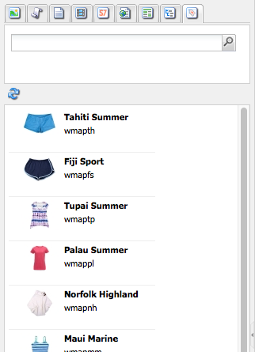

# 작성 - 환경 및 도구 {#authoring-the-environment-and-tools}

AEM의 작성 환경에서는 컨텐츠를 구성하고 편집하기 위한 다양한 메커니즘을 제공합니다. 제공된 도구는 다양한 콘솔 및 페이지 편집기에서 액세스됩니다.

## 사이트 관리 {#site-administration}

**웹 사이트** 콘솔을 사용하여 웹 사이트를 관리하고 탐색할 수 있습니다. 두 개의 창을 사용하면 웹 사이트의 구조를 확장하고 다음과 같은 필수 요소에 대해 작업을 수행할 수 있습니다.

## 페이지 컨텐츠 편집 {#editing-your-page-content}

컨텐츠 파인더 및 사이드 킥을 사용하여 클래식 UI가 있는 별도의 페이지가 있습니다.

`https://localhost:4502/cf#/content/geometrixx/en/products/triangle.html`

## 도움말 액세스 {#accessing-help}

다양한 **도움말** 리소스는 AEM 내에서 직접 액세스할 수 있습니다.

페이지를 편집할 때 [콘솔 도구 모음에서 도움말](/help/sites-classic-ui-authoring/author-env-basic-handling.md#accessing-help)에 액세스할 수 있을 뿐만 아니라 사이드 킥에서 도움말에 액세스(? 아이콘 사용)할 수도 있습니다.

또는 특정 구성 요소의 [편집] 대화 상자에 있는 **도움말** 단추를 사용하면 상황에 맞는 도움말이 표시됩니다.

## 사이드 킥 {#sidekick}

사이드 킥의 **구성 요소** 탭에서는 현재 페이지에 추가할 수 있는 구성 요소를 찾을 수 있습니다. 필요한 그룹을 확장한 다음, 구성 요소를 페이지에서 필요한 위치로 드래그할 수 있습니다.

## 컨텐츠 파인더 {#the-content-finder}

컨텐츠 파인더를 사용하면 페이지를 편집할 때 저장소 내에서 자산 및/또는 컨텐츠를 빠르고 손쉽게 찾을 수 있습니다.

컨텐츠 파인더를 사용하여 다양한 리소스를 찾을 수 있습니다. 적절한 곳에서는 항목을 드래그하여 페이지의 단락에 놓을 수 있습니다.

* [이미지](#finding-images)
* [문서](#finding-documents)
* [동영상](#finding-movies)
* [Scene 7 미디어 브라우저](/help/sites-administering/scene7.md#scene7contentbrowser)
*  [페이지](/help/sites-classic-ui-authoring/classic-page-author-env-tools.md#finding-pages)

* [단락](#referencing-paragraphs-from-other-pages)
* [제품](/help/sites-classic-ui-authoring/classic-page-author-env-tools.md#products)
* 또는 [저장소 구조별로 웹 사이트를 검색할 수 있음](#the-content-finder)

모든 옵션에서 [특정 항목을 검색할 수 있습니다](#the-content-finder).

### 이미지 찾기 {#finding-images}

이 탭에는 저장소의 모든 이미지가 나열됩니다.

페이지에 이미지 단락을 만든 후 항목을 단락으로 드래그하여 놓을 수 있습니다.

### 문서 찾기 {#finding-documents}

이 탭에는 저장소의 모든 문서가 나열됩니다.

페이지에 Download 단락을 만든 후 항목을 단락으로 드래그하여 놓을 수 있습니다.

### 동영상 찾기 {#finding-movies}

이 탭에는 저장소의 모든 동영상(예: Flash 항목)이 나열됩니다.

페이지에 적절한 단락(예: Flash)을 만들면 항목을 단락으로 드래그하여 놓을 수 있습니다.

### 제품 {#products}

이 탭에는 모든 제품이 나열됩니다. 페이지에 적절한 단락(예: 제품)을 만들면 항목을 단락으로 드래그하여 놓을 수 있습니다.

### 페이지 찾기 {#finding-pages}

이 탭에는 모든 페이지가 표시됩니다.편집할 페이지를 두 번 클릭하여 엽니다.

### 다른 페이지의 단락 참조 {#referencing-paragraphs-from-other-pages}

이 탭에서는 다른 페이지를 검색할 수 있습니다. 그러면 해당 페이지의 모든 단락이 나열됩니다. 현재 페이지로 단락을 드래그하여 놓을 수 있으며, 이렇게 하면 원래 단락에 대한 참조가 만들어집니다.

### 전체 저장소 보기 사용 {#using-the-full-repository-view}

이 탭에는 저장소의 모든 리소스가 표시됩니다.

### 컨텐츠 브라우저에서 검색 사용 {#using-search-with-the-content-browser}

모든 옵션에서 특정 항목을 검색할 수 있습니다. 검색 패턴과 일치하는 모든 태그 및 리소스가 나열됩니다.

검색에 와일드카드를 사용할 수도 있습니다. 지원되는 와일드카드는 다음과 같습니다.

* `*`
0개 이상의 문자 시퀀스와 일치하는 항목을 찾습니다.

* `?`
단일 문자와 일치하는 항목을 찾습니다.

>[!NOTE]
>
>와일드카드 검색을 수행하려면 사용해야 하는 모조 속성 &quot;name&quot;이 있습니다.

예를 들어 이름이 있는 이미지가 있는 경우:

`ad-nmvtis.jpg`

다음 검색 패턴에 따라 해당 이미지(및 이 패턴과 일치하는 기타 이미지)를 검색할 수 있습니다.

* `name:*nmv*`
* `name:AD*`
대/소문자를 구분하지  ** 않습니다.

* `name:ad?nm??is.*`
쿼리에 사용할 수 있는 와일드카드의 수는 제한되어 있지 않습니다.

>[!NOTE]
>
>[SQL2](https://helpx.adobe.com/experience-manager/6-5/sites/developing/using/reference-materials/javadoc/org/apache/jackrabbit/commons/query/sql2/package-summary.html) 검색을 사용할 수도 있습니다.

## 참조 표시 {#showing-references}

AEM에서는 현재 작업 중엔 페이지에 링크된 페이지를 확인할 수 있습니다.

직접 페이지 참조를 표시하려면:

1. 사이드 킥에서 **페이지** 탭 아이콘을 선택합니다.

   

1. **참조 표시...를 선택합니다.** AEM은 참조 창을 열고 선택한 페이지를 참조하는 페이지와 해당 경로를 표시합니다.

   

특정 상황에서 사이드 킥에서 다음을 비롯한 추가 작업을 사용할 수 있습니다.

* [론치](/help/sites-classic-ui-authoring/classic-launches.md)
* [Live Copy](/help/sites-administering/msm.md)

* [블루프린트](/help/sites-administering/msm-best-practices.md)

또한 [웹 사이트 콘솔에서 다른 페이지 간 관계를 볼 수 있습니다](/help/sites-classic-ui-authoring/author-env-basic-handling.md#page-information-on-the-websites-console).

## 감사 로그 {#audit-log}

사이드 킥의 **정보** 탭에서 **감사 로그**&#x200B;에 액세스할 수 있습니다. 여기에는 현재 페이지에서 수행한 최근 작업이 나열됩니다. 예:

## 페이지 정보 {#page-information}

웹 사이트 콘솔은 페이지](/help/sites-classic-ui-authoring/author-env-basic-handling.md#page-information-on-the-websites-console)의 현재 상태(예: 게시, 수정, 잠김, livecopy 등)에 대한 정보도 제공합니다.[

## 페이지 모드 {#page-modes}

클래식 UI로 페이지를 편집할 때에는 사이드 킥의 하단에 있는 아이콘을 사용하여 액세스할 수 있는 다양한 모드가 있습니다.

사이드 킥 하단의 아이콘 행은 페이지 작업 모드를 전환하는 데 사용됩니다.

* [편집](/help/sites-classic-ui-authoring/classic-page-author-edit-mode.md)
기본 모드로서 페이지를 편집하고, 구성 요소를 추가하거나 삭제하고, 기타 변경을 수행할 수 있습니다.

* [미리 보기](/help/sites-classic-ui-authoring/classic-page-author-edit-content.md#previewing-pages)
이 모드에서는 페이지가 웹 사이트에 나타나는 최종 형태를 미리 볼 수 있습니다. 

* [디자인](/help/sites-classic-ui-authoring/classic-page-author-design-mode.md#main-pars-procedure-0)
이 모드에서는 구성 요소를 액세스할 수 있도록 구성하여 페이지의 디자인을 편집할 수 있습니다.

>[!NOTE]
>
>다른 옵션도 사용할 수 있습니다.
>
>* [스캐폴딩](/help/sites-classic-ui-authoring/classic-feature-scaffolding.md)
>* [Client Context](/help/sites-administering/client-context.md)
>* 웹 사이트 - [웹 사이트] 콘솔을 엽니다.
>* 다시 로드 - 페이지를 새로 고칩니다.

## 키보드 단축키 {#keyboard-shortcuts}

다양한 [키보드 단축키](/help/sites-classic-ui-authoring/classic-page-author-keyboard-shortcuts.md)도 사용할 수 있습니다.
